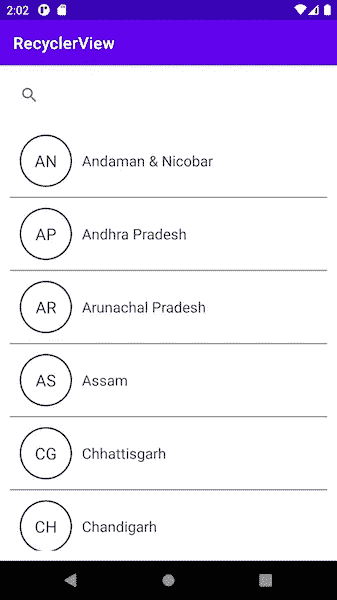
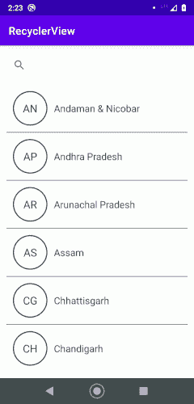

# 可搜索回收视图

> 原文：<https://medium.com/geekculture/searchable-recyclerview-e316289edc25?source=collection_archive---------3----------------------->


Searchable RecyclerView

为了制作一个可搜索的 recycle view，我们需要一个 recycle view(duh)和一个接受用户查询的搜索视图(T1)。

让我们先设计布局。xml 应该是这样的

```
<?xml version="1.0" encoding="utf-8"?>
<androidx.constraintlayout.widget.ConstraintLayout xmlns:android="http://schemas.android.com/apk/res/android"
    xmlns:app="http://schemas.android.com/apk/res-auto"
    xmlns:tools="http://schemas.android.com/tools"
    android:layout_width="match_parent"
    android:layout_height="match_parent"
    tools:context=".MainActivity">

    <androidx.appcompat.widget.SearchView
        android:id="@+id/search_bar"
        android:layout_width="0dp"
        android:layout_height="wrap_content"
        android:layout_margin="@dimen/dimen_12dp"
        app:layout_constraintEnd_toEndOf="parent"
        app:layout_constraintStart_toStartOf="parent"
        app:layout_constraintTop_toTopOf="parent" />

    <androidx.recyclerview.widget.RecyclerView
        android:id="@+id/city_name_list"
        android:layout_width="0dp"
        android:layout_height="0dp"
        android:layout_margin="@dimen/dimen_12dp"
        app:layout_constraintBottom_toBottomOf="parent"
        app:layout_constraintEnd_toEndOf="parent"
        app:layout_constraintStart_toStartOf="parent"
        app:layout_constraintTop_toBottomOf="@id/search_bar"
        app:layout_constraintVertical_bias="0"
        tools:listitem="@layout/city_name_row_layout" />

</androidx.constraintlayout.widget.ConstraintLayout>
```

列表项的 xml 布局是:

```
<?xml version="1.0" encoding="utf-8"?>
<LinearLayout xmlns:android="http://schemas.android.com/apk/res/android"
    xmlns:app="http://schemas.android.com/apk/res-auto"
    xmlns:tools="http://schemas.android.com/tools"
    android:layout_width="match_parent"
    android:layout_height="wrap_content"
    android:orientation="horizontal">

    <TextView
        android:id="@+id/city_code"
        android:layout_width="@dimen/dimen_64dp"
        android:layout_height="@dimen/dimen_64dp"
        android:layout_margin="@dimen/dimen_12dp"
        android:background="@drawable/circle_shape"
        android:gravity="center"
        android:padding="@dimen/dimen_12dp"
        android:textColor="@color/grey_text"
        android:textSize="@dimen/text_size_medium_large"
        tools:text="DL" />

    <TextView
        android:id="@+id/city_name"
        android:layout_width="wrap_content"
        android:layout_height="wrap_content"
        android:layout_gravity="center_vertical"
        android:textColor="@color/grey_text"
        android:textSize="@dimen/text_size_medium"
        tools:text="New Delhi" />
</LinearLayout>
```

这给了我们一个类似这样的布局



Screenshot of Searchable Recyclerview layout

我假设此时您有一个适配器连接到您的回收器视图。现在，为了能够根据用户输入的查询过滤列表，我们需要一个过滤器。向 RecyclerView 的适配器添加筛选器

```
class CityListAdapter(private var cityDataList: ArrayList<CityDataObject>) :
    RecyclerView.Adapter<CityViewHolder>() {

   override fun onCreateViewHolder(parent: ViewGroup, viewType: Int): CityViewHolder {
        //...
    }

    override fun onBindViewHolder(holder: CityViewHolder, position: Int) {
        //...
    }

    override fun getItemCount(): Int {
        return cityDataList.size
    }

    fun getFilter(): Filter {
        return cityFilter
    }

    private val cityFilter = object : Filter() {
        override fun performFiltering(constraint: CharSequence?): FilterResults {
            val filteredList: ArrayList<CityDataObject> = ArrayList()
            if (constraint == null || constraint.*isEmpty*()) {
                cityDataList.*let* **{** filteredList.addAll(**it**) **}** } else {
                val query = constraint.toString().*trim*().*toLowerCase*()
                cityDataList.*forEach* **{** if (**it**.cityName.*toLowerCase*(Locale.*ROOT*).*contains*(query)) {
                        filteredList.add(**it**)
                    }
                **}** }
            val results = FilterResults()
            results.values = filteredList
            return results
        }

        override fun publishResults(constraint: CharSequence?, results: FilterResults?) {
            if (results?.values is ArrayList<*>) {
                cityDataList.clear()
                cityDataList.addAll(results.values as ArrayList<CityDataObject>)
                notifyDataSetChanged()
            }
        }
    }
}
```

在 github 的 [CityListAdapter](https://github.com/svvashishtha/searchableRecyclerView/blob/master/app/src/main/java/com/example/recyclerview/CityListAdapter.kt) 的实现中检查这个类。

现在，为了接受来自用户的查询，我们将一个 OnQueryTextListener 附加到我们的 SearchView，如下所示

```
searchBar.setOnQueryTextListener(object : SearchView.OnQueryTextListener {
    override fun onQueryTextSubmit(query: String?): Boolean {
        adapter?.getFilter()?.filter(query)
        return true
    }

    override fun onQueryTextChange(newText: String?): Boolean {
        adapter?.getFilter()?.filter(newText);
        return true
    }

})
```

瞧。您现在有了一个可搜索的 RecyclerView。

**上述代码的问题**:第一次搜索时效果很好，但当你改变查询时就不那么好了。这是因为在过滤器实现中，我们对原始列表进行了更改。现在它只包含第一个查询的搜索结果。

要解决此问题，请创建列表的副本，并在原始列表上发布结果时始终对该副本执行搜索，反之亦然。我在下面强调了需要进行的更改:

```
package com.example.recyclerview

import android.view.LayoutInflater
import android.view.View
import android.view.ViewGroup
import android.widget.Filter
import android.widget.TextView
import androidx.recyclerview.widget.RecyclerView
import java.util.*
import kotlin.collections.ArrayList

class CityListAdapter(private var cityDataList: ArrayList<CityDataObject>) :
    RecyclerView.Adapter<CityViewHolder>() {

    // Create a copy of localityList that is not a clone
    // (so that any changes in localityList aren't reflected in this                                                           //list)
    **val initialCityDataList = ArrayList<CityDataObject>().*apply* {
        cityDataList?.*let* { addAll(it) }
    }** override fun onCreateViewHolder(parent: ViewGroup, viewType: Int): CityViewHolder {
//...
    }

    private val cityFilter = object : Filter() {
        override fun performFiltering(constraint: CharSequence?): FilterResults {
            val filteredList: ArrayList<CityDataObject> = ArrayList()
            if (constraint == null || constraint.*isEmpty*()) {
                **initialCityDataList**.*let* **{** filteredList.addAll(**it**) **}** } else {
                val query = constraint.toString().*trim*().*toLowerCase*()
                **initialCityDataList**.*forEach* **{** if (**it**.cityName.*toLowerCase*(Locale.*ROOT*).*contains*(query)) {
                        filteredList.add(**it**)
                    }
                **}** }
            val results = FilterResults()
            results.values = filteredList
            return results
        }

        override fun publishResults(constraint: CharSequence?, results: FilterResults?) {
            if (results?.values is ArrayList<*>) {
                cityDataList.clear()
                cityDataList.addAll(results.values as ArrayList<CityDataObject>)
                notifyDataSetChanged()
            }
        }
    }
} 
```

在这之后，你的可搜索回收视图应该每次都能工作。



Demo gif of searchable recyclerview

请点击此处查看本文的示例项目:

[](https://github.com/svvashishtha/searchableRecyclerView) [## svvashishtha/searchableRecyclerView

### 可搜索的回收视图。通过在…上创建帐户，为 svvashishtha/searchableRecyclerView 开发做出贡献

github.com](https://github.com/svvashishtha/searchableRecyclerView) 

如果你发现这篇文章/代码有任何问题或者有任何建议，请留下评论。