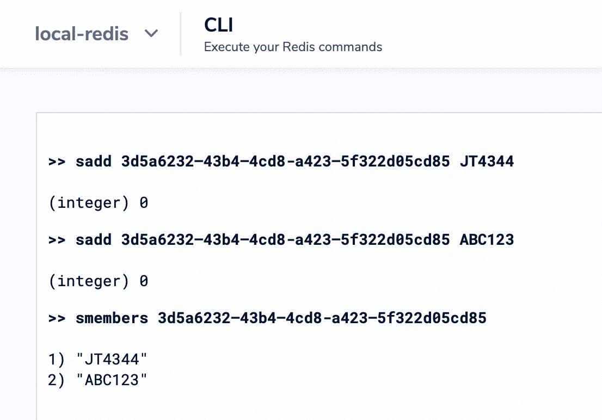
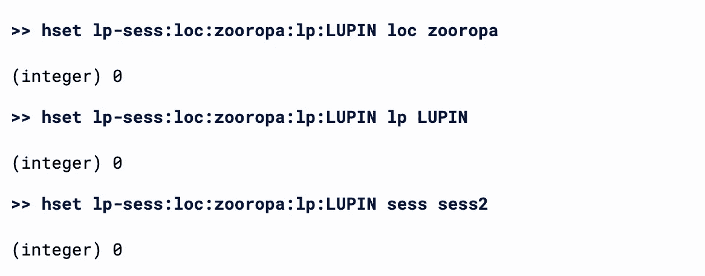
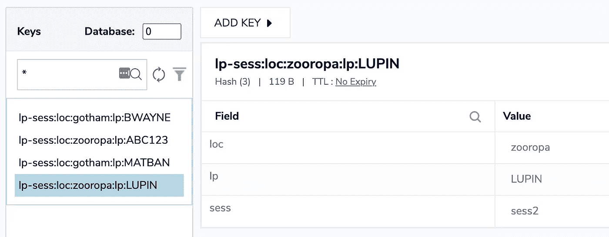
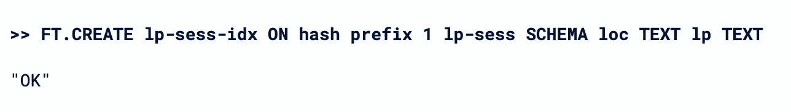
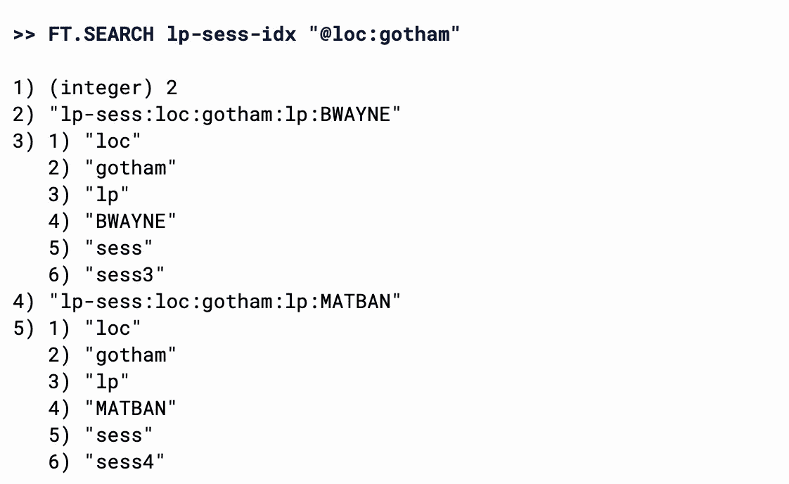
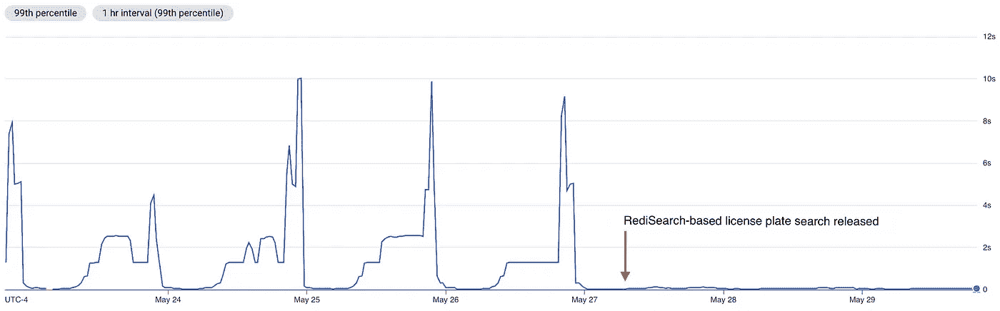

# 搜索 Redis

> 原文：<https://medium.com/geekculture/searching-redis-40e2387376f2?source=collection_archive---------14----------------------->

## *当按键不行的时候*


Photo by [Warren Wong](https://unsplash.com/@wflwong?utm_source=medium&utm_medium=referral) on [Unsplash](https://unsplash.com?utm_source=medium&utm_medium=referral)

在我的[上一篇文章](https://ranjithzachariah.medium.com/scaling-redis-571568378686)中，我描述了在扩展一个扫描繁重的 redis 工作负载时的一些冒险经历。我最终打算探索 Redis 企业。我希望把这个问题外包给 redis 背后的团队。

事实证明扫描是不可救药的，欧比-万·科博比也救不了我们。但是，Redis Enterprise 支持 RediSearch 模块，这提供了一个优雅的解决方案。

# 问题和天真的方法

让我们后退。问题中的工作负载来自一个洗车分析平台。下面是存储在 redis 中的示例键。这些是由前缀、位置 id 和牌照组成的复合密钥。存储在每个键上的值是一个会话 id。

```
“lp-sess:loc:3d5a6232–43b4–4cd8-a423–5f322d05cd85:lp:JT4344”
“lp-sess:loc:84bba9e7–0a8a-4af5–8b23-f1a16844c7bb:lp:HXS290”
“lp-sess:loc:7eae9995–23dd-4f0d-be0c-175979bfdc5b:lp:GMP1936”
“lp-sess:loc:ea9ef92b-1814–4a24-b4b9-ec94a496f301:lp:944101”
“lp-sess:loc:741100c2–4a1c-45b5-a44f-c315b63aa30b:lp:IKR069”
“lp-sess:loc:a1981989-aabf-4e52–9925–78e3b93d5d2e:lp:AJT138”
“lp-sess:loc:f31077cc-0bb5–4157–939c-adc08941e7ed:lp:KDC3600”
“lp-sess:loc:72cf7004-abef-47c5–9d8e-22d32e22f73b:lp:9J1252”
“lp-sess:loc:d76f798e-4653–4240-bb11-ec1981f1f228:lp:P556P”
“lp-sess:loc:a36c0c25–4c68–46bc-962c-47f55c2198c6:lp:M275079”
```

当一辆车进入给定摄像机的视野时，我们想知道我们以前是否见过这辆车。这个信息在 redis。每当一辆前所未见的车进入视野，我们就把它加入数据库。复杂的因素是车牌匹配应该是模糊的。我们容忍不同板块之间的一些性格差异。

由于这个模糊规则，O(1) redis GET 变成了 O(n) redis SCAN。

下面是令人讨厌的代码。

```
for key in self._redis.scan_iter(match=key_mask):
    _, lp_candidate = key.decode("utf-8").rsplit(":", 1)
    sim = Similarity.lp_similarity_ratio(plate, lp_candidate)        if Similarity.is_similar(sim, self.__lp_sim_threshold) and (best_match is None or best_match[1] < sim):
        best_match = LicensePlate(lp_candidate), sim
```

上面的 *key_mask* 会将扫描结果过滤到给定的位置。我们迭代这个位置的板块。对于每一个，我们对我们的候选人应用相似性函数来识别*最佳匹配*。

我对 SCAN 如何在多节点 redis 集群中工作有一个乐观、错误的看法。我构建了一个分片密钥，它可以将所有密钥放在一个给定的位置。我假设通过仔细的分片和适当的匹配过滤器，我可以将扫描操作限制在单个节点上。我错了。扫描操作迭代数据库中的所有键。在多节点群集中，扫描是一种分布式操作。将该操作乘以一个高吞吐量系统，您就有了一个解决性能瓶颈的方法。

# 备选方案 1:成套设备

Redis 提供了几种有用的数据结构。例如，集合。我们可以创建以位置为关键字的集合，并添加盘子作为成员。瞧:一个 DIY 二级索引。



redis set operations

这种方法的一个问题是 TTL 适用于整个集合，而不是单个成员。我们想在两小时后让车牌过期。我们不想让整个位置过期，而只是让一个位置的单个板过期。

通过在代码中管理超时并显式移除成员，或许可以解决这一限制。不过，这并不优雅。

# 选择 2:重新研究

Redis Enterprise 是 Redislabs 的托管 redis 解决方案。它提供 redis 集群即服务和几个附加模块。其中一个插件是重新搜索。RediSearch 允许您在 redis 数据库中建立搜索索引。它简化了复杂的查询。

您可以通过将它作为 docker 容器运行，在本地尝试重新搜索。

```
docker run -it --rm --name redis-search \
   -p 6379:6379 \
   redislabs/redisearch:2.0.0
```

您可以使用 redis cli 或像 [redisinsight](https://redislabs.com/redis-enterprise/redis-insight/) 这样的 GUI 客户端连接到您本地的 *redis-search* 。

让我们首先用 *loc、*和 *sess* 字段创建几个散列。



Use hset to create hash key and fields



Browsing hash values in redisinsight

接下来，让我们创建一个搜索索引。该索引包括前缀为 *lp-sess* 的关键字，我们对 *loc 和 lp* 字段进行索引。



Create a search index in RediSearch

让我们在索引中查询一个位置。



A location-based search query

这已经好多了。我们可以使用搜索索引来查找给定位置的所有车牌。

此外，我们可以在查询中添加一个板式过滤器。我们可以用%操作符进行模糊匹配，它应用了一个 [Levenshtein 距离](https://en.wikipedia.org/wiki/Levenshtein_distance)约束。Levenshtein 距离为 1 对应于一个字符的不匹配。过滤器容差对应于%符号的数量。


A composite search query with fuzzy plate matching

你好，再搜索。这里有一个基于 Python 实现的[示例 repo](https://github.com/rzachariah/hello-redis-search) 。

这是洗车分析平台对搜索性能的影响。



99th percentile fuzzy license plate search [s]

在第 99 百分位，平板搜索时间从扫描的 10 秒减少到重新搜索的 40 毫秒。

这个旅程是由 redislabs 的一些非常明智的建议促成的。谢谢你，欧比旺·克诺比！