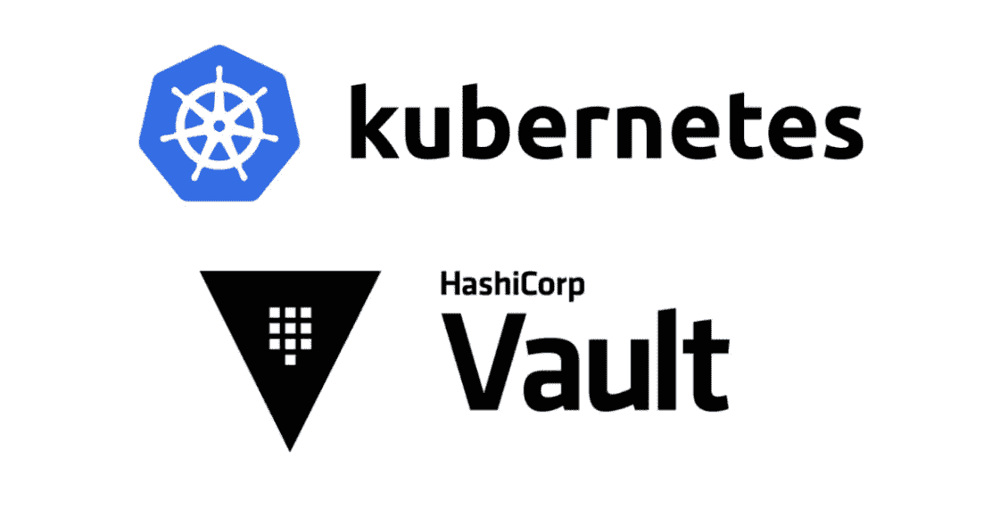
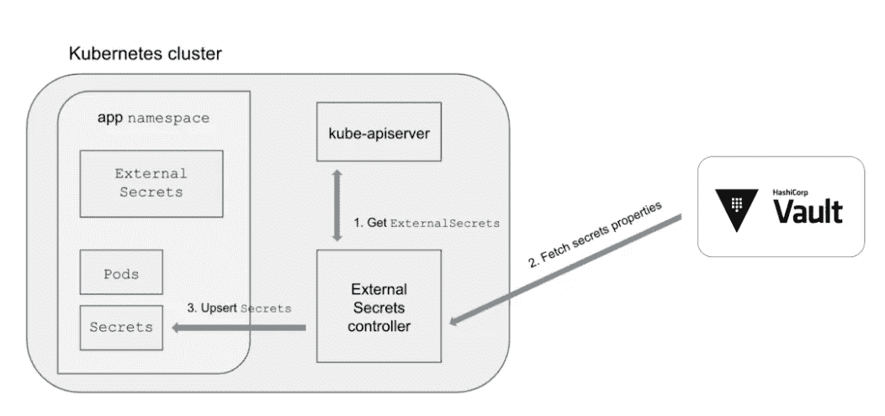

# 基于 HashiCorp 金库的 Kubernetes 集群秘密管理

> 原文：<https://medium.com/geekculture/secret-management-in-kubernetes-cluster-with-hashicorp-vault-41109656892?source=collection_archive---------6----------------------->



# 介绍

管理 Kubernetes 的秘密可能是一项具有挑战性的任务。Yaml 对秘密的定义是 base64 编码的，因此查找错误可能相当困难。但是这样做的安全性在哪里呢？如果您对 Kubernetes 中的安全性非常重视，那么您需要一个秘密管理工具来提供秘密、凭证、附加安全策略等的单一来源。换句话说，你需要哈希公司的金库。

# 先决条件

本教程要求安装 [Kubernetes 命令行界面(CLI)](https://kubernetes.io/docs/tasks/tools/install-kubectl/) 和 [Helm CLI](https://helm.sh/docs/helm/) 、 [Minikube](https://minikube.sigs.k8s.io/) 、Vault 和 Vault Helm 图表、示例 web 应用程序以及其他配置，以便将所有这些整合在一起。

# CentOS/RHEL 上的 Vault 安装和配置

**注意:**要安装 Vault Enterprise，请将`install vault`替换为`install vault-enterprise`。

使用以下命令验证安装。

只要 Vault 服务器是网络可寻址的，在 Kubernetes 集群外部运行的 Vault 就可以由它的任何 pod 寻址。如果 Vault 服务器绑定到与 Kubernetes 集群相同的网络，则可以在本地运行 Vault 和 Kubernetes 集群。

在**另一个终端**中，使用`root`作为根令牌启动一个 Vault dev 服务器，在`0.0.0.0:8200`监听请求。

```
$ vault server -dev -dev-root-token-id root -dev-listen-address 0.0.0.0:8200
```

将`-dev-listen-address`设置为`0.0.0.0:8200`会覆盖 Vault 开发服务器的默认地址(`127.0.0.1:8200`)，并使 Vault 可由 Kubernetes 集群及其 pods 寻址，因为它绑定到共享网络。

为`vault` CLI 导出一个环境变量，以寻址 Vault 服务器。

```
$ export VAULT_ADDR=[http://0.0.0.0:8200](http://0.0.0.0:8200)
```

我们部署的 web 应用程序希望 Vault 在路径`secret/devwebapp/config`中存储用户名和密码。要创建这个秘密，需要启用一个[键-值秘密引擎](https://www.vaultproject.io/docs/secrets/kv/kv-v2.html)，并将用户名和密码放在指定的路径中。默认情况下，Vault dev 服务器在前缀为`secret`的路径下启动一个键值机密引擎。

用一个`username`和`password`在路径`secret/devwebapp/config`创建一个秘密。

验证秘密存储在路径`secret/devwebapp/config`中。

现在，带有 secret 的 Vault 服务器已经准备好由 Kubernetes 集群和部署在其中的 pods 进行寻址。

# 开始 Kubernetes

我假设我们已经启动并运行了 kubernetes 集群，如果没有，请遵循 [**kubernetes 安装文档**](https://kubernetes.io/docs/tasks/tools/) **。**

# 部署服务以通过外部服务寻址外部保险库



外部保管库可能没有群集中的服务可以依赖的静态网络地址。当 Vault 的网络地址更改时，每个服务也需要更改才能继续运行。管理这个网络地址的另一种方法是定义一个 Kubernetes [服务](https://kubernetes.io/docs/concepts/services-networking/service/)和[端点](https://kubernetes.io/docs/concepts/services-networking/service/#services-without-selectors)。

一个*服务*围绕 pod 或外部服务创建一个抽象。当在 pod 中运行的应用程序请求服务时，该请求被路由到共享服务名称的端点。

创建一个名为 EXTERNAL_VAULT_ADDR 的变量名来分配存储 ip 地址。

```
EXTERNAL_VAULT_ADDR=$(hostname -I | awk '{print $1}')
```

定义一个名为`external-vault`的服务和一个被配置为寻址`EXTERNAL_VAULT_ADDR`的相应端点。

创建`external-vault`服务。

```
$ kubectl apply --filename external-vault.yaml
```

验证`external-vault`服务可从`devwebapp`盒内寻址。

```
$ kubectl exec devwebapp -- curl -s http://external-vault:8200/v1/sys/seal-status | jq
```

结果应显示 vault 服务器的状态。

然后应用下面的 yaml 文件来部署应用程序。这个部署将`VAULT_ADDR`设置为`external-vault`服务。

接下来，应用 sarva.yaml 中定义的部署。

```
kubectl apply -f sarva.yaml
```

这个名为`devwebapp-through-service`的部署创建了一个 pod，它通过服务寻址 Vault。

等待`devwebapp-through-service` pod 运行并准备就绪(`1/1`)。

最后，从`devwebapp-through-service`窗格中请求在`localhost:8080`提供的内容。

```
$ kubectl exec   $(kubectl get pod -l app=devwebapp-through-service -o jsonpath="{.items[0].medata.name}")   -- curl -s localhost:8080 **{"password"=>"salsa", "username"=>"giraffe"}**
$
```

web 应用程序验证并从外部 Vault 服务器请求它通过`external-vault`服务找到的秘密。

# 结论

我们提供了一个 Kubernetes 集群，其中的秘密来自一个运行**服务**的 Vault 集群，避免了我们自己加密秘密或将它们存储在不同地方的需要。

我们还受益于能够从 web 用户界面以纯文本方式可视化机密的更改，因此对机密进行故障排除变得很容易。