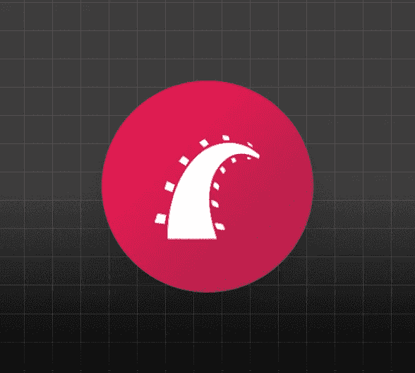

# 使用 Auth0 保护 Rails API

> 原文：<https://medium.com/geekculture/secure-a-rails-api-with-auth0-987f79b83785?source=collection_archive---------13----------------------->

如果你想在互联网上公开暴露一个 API，授权迟早会成为你的一个需求。您希望验证使用 API 的客户机是否具有适当的权限。

这本指南正是关于这一点的。我们将使用 [Ruby On Rails](https://rubyonrails.org/) 编写一个 API，并以 [Auth0](https://auth0.com/) 作为授权服务器。