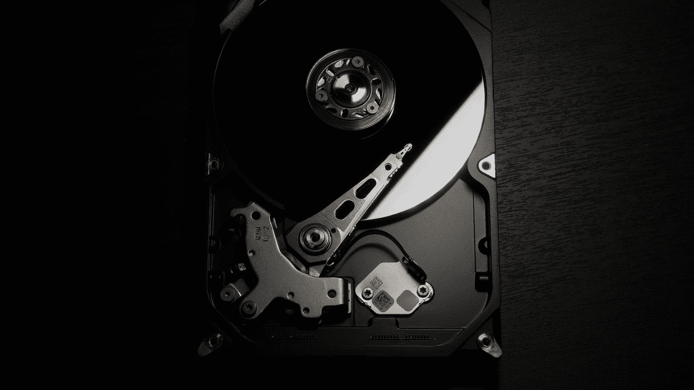

# 如何在 AWS 上保护 S3

> 原文：<https://medium.com/geekculture/secure-s3-on-aws-f4200aef386e?source=collection_archive---------17----------------------->

## 保护您组织最重要的资产信息。

Photo by [Shubham Bombarde](https://unsplash.com/@shubhambombarde?utm_source=medium&utm_medium=referral) on [Unsplash](https://unsplash.com?utm_source=medium&utm_medium=referral)

任何组织最重要的资产永远是信息，随着大多数公司的现代化，信息如今都存储在虚拟硬盘上。

对于那些在 AWS 平台上工作的人来说，这里有一些关于最重要的安全措施的提示，要考虑到…