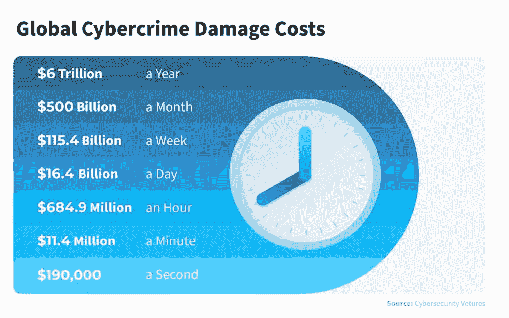
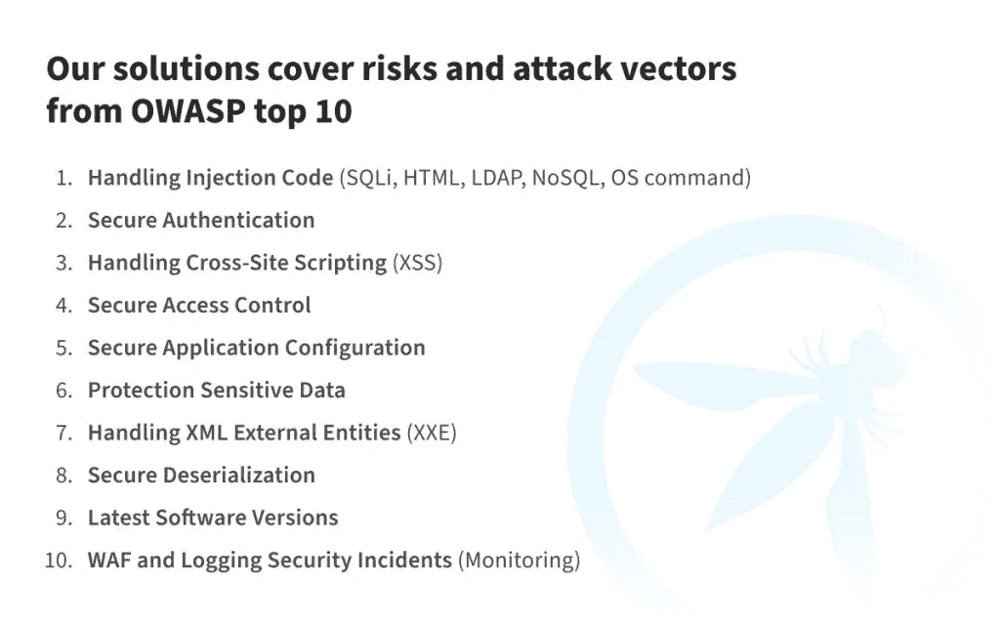
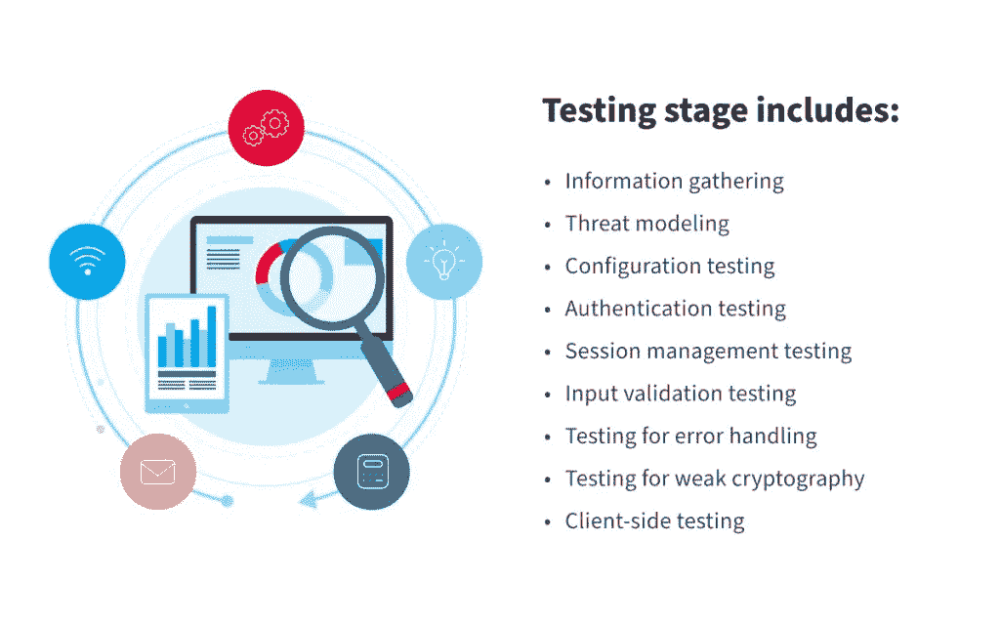
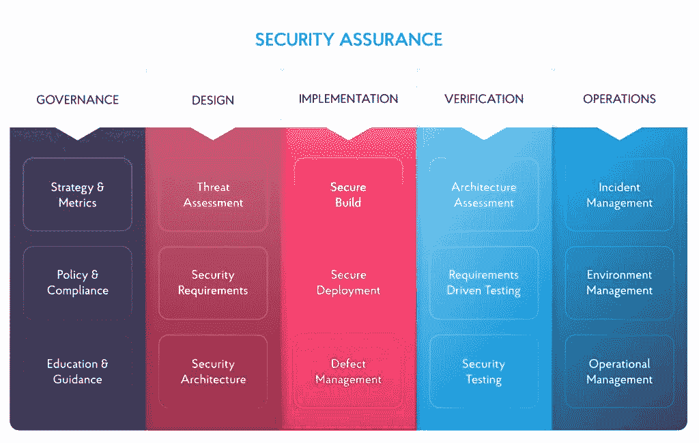

# 安全软件开发过程-NIX 安全 SDLC 方法 NIX United

> 原文：<https://medium.com/geekculture/secure-software-development-process-nix-approach-to-secure-sdlc-nix-united-b2784a8174e3?source=collection_archive---------17----------------------->

在这个数字化转型和不断变化的时代，构建安全、高质量的软件比以往任何时候都更具挑战性。技术世界在不断发展，随之而来的是威胁。您的公司用来保护自己的方法可能已经过时，需要被更先进的方法、策略和技术所取代。

软件开发生命周期中的安全措施有助于企业强化系统，保护系统免受威胁。

不同的项目需要不同的安全级别，并且必须符合您所在地区的行业特定要求或国家法规。从一开始就包含必需的实践是很重要的。如果不清楚您的项目需要什么样的安全级别、度量标准以及应用于您的项目的网络安全实践的不断改进，外部攻击可能会危及整个系统的安全。

在本文中，我们将讨论如何保护软件开发过程，并确保最终产品能够抵御任何攻击。

# 什么是安全的软件开发过程？

安全软件开发流程是基于行业领先组织(如 OWASP 或 SAFECode)提供的可靠安全软件开发文档的最佳实践集合。也称为安全软件开发生命周期(SSDLC)，专注于为标准 SDLC 补充安全性，并确保最终产品受到保护。

**安全的 SDLC 如何让您的企业受益:**

*   在计划阶段或开发过程的早期，在缺陷被编码为存在之前检测缺陷，降低业务风险
*   通过在生命周期早期预防或检测并解决问题来节省成本
*   将安全性作为一个持续的过程嵌入
*   召集所有利益相关者，确保软件应用程序的安全性

安全的软件开发流程可以保护软件免受未经授权的访问，并确保所需的合规性级别。此外，对漏洞的持续监控可以提高软件质量，降低业务风险。

# 安全软件开发生命周期(SSDLC)-NIX 的方法

我们建议从软件开发生命周期的开始就实施安全实践，从而优化进一步系统变更的成本以满足安全需求，并创建高质量、安全的产品。

# 第一阶段:战略

在 SSDLC 的第一阶段，我们根据业务行业和未来的使用案例，定义特定业务领域和国家特有的风险、标准和要求。包含技术和法规要求以快速识别和修复项目中潜在的不符合区域是非常重要的。

这既包括标准的网络安全规则和实践，也包括特定的策略，如 HIPAA、PCI DSS、GDPR 和 CCPA。然后，团队选择最适合的 SSDLC 方法，并为安全软件开发的所有阶段起草一份计划。

如此早期地实施经过验证的安全实践，可以确保工程团队在安全问题成为问题之前解决它们。

# 第二阶段:设计

在 SSDLC 的设计阶段，我们的专家会执行威胁评估，并为软件构建应用程序风险模型。基于定义的安全需求，工程师构建未来软件的架构。

NIX United 的工程师基于丰富的项目经验创建解决方案，从大型企业系统到简单的应用程序，并始终考虑每个领域中每种解决方案的具体情况。

# 第三阶段:发展

我们的专家严格遵循安全开发的指导方针和要求，如 OWASP 安全开发和测试指南和 ASVS。我们使用最新版本的库和框架，并监控该软件的潜在网络安全风险。我们使用静态应用程序安全测试(SAST)，它允许专家在软件开发阶段检测问题。这为开发人员在代码开发过程中可能引入代码的问题提供了即时反馈。

如有必要，我们会提供额外的安全强化，以符合业务领域的特性和政策。

# 阶段 4:测试

我们提供整体测试，以确保软件的安全和高效运行。我们内部顶尖的安全团队使用 OWASP Zed 攻击代理(ZAP)和 Burp Suite Pro 等安全扫描器在项目中实施动态应用安全测试(DAST)。这允许通过在运行时模拟黑客攻击和查明影响安全性的配置错误来暴露漏洞。

最重要的是，我们的团队根据 OWASP 方法进行安全测试，并定期进行渗透测试，以模拟针对软件和所有相关元素的网络攻击，从而检查可利用的漏洞。

# 第 5 阶段:部署和维护

在 SSDLC 的最后阶段，我们将软件部署到生产环境中，设置安全配置，并提供后期生产活动来预防和阻止潜在威胁。该团队还实施防火墙和其他解决方案来监控流量，并发送有关任何偏差的通知。

同样重要的是第三方软件跟踪——第三方元素中的漏洞会削弱整个系统。监控它们的安全性并在必要时修复易受攻击的点是至关重要的——对第三方软件的系统分析有助于发现受受损组件威胁的区域并填补漏洞。

在某些情况下，该团队会创建一个事件响应计划，明确描述您的事件团队解决任何安全违规的步骤。迅速执行响应计划对于解决安全漏洞至关重要。

网络安全始终是一个动态领域，其系统必须不断发展才能解决潜在威胁。NIX 工程师提供这样的分析来评估当前的安全级别是否足以满足软件的需求。我们的工程师总是提供提高安全级别和确保架构可伸缩性的方法，通过制定架构来牢记项目的进一步发展。

# 安全软件开发方法

根据我们安全团队的经验，我们可以肯定地说，使用任何模型都比不使用任何模型好得多。这些安全 SDLC 方法中的任何一种都将允许您了解项目中的当前情况，并建立长期策略，这将帮助您提高组织中所有领域的安全性，从而使您的产品更加成熟。

# 在成熟模型中构建安全性(BSIMM)

BSIMM 是一个测量软件安全性和成熟度的安全模型，由 12 个实践组成，分为四个领域，如治理、智能、SSDL 接触点和部署。

它提供了您当前软件安全计划(SSI)的客观视图，让您深入了解您的 SSI 如何与您所在行业的其他 BSIMM 成员的 SSI 相匹配，并显示逐年的进展。

# 微软安全开发生命周期

微软软件开发生命周期最初被设计为一套用于微软自身产品保护的内部方法。

后来，公司将这些做法作为产品与全世界分享。微软 SDL 是一种权威的方法，它为公司提供了经过时间验证的最佳实践和技巧，帮助他们实现更好的软件安全性。

微软 SDL 不断在各种公司软件上进行测试，并定期更新以应对不断发展的安全风险，涵盖了安全的大多数方面。

# OWASP 软件保障成熟度模型(SAMM)

在 NIX United，我们更倾向于 OWASP SAMM，因为它是一个权威的模型，定义完整，可测量，易于遵循，即使对于那些不涉及安全的人也是如此。它允许公司分析当前的软件安全实践，在特定的迭代中构建安全计划，展示安全过程中的渐进增强，并测量与安全相关的活动。

以下是我们用于 360 安全审计的综合框架。在评估和深入分析您当前的业务需求后，我们的顶级团队可以只应用那些有助于您实现所需安全级别的组件。

# 网络安全法规合规性

法规遵从性是在安全开发生命周期的早期阶段需要考虑的重要基础——检查您的业务想法是否意味着符合特定行业的要求或国家限制，以及您是否能够满足这些标准。

一旦出现违规行为，可能会产生严重的后果——从损害组织的声誉到巨额罚款，甚至破产或承担法律责任。

# 通用数据保护条例(GDPR)

GDPR 是欧洲隐私立法的核心，要求企业保护欧盟公民的个人数据和隐私。GDPR 还控制欧盟以外的个人数据输出。GDPR 保护主要身份数据、医疗保健相关数据、生物识别数据等。

任何存储或操作欧盟公民个人信息的组织都必须遵守 GDPR——即使他们在 EU-没有业务，并在安全软件开发生命周期的所有阶段遵守这些准则。

# 消费者隐私法(CCPA)

[加州消费者隐私法(CCPA)](https://oag.ca.gov/privacy/ccpa) 允许任何加州消费者有权查看公司收集的所有数据以及拥有这些数据的所有第三方的完整列表。此外，加州法律赋予消费者起诉组织的权利，如果他们认为违反了隐私准则，即使没有违反。

加利福尼亚州年收入至少为 2500 万美元的所有组织都必须遵守 CCPA。同样，拥有至少 50，000 人的个人数据的任何规模的公司都受此法规管辖。请记住，从**安全 SDLC** 的一开始，就要确保您的软件符合这些标准。

# 健康保险流通与责任法案(HIPAA)

HIPAA 指的是 1996 年的健康[保险流通和责任法案](https://www.hhs.gov/sites/default/files/ocr/privacy/hipaa/administrative/combined/hipaa-simplification-201303.pdf)并确保患者的受保护健康信息(PHI)保持机密。

HIPAA 覆盖的实体是接收、转发或更新电子保护健康信息(ePHI)或电子健康记录(EHR)的个人或公司。

每个处理患者健康信息的企业都应确保他们使用 [HIPAA 兼容软件](https://nix-united.com/blog/how-to-develop-a-hipaa-compliant-software/)并遵循程序来维护这些信息的安全性，以避免敏感的[数据泄露](https://nix-united.com/blog/what-is-hipaa-violation-and-how-to-prevent-data-breaches/)并确保 **SDLC** 的安全。

# 支付卡行业数据安全标准(PCI DSS)

[支付卡行业数据安全标准(PCI DSS)](https://www.pcisecuritystandards.org/pci_security/) 是一系列要求的集合，旨在确保所有处理、存储或传输信用卡数据的公司都受到保护。

PCI DSS 适用于与支付卡处理相关的工作人员。这包括各种规模的批发商、金融机构、销售点软件供应商以及构建和管理支付处理基础设施的开发人员。

# 如何保护软件开发-最佳实践

# 建立明确的安全要求

开发团队需要接收易于遵循的精确需求。这适用于所有安全提示、建议和手册。在安全软件开发生命周期的测试阶段发现的任何漏洞都应该很容易修复。至关重要的是，所有相关人员、流程和工具都要提供解决方案，而不仅仅是指出问题。

# 教育你的团队

安全 SDLC 与一系列相关流程并行，包括:

*   创建安全的编码指南
*   为开发人员提供安全知识和安全编码培训

这些将有助于有效地将安全性纳入 SDLC，并将所有部分放在一起以了解全局。

培训必须是您组织的安全 DNA 的重要组成部分，并定期进行，而不仅仅是一年一次。为您的员工提供完善的安全培训将对保护您的数据和资产大有裨益。

# 支持增长的心态

因为安全的 SDLC 将改变团队运作和互动的方式，所以每个人都以开放的心态对待体验是至关重要的。安全团队应该努力让开发人员能够自己保护他们的应用程序。

# 先解决大问题

最好将注意力集中在最紧迫的问题和可行的解决方案上，而不是修复您发现的每个漏洞——虽然它可能会修复新的或小型应用程序的所有现有安全问题，但它不一定适用于遗留软件，并且需要开发团队付出更多的努力。

分类方法可能很有用，因为它不仅专注于防止安全障碍进入生产阶段，还专注于确保现有的漏洞随着时间的推移得到解决和消除。

# 将合并与其他计划联系起来

如果软件已经构建完成，并且与其他现代化工作(例如云转型或 DevOps 计划)相关，工程团队通常更容易实施安全的 SDLC 变更。

# 包扎

NIX United 基于深厚的技术知识和 27 年以上为具有高安全性要求的行业提供解决方案的经验，构建特别强调安全性的软件。

我们拥有一流的内部团队，他们在各个领域实施高安全性标准方面拥有丰富的经验，能够不断提高技能组合，以跟上不断发展的行业需求。我们的职责包括为测试人员和开发人员实施安全培训计划，不断推进他们的开发、测试技能，并增强核心流程。

此外，我们可以参与解决现有产品的网络安全挑战，并帮助您为新软件制定长期战略。

*原载于 2021 年 9 月 3 日*[*【https://nix-united.com】*](https://nix-united.com/blog/secure-software-development-process-nixs-approach-to-secure-sdlc/)*。*