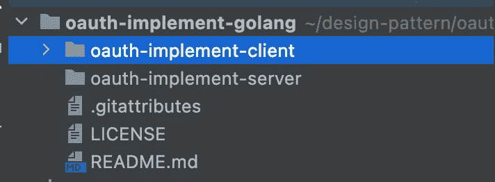
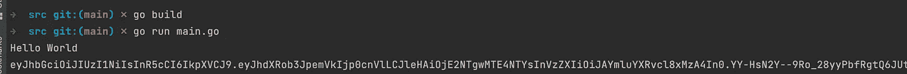
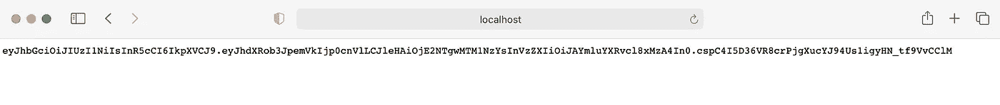
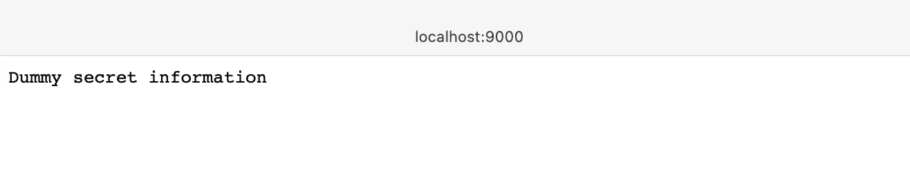
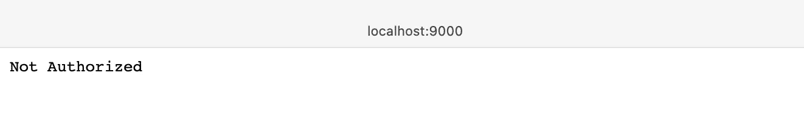
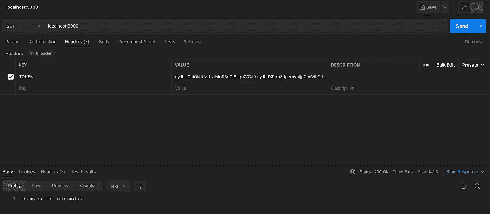
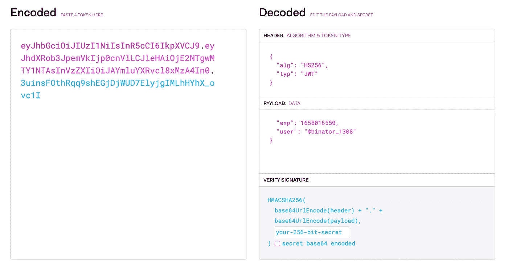

# 通过戈朗的 JWT 保护 API

> 原文：<https://medium.com/geekculture/securing-apis-via-jwt-in-golang-9d3659a32c34?source=collection_archive---------3----------------------->

# Json Web 令牌(JWT)

JSON Web Token (JWT)是一个开放标准( [RFC 7519](https://tools.ietf.org/html/rfc7519) )，它定义了一种紧凑且独立的方式，以 JSON 对象的形式在各方之间安全地传输信息。该信息可以被验证和信任，因为它是数字签名的。jwt 可以使用秘密(使用 **HMAC** 算法)或使用 **RSA** 或 **ECDSA** 的公钥/私钥对进行签名。

# 从 Go 应用程序开始

你可以直接从一个空的 Go 项目开始。我们基本上需要一个客户端和一个服务器。



project structure

# 在旅途中创建简单的客户端

我们将从 GoLang 的 OAuth 客户开始。我们将从一个主文件开始，在这里我们需要导入 jwt-go 库。

```
import "github.com/golang-jwt/jwt/v4"
```

创造一个 JWT 发电机

您可以使用 jwt-go 库创建 JWT 生成器函数

```
func GenerateJWTToken() (string, error) {
   token := jwt.New(jwt.SigningMethodHS256)

   claims := token.Claims.(jwt.MapClaims)

   claims["authorized"] = true
   claims["user"] = "@binator_1308"
   claims["exp"] = time.Now().Add(time.*Minute* * 30).Unix()

   tokenString, err := token.SignedString(mySignedKey)

   if err != nil {
      fmt.Errorf("generating JWT Token failed")
      return "", err
   }

   return tokenString, nil
}
```

您可以运行方法来检查客户端是否可以生成 JWT 令牌



接下来，我们可以创建一个方法，通过 http 公开这个特性，并在新请求中创建一个有效的 JWT 令牌

```
func HomePage(w http.ResponseWriter, r *http.Request) {
   validToken, err := GenerateJWTToken()
   if err != nil {
      fmt.Fprintf(w, err.Error())
   }

   fmt.Fprintf(w, validToken)
}
```

我们还需要为此创建一个处理程序。我们将为客户端使用端口 9001

```
func handleRequests() {
   http.HandleFunc("/", HomePage)
   log.Fatal(http.ListenAndServe(":9001", nil))
}
```

您应该能够看到在运行应用程序和访问 localhost:9001 时生成的 JWT 令牌



我们现在有了一个可以生成 JWT 令牌的基本客户端。

# 在移动中创建简单的服务器

我们现在从一个简单的服务器开始。我们可以初始化一个简单的主文件。

我们可以创建一个包含一些秘密信息的虚拟主页

```
func homePage(w http.ResponseWriter, r *http.Request) {
   fmt.Fprintf(w, "Dummy secret information")
}
```

我们还需要一个在端口 9000 上服务它的处理程序

```
func handleRequests() {
   http.HandleFunc("/", homePage)
   log.Fatal(http.ListenAndServe(":9000", nil))
}
```

我们应该能够在 localhost:9000 上看到伪秘密信息



现在，我们希望将此信息限制为授权访问它的经过验证的用户。

我们将从创建一个授权请求的函数开始。现在让我们对*令牌*头进行基本检查。

```
func isAuthorized(endpoint func(w http.ResponseWriter, r *http.Request)) http.Handler {
   return http.HandlerFunc(func(w http.ResponseWriter, r *http.Request) {
      if r.Header["Token"] != nil {

      } else {
         fmt.Fprintf(w, "Not Authorized")
      }
   })
}
```

接下来，我们将在处理程序中用*句柄*替换 *HandleFunc* 方法，并用我们的认证方法包装它。

现在我们可以继续讨论授权方法了。我们可以使用签名密钥和 HMAC 算法(我们在客户机中使用的)解析*令牌*头。如果它是有效的，那么我们可以服务于原始端点。

```
func isAuthorized(endpoint func(w http.ResponseWriter, r *http.Request)) http.Handler {
   return http.HandlerFunc(func(w http.ResponseWriter, r *http.Request) {
      if r.Header["Token"] != nil {
         token, err := jwt.Parse(r.Header["Token"][0], func(token *jwt.Token) (interface{}, error) {
            if _, ok := token.Method.(*jwt.SigningMethodHMAC); !ok {
               return nil, fmt.Errorf("there was an error")
            }
            return mySigningKey, nil
         })

         if err != nil {
            fmt.Fprintf(w, err.Error())
         }

         if token.Valid {
            endpoint(w, r)
         }
      } else {
         fmt.Fprintf(w, "Not Authorized")
      }
   })
}
```

现在我们可以再次运行服务器了。它仍然应该在浏览器上抛出*未授权*异常



但是在 postman 上使用来自客户端的有效头运行它，我们应该能够获取秘密信息。



我们可以在 [json.io 调试器](https://jwt.io/#debugger-io)上检查正确的头文件。回应应该是这样的:



decrypting a JWT token

# 在客户端对服务器发出的请求进行身份验证

我们需要将带有有效 JWT 的令牌头添加到客户端，以获得请求授权。

```
client := &http.Client{}
req, _ := http.NewRequest("GET", "http://localhost:9000", nil)
req.Header.Set("TOKEN", validToken)
res, err := client.Do(req)
if (err != nil) {
   fmt.Fprintf(w, err.Error())
}

body, err := ioutil.ReadAll(res.Body)
if err != nil {
   fmt.Fprintf(w, err.Error())
}
```

这样，我们的令牌应该是有效的，我们对服务器的所有请求都应该得到服务。


# 结论

我们现在在 GoLang 上有了一个基本的服务器和客户端，并通过 JWT 令牌授权了一个 ReST API。API 现在是安全的。
这篇文章的代码可以在[这里](https://github.com/abinator-1308/oauth-implement-golang)找到

*祝贺你坚持到了最后！在* [*Twitter*](https://twitter.com/bot_pragmatic) *，*[*GitHub*](https://github.com/abinator-1308/abinator-1308)*，*[*Medium*](/@abhinav.as1308)*，*[*LinkedIn*](https://www.linkedin.com/in/abinator-1308/)*，或者*[*insta gram*](https://www.instagram.com/abinator_1308/)*。*

感谢阅读！

# 参考

*   [https://oauth.net/2/](https://oauth.net/2/)
*   [https://github.com/golang-jwt/jwt](https://github.com/golang-jwt/jwt)
*   [https://github.com/dgrijalva/jwt-go](https://github.com/dgrijalva/jwt-go)
*   [https://www.youtube.com/watch?v=-Scg9INymBs](https://www.youtube.com/watch?v=-Scg9INymBs)
*   [https://jwt.io/](https://jwt.io/)