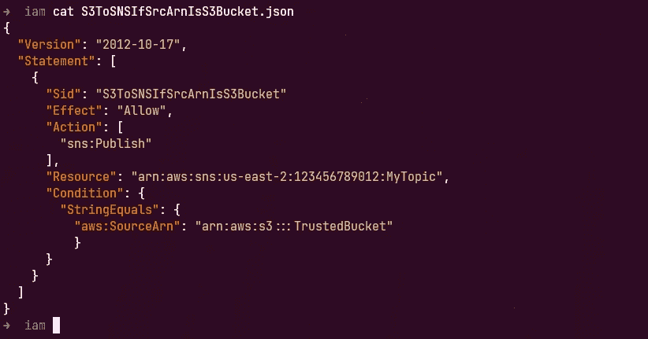

# 使用条件逻辑保护 AWS IAM 策略

> 原文：<https://medium.com/geekculture/securing-aws-iam-policies-using-conditional-logic-e8fc19b5f2d?source=collection_archive---------5----------------------->

## 利用 AWS 请求上下文进行授权

在 AWS 中，可以根据您在给定 IAM 策略中允许或拒绝的操作来授予对资源的授权。IAM 策略可以附加到 IAM 身份(用户、组或角色),也可以作为基于资源的策略直接附加到资源。IAM 策略的主体包含几个元素…