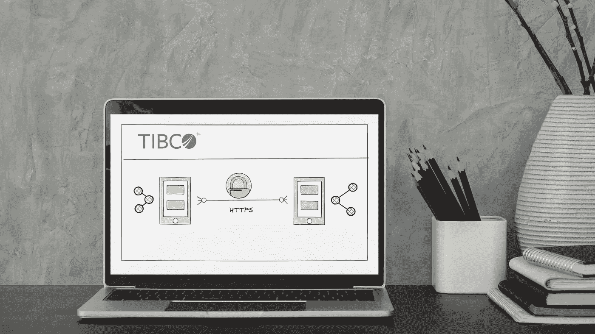
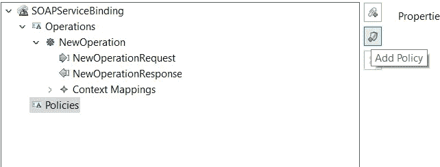
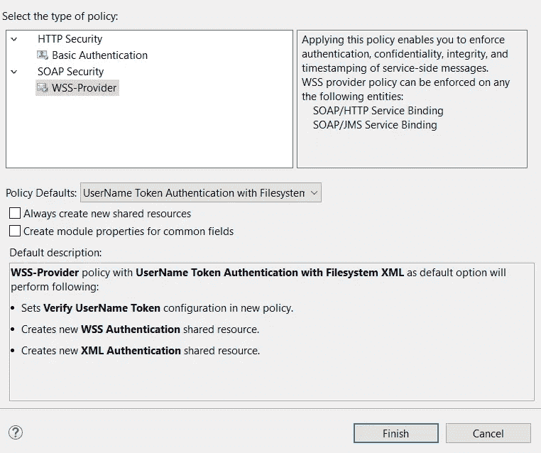
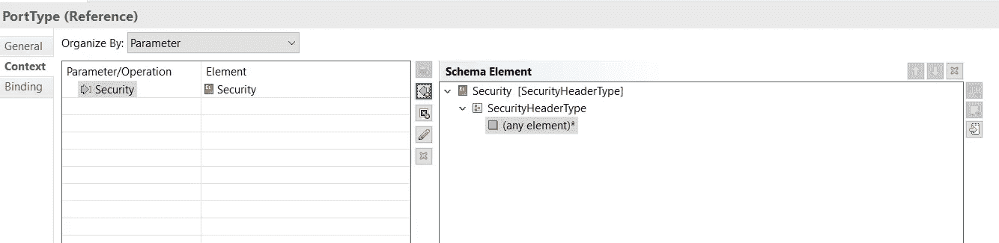
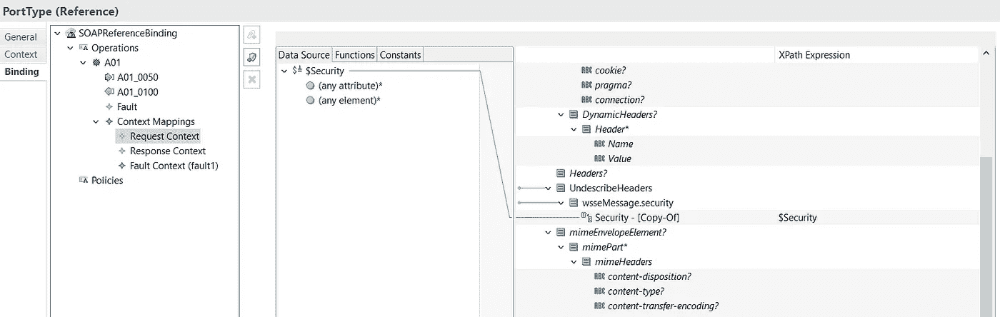
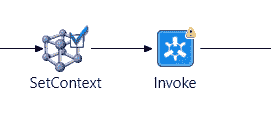

# 使用 TIBCO BusinessWorks 6.x 保护 web 服务

> 原文：<https://medium.com/geekculture/securing-webservices-with-tibco-businessworks-6-x-7232a892b992?source=collection_archive---------17----------------------->

## 或者我们入侵 TIBCO Business Works for WS-Security 1.2 的方式



## 介绍

在这个故事中，我想谈谈我的团队在 TIBCO Business Works 6.x 流程中配置 WS-Security 时遇到的麻烦。

我的团队无法仅使用标准机制来调用安全的 Web 服务。当我们意识到 TIBCO Business Works 6.x 只支持 WS-Security 1.0，而外部服务实现了 WS-Security 1.2 时，顿悟就来了

## 什么是 WS-Security？

WS-Security 是允许 SOAP Web 服务之间安全通信的协议。它是为了实现完整性和保密性而创建的。

它不同于基本身份验证，因为它将身份验证信息放在 SOAP 消息中，也不放在 HTTP 头中。

WS-Security 在 SOAP 头中添加了一个 XML 元素，称为*安全块*，它可以携带签名。您可以在安全模块中找到两个模块:

*   *UsernameToken* :携带用户名和密码信息；
*   *二进制安全令牌*:带来安全证书。

同时，WS-Security 只允许加密消息的一部分，除了传输层加密。

WS-Security 1.0 编码于 2004 年。它将 **UsernameToken** 定义如下:

```
<wsse:Security>
  <wsse:UsernameToken>
     <wsse:Username/>
  </wsse:UsernameToken>
</wsse:Security>
```

完成了两次更新:一次是 1.1 版本，在 2006 年，另一次是在 2007 年到 1.2 版本。最后一个为 UsernameToken 添加了几个可选属性: **Nonce** 和 **Created** 。

```
<wsse:Security>
   <wsse:UsernameToken>
      <wsse:Username/>
      <wsse:Password/>
      <wsse:Nonce/>
      <wsse:Created/>
   </wsse:UsernameToken>
</wsse:Security>
```

第一个是用于加密密码的随机密钥，而第二个是代表消息创建时间的日期。

## 您可以用 TIBCO Business Works 6 做什么

TIBCO Business Works 6.x 使用 WS-Security 1.0 安全化您的 web 服务。

文档很简单:为您的服务创建一个 SOAP 绑定，然后添加一个**策略**:



add policy to service binding

如果没有，则创建一个新策略，并选择**使用文件系统 XML 进行用户名令牌验证**或**使用工作区 XML 进行用户名令牌验证**



New Policy panel

我更喜欢*文件系统*选项:通过这种方式，你可以应用任何需要的密码轮换策略，而无需重新编译和部署你的应用。

完成按钮创建一个引用包外部 XML 凭证文件的 *WSSProvider* 资源。

用于创建 XML 凭证文件的模式不允许插入*随机数*和*创建的*时间戳。

事实上，它实现了 1.0/1.1 WSS 安全性。我们没有找到现成的方法来编码 1.2 UsernameToken。

## 我们的解决方案

当我们观察基本组件时，我们尝试了许多方法来实现我们的目标。我们当然不能贬低其他服务安全令牌。

最后，我们选择在引用的 PortType 中的 HTTP 上下文集合上进行操作。SetContext 调色板允许您在 HTTP 请求的头中定义和赋值自定义值。当调用使用登录令牌的云平台时，使用相同的机制。

在下面，我将使用点来简化程序。

1.  向端口类型引用添加安全上下文



2.在绑定面板中，在 SoapReferenceBinding 的上下文映射部分，将新定义的安全上下文映射到 SOAP 消息的头中



3.在流程路径中添加 SetContext 活动，以动态设置值。



SetContext activity

那都是乡亲们！

## 问候

我谈到的解决方案来自洛伦佐·尼吉多和 T2·帕里得·奥基比安科为找到合适的解决方案所做的艰苦工作。当第一个错误出现时，我参与了解决方案的上半部分。

我要感谢这两位，因为他们授权我分享他们的经验。干得好，伙计们！

## 放弃

本文中的所有观点和提出的解决方案都是个人的，不以任何方式代表 TIBCO 软件。

## 参考

*   *WS Security 1.0 规范*:[https://docs . oasis-open . org/WSS/2004/01/oasis-200401-WSS-soap-message-Security-1.0 . pdf](https://docs.oasis-open.org/wss/2004/01/oasis-200401-wss-soap-message-security-1.0.pdf)
*   *WS Security 1.1 规范*:[https://www . oasis-open . org/committees/download . PHP/16790/WSS-v 1.1-Spec-OS-soapmessagesecurity . pdf](https://www.oasis-open.org/committees/download.php/16790/wss-v1.1-spec-os-SOAPMessageSecurity.pdf)
*   *WS Security 1.2 Spec*:[http://docs . oasis-open . org/WS-sx/WS-Security policy/200702/WS-Security policy-1.2-Spec-OS . pdf](http://docs.oasis-open.org/ws-sx/ws-securitypolicy/200702/ws-securitypolicy-1.2-spec-os.pdf)
*   *TIBCO Docs*:[https://Docs . TIBCO . com/pub/active matrix _ business works/6 . 8 . 1/doc/html/default . htm # binding-palette/WSS-authentic ation . htm？Highlight=WS-Security](https://docs.tibco.com/pub/activematrix_businessworks/6.8.1/doc/html/Default.htm#binding-palette/wss-authentication.htm?Highlight=WS-Security)