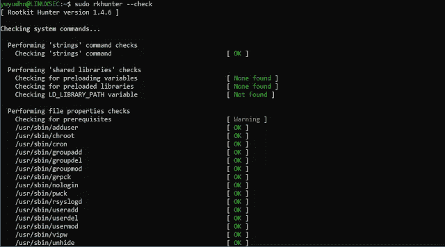
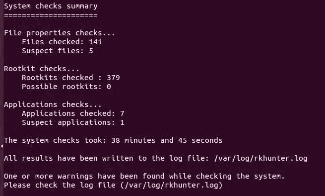

# 使用 Rootkit Hunter 保护您的 CentOS Linux 服务器

> 原文：<https://medium.com/geekculture/securing-your-centos-linux-server-with-rootkit-hunter-9232ae966a2f?source=collection_archive---------4----------------------->


Image by [Paolo Tarsitano](https://www.cybersecurity360.it/giornalisti/paolo-tarsitano/) from [Cyber Security 360](https://www.cybersecurity360.it/nuove-minacce/scranos-lo-spyware-invisibile-che-estorce-denaro-alle-vittime-dettagli-e-consigli-per-difendersi/)

[rootkit](https://en.wikipedia.org/wiki/Rootkit)是一个软件集合，通常是恶意的，被设计成允许访问计算机或其软件的一个区域，该区域本来是不被允许的，例如，未授权的用户，并且经常掩盖其存在或其他软件的存在。它是黑客用来获得对计算机或网络的持续管理员级别访问的软件。如今，rootkits 通常与特洛伊木马、蠕虫、病毒等恶意软件相关联，这些恶意软件对用户和其他系统进程隐藏了它们的存在和行为。



Image by [admin](https://www.servernoobs.com/author/admin/) from [ServerNoobs](https://www.servernoobs.com/install-rkhunter/)

Rkhunter([Rootkit Hunter](http://rkhunter.sourceforge.net/))是一款基于 Unix 的工具，可以扫描 Rootkit、后门和可能的本地漏洞。它通过将重要文件的 SHA-1 哈希与在线数据库中已知的良好哈希进行比较，搜索 rootkits 的默认目录，错误的权限，隐藏文件，内核模块中的可疑字符串，以及对 [Linux](https://www.linux.org/) 和 [FreeBSD](https://www.freebsd.org/) 的特殊测试来实现这一点。rkhunter 因包含在流行的操作系统中而引人注目。


Image by [Design Team](https://fedoraproject.org/wiki/Artwork) from [Fedora](https://fedoraproject.org/wiki/EPEL)

安装 rkhunter 所需的所有文件都包含在[Enterprise Linux](https://fedoraproject.org/wiki/EPEL)存储库中。EPEL 库为常用的 [CentOS](https://www.centos.org/) 企业软件提供了易于安装的软件包。安装 EPEL 存储库:

```
yum install epel-release
```

一旦安装了 EPEL 存储库，以 root 用户身份发出以下命令来启动安装例程。

```
yum -y install rkhunter
```

更新 rkhunter 数据库以获取最新的定义:

```
rkhunter --update
```

接下来，您需要更新系统文件属性。这是建立基础数据库文件以比较扫描的必要步骤。全新安装时，第一次运行 propupd 会创建一个新的数据库文件。在以后的扫描中，运行 propupd 命令会更新数据库文件。因此，要更新数据库文件，如果您满意，您只需信任源系统文件的更改，请使用以下命令:

```
rkhunter --propupd
```


Image by [Geotab](https://www.youtube.com/channel/UCuKGmfWD41mmefYYI62pfsQ) from [YouTube](https://www.youtube.com/watch?v=Bb0jABb24Oc)

O 打开 rkhunter 的配置文件进行编辑，并设置电子邮件通知，可通过编辑如下`MAIL-ON-WARNING`值来启用。当 rkhunter 发出警告时，您会收到一条消息。请注意，必须正确设置本地邮件，邮件通知才能正常工作。

```
vi /etc/rkhunter.confMAIL-ON-WARNING=username@domainname.com
```

参数`ALLOW_SSH_ROOT_USER`告诉 rkhunter 是否允许 root 用户通过 ssh 进入系统。这在文件中默认是未设置的。Rkhunter 每次运行都会抱怨这个。如果您禁用了 root 登录，您应该将该参数设置为“否”。

```
ALLOW_SSH_ROOT_USER=no
```

对于不使用模块的系统，您应该在禁用检查列表中禁用特定于操作系统的检查，否则，您可能会在扫描过程中遇到误报。特定于 Linux 的测试与模块相关，因此它们都与不使用模块的系统无关:

```
DISABLE_TESTS=suspscan hidden_procs deleted_files packet_cap_apps apps os_specific
```


Image by [Andrés Sosa](https://creativapixel.com/author/andres/) from [Creativa Pixel](https://creativapixel.com/eliminar-automaticamente-copias-backup-cronjob-cpanel-hosting/)

rkhunter 的当前版本在`/etc/cron.daily`下预装了一个 cronjob。如果您希望将每日报告发送到默认情况下本地根邮件帐户`/var/spool/mail/root`之外的其他地方(如果发现警告，已经发送到上面指定的地址)，您可以编辑 cronjob 的配置文件:

```
vi /etc/sysconfig/rkhunterMAILTO=username@domainname.com
```



Image by [Pickaweb](https://www.pickaweb.co.uk/) from [Pickaweb](https://www.pickaweb.co.uk/kb/setup-and-configure-rkhunter-malware-scanner/)

Y 您可以使用自动跳过功能启动手动扫描，即您不必在每次扫描结束时按 enter 键，通过发出以下命令来测试设置:

```
rkhunter -c -sk
```

如果发现任何警告，您应该会收到以下邮件:

> 请检查这台机器，因为它可能被感染了。

要查看日志以了解更多详细信息，请使用以下命令:

```
grep “Warning” /var/log/rkhunter/rkhunter.log
```