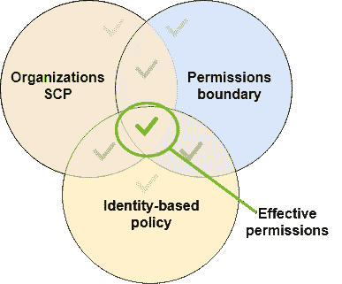
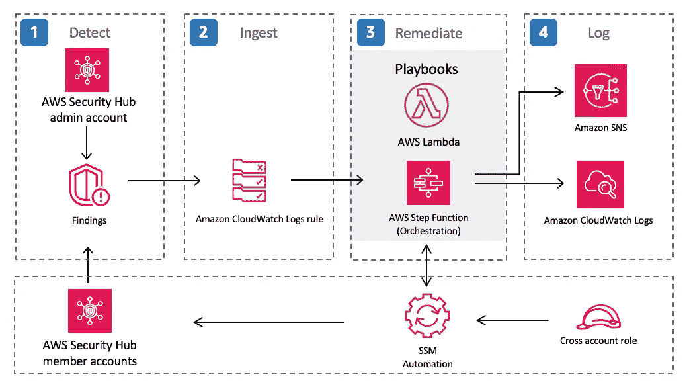

# 保护云上的数据库实例免受未经授权的访问或修改

> 原文：<https://medium.com/geekculture/securing-your-database-instance-on-the-cloud-from-unauthorized-access-or-modifications-15733ea3f062?source=collection_archive---------7----------------------->

如果你是网络新闻的热心读者，你会注意到许多数据库的数据泄漏或数据修改是由错误配置或薄弱配置造成的。就在这个月，[福克斯新闻频道](https://siliconangle.com/2022/04/07/fox-news-database-13m-records-found-exposed-online/)拥有 1300 万条记录的数据库通过一个未受保护的数据库被暴露在网上。看看网络战领域，黑客组织“匿名者”曝光了数吨属于俄罗斯联邦的数据库。根据下面的[文章](https://www.websiteplanet.com/blog/cyberwarfare-ukraine-anonymous/)，该研究公司能够抽样调查 100 个数据库中有 92 个是使用无密码保护的云存储库被入侵的。据观察，除了访问数据库内容之外，文件也被删除，并发起了网络破坏活动来传递信息。

[Image 1](https://threatpost.com/ladders-skymed-data-leak/144307/): Database publicly accessible.

对所有读者的呼吁是“**永远不要让你的云数据库对公众开放**”。打个比方，如果你把自己的保险箱放在马路中间，人们就会试图打开它。即使有了打开保险箱的密码，对手能够绕过对它的控制也只是时间问题。回想起来，互联网是一个“开放”的空间。这基本上意味着，如果你的数据库可以公开访问，对手就能够扫描网络并试图闯入你的数据库。

对于所有开发人员、DevOps 工程师、IT 甚至安全从业者来说，必须有一种心态，即一旦您的数据库被公开，不管是有意还是无意，对您的数据库的攻击可能会在第一个小时内发生。正如 Imperva 的蜜罐[研究](https://www.imperva.com/blog/never-leave-your-cloud-database-publicly-accessible/)所记录的，黑客将试图连接到数据库，并试图暴力破解认证(如果有的话)。

**本文将使用 Amazon Web Services (AWS)作为示例，请记住，在使用云服务提供商时，安全性是一项共同的责任。*

**允许云数据库对所有人公开的根本原因:**

**缺乏安全设计考虑** —在系统/应用的设计阶段，通过使用威胁建模、安全设计模式和参考架构来整体评估设计和架构至关重要。根据 [AWS 文档](https://docs.aws.amazon.com/vpc/latest/userguide/VPC_Scenario2.html)，建议在公共子网上运行面向公众的系统(如 web 服务器)，在私有子网上运行后端服务(如应用服务器和数据库服务器)。这增加了安全态势，因为对手将无法直接访问您的内部资源。安全设计考虑阶段经常被忽略或偷工减料，以便更快地投入市场。

如果业务要求允许公开数据库，组织应确定潜在威胁，应用必要的安全控制措施，并评估剩余风险。

**注:2021 年，* [*OWASP*](https://owasp.org/Top10/A04_2021-Insecure_Design/) *创立了一个名为“A04:不安全的设计”的新类别，作为 10 大最关键的应用安全风险之一。*

**使用了薄弱或错误配置的网络策略****—有几个网络控制来管理数据库连接。例如，安全组、网络 ACL、网络或本地防火墙。开发人员可能会不小心(有意或无意)允许所有连接(0 . 0 . 0 . 0/24)；允许从宽阔的 CIDR 街区连接；或者/甚至使用默认网络 ACL(允许所有入站或出站流量)或子网(公共子网—主路由表将发往互联网的子网流量发送到互联网网关)。**

****缺乏可见性和策略执行** —随着组织的扩展，可能很难跟踪所有开发人员在云上执行的操作(也可能跨不同的 AWS 帐户)。通常，组织在云上给予开发人员完全的自主权，而没有为云部署设计安全基线。即使有一个内部流程(非技术控制)向开发人员阐明，人为错误和疏忽也可能导致数据库的错误配置。**

**我想分享**三个**步骤来更好地保护您在云上的数据库实例(也适用于云上的其他用例或服务)免受未经授权的访问和修改。**

****第一步:在开发之前，一定要为解决方案的设计(包括安全性)做好计划，并列出剩余风险****

****

**[Image 2:](https://docs.aws.amazon.com/AmazonRDS/latest/UserGuide/TUT_WebAppWithRDS.html) An example of a system/network diagram on the cloud**

**俗话说“如果你没有计划，你就计划失败”。在构建任何云解决方案之前，规划设计并向利益相关者强调任何潜在风险是至关重要的。该架构必须与组织的业务目标和策略保持一致，包括安全性。**

**让我们用一个简单的三层体系结构作为例子——Web 服务器、应用服务器和数据库服务器。我们应该在公共子网内部署所有三台服务器，还是应该遵循安全最佳实践，将 web 服务器部署到公共子网，将应用程序和数据库服务器部署到私有子网？坦率地说，这种情况没有直接的答案。这实际上取决于您的业务需求。有没有这样一个用例，您要求应用程序和数据库服务器对公众开放？随后，执行威胁建模，并评估可以采取哪些安全控制措施来消除或减轻已识别的风险—允许公众访问会导致更大的攻击面。根据组织的预算和风险偏好，风险可能被接受、减轻或避免。如果避免了，就必须考虑一个单独的设计，直到涉众对风险感到放心为止。**

**安全性并不意味着成为组织的障碍，相反，与每个设计相关联的风险必须被阐明和理解。**

****步骤 2:利用技术控制来实施安全基线****

****

**[Image 3:](https://docs.aws.amazon.com/IAM/latest/UserGuide/access_policies_boundaries.html) Effective permission Venn diagram**

**如果组织有明确的安全或法规要求，就有可能将它们转化为云上的策略文档。在 AWS 中，我们可以利用服务控制策略(SCP)或 IAM 策略(带有权限边界)来决定允许或拒绝什么操作。例如，可以配置一个规则来拒绝在公共子网中启动任何数据库实例。此外，可以强制将哪些安全组附加到已部署的数据库实例。**

**利用云上的技术控制可以帮助消除任何人为错误，并帮助开发人员与组织的业务和安全策略保持同步。**

***注意:如果数据库需要公开，可以考虑实施 IP 地址的细粒度白名单，并不时地审查该策略。否则，数据库实例应该只允许来自应用服务器的连接。***

****步骤 3:执行主动审计和扫描****

****

**[Image 4:](https://aws.amazon.com/solutions/implementations/aws-security-hub-automated-response-and-remediation/) Use AWS Security Hub as a detection means**

**一个重要的安全原则是确保云中有足够的可见性。至少，我会推荐使用 AWS Security Hub，这是一种云安全状态管理服务，可以执行安全最佳实践检查、汇总警报并实现自动补救。AWS 安全中心支持多个公认的行业标准，如 CIS、PCI-DSS 和 AWS。关于数据库安全性，它会引发一些问题，如数据库实例可公开访问、静态数据库加密未启用、数据库实例应具有删除保护未启用、数据库日志应启用等等。组织可以将安全中心的输出用于检测目的，并在偏离安全最佳实践时用于表达风险。此外，安全中心扫描每 12 小时执行一次，因此它提供了您的云实例的最新状态。**

**如果您的组织资源不稀缺，可以考虑组建一个团队来构建一个自动化脚本，以便对您部署的云实例运行主动扫描。受一位安全研究员[的文章](https://infosecwriteups.com/how-i-discovered-thousands-of-open-databases-on-aws-764729aa7f32)的启发，该研究员在 AWS 上发现了数千个开放数据库(Elasticsearch)。这些数据库会泄露客户的个人信息，甚至生产日志，从而泄露组织网络的内部信息。**

***注意:可以利用 AWS 配置来监视变化(例如，在公共子网中启动一个 DB 实例)并对其采取行动。此外，AWS 配置规则允许自动修复不符合的资源。此外，可以启用 AWS GuardDuty 来检测数据库实例上的异常或潜在的暴力尝试。***

# ****结论****

**迁移到云确实有很多好处。但是在云上部署任何系统/应用程序之前，必须确保设计经过深思熟虑，包括与业务和安全目标及策略保持一致。一个小错误，比如数据库实例的错误配置或数据库安全控制不足，都可能导致攻击者获得对数据库的未授权访问或修改。我们必须有这样的心态:无论公共互联网上有什么，它都是一个开放的空间，任何人都可以试图闯入。**

**作为风险识别的一部分，根据您的设计草案应用威胁建模来评估所有潜在的攻击是至关重要的。随后，组织应实施相关的安全控制，以消除或减轻任何风险，并确定组织是否可以接受剩余风险级别。否则，需要重新设计和评估。**

**此外，组织可以在 SCP 或权限边界上实施策略，以使其开发人员的配置符合业务和安全策略。最后，始终采取主动措施来审计和扫描云配置。对组织目标的任何偏离都应立即纠正和补救(也可以是自动化的)。**

**最后，云安全是**的共同责任**。在确保为组织部署的系统和应用程序强制实施安全配置方面，云用户发挥着巨大的作用。**