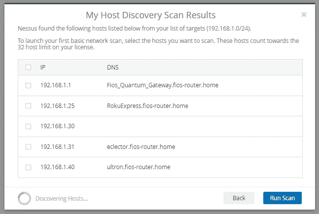
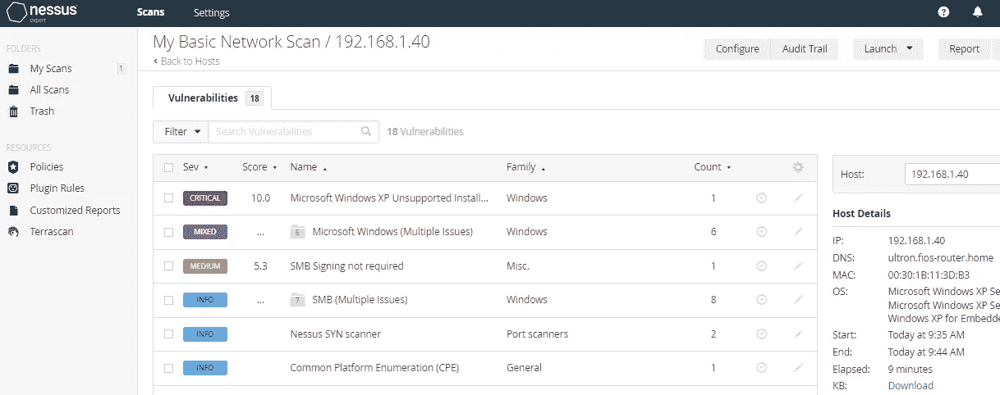
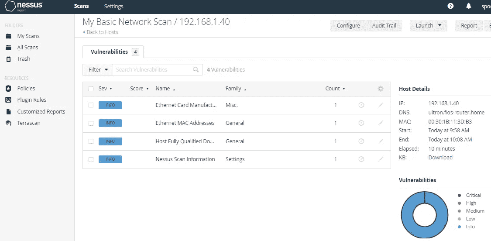
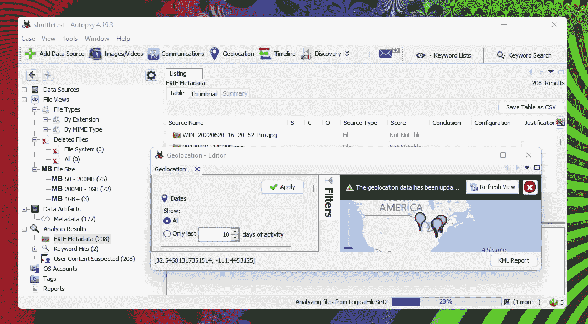

# 我通过了安全+ —为你准备提示

> 原文：<https://medium.com/geekculture/security-exam-prep-23429aa968d2?source=collection_archive---------10----------------------->


我通过了考试。规则禁止我说更多，除了下面的信息帮助了我！

为了准备参加最新的考试——sys 601，我读了两本书，做了很多模拟考试(几百道题)。在本文中，我想重点介绍备考的某个方面——这些资料中出现的与安全相关的工具(命令行实用程序和其他软件),您需要知道如何使用它们。了解这些工具也将有助于解决考试中的一种特殊类型的问题——基于表现的问题。它们就像一个小小的网络安全益智游戏。

我认为我对下面的输出进行了充分的净化。请不要攻击我的网络！

# 需要了解的命令和应用

*   ping —您知道这是做什么的，但您知道它有大约 20 个选项标志吗？您可以更改 ping 中的字节数。非常大的数字可用于缓冲区溢出攻击！
*   pathping —分析源和目的地之间沿路由的延迟和损失。相对于对所有东西都运行 ping 来说，省去了很多麻烦。

```
pathping [www.bbc.com](http://www.bbc.com)Tracing route to bbc.map.fastly.net [151.101.192.81]
over a maximum of 30 hops:
  0  Retrofuture.fios-router.home [192.168.1.163]
  1  Fios_Quantum_Gateway.fios-router.home [192.168.1.1]
  2  lo0-100.washdc-vfttp-340.verizon-gni.net [71.163.33.1]
  3  ae1340-21.artnvafc-mse01-aa-ie1.verizon-gni.net [100.41.23.70]
  4     *        *        *
Computing statistics for 75 seconds...
            Source to Here   This Node/Link
Hop  RTT    Lost/Sent = Pct  Lost/Sent = Pct  Address
  0                                           Retrofuture.fios-router.home [192.168.1.163]
                                0/ 100 =  0%   |
  1    0ms     0/ 100 =  0%     0/ 100 =  0%  Fios_Quantum_Gateway.fios-router.home [192.168.1.1]
                                0/ 100 =  0%   |
  2   10ms     0/ 100 =  0%     0/ 100 =  0%  lo0-100.washdc-vfttp-340.verizon-gni.net [71.163.33.1]
                                0/ 100 =  0%   |
  3   11ms     0/ 100 =  0%     0/ 100 =  0%  ae1340-21.artnvafc-mse01-aa-ie1.verizon-gni.net [100.41.23.70]Trace complete.
```

*   tracert(windows)/traceroute(Linux)—该命令显示三列时间。因为默认情况下，它会向路由中的每个点发送 3 次 UDP 数据包。

```
tracert 8.8.8.8Tracing route to dns.google [8.8.8.8]
over a maximum of 30 hops:1    <1 ms    <1 ms    <1 ms  Fios_Quantum_Gateway.fios-router.home [192.168.1.1]
  2    11 ms     9 ms     9 ms  lo0-100.washdc-vfttp-340.verizon-gni.net [71.163.33.1]
  3    12 ms     7 ms     9 ms  ae1340-20.washdcdn-mse01-aa-ie1.verizon-gni.net [100.41.23.68]
  4    14 ms    16 ms     8 ms  0.ae1.gw16.iad8.alter.net [140.222.3.87]
  5     9 ms     9 ms     9 ms  &#10.170.148.204.in-addr.arpa [204.148.170.158]
  6    17 ms    19 ms     8 ms  64.233.174.210
  7     7 ms     9 ms     8 ms  142.251.77.63
  8    13 ms     9 ms     9 ms  dns.google [8.8.8.8]Trace complete.
```

*   netstat —我运行了“bo”选项来显示哪个可执行文件拥有哪个网络进程。仔细观察，你会发现思科 Webex、英伟达 GPU、Steam、Discord、Spotify 和 MS Edge 都在运行。

```
.\netstat -bo
Active ConnectionsProto Local Address Foreign Address State PID
 TCP 127.0.0.1:62529 Retrofuture:62530 ESTABLISHED 1536
 [atmgr.exe]
***there were ten listening ports for atmgr.exe. This is Cisco webex. I seldom used so I uninstalled this port hog.***
 TCP 127.0.0.1:62538 Retrofuture:62537 ESTABLISHED 1536
 [atmgr.exe]
 TCP 127.0.0.1:64867 Retrofuture:65001 ESTABLISHED 4624
 [nvcontainer.exe]
 TCP 127.0.0.1:64941 Retrofuture:64961 ESTABLISHED 17196
 [NVIDIA Web Helper.exe]
 TCP 127.0.0.1:64961 Retrofuture:64941 ESTABLISHED 12940
 [NVIDIA Share.exe]
 TCP 127.0.0.1:65001 Retrofuture:64867 ESTABLISHED 4624
 [nvcontainer.exe]
 TCP 192.168.1.163:50067 155.133.253.34:27034 ESTABLISHED 24468
 [steam.exe]
 TCP 192.168.1.163:50520 204.79.197.239:https ESTABLISHED 14720
 [msedge.exe]
 TCP 192.168.1.163:50522 52.109.12.61:https ESTABLISHED 14720
 TCP    192.168.1.163:57960    20.190.151.6:https     TIME_WAIT       0
 TCP    192.168.1.163:57961    25:https               ESTABLISHED     16144
 [Spotify.exe]
 TCP    192.168.1.163:57962    20.190.151.6:https     TIME_WAIT       0
 TCP    192.168.1.163:58492    lb-140-82-113-25-iad:https  ESTABLISHED     14720
 [msedge.exe]
 TCP    192.168.1.163:58689    162.159.136.234:https  ESTABLISHED     2016
 [Discord.exe]
```

我使用-i 选项运行，以查看各种连接在给定状态下持续了多长时间，然后查找其中一些连接，以查看我连接到了什么。我可以告诉一些是亚马逊(ec2 和服务器前缀)主机。

```
.\netstat -iActive ConnectionsProto  Local Address          Foreign Address        State        Time in State (ms)
TCP    192.168.1.163:50067    155.133.253.34:27034   ESTABLISHED        2688872
TCP    192.168.1.163:52045    ec2-34-193-113-164:https  ESTABLISHED        2618517
TCP    192.168.1.163:53641    server-18-165-98-115:https  TIME_WAIT          99971
TCP    192.168.1.163:53642    server-18-165-98-39:https  TIME_WAIT          99991
TCP    192.168.1.163:53644    52.109.4.12:https      ESTABLISHED        314434
TCP    192.168.1.163:53651    e1:https               TIME_WAIT          14313
```

*   nslookup —查询有关主机的域服务器。检索附加信息(看起来 dnsenum 使用了这个命令)，比如使用的顶级 DNS 根服务器。

```
nslookup [www.bbc.com](http://www.bbc.com)
Server:         172.20.176.1
Address:        172.20.176.1#53Non-authoritative answer:
[www.bbc.com](http://www.bbc.com)     canonical name = [www.bbc.com.pri.bbc.com](http://www.bbc.com.pri.bbc.com).
[www.bbc.com.pri.bbc.com](http://www.bbc.com.pri.bbc.com) canonical name = bbc.map.fastly.net.
Name:   bbc.map.fastly.net
Address: 151.101.64.81
Name:   bbc.map.fastly.net
Address: 151.101.192.81
Name:   bbc.map.fastly.net
Address: 151.101.128.81
Name:   bbc.map.fastly.net
Address: 151.101.0.81
Name:   j.root-servers.net
Address: 192.58.128.30
Name:   m.root-servers.net
Address: 202.12.27.33
Name:   j.root-servers.net
Address: 2001:503:c27::2:30
Name:   m.root-servers.net
Address: 2001:dc3::35
```

*   ipconfig—(windows)/ifconfig(Linux)—打印出接口信息。/all 或-a '打印所有内容。
*   route —默认情况下，打印主机的路由表(IPv4 和 v6)。在 windows 上，它还会列出网络适配器的 MAC 地址。您还可以使用它来添加、更改和删除路线。顺便说一下，MAC 地址的前 3 个字节告诉你设备的制造商。看这里: [MAC B4:2E:99 | MAC 地址查找(maclookup.app)](https://maclookup.app/macaddress/B42E99) 。
*   arp—“-a”选项用于打印 ARP 缓存，“-s”将添加一个地址。现代家庭中有相当多的联网设备！172.20.177.124 地址是我的 Linux VM 的 Windows 子系统。

```
PS C:\Users\eizde> arp -aInterface: 192.168.1.163 --- 0xa
  Internet Address      Physical Address      Type
  192.168.1.1           c8-a7-0a-b8-1e-66     dynamic
  192.168.1.13          10-f0-05-71-55-cf     dynamic
 ...
  192.168.1.231         a8-66-7f-03-3e-6b     dynamic
  192.168.1.252         90-cd-b6-b2-62-b3     dynamic
  192.168.1.255         ff-ff-ff-ff-ff-ff     static
  224.0.0.22            01-00-5e-00-00-16     static
  224.0.0.251           01-00-5e-00-00-fb     static
  224.0.0.252           01-00-5e-00-00-fc     static
  239.255.255.250       01-00-5e-7f-ff-fa     static
  255.255.255.255       ff-ff-ff-ff-ff-ff     staticInterface: 172.20.176.1 --- 0x2a **[this is a WSL2 instance]**
  Internet Address      Physical Address      Type
  172.20.177.124        00-15-5d-94-6a-2b     dynamic
  172.20.191.255        ff-ff-ff-ff-ff-ff     static
  224.0.0.22            01-00-5e-00-00-16     static
  224.0.0.251           01-00-5e-00-00-fb     static
  239.255.255.250       01-00-5e-7f-ff-fa     static
```

*   创建文件，合并文件，读取文件。相同的名称和功能，但在 Linux 和 Powershell 之间的使用方式非常不同。
*   curl —(在 WSL2 和 powershell 中)我用 curl 做了一些检索和标题抓取，使用了我在 netstat 中找到的 IP 地址。

```
curl -s -I 52.109.4.12 | grep -e "Server"
Server: Microsoft-IIS/10.0
```

“-I”标志仅用于显示文档信息。-s '是静音模式-只是输出少了一点。nmap 显示服务器(www.office.com)对 http 和 https 流量开放。

```
curlcmdlet Invoke-WebRequest at command pipeline position 1
Supply values for the following parameters:
Uri: [www.google.com](http://www.google.com)StatusCode        : 200
StatusDescription : OK
Content           : <!doctype html><html itemscope="" itemtype="[http://schema.org/WebPage](http://schema.org/WebPage)" lang="en"><head><meta
                    content="Search the world's information, including webpages, images, videos and more. Google has
                    many speci...
RawContent        : HTTP/1.1 200 OK
                    X-XSS-Protection: 0
                    X-Frame-Options: SAMEORIGIN
                    Cache-Control: private, max-age=0
                    Content-Type: text/html; charset=UTF-8
                    Date: Mon, 19 Sep 2022 17:50:24 GMT
                    Expires: -1
                    P3P: CP=...
Forms             : {f}
Headers           : {[X-XSS-Protection, 0], [X-Frame-Options, SAMEORIGIN], [Cache-Control, private, max-age=0],
                    [Content-Type, text/html; charset=UTF-8]...}
**.... I cut off rest**
```

特定于 Linux(以及用于 Linux 的 Windows 子系统)

*   nmap — [Nmap:网络映射器—免费安全扫描器](https://nmap.org/)

nmap 也有抓取横幅的命令选项。

```
nmap -sV -script=banner 52.109.4.12
Starting Nmap 7.80 ( [https://nmap.org](https://nmap.org) ) at 2022-09-20 09:08 EDT
Nmap scan report for 52.109.4.12
Host is up (0.016s latency).
Not shown: 998 filtered ports
PORT    STATE SERVICE   VERSION
80/tcp  open  http      Microsoft IIS httpd 10.0
|_http-server-header: Microsoft-IIS/10.0
443/tcp open  ssl/https
|_http-server-header: Microsoft-IIS/10.0
Service Info: OS: Windows; CPE: cpe:/o:microsoft:windowsService detection performed. Please report any incorrect results at [https://nmap.org/submit/](https://nmap.org/submit/) .
Nmap done: 1 IP address (1 host up) scanned in 61.78 seconds
```

我用它扫描了我的本地网络。/24 CIDR 范围意味着从 192.168.1.0 开始扫描 2⁸地址(256)。网络掩码的宽度是 24，所以 32 减去 24 得到 8。范围内的地址数是 2⁸.

```
skye@Retrofuture:/mnt/c/Users/eizde$ nmap 192.168.1.0/24
Starting Nmap 7.80 ( [https://nmap.org](https://nmap.org) ) at 2022-09-19 12:56 EDT
**...cut a few things**Nmap scan report for 192.168.1.100
Host is up (0.0082s latency).
Not shown: 996 closed ports
PORT     STATE SERVICE
7911/tcp open  unknown
8000/tcp open  http-alt
9666/tcp open  zoomcp
9999/tcp open  abyssNmap scan report for 192.168.1.101
Host is up (0.030s latency).
Not shown: 998 closed ports
PORT     STATE    SERVICE
3828/tcp filtered neteh
8600/tcp filtered asterixNmap scan report for printer.fios-router.home (192.168.1.173)
Host is up (0.0027s latency).
Not shown: 993 closed ports
PORT     STATE SERVICE
80/tcp   open  http
139/tcp  open  netbios-ssn
443/tcp  open  https
445/tcp  open  microsoft-ds
515/tcp  open  printer
631/tcp  open  ipp
9100/tcp open  jetdirectNmap scan report for Pixel-4a.fios-router.home (192.168.1.199)
Host is up (0.016s latency).
All 1000 scanned ports on Pixel-4a.fios-router.home (192.168.1.199) are closedNmap scan report for 192.168.1.217
Host is up (0.014s latency).
All 1000 scanned ports on 192.168.1.217 are closedNmap scan report for 192.168.1.252
Host is up (0.0024s latency).
All 1000 scanned ports on 192.168.1.252 are closedNmap done: 256 IP addresses (9 hosts up) scanned in 18.16 seconds
```

*   类似 netcat 的卷曲，但更普通。Netcat 可以执行扫描、流式传输和数据传输。用于故障排除，可以抓取横幅。
*   dd —文件的低级复制。可用于制作图像。
*   头/尾—查看文件的开头或结尾。Tail 可以保持“开启”状态，这样您就可以随时查看所有新活动。
*   grep —在一个文件(或一组文件)中查找模式。

```
If helloworld.txt contains "hello" this will find it.
grep “hello” helloworld.txt
```

*   chown —更改文件的所有权(chown newOwner 文件)。
*   chmod —更改文件的读/写/执行与所有者/组/其他权限(使用自主访问控制，如 Windows)。
*   logger——写入系统日志(尽管在 OSX 蒙特瑞上，他们将其更改为写入新的日志系统)。
*   tcpdump —监视网络流量并创建 pcap 文件以供以后分析。

```
tcpdump -c 20 -w mydump.pcap
writes 20 packets to mydump.pcap
```

**其他工具**

*   wireshark — [Wireshark 深入人心。像 tcpdump 一样的网络流量/协议嗅探器，但是有一个很棒的 UI。在线分析、协议解析器等。](https://www.wireshark.org/)
*   tcpreplay —重放 pcap 文件(tcpreplay -i eth0 mydump.pcap)中的网络流量。必须始终指定接口，并且可能需要 sudo(root)权限。

```
sudo tcpreplay -i eth0 mydump.pcap
Actual: 20 packets (3371 bytes) sent in 86.94 seconds
Rated: 38.7 Bps, 0.000 Mbps, 0.23 pps
Statistics for network device: eth0
        Successful packets:        20
        Failed packets:            0
        Truncated packets:         0
        Retried packets (ENOBUFS): 0
        Retried packets (EAGAIN):  0
```

*   memdump —将系统内存转储到标准输出流(可以转储内核或物理内存)，但如果没有工具，则不可读。您应该将这个输出定向到某个地方，比如一个附加的硬盘驱动器。
*   winhex，hxd 等。—用于分析二进制文件。可以很容易地在文件中找到人类可读的文本字符串。
*   领域信息挖掘器；获取 DNS 信息。可以查询特定系统或不使用命令运行。要了解结果，您应该熟悉 DNS 记录类型！

```
dig j.root-servers.net; <<>> DiG 9.16.1-Ubuntu <<>> j.root-servers.net
;; global options: +cmd
;; Got answer:
;; ->>HEADER<<- opcode: QUERY, status: NOERROR, id: 25376
;; flags: qr rd ad; QUERY: 1, ANSWER: 4, AUTHORITY: 0, ADDITIONAL: 0
;; WARNING: recursion requested but not available;; QUESTION SECTION:
;j.root-servers.net.            IN      A;; ANSWER SECTION:
j.root-servers.net.     0       IN      A       192.58.128.30
m.root-servers.net.     0       IN      A       202.12.27.33
j.root-servers.net.     0       IN      AAAA    2001:503:c27::2:30
m.root-servers.net.     0       IN      AAAA    2001:dc3::35;; Query time: 0 msec
;; SERVER: 172.20.176.1#53(172.20.176.1)
;; WHEN: Mon Sep 19 14:27:45 EDT 2022
;; MSG SIZE  rcvd: 196
```

*   dnsenum——收集给定域名的各种 DNS 信息的伟大工具。该报告包含邮件(MX)、web 和 vpn 服务器、名称服务器等内容。这是一个有趣的工具，具有一些基于配置文件(/usr/share/dnsenum/dns.txt)的强力特性。它所做的是尝试 dns.txt 中的每个域名前缀，以找到给定域可能在线的所有内容。它还会扫描 IP 范围(使用/24)来查找网上找到的东西，并对它们执行反向查找来搜寻更多使用暴力无法找到的服务。
*   nessus- [下载 nessus 漏洞评估| Nessus | Tenable](https://www.tenable.com/products/nessus)

我安装了 Nessus Expert 的试用版，这样我可以分享一些功能和截图。仅供参考，在 100mbps 的连接上下载需要几分钟。Nessus 允许您扫描使用 IP 或 CIDR 范围的主机，所以它做的第一件事是主机发现。嘿-我有一个 Roku！



我决定扫描 Roku、我的台式机、一个 XP 游戏系统和一个威瑞森机顶盒。Nessus 在开放的端口上抓取横幅，它还根据找到的端口和服务进行操作系统猜测。良好的摘要和足够的信息来识别网络上的任何流氓设备以及重要的安全问题。扫描四台主机花了 20 分钟。它真的不喜欢我的 XP 系统，但这并不奇怪，因为它运行的是一个不受支持的操作系统，多年来一直没有打补丁。一个关于中小型企业的桌面误报。防火墙实际上被设置为阻止所有 SMB 流量，但是由于 nessus 在那台机器上运行，它不知道这一点。Nessus 还可以运行恶意软件认证扫描和许多其他类型的扫描。



我禁用了 XP box 上的文件和打印机共享，以及其他所有防火墙流量例外，因为 XP 默认情况下允许太多，并重新运行了扫描-基本安全补救。一旦我这样做了，Nessus 几乎找不到任何关于主机的信息，甚至说不出它是什么操作系统。**由此可见基于主机的防火墙有多重要。**



*   布谷鸟— [布谷鸟沙箱—自动恶意软件分析](https://cuckoosandbox.org/download)。这为恶意软件分析创建了一个沙箱，包括不良网站。

注意，只有 Python 2.7 才完全支持 Cuckoo，所以您应该使用虚拟环境(anaconda)安装它，这样就不会搞乱其他 Python 环境。安装是相当痛苦的-许多先决条件和 Windows 的零指令。我试图安装一些先决条件，他们无法找到。运行主 pip install 命令，发现某些部分也被 Windows security 标记为特洛伊木马(对于安全软件来说这并不奇怪)。窗户上的布谷鸟到此为止。

*   基于 harvester- Python 的“工具，用于从不同的公共来源(搜索引擎、pgp 密钥服务器)收集子域名、电子邮件地址、虚拟主机、开放端口/横幅和员工姓名。”呀！ [laramies/theHarvester:电子邮件、子域名和域名收割机—OSINT(github.com)](https://github.com/laramies/theHarvester)
*   sn1per- [1N3/Sn1per:攻击面管理平台| sn1 persecurity LLC(github.com)](https://github.com/1N3/Sn1per)“自动侦察扫描器，可用于使用最新的开源工具和技术发现资产和扫描漏洞。”
*   scanless—[ve sche/scanless:online port scan scraper(github.com)](https://github.com/vesche/scanless)通过使用在线网站为您执行匿名端口扫描。标识目标系统上运行的服务。在这个例子中，我扫描了一个邮件服务器。我还扫描了我家的外部 IP，一切都关闭了:)

```
scanless.exe -t  209.85.202.26 -s spiderip
Running scanless v2.1.6...spiderip:
PORT      STATE  SERVICE
21/tcp    closed ftp
22/tcp    closed ssh
25/tcp    open   smtp
80/tcp    closed http
110/tcp   closed pop3
143/tcp   closed imap
443/tcp   closed https
465/tcp   closed smtps
993/tcp   closed imaps
995/tcp   closed pop3s
1433/tcp  closed ms-sql-s
3306/tcp  closed mysql
3389/tcp  closed ms-wbt-server
5900/tcp  closed vnc
8080/tcp  closed http-proxy
8443/tcp  closed https-alt
```

*   hping——10 岁，没有积极发展。为什么会在书里？
*   尸检— [尸检—下载](https://www.autopsy.com/download/)这是用于分析和报告硬盘(或仅选择文件/文件夹)、虚拟机、磁盘映像，甚至系统上未分配的空间。该应用程序有一个用户界面，可以访问所有报告数据，包括文件类型、文件大小、关键字(电子邮件地址或您自己的搜索)、文件元数据、图像浏览、包含地理标签的数据(如图片)——基本上是文件类型的任何已知元数据。在分析过程中，用户界面中也会显示结果。下面是截图。



Scanned my photos and geolocated them. Nice trip down memory lane.

*   FTK 成像仪— [FTK 成像仪—extero](https://www.exterro.com/ftk-imager)在不改变源的情况下创建图像，因此您可以根据图像安全地工作(不使用原始图像对取证至关重要)
*   Volatility-[Volatility foundation/Volatility 3:Volatility 3.0 开发(github.com)](https://github.com/volatilityfoundation/volatility3/)从易失性存储器(RAM)中提取数字文物的框架。我使用任务管理器为一个进程创建了一个转储文件(右键单击一个进程并选择 Create Dump File ),并尝试运行 volatility 来分析它。我收到一个错误，说我需要符号表。我试着下载它们，但是它们在网站上不见了。我给他们发了一封邮件。此链接不起作用:[https://downloads . volatity foundation . org/volatity 3/symbols/windows . zip](https://downloads.volatilityfoundation.org/volatility3/symbols/windows.zip)

# 基于绩效的问题

如果您没有听说过这些，您需要了解它们以及它们如何在 Security+上工作。不要毫无准备而浪费时间，或者慌乱而犯错误。以上所有细节的原因是为了让你知道你可能被要求在 PBQ 中应用的工具。

[基于绩效的问题概述| CompTIA IT 认证](https://www.comptia.org/testing/testing-options/about-comptia-performance-exams/performance-based-questions-explained)

[基于绩效的问题常见问答| CompTIA IT 认证](https://www.comptia.org/testing/testing-options/about-comptia-performance-exams/performance-based-questions-faq)

Security+只有模拟 pbq，这很好，因为你可以跳过它们，以后再回到它们。完整描述:“模拟是一种环境或工具的近似，如防火墙、网络图、终端窗口或操作系统。它们通常具有受限的系统功能，但被设计为允许多种可能的响应或路径。”

示例:[模拟容器(comptia.io)](https://demosim.comptia.io/)

你会得到一个可点击的网络图，这样你就可以打开工作站控制台或查看路由器上的接口和 ACL。控制台允许您输入基本命令- ping、ipconfig。如果您在控制台中键入无法识别的命令，您将得到一条错误消息。路由器 ACL 是可编辑的，但只是用于简单的事情，如关闭或打开规则。足以解决网络问题。

> **确保您能阅读 ACL 并理解 CIDR 符号，这样您就能准确地知道示例网络中的哪些系统受到哪些规则的影响。**

*   一种类型的 PBQ 是在模拟终端中使用命令行执行任务或分析
*   您可能需要分析 wireshark 数据包，并回答有关数据包中使用的协议的问题
*   简单的安全日志分析(如系统登录)来寻找攻击的迹象
*   从 md5sum 命令比较文件的校验和
*   排除网络连通性问题(tracert、ping、路由等)。)
*   释放和更新 DHCP 租约(你知道- ipconfig /release)

这里是另一批: [CompTIA SmartBuilder PBQ 示例](https://www.smartbuilder.com/examples/comptia/index.php)。唯一的问题是它没有给出答案，问题也不是很大(我认为不是所有的都是为了安全+)

可以在网上戳一下，多找几个例子。