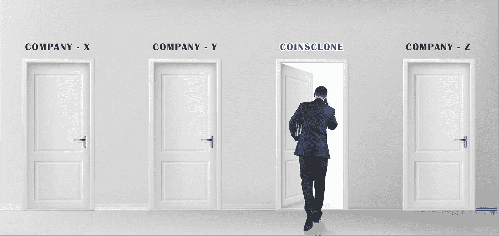

# 寻找最好的加密交换软件解决方案提供商

> 原文：<https://medium.com/geekculture/seeking-a-finest-crypto-exchange-software-solution-provider-35b50f75d5e8?source=collection_archive---------12----------------------->

> 但是找到一个加密交换脚本提供者有点困难。如你所知…

我们正在建立一个混合加密交换，所以一旦我们决定使用克隆脚本，我们知道我们正在寻找一些罕见的东西。在源代码方面，Github 只能帮你这么多。有些软件很少能在网上免费获得，找到没有错误的源代码更是一个挑战。问问任何一个开发者对软件中的 bug 的真实看法。bug 是有史以来最讨厌的事情之一，没有人愿意去当调试岗。

我们在寻找一个足够灵活可以修改的源代码。修改软件的源代码比完全从头构建一个更容易管理。没有多少混合交易所的源代码可以在网上从可靠的来源找到。因此，我们需要 DeFi 交换和集中式交换的源代码，我们可以修改它们来构建我们自己的交换。德克斯和 CEX 的克隆脚本更容易找到，所以我们有最好的。

对于我们来说，将初创公司的福祉放在首位，并向加密软件提供商寻求 [**白标软件**](https://www.coinsclone.com/white-label-crypto-exchange-software/) 或 [**加密交换克隆脚本**](https://www.coinsclone.com/blog/top-10-cryptocurrency-exchange-clone-script/) 是一件值得骄傲的事情。

但是找到一个 [**加密交换脚本提供者**](/geekculture/how-to-choose-a-finest-cryptocurrency-exchange-software-solution-provider-bb63be00fc5) 有点问题。如你所知，我们当时的创业公司已经成立几个月了，我们没有多少钱可以投资。我们设法从一个在线网站上提取了一个 Defi 交换的源代码，但是我们仍然需要一个集中的交换脚本，这些有点难得到，至少是一个完整的版本。

我们不得不放眼海外，因为本地公司的白牌解决方案非常昂贵。无论你在哪里得到软件，软件就是软件。我们做了研究，我们观察了南美公司、欧洲公司、非洲公司和亚洲公司。非洲公司的服务相对便宜，但他们的产品没有我们想要的规格，我们需要更强大的软件。

欧洲公司几乎和国内一样贵，所以那是不可能的。最终选择了南美或亚洲的公司，最终，我们选择了更便宜的方案。马来西亚、韩国和印度公司有我们想要的产品，而且比我们想象的要便宜得多。与韩国公司有语言障碍，即使我们与他们的官方翻译沟通。

最终，我们的选择归结为一家马来西亚公司和一家名为 **Coinsclone** 的印度公司。他们以相对相同的价格向我们提供同样的产品。演示产品是我们必须继续的全部，这并不多，所以当我们审查他们时，我们必须向我们交谈的代表询问所有问题。我们最终选择了印度公司，因为每次我们与马来西亚公司交谈时，我们都与不同的代表交谈，这使得整个开发阶段变得非常复杂。

我们使用 DeFi 脚本并从中提取我们想要的东西，然后我们将它添加到我们购买的 **CEX 脚本**的架构中，然后通过测试阶段。之后没多久就托管了一个平台的软发布。在进行必要的定制后的两个月，我们的平台正式平稳运行，我们开始获利。从我个人的历程来看，在经历了很多磨难之后， [**Coinsclone**](https://www.coinsclone.com/?utm_source=exp&utm_campaign=VKV) 成为了我们整个商业计划的一线希望，将我们梦想中的商业变成了现实。

看看他们的显赫地位，如果你打算转向这种商业模式。此外，这将是一个正确的时代，从 [**Coinsclone**](/geekculture/coinsclone-why-choose-us-e3a9c32d7936) 获得咨询将对你的业务增长更加有效。