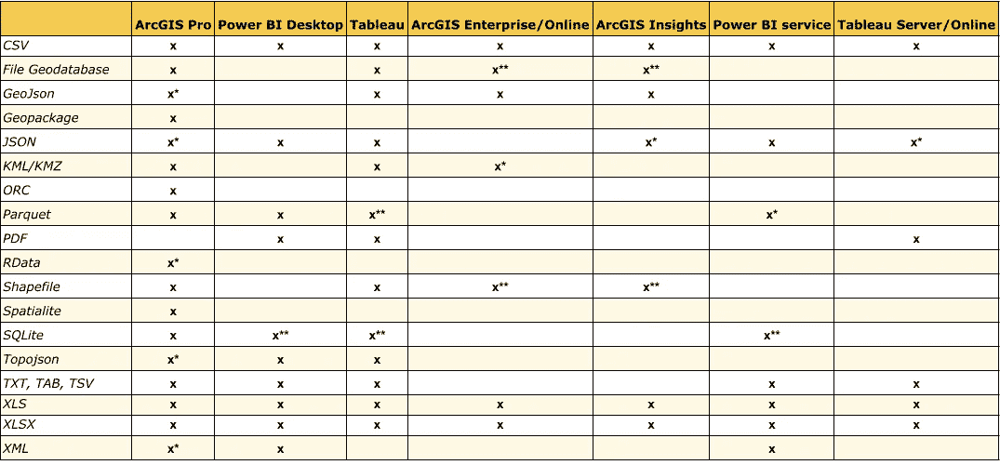
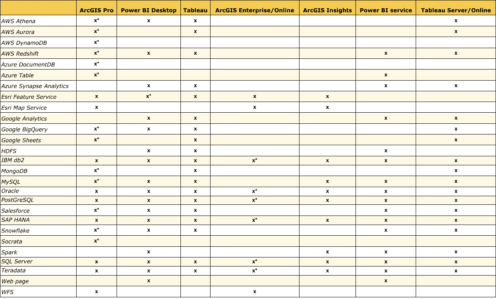
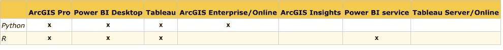

# 为企业数据互操作性选择格式

> 原文：<https://medium.com/geekculture/selecting-formats-for-enterprise-data-interoperability-d400d7ee4cfb?source=collection_archive---------41----------------------->

Photo by [Lukas](https://www.pexels.com/@goumbik?utm_content=attributionCopyText&utm_medium=referral&utm_source=pexels) from [Pexels](https://www.pexels.com/photo/black-and-gray-laptop-on-black-sectional-couch-577210/?utm_content=attributionCopyText&utm_medium=referral&utm_source=pexels)

## 随着各种规模的组织对一切都采用数据驱动的方法，确保企业数据和分析的投资尽可能延伸，同时最大限度地减少数据工程师的工作量变得越来越重要。

根据我的经验，当组织开始将企业数据作为其日常运营的一部分时，它们往往分为三类:

1.  大型组织拥有许多数据和分析专家，但没有中央管理机构，导致不同的来源、软件和最佳实践
2.  没有数据专家且数据和分析预算很少的小型组织，通常会导致采用开源或供应商锁定
3.  存在这些问题的中型组织

此外，我发现数据用户通常分为两类:GIS 分析师和数据分析师/科学家，这两个派别有时会在一个组织内争夺资源和声望(几十年来重复的“空间是特殊的”与“GIS 只是地图”)。

长期以来，组织范围内的数据都存储在记录系统中，但随着数据驱动的工作流成为常态，越来越多的数据正从大型机和 Oracle 数据库的局限中解放出来，供企业使用。在政府、非营利组织和学术领域，现代开放数据运动在 2000 年代末开始生根发芽。GIS 早就接受了开放数据(例如，宾夕法尼亚州的空间数据交换中心[【PASDA】](https://www.pasda.psu.edu/about.asp)，始于 1995 年，比谷歌早 3 年左右)，尽管这些数据的格式直到最近才变得相当专业。与此同时，私营部门长期以来一直在接受数据分析，最近是以商业智能的名义。

随着如此多的数据的可用性，一个行业已经围绕使数据易于可视化和使用企业级软件实现报告而发展。我一直看到相同的三个企业数据可视化解决方案，所以这些是我在这里要关注的。出于本文的目的，我将忽略“所有数据都是数据”方法的“空间是特殊的”,以努力在空间和空间数据用户之间找到某种和谐。我将尝试识别具有良好互操作性的格式，无论是常规 BI 软件可以读取的空间文件，还是查看不符合 OGC 或专有 GIS 标准的 GIS 中的数据。我没有选择特定的顺序来检查:

*   [ArcGIS](https://www.arcgis.com/index.html)
*   [画面](https://www.tableau.com/)
*   [功率 BI](https://powerbi.microsoft.com/en-us/)

我们将关注软件的桌面版和企业版(在 ArcGIS 中，是两个企业版，ArcGIS Enterprise/Online 和 Insights)。此外，这种分解只考虑对静态文件和数据连接的只读访问，而不考虑写访问。通常，分析师不需要编辑数据，如果需要编辑数据，通常是在记录系统中进行，而不是在可视化包中进行。让我们从每个软件可以读取的文件类型开始。我对文件类型和数据连接进行了区分，因为一个是静态的，另一个是实时提要或按计划刷新的提要，没有自定义代码。

## 文件类型

*requires extra licensing or software, **requires workaround

根据上表，很明显，文件类型类别中的赢家是电子表格，因为根据文档，每个软件都可以开箱即用地读取它们。排在第二位的是 JSON，ArcGIS 套件需要使用[数据互操作性](https://www.esri.com/en-us/arcgis/products/arcgis-data-interoperability/overview)扩展来读取它(注意，我将普通 JSON 与 [GeoJson](https://geojson.org/) 和 [Topojson](https://github.com/topojson/topojson#topojson) 分开)。我认为这里的一大要点是，每个制造商的桌面软件可以读取比他们的 SaaS 或托管企业产品更多的数据文件。通常，您可以使用桌面软件将数据作为 Power BI 报告、Tableau 工作簿或 ArcGIS 服务定义加载到这些服务中。我是说 ArcGIS E/O 需要 shapefiles 和文件地理数据库的解决方案，因为它们需要压缩才能上传，SQLite 需要 Tableau 和 Power BI 的解决方案，因为它需要自定义 ODBC 连接。

## 数据连接

*requires extra licensing or software

事情变得更有趣了。同样，桌面软件具有最大范围的功能，但企业级软件连接到标准 RDBMS 服务器的能力，如 SQL Server、Oracle、PostGreSQL 等。允许终端用户在仪表盘等可视化工具中查看和过滤更接近实时的画面。ArcGIS Online 不能直接连接到源系统，但 ArcGIS Enterprise 和 Server 可以，并且从这些软件创建的服务可以注册到 ArcGIS Online，并被吸收到这三种工具的桌面软件中。Azure 和 AWS 的大数据服务获得的支持参差不齐，但 HDFS 和 Spark 在所有三个生态系统中都获得了良好的支持。Power BI 和 Tableau 都可以接收托管在 [Snowflake](https://www.snowflake.com/) 中的数据，这是一个不断增长的企业数据仓库平台，ArcGIS 也可以，但只能是启用了数据互操作性的 ArcGIS Pro。

## 展开性

如果给定软件中的标准功能套件不够用，而且经常不够用，那么您可能需要看看是否有任何受支持的编程语言或软件环境。这里我们只关注 [Python](https://www.python.org/) 和 [R](https://www.r-project.org/) 。

## 开源支持

除了这里列出的企业软件之外，考虑一下开源软件可能支持的格式也不失为一个好主意，比如 [QGIS](https://www.qgis.org) 和 [Apache 超集](https://superset.apache.org/)。开源和企业的结合在某些情况下可能是有意义的，例如托管在启用了 PostGIS 的 PostGreSQL 实例上的 [ArcGIS 企业级地理数据库](https://enterprise.arcgis.com/en/server/latest/manage-data/windows/enterprise-geodatabases-and-arcgis-enterprise.htm)，它将支持 ArcGIS、QGIS 和标准数据连接，以便在其他 BI 软件中读取。

## 结论

那么，我们能从这一切中得出什么结论呢？企业数据互操作性的完美数据格式是什么？这是不确定的，取决于具体情况，但我不得不选择普通的 CSV 或备受指责的 RDBMS (PostGres，如果你可以的话)。非常虎头蛇尾，但有时简单就是出路。对于大数据，也许本地拼花文件也是桌面分析可以导出到企业软件的方法。请记住，还有许多数据格式与这些软件包兼容，本文的研究绝非详尽或完整。每个新版本都增加了新的兼容性，对于任何规模的组织的数据领导来说，仔细检查他们的选项并思考什么样的体系结构将支持最多的用户并最大限度地减少数据工程师的重复工作是非常重要的。

## 来源

*   [https://docs . Microsoft . com/en-us/power-bi/connect-data/desktop-data-sources](https://docs.microsoft.com/en-us/power-bi/connect-data/power-bi-data-sources)
*   [https://help . tableau . com/current/pro/desktop/en-us/example connections _ overview . htm](https://help.tableau.com/current/pro/desktop/en-us/exampleconnections_overview.htm)
*   [https://help . tableau . com/current/online/en-us/creator _ connect . htm](https://help.tableau.com/current/online/en-us/creator_connect.htm)
*   [https://pro . ArcGIS . com/en/pro-app/latest/help/projects/supported-data-types-and-items . htm # ESRI _ section 1 _ a1 C9 d 114 E6 EC 426 c 9 ABA 37 fa 6b 02 FD 37](https://pro.arcgis.com/en/pro-app/latest/help/projects/supported-data-types-and-items.htm#ESRI_SECTION1_A1C9D114E6EC426C9ABA37FA6B02FD37)
*   [https://doc . ArcGIS . com/en/insights/latest/get-started/supported-data . htm](https://doc.arcgis.com/en/insights/latest/get-started/supported-data.htm)
*   [https://www . ESRI . com/en-us/ArcGIS/products/ArcGIS-data-inter operability/supported-formats](https://www.esri.com/en-us/arcgis/products/arcgis-data-interoperability/supported-formats)
*   [https://doc . ArcGIS . com/en/ArcGIS-online/reference/supported-items . htm](https://doc.arcgis.com/en/arcgis-online/reference/supported-items.htm)