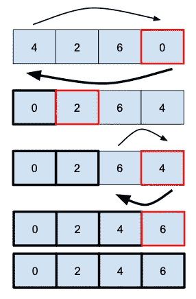

# 选择排序

> 原文：<https://medium.com/geekculture/selection-sort-38f1196b36ae?source=collection_archive---------15----------------------->

## 选择排序是另一种简单的排序算法，但不是最有效的。

**它的工作原理是通过获取当时的一个元素(**从未排序的子数组**中选择最小的元素)并与排序后的那个元素交换来构建排序后的子数组**(增加排序后的数组的大小)。