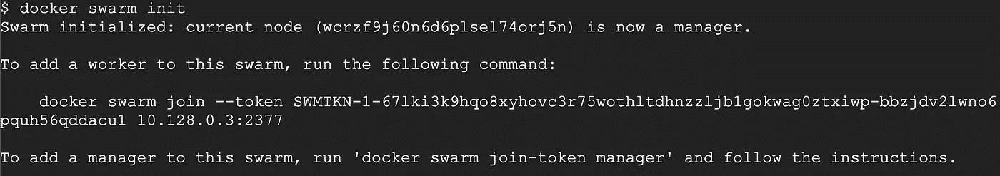
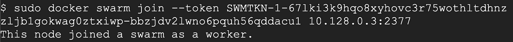
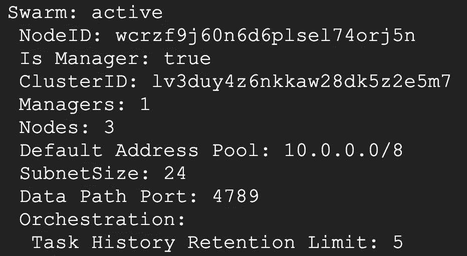
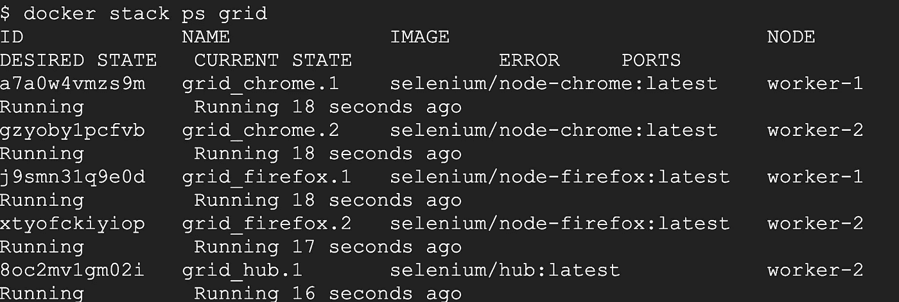

# 具有 Docker 群的硒网格

> 原文：<https://medium.com/geekculture/selenium-grid-with-docker-swarm-d66e97320380?source=collection_archive---------17----------------------->

在本指南中，我们将讨论在 GCP 或 AWS 等云服务上使用 Docker Swarm 建立 Selenium 网格。

我们先从基础开始，即什么是 Selenium Grid 和 Docker Swarm。

# 硒格是什么？

elenium Grid 通过将客户端发送的命令路由到远程浏览器实例，允许在远程机器(虚拟或真实)上执行 WebDriver 脚本。它旨在提供一种在多台机器上并行运行测试的简单方法。

Selenium Grid 允许我们在多台机器上并行运行测试，并集中管理不同的浏览器版本和浏览器配置(而不是在每个单独的测试中)。

## Selenium 网格的用途和主要功能

1.  所有测试的中心入口点
2.  管理和控制浏览器运行的节点/环境
3.  缩放比例
4.  并行运行测试
5.  负载平衡

## 现在一个问题来了“什么时候用网格”？

一般来说，有两个原因会让你想使用网格。

1.  针对多个浏览器、多个版本的浏览器以及运行在不同操作系统上的浏览器运行测试。
2.  减少测试套件完成一次测试所需的时间。

网格通过使用多台机器并行运行测试来加速测试的执行。例如，如果您有一个包含 100 个测试的套件，但是您设置了 Grid 来支持 4 个不同的机器(虚拟机或单独的物理机器)来运行这些测试，那么您的测试套件将在(大约)四分之一的时间内完成，就像您在单台机器上顺序运行测试一样。

# 什么是 Docker Swarm？

D [ocker swarm](https://docs.docker.com/engine/swarm/) 是一个容器编排工具，这意味着它允许用户管理部署在多台主机上的多个容器。

docker 集群的一个重要优势是为应用程序提供了高水平的可用性。在 docker 群中，通常有几个工作节点和至少一个管理节点，管理节点负责有效地处理工作节点的资源，并确保集群有效地运行。

## Docker 群模式服务有哪两种？

Docker Swarm 有两种类型的服务:复制的和全局的。

**复制服务:**群模式复制服务通过指定群管理器分配给可用节点的复制任务数量来发挥作用。

**全局服务:**全局服务通过使用 swam 管理器向每个满足服务约束和资源需求的可用节点调度一个任务来工作。

## 什么是 Docker 群节点？

docker 群由一组在集群中运行的物理机或虚拟机组成。当一台机器加入集群时，它就成为了集群中的一个节点。docker swarm 功能可识别三种不同类型的节点，每种节点在 docker swarm 生态系统中扮演不同的角色:

**Docker 群管理器节点:**管理器节点的主要功能是将任务分配给群中的工作者节点。管理节点也有助于执行一些管理任务，这些任务是操作集群所必需的。Docker 建议一个群最多有七个管理节点。

**Docker Swarm Leader 节点:**当一个集群建立后，使用 Raft 共识算法将其中一个分配为“Leader 节点”。领导者节点为群做出所有的群管理和任务协调决策。如果领导节点由于中断或故障而变得不可用，则可以使用 Raft 共识算法来选举新的领导节点。

**Docker Swarm 工作节点:**在拥有众多主机的 Docker Swarm 中，每个工作节点通过接收和执行管理节点分配给它的任务来工作。默认情况下，所有管理器模式也是工作者节点，并且当它们有可用的资源时能够执行任务。

# 为什么我们应该将 Selenium Grid 与 Docker Swarm 一起使用？

有了 Docker Swarm，创建一个具有高可用性的动态网格变得很容易，它可以根据我们的需求进行扩展。本文将带您使用 3 台机器(1 个管理器，2 个工作节点)在 GCP 上建立一个网格。建议的最小设置是至少 5 台机器(3 个管理器，2 个工作节点)。

# 让我们从设置开始

既然我们清楚了什么是 Selenium Grid、Docker Swarn、它们的优点以及为什么要一起使用它们，那么让我们从设置开始。

## 在 GCP 创建基础机器

创建 3 台`E2`实例类型的机器，选择`Ubuntu Server 21.04 LTS (HVM), SSD Volume Type`作为操作系统。我们将使用 ubuntu，以便安装最新版本的 Docker。

首先在所有 3 台机器上安装 docker

## 设置群组主节点和工作节点

选择一台机器作为主机器，并通过运行`docker swarm init`在其上启动 Docker Swarm 模式

现在，在另外两台机器上执行 join 命令，作为工作节点加入群网络:

一旦主节点和工作节点设置完成，在主节点上执行`docker info`命令以查看更多关于群网络的信息。如果一切正常，您将在输出中看到`Swarm: active`和`Nodes: 3`(3，因为即使经理也是节点之一)

## 创建硒网格

一旦创建了 swarm manager 节点和 worker 节点，下一步就是设置 Selenium 网格。为此，我们创建一个 Docker 堆栈兼容的合成文件。下面的`.yaml`将用于部署 docker 堆栈。

**端口映射:**我们已经将`ports`公开为`4444:4444`，这基本上意味着可以在 Swarm 网络中的任何节点上通过端口`4444`连接到网格。但是我们没有为节点这样做，因为我们不想在群节点上暴露单个节点。

**部署约束:**约束选项`constraints: [node.role == worker]`允许我们将工作负载放在 worker 节点上，而不是 manager 节点上。如果您想在 manager 节点上运行 hub，请使用`[node.role == manager]`作为值

**环境变量:**我们为节点定义了两个环境变量`HUB_PORT_4444_TCP_ADDR: hub`和`HUB_PORT_4444_TCP_PORT: 4444`。这是因为 selenium 入口点脚本使用了这些环境变量。这些变量是在 Docker 的早期版本中使用链接时自动创建的。这个特性现在被弃用了，不再创建变量。所以我们需要定义它们。

**卷映射**:卷`/dev/shm`和`/dev/urandom`从主机共享，因为它们对于浏览器的某些工作是必需的。

## 入口点覆盖

我们使用了两种不同的方法来覆盖`chrome`和`firefox`图像的入口点

使用两种不同方法的原因是为了展示这两种方法。

那么首先，为什么我们需要在`SE_OPTS`中覆盖主机？原因是一个容器可以有多个接口，当我们启动`selenium-server.jar`时，它试图根据可用的接口进行猜测。然后，它将这个地址发送给 hub，以便与它联系。在多个接口的情况下，地址可能被错误地确定，并且在这种情况下，集线器将不能与节点通信。要解决这个问题，我们需要自己确定容器的 IP 或主机名。

这里有两种方法，一种是使用容器的主机名。这是随机的，可以是字母数字。第二种方法是使用 IP 地址。这需要在容器映像上安装 IP 命令。这在`chrome`图像中可用，但在`firefox`图像中不可用。所以主机名方法在这两种情况下都适用。

Docker 会在运行的容器中自动创建一个名为 HOSTNAME 的环境。我们使用双美元`$$`来确保 docker 在解析我们的合成文件时不处理环境变量

## 部署 Selenium 网格

为了部署 Selenium 网格，我们必须在 Swarm manager 节点上执行下面的命令

我们可以使用`docker stack ps grid`命令检查堆栈的状态

# 测试网格

我们已经部署了网格，下一步是验证它是否已经启动并运行。我们将使用 python 来测试我们的网格。Python 不会预装在 GCP 的 ubuntu 图像上。所以我们需要先安装 python。

一旦 python 和 pip 安装完毕，下一步就是安装 **selenium** 。

一旦 selenium 就绪，我们就可以在 python 中执行以下命令来测试网格:

# 缩放网格

我们可以轻松地放大和缩小网格，甚至可以根据负载应用自动缩放来添加新的工作节点。

# 结论

本文研究了如何使用 Docker 和 Docker Swarm 配置 Selenium Grid，以便在多台机器上分布测试。

寻找一些挑战？

1.  通过在不同的 Selenium 网格节点上并行运行所有测试方法，尝试进一步减少测试执行时间。
2.  在 Travis 或 Jenkins(或其他 CI 工具)上配置测试的运行，使它们成为持续集成过程的一部分。