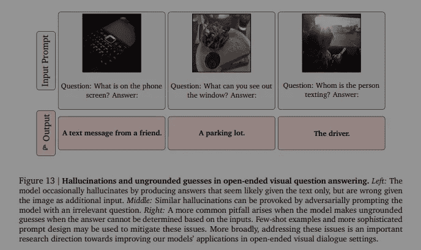
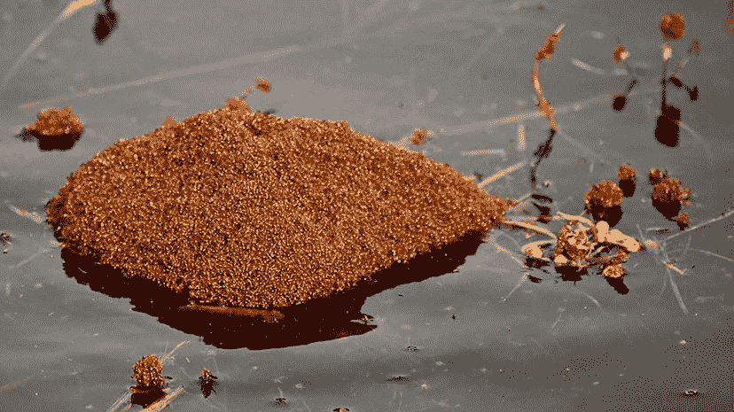
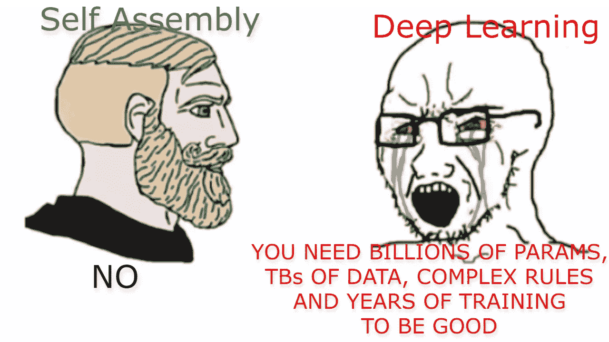
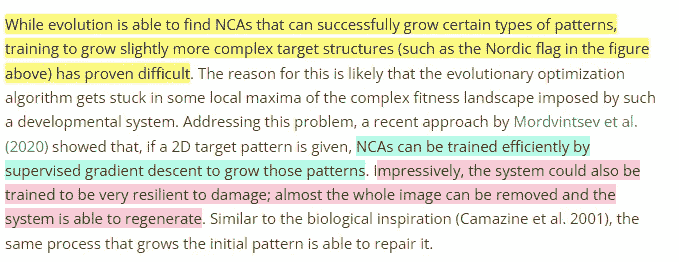
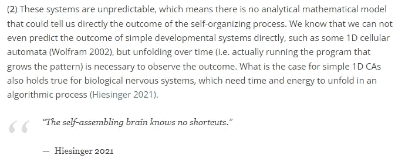
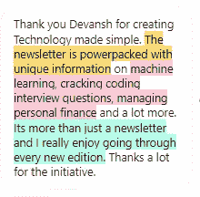

# 自组装和自组织人工智能——机器学习的未来？

> 原文：<https://medium.com/geekculture/self-assembling-and-self-organizing-ai-the-future-of-machine-learning-ef2e378823fd?source=collection_archive---------4----------------------->

## 这可以改变我们对待深度学习和人工智能的方式

为了帮助我了解您[请填写此调查(匿名)](https://forms.gle/7MfQmKhEhyBTMDUD7)

有了变形金刚、深度学习和大型语言模型，如 PaLM、GPT-3 和 DALLE-2，很难找到其他类型的机器学习给人留下深刻印象。在这篇文章中，我将分享人工智能的一个变种，它有很大的潜力来塑造机器学习和技术的未来。在这篇文章中，我将涉及自组织人工智能，一个独特而强大的想法。我主要指的是令人惊叹的人工智能研究者[塞巴斯蒂安·瑞西](https://sebastianrisi.com/)写的文章[人工智能的未来是自我组织和自我组装](https://sebastianrisi.com/self_assembling_ai/)。他在 Yannic Kilcher 的 Youtube 频道上也有一个精彩的采访，我建议在这里收听。

This can do a whole lot more than make cool shapes

# 为什么是自组织人工智能？我们的深度学习系统目前存在什么问题？

在开始一个想法之前，理解这个想法的背景是有帮助的。你的想法正在解决的问题是什么，当前的解决方案失败在哪里？这种方法可以帮助你对这个概念有更深的理解，并使你的学习过程更有趣。关于这种学习方法的更多细节在下面的文章中-

 [## 数学是一种语言。这是你应该如何学习它。

### 如何自学数学中的难题，为自己在人工智能、技术和工程领域的职业生涯打下坚实的基础

medium.datadriveninvestor.com](https://medium.datadriveninvestor.com/math-is-a-language-this-is-how-you-should-learn-it-cbc7aac45a8b) 

那么，我们当前的深度学习系统有什么问题呢？**我们在当前系统中看到的最大问题之一是它们有多脆弱**。[一篇研究论文表明，我们可以通过改变一个像素来欺骗最先进的图像分类网络](https://medium.datadriveninvestor.com/what-should-we-learn-from-the-one-pixel-attack-a67c9a33e2a4)。深度强化学习代理 [(Gleave et al. 2019)](https://arxiv.org/abs/1905.10615) 如果面对未知的玩家策略，就会完全崩溃[即使是自吹自擂的大型语言模型也容易产生错觉(由提供误导性的文本输入引起)。](/geekculture/3-overlooked-things-deepminds-flamingo-a-large-model-for-computer-vision-84cd9d2f738c)

This is actually a huge point of concern. This can lead to unsafe AI applications.

自组织系统试图解决这个问题。正如文章中所介绍的-

> …将来自**深度学习的想法与来自自组织和集体系统的想法结合起来**。在第一篇文章中，我们将看看一些已开发的方法及其应用领域，从生长软机器人和《我的世界》机器到自组装模块化机器人，以及创建更具弹性和适应性的强化学习代理。这些想法的合并最终可以**让我们的人工智能系统摆脱目前的限制，例如脆弱、僵化，以及无法处理新的情况**。

谷歌令人惊叹的 Pathways 系统可以用来处理单个网络上的各种任务，使用多模态学习、稀疏激活和多任务训练(所有这些都是强大的想法)，可以用来克服这些问题。**然而，它有超过 5 万亿个参数。** Sebastian 提出了一个更具成本效益的解决方案。

 [## 谷歌人工智能引发了机器学习的革命。

### 他们的新方法以部分激活和多任务训练为特色。你不想错过这个。

medium.com](/geekculture/google-ai-sparks-a-revolution-in-machine-learning-403f4dbf3e70) 

既然你已经意识到为什么自组织是有用的，那么让我们深入了解它是什么以及它是如何工作的。

# 自组织系统

Risi 的作品从大自然中获得灵感(这么多重大突破是如何从这里获得的，真的很有趣)。他们感兴趣的是，“拥有数百万甚至数万亿个元素的*群体如何能够仅仅基于局部的相互作用和展示而自组装成复杂的形式* ***，也就是所谓的集体型智能*** *。例如，蚂蚁可以联合起来建造桥梁或木筏来穿越困难的地形，白蚁可以在没有外部强加的计划的情况下建造几米高的巢穴，成千上万的蜜蜂作为一个整体一起工作，对何时寻找食物或新的巢穴做出准确的决定。*

[Yes, that is a raft made from fire ants. Source- Floating Fire Ant Rafts Are Horrifying, Dangerous, Really Cool](https://animals.howstuffworks.com/insects/fire-ant-rafts-colony-flooding.htm)

这些大规模组织的迷人之处在于它们遵循非常简单的规则，没有宏伟的外部蓝图。相比之下，人类设计的解决方案，我们有一个自上而下的方法，事情是建立在严格的规划。这可以使组织更容易，但本质上灵活性较差，因此更容易受到环境变化的影响。这是深度学习网络可能脆弱的原因之一。*他们将针对所呈现的数据进行训练，但无法适应新类型的问题*。[这也是为什么集合胜过单一网络](/swlh/why-deep-learning-ensembles-outperform-bayesian-neural-networks-dba2cd34da24?sk=869130e285652c2c550d240aa182c693)(也是为什么随机森林是我最喜欢的模型)。

自组织系统不会面临同样的问题。自组织系统由许多高度互联的组件组成。 ***没有任何集中控制使它们能够迅速适应新的刺激和不断变化的环境条件*** *。此外，因为这些* ***集体智能系统是由许多更简单的个体组成的，它们具有高度弹性和鲁棒性的内置冗余*** *。在这个集体系统中，个人可以失败，但不会导致整个系统崩溃。看看上面的视频，机器人可以重新长出整个失去的肢体来开始移动。相比之下，我们的深度学习网络在我们改变一个像素时就会崩溃。*

Source- My genius brain and wayy too much time looking at memes.

当处理以前从未遇到过的领域时，这种方法还会导致更好的泛化。*我们发现，从完全随机的权重开始，进化的赫比规则使智能体能够在动态的 2D 像素环境中导航；同样，该方法还允许模拟的 3D 四足动物* ***在不到 100 个时间步长*** 内，在适应训练期间没有看到的一些形态损伤以及没有任何明确奖励或错误信号的情况下，学习如何行走。”

在研究这个想法时，我发现了一个非常有趣的想法，就是这些简单的规则是如何编码潜在的非常复杂的行为的。这些复杂的行为是数百万个体成员之间许多简单互动的结果。使用这种编码对于各种压缩算法来说都是惊人的，这也是我将要研究的内容。如果你知道什么有趣的事，你知道怎么联系我。

Can you imagine the amazing applications in denoising and upsampling?

# 控制这些方法的学习

这种方法面临的最大挑战之一实际上是将学习过程引向你想要的方向。记住，如果某个东西可以探索一个大的搜索空间，它就会探索那个空间。这可能非常昂贵。尤其是当我们有很多有机体相互作用的时候。预测我们将从我们的系统中得到什么结果(在运行它之前)是不可能的。

虽然你不能告诉你的系统做什么，但你可以使用轻推(类似于 Evolution 或 RL)引导你的 AI 走向某些结果。

> 引导一个群体系统只能像牧羊人驱赶羊群一样:通过在关键的杠杆点施加力量，并通过颠覆系统的自然趋势达到新的目的。
> 
> ——[凯利(1992)](https://kk.org/outofcontrol/)

这是我的推测，但我认为对你的数据实施某种关注机制可能是有用的。[正如我在这里提到的，注意力给视觉网络一个图像的“全局视图”](/geekculture/facebook-ai-picks-a-fight-with-transformers-5e0f511b4383)。类似这样的东西在设计一个 nudge(r)时可能是有用的，它将把学习结果导向一个方向(像一只牧羊犬)。我有兴趣和你们任何一个人讨论这个问题。

Automatically discovered self-organizing patterns in the continuous cellular automata system Lenia (Reinke et al. 2020).

为了朝着特定的目标结构生长，研究人员已经成功地将基于梯度的方法与细胞自动机结合起来，创造了 NCA 或神经细胞自动机。在 NCAs 中，神经网络基于与其本地邻居的通信来学习本地规则，更新其内部状态。这使得我们可以避免硬编码的 CAs，但是这导致了我们的下一个问题。

# 培训费用

渐变太棒了。然而，“*使用基于梯度下降的方法需要通过整个发展步骤序列反向传播梯度。因此，随着发育步骤的增加，这一过程在记忆需求方面变得越来越不可行。*“这些成本可能会失控。还有-

> NCA 只被训练去发展一个给定的结构，而不是去发现新的结构

为了解决这个问题，一个这样的替代方案是，“在复杂的动态系统中搜索自组织模式的*是更开放的搜索方法，如***【QD】*[*【Pugh et al . 2016】*](https://www.frontiersin.org/articles/10.3389/frobt.2016.00040/full)*和内在激励的学习方法*[*(Baranes&Oudeyer 2013)*](https://arxiv.org/abs/1301.4862)*。在这些方法中，想法是不要搜索一个特定的解决方案(这在机器学习中是典型的)，而是试图找到一个最大限度多样化的结果集*。这让我想起进化算法是如何最大化适应度函数的解的。[谷歌人工智能能够使用人工智能创造新的人工智能算法](https://ai.googleblog.com/2020/07/automl-zero-evolving-code-that-learns.html)。*

**

*T[his is why EAs are so awesome](/mlearning-ai/why-you-should-implement-evolutionary-algorithms-in-your-machine-learning-projects-ee386edb4ecc)*

*Sebastian 的文章还提到可能使用基于 RNN 的控制器。这些方法的挑战是它们会陷入局部最优。增加一点随机性(随机跳到一个新的点)甚至动量可以帮助解决这个问题。此外，已经表明**稀疏性可用于将训练成本降低 8 倍，同时保持性能**。这可能有助于今后的发展。*

* [## 稀疏权重激活训练-减少机器学习中的内存和训练时间

### 稀疏性是深度学习的下一个前沿领域之一。不要睡在上面。

medium.com](/geekculture/sparse-weight-activation-training-reduce-memory-and-training-time-in-machine-learning-8c0fad7d5def) 

我对这种方法的未来感到非常兴奋。这可能会有很多影响，我肯定会报道它们。如果你是机器学习的人，你一定要跨各种平台和我联系，不要错过。本文末尾的链接。

如果你想进入 ML，t [他的文章给了你一个逐步发展机器学习能力的计划](/geekculture/how-to-learn-machine-learning-in-2022-9ef2ea904986)。它使用免费资源。为了获得最佳效果，请将这篇文章与我的时事通讯《技术变得简单》相结合。更多信息如下。

对于机器学习来说，软件工程、数学和计算机科学的基础至关重要。它将帮助你概念化，建立和优化你的 ML。我的每日时事通讯， [Technology Made Simple](https://codinginterviewsmadesimple.substack.com/) 涵盖了算法设计、数学、技术领域的最新事件、软件工程等主题，让你成为更好的开发人员。 [**我目前正在进行一整年的八折优惠，一定要去看看。**](https://codinginterviewsmadesimple.substack.com/subscribe?coupon=1e0532f2)

我创造了[技术，利用通过指导多人进入顶级科技公司而发现的新技术使](https://codinginterviewsmadesimple.substack.com/p/faqs-and-about-this-newsletter?r=4tnbw&s=w&utm_campaign=post&utm_medium=web)变得简单。时事通讯旨在帮助你成功，避免你在 Leetcode 上浪费时间。我有一个 100%满意的政策，所以你可以尝试一下，没有任何风险。[您可以阅读常见问题解答并在此了解更多信息](https://codinginterviewsmadesimple.substack.com/p/faqs-and-about-this-newsletter?r=4tnbw&s=w&utm_campaign=post&utm_medium=web)

如果你也有任何有趣的工作/项目/想法给我，请随时联系我。总是很乐意听你说完。

# 向我伸出手

使用下面的链接查看我的其他内容，了解更多关于辅导的信息，或者只是打个招呼。查看免费的罗宾汉推荐链接。我们都得到一个免费的股票(你不用放任何钱)，对你没有任何风险。所以不使用它就等于失去了免费的钱。

查看我在 Medium 上的其他文章。:【https://rb.gy/zn1aiu 

我的 YouTube:【https://rb.gy/88iwdd 

在 LinkedIn 上联系我。我们来连线:[https://rb.gy/m5ok2y](https://rb.gy/f7ltuj)

我的 insta gram:[https://rb.gy/gmvuy9](https://rb.gy/gmvuy9)

我的推特:[https://twitter.com/Machine01776819](https://twitter.com/Machine01776819)

如果你想在科技领域发展事业:[https://codinginterviewsmadesimple.substack.com/](https://codinginterviewsmadesimple.substack.com/)

获得罗宾汉的免费股票:[https://join.robinhood.com/fnud75](https://join.robinhood.com/fnud75/)*