# 拥有 YOLOv5 和 Roboflow 的自动驾驶汽车

> 原文：<https://medium.com/geekculture/self-driving-car-with-yolov5-and-roboflow-a5a2bf109c6?source=collection_archive---------1----------------------->

你是否对自动驾驶汽车及其背后的算法感兴趣？这篇文章让你使用由 [Roboflow](https://roboflow.com/) 提供的 [Udacity 自动驾驶汽车数据集](https://public.roboflow.com/object-detection/self-driving-car)进行更深入的研究。

Photo by [Roberto Nickson](https://unsplash.com/@rpnickson?utm_source=medium&utm_medium=referral) on [Unsplash](https://unsplash.com?utm_source=medium&utm_medium=referral)

# YOLOv5

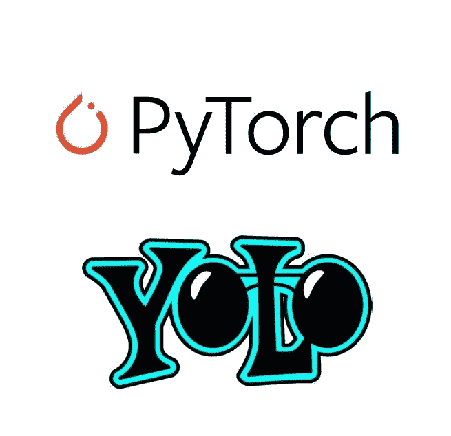

*YOLOv5 inferencing live on video with COCO weights*

**YOLO**—**Y**ou**O**only**L**ook**O**nce 是在 COCO 数据集上预先训练的一系列对象检测架构和模型。YOLOv5🚀代表 [Ultralytics](https://ultralytics.com/) 对未来视觉 AI 方法的开源研究。

YOLOv5 快如闪电。根据[报告](https://blog.roboflow.com/yolov5-v6-0-is-here/#:~:text=Performance%20and%20speed%20benchmarks%20for,size%2032%20%2D%20Tesla%20v100).)，它在 COCO 上提供了最新速度基准 1666 FPS 的最先进的对象检测。YOLOv5 也是惊人的准确。所有这些，加上 YOLOv5 的尺寸小得多，使得 YOLOv5 成为自动驾驶汽车的最佳架构之一，如果不是最好的话。

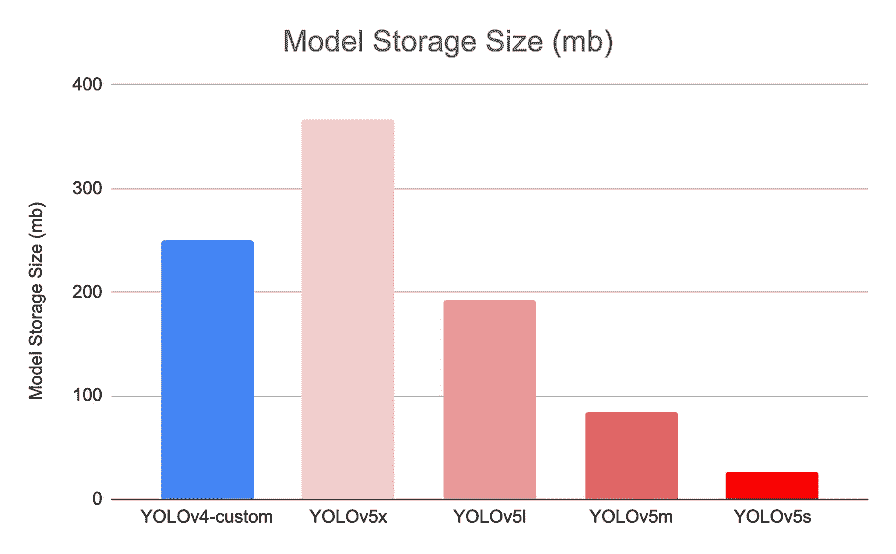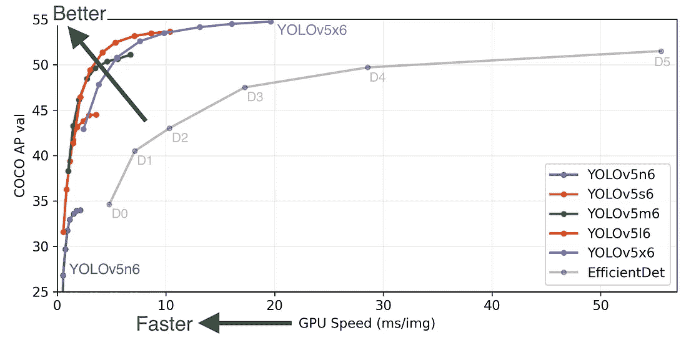

Image via [https://github.com/ultralytics/yolov5](https://github.com/ultralytics/yolov5)

YOLO 把一幅图像分成一个网格系统，每个网格检测自己内部的物体。这使得它们能够在有限的计算资源下非常快速地执行。

为了理解 Yolov5 如何改进性能及其架构，让我们来看一下下面的高级对象检测架构:

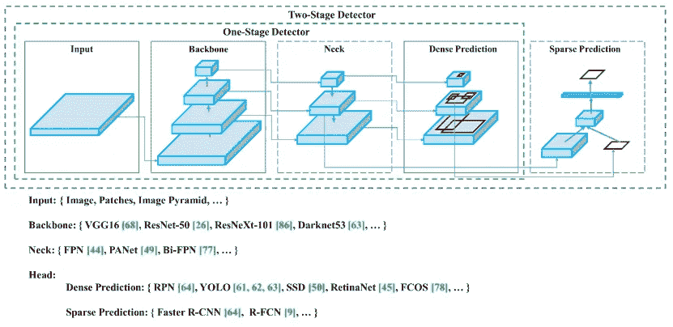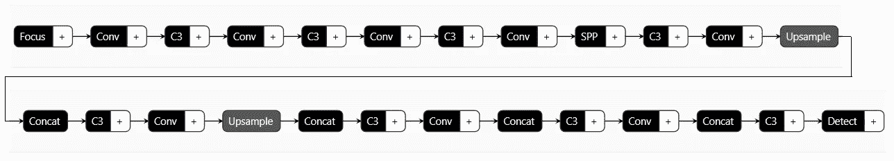

Yolov5s model

# 步伐

我们将通过在 [**Udacity 自动驾驶汽车数据集**](https://public.roboflow.com/object-detection/self-driving-car) **上训练 YOLOv5 所需的步骤。**

> 你可以参考这款 [Google Colab 笔记本](https://colab.research.google.com/drive/1I3vLiAPh_08BdEo0JoNyzVIqVKmxn3fJ?usp=sharing)跟着做。

为了训练我们的检测器，我们采取以下步骤:

*   准备数据集
*   安装 YOLOv5 依赖项
*   从 Roboflow 下载自动驾驶汽车物体检测数据集
*   为培训建立 YAML 档案
*   训练模型
*   评估绩效
*   可视化训练数据
*   在测试图像上运行推理

# 准备数据集

我们将使用 [**Udacity 自动驾驶汽车数据集**](https://public.roboflow.com/object-detection/self-driving-car) ，，该数据集在 [**Roboflow 公共物体检测数据集**](https://public.roboflow.com/object-detection) 中可用。

该数据集包含 11 个类别的 97，942 个标签和 15，000 幅图像。有 1720 个空示例(道路上没有物体的图像)。这 11 个类别包括汽车、卡车、行人、信号和骑自行车的人。

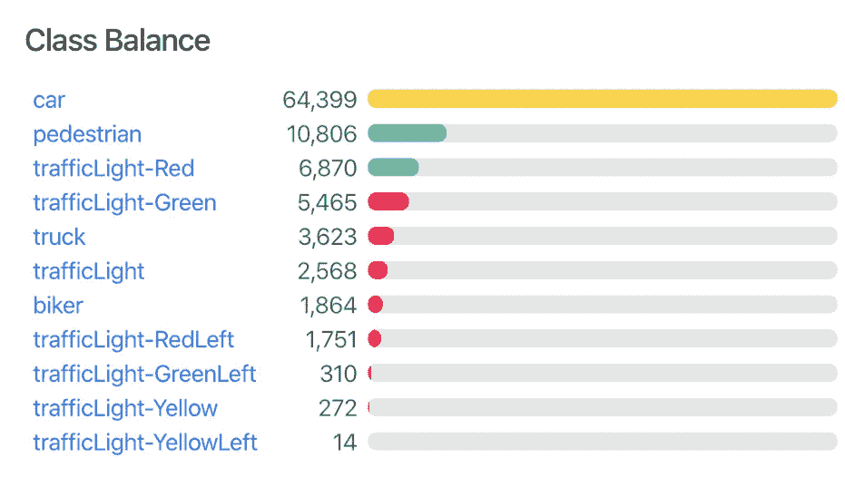

您还可以使用 Roboflow 的便捷[注释工具](https://docs.roboflow.com/annotate)在图像上添加注释。Roboflow 还允许您简化数据预处理和增强步骤，并根据您的选择执行训练测试分割！

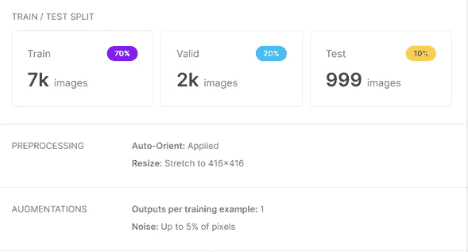

These are the settings I have applied to my dataset.

# **安装 YOLOv5 依赖项**

我们首先克隆 YOLOv5 存储库并安装依赖项。这将设置我们的编程环境，为运行对象检测训练和推理命令做好准备。

Google Colab 附带了一个预装的 GPU 加速器，允许我们加速我们的训练。请确保在开始和导入所需的依赖项之前调整这些设置。

# 从 Roboflow 下载数据集

使用 Roboflow，您可以下载数据集，创建免费帐户，并将数据集作为项目上传到您的工作空间中。注释之后，应用所需的预处理和扩充步骤，下载 YOLOv5 PyTorch 格式的代码片段。我已经将所有图像的大小调整为 416 x 416 像素，并增加了 5%的噪声，以便模型学习得更好。

**我应用的噪声使它看起来像是在下雨，使我的模型能够在这种情况下进行物体检测。**

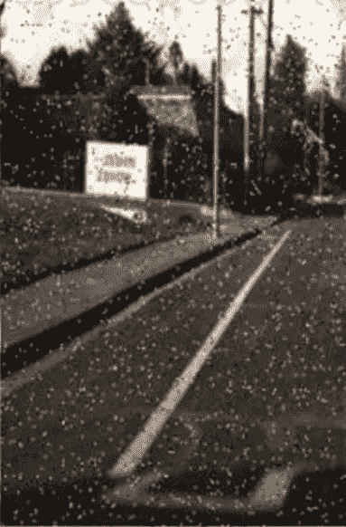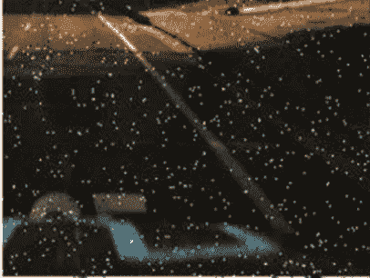

# 为培训建立 YAML 档案

为了训练一个 YOLOv5 模型，我们需要两个 YAML 文件。

第一个 YAML 明确指出:

*   对应于这些类的名称
*   我们想要检测的类的数量
*   我们的培训和验证数据在哪里

我们的这个 YAML 看起来像这样:

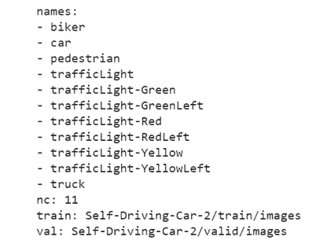

第二个 YAML 是指定整个模型配置。其网络架构可以修改，正确的*数量 _ 类别*也需要指定。

# 训练模型

我们可以使用以下超参数来获得我们模型的最佳结果:

*   **img:** 定义输入图像尺寸
*   **批量:**确定批量大小
*   **时期:**定义训练时期的数量
*   **数据:**设置 YAML 文件的路径
*   **cfg:** 指定型号配置
*   **权重:**指定权重的自定义路径
*   **名称:**结果名称
*   **nosave:** 仅保存最后一个检查点
*   **缓存:**缓存图像以加快训练速度

# 评估绩效

完成培训后，我们现在准备评估我们模型的性能。我们可以用 [**张量板**](https://www.tensorflow.org/tensorboard) **来形象化表现。**

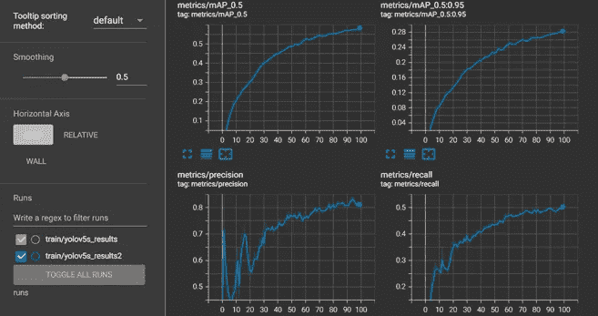

Training Metrics

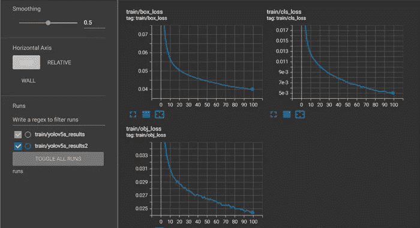

Training Losses

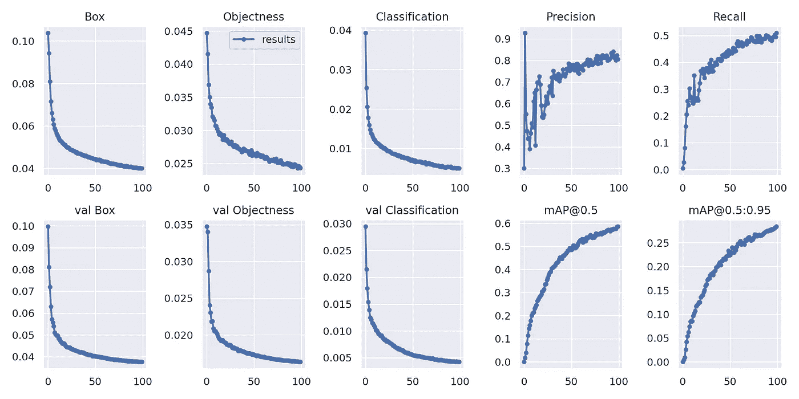

# 可视化训练数据

在训练期间，YOLOv5 训练管道创建了具有增强功能的批量训练数据。我们可以将训练数据真实情况以及扩充的训练数据可视化。

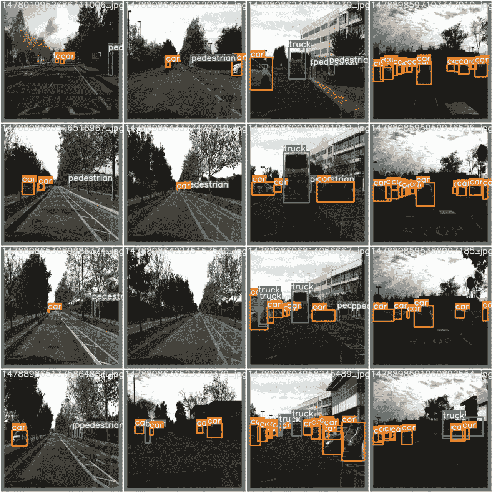

*Our training data ground truth*

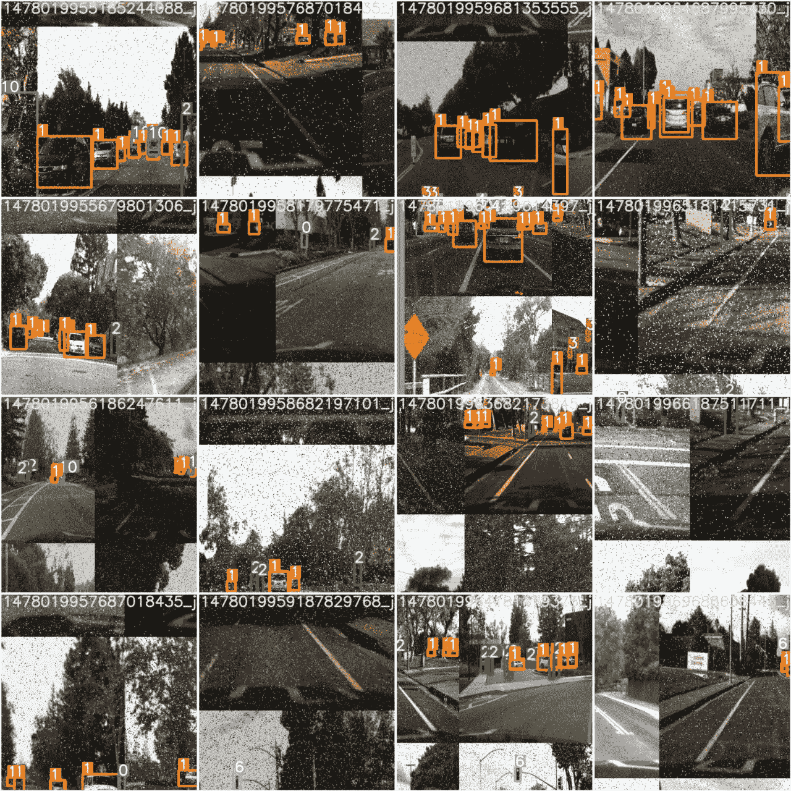

*Training data with augmentations*

# 在测试图像上运行推理

我们现在采用经过训练的模型，并对测试图像进行推断。我们使用在训练模型进行推理时创建的权重。

让我们来看看我们的结果:

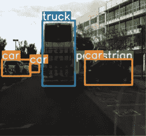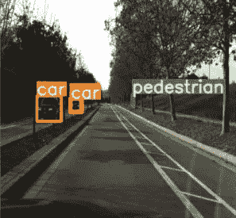

Predictions on test images

# 结论

现在，一个充满自动驾驶汽车的世界似乎只是一个梦想。但是随着这一领域的进一步发展，我确信这将很快成为可能，而不仅仅是白日梦。

这篇文章中的插图仅仅是物体检测的一个例子——一个基本的构建模块。真正的挑战来自对这些物体的三维感知，以及汽车如何对这些物体做出反应。周围的某些因素，如天气和低于标准的基础设施，也会影响这些汽车的性能。

将这些课程作为课程的一部分将引起人们的兴趣，并有助于在该领域进行进一步的研究和开发。这无疑将加速这一进程，并使自动驾驶汽车很快成为现实。希望这篇文章能有助于激发你们所有人的兴趣！