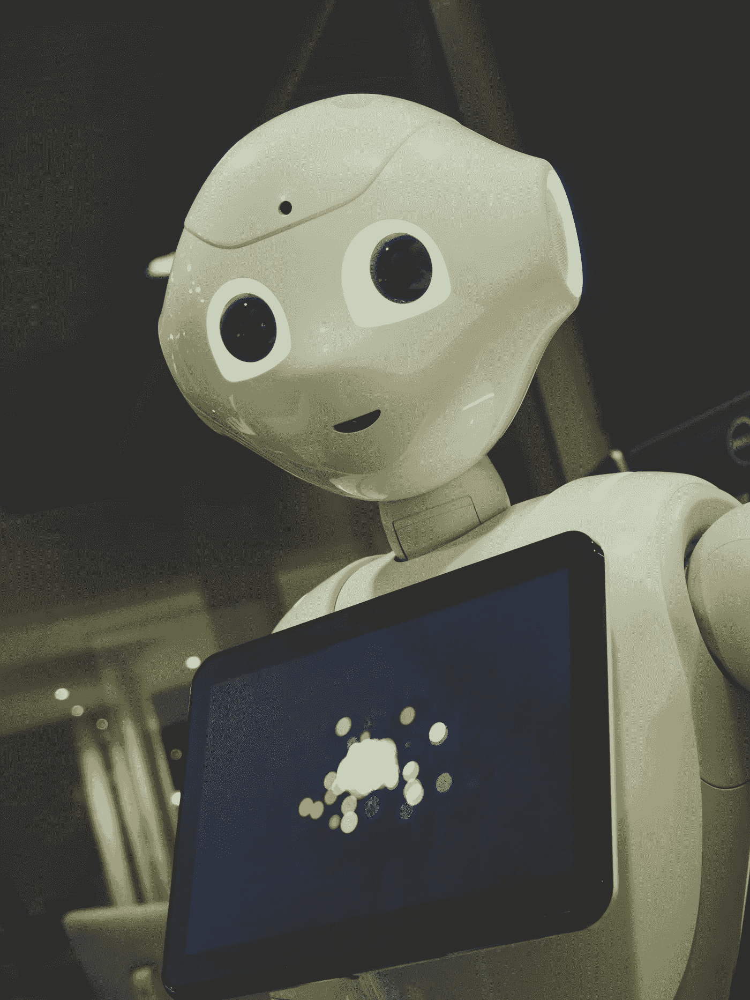

# 自我想象机器人。

> 原文：<https://medium.com/geekculture/self-imagining-robot-e8160c3950f1?source=collection_archive---------16----------------------->

## 最近的发现

Photo by [Owen Beard](https://unsplash.com/@owenbeard?utm_source=unsplash&utm_medium=referral&utm_content=creditCopyText) on [Unsplash](https://unsplash.com/s/photos/robots?utm_source=unsplash&utm_medium=referral&utm_content=creditCopyText)

随着世界的进步，科学在每一个领域都取得了进步，每一个小任务都实现了自动化，因此它们可以在最短的时间内完成。与之类似的，是人工智能行业。有些人可能认为它是计算机科学的一个分支，而有些人不这样认为。嗯，我相信它就在薄薄的边界上。因为它不仅使用一些…