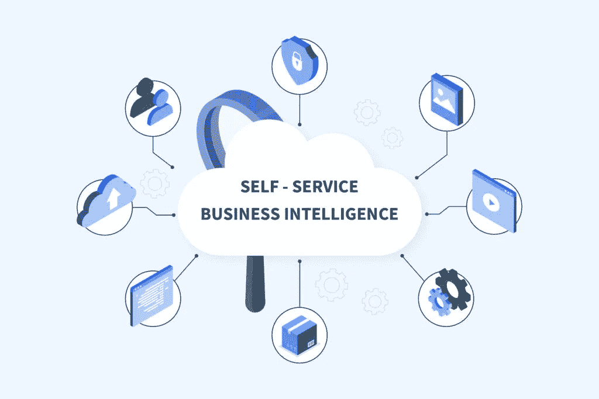
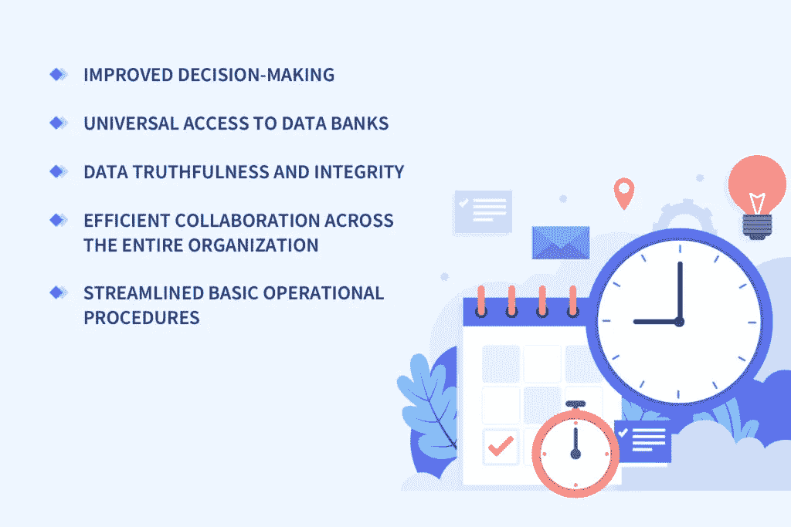
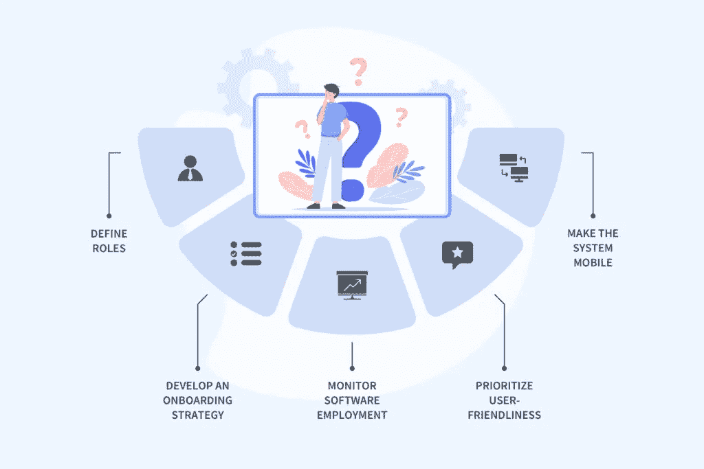
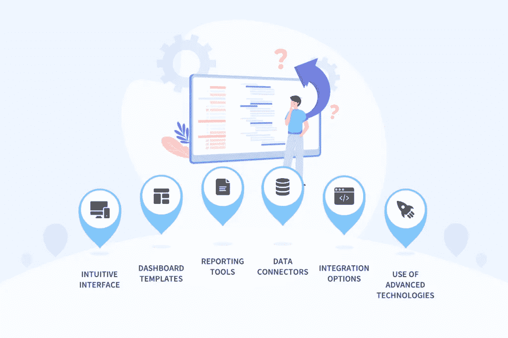

# 自助式商业智能审查— NIX United

> 原文：<https://medium.com/geekculture/self-service-business-intelligence-scrutinized-nix-united-90b32ce7f214?source=collection_archive---------20----------------------->

俗话说，掌握信息就是掌握局势。这条经验法则在商业领域也同样适用，因为关于客户的数据、利基市场的主导趋势以及公司的工作流程指数可以成为制定公司未来几个月营销战略的基准。意识到这些数据的重要性和处理这些数据的好处，企业投资[商业智能(BI)软件](https://nix-united.com/services/business-intelligence-services-bi/)来利用最先进的工具进行数据收集、处理和分析。

然而，如果处理[数据科学解决方案](https://nix-united.com/services/data-science/)的大型组织在他们的 IT 人员领域负有责任，对于较小的企业——尤其是初创公司——这种例子非常罕见，因为支付整个技术部门的定期工资远远超出了他们的能力。这就是为什么他们经常寻找“什么是自助商业智能？”这个问题的答案并尝试将最佳自助 BI 实践实施到他们的管道例程中，以成功应对他们面临的众多挑战。

# 自助商业智能解释

什么是自助 BI？这是一个业务数据收集和分析的过程，它不是像通常那样由组织的 It 专家执行，而是由销售、会计、产品开发、市场营销等其他团队执行。

非技术背景，计算机非常基础的人有可能吗？是的，它是。术语“自助商业智能”不仅包括分析能力和过程，还包括建立这种过程的相应工具。高瞻远瞩的软件供应商正朝着[领域的最新趋势](https://nix-united.com/blog/top-business-intelligence-trends-for-2021/)调整方向，倾向于为他们的 BI 解决方案提供一些自助式 BI 设施的例子。

通常，自助式商业智能体系结构包含许多仪表板和界面，对于外行人来说，这些仪表板和界面没有或很少有挑战性。因此，销售和营销领域的专家可以执行查询并从大量数据源中获得洞察力，而无需处理数据分析师或 IT 人员，然后做出数据驱动的业务决策。

自助 BI 的套路和正规的有什么不同？

# 传统和自助商业智能并列

在传统的商业智能周期中，一个组织的所有部门——从人力资源到销售部门——都会生成和存储大量与业务相关的数据。收集数据后，他们将其传递给 it 团队和/或 BI 专家，以执行数据分析并生成性能报告、预测发展和预测趋势。这不是一次性的例子。这种做法不时重复，以支持企业的标准管道作业。

通过这种方式，数据和分析的质量仍然很高，但企业的整体效率却大大降低，因为堆积在技术人员身上的众多挑战和责任迫使他们同时处理太多的差事。其结果是，业绩基本上被延迟了，利益相关者一直在愤怒地等待(有时是几天)提交给他们的报告。同时，在长时间的交付过程中，这些数据的可信度和价值会急剧下降。

自助商业智能是一个完全不同的故事。在这种情况下，数据终端用户不必一直处于待机模式，直到 IT 人员完成他们的工作。利用自助式 BI 工具，所有部门的人员都可以利用直观的用户界面来帮助他们分析数据和生成报告，而无需具备深厚的技术专业知识。可能出现的错误和不足是对通过自助业务智能获得的程序的及时性的有效权衡。技术人员也多了一项工作，可以更加专注于需要他们专门能力的工作。

这种方法会给公司带来什么好处？

# 自助商务智能的优势

一旦实施，自助 BI 将成为组织的强大资产，因为它:

*   促进决策。不再有令人厌烦和乏味的尝试，将无数的电子表格汇集在一起，目的是弄清楚整体情况。自助式 BI 控制面板和报告将所有必要的数据可视化，并允许经理和普通员工规划出有知识的步骤，以简化业务工作流程。
*   授予数据库的通用访问权限。任何部门的员工都可以找到对其责任部门有用的信息。因此，营销人员深入了解客户行为和需求，金融人员分享与其领域相关的报告，人力资源部门研究人员绩效数据，等等。
*   提供了真相的单一版本。前一个好处转化为这一个。一旦企业的所有部分都提供了相同的档案，数据之间就不会有差异，因此企业机制将在透明的工作环境中作为一个整体运作。
*   支持整个组织的协作。当所有员工都能够平等地访问自助 BI 工具传递的数据时，他们可以创建包含所有部门专家的任务组，这些专家将参与结果讨论和公司政策的制定。
*   减轻 IT 和 BI 团队的压力。由于最终用户可以自己处理数据处理和分析，技术部门和分析人员将把他们的精力放在其他需要他们立即关注的任务上。
*   简化基本的车间流程。当您需要的所有输入数据全天候唾手可得时，为每个部门创建特定任务变得轻而易举。通过采用自助式 BI 机制，微观管理也变得相当容易。
*   奖励竞争优势。对数据的充分利用、获得及时的洞察力以及加快决策制定速度，意味着一个组织的业务效率会大幅提高，相应地，在利基市场上也会比竞争对手拥有更大的优势。

尽管有明显的优点，但是，自助式 BI 计划的实施可能会面临严重的障碍。

# 自助商业智能应用的挑战

作为在[数据处理](https://nix-united.com/services/big-data-management-services-data-engineering/)领域经验丰富的参与者，我们 NIX United 认为在引入自助 BI 时，关注以下瓶颈至关重要。

# 最终用户的不情愿

习惯于采用商业决策的传统直觉驱动实践的员工和经理都可以抵制加入自助式商业智能。此外，如果用户界面不够友好，有技术障碍的人员可能会发现学习操作自助服务 BItools 令人望而生畏。

这个问题可以通过一致的措施来缓解，这些措施旨在解释和强调自助服务解决方案的好处，并优化这些解决方案，以便普通用户掌握。

# 数据处理结果不准确

由于这种解决方案是每个人(特别是外行人)的通用工具，分析可能处理不当，产生不良结果。此外，由随机的人输入，数据可能会变得相当混乱和不稳定。

所有这些陷阱都可以通过全面的培训计划来避免，这些计划不仅会教育员工使用自助 BI 软件，还会教育他们搜索必要的数据并创建报告和可视化。

# 危及数据隐私和安全

由于许多终端和人员通过自助式 BI 解决方案访问业务、财务和个人数据，如果系统实施不当，他们的完整性可能会受到损害。

为了最大限度地减少数据泄漏或未经授权的渗透风险，必须在软件开发阶段和风险承担者使用该工具时设想强有力的安全措施。

# 疯狂的部署

与个人努力非常相似，随着多个参与者自行部署这样的环境，自助式商业智能系统可能会变得相当混乱。

为了防止事情失控，BI 团队应该监控部署过程，并对不同用户的独立工作设置一些集中限制。

如果在专家的支持下，根据深思熟虑的策略实施自助 BI 平台，所有这些挑战都可以成功解决。

# 实施自助商业智能:需要记住的 5 件事

在制定自助式 BI 实施计划时，必须考虑一些基本因素:

*   定义角色。您应该在将利用您将要推出的解决方案的利益相关者之间分配职责。这种分布取决于他们在组织中的职能以及他们处理的数据类型。
*   制定入职战略。你应该认识到，采用任何具有特定功能和特征的新技术都需要时间和努力。当你让它以自己的方式前进时，它会变得更长更难。为了更快地推进 it，制定并实施详细的培训和入职政策是必不可少的。
*   继续监控软件使用情况。当您将自助式 BI 框架付诸实施并确保它按照您的预期运行时，不要松懈。如果某些元素表现不佳，您应该跟踪使用它进行调整的方式。
*   优先考虑用户友好性。由于自助 BI 解决方案的大多数用户可能只具备基本的 IT 知识和技能，因此软件拥有直观的用户界面和简单易用是至关重要的。
*   移动体验很重要。鉴于当今世界智能手机无处不在，拥有移动版本的自助 BI 解决方案至关重要。这不仅有助于其更广泛的使用，还将使数据和分析可供员工随时随地使用。

这些是基本的，但是每个组织可以在这个列表中添加一些要点，并开发自己的定制实施方案。同样重要的是应该包含在解决方案中的自助式 BI 架构的组件。

# 自助 BI 架构的必备功能

现有自助 BI 解决方案的示例在试图满足使用它们的组织的需求方面表现出了极大的灵活性，然而一些功能被认为是所有这些解决方案的基本功能。

# 1.直观的拖放界面

简单整洁的界面是任何可靠的自助式 BI 工具的主要元素。它将允许用户快速掌握它，并轻松地在解决方案中导航。他们还必须能够从可用的表中选择数据字段，并将它们拖放到他们想要的地方。此外，只需点击几下鼠标，就可以创建自定义仪表盘和访问分析，让非技术人员也能顺利使用该工具。

# 2.预设仪表板模板

这些嵌入式分析工具旨在可视化数据模式，以便于理解和进一步分析。通常，此类模板包含彩色编码地图、饼图、条形图/线图、散点图和其他支持数据呈现的媒体。这里应该使用拖放功能，以及数据混合特性和数据库插件。

# 3.各种报告工具

报告功能对于一流的自助 BI 环境也至关重要。这种工具应该能够分析以不同格式(视觉和文本)呈现的数据，这取决于每个目的的首选类型。这些工具还必须可以通过链接共享，这样所有参与数据处理的人都可以在他们的仪表板上看到由不同小工具支持的报告。

# 4.数据连接器

如今，可供业务用户使用的数据库范围相当大，一个令人满意的 BI 解决方案必须保证能够访问其中的大部分。此类数据源的示例包括公司的 CRM 和 ERP 以及 Google Drive、Google BigQuery、Azure Synapse、Sharepoint、Microsoft Analysis Services、Microsoft SQL Server 等。如果客户希望连接到其他平台，解决方案中应包括“内存中数据源”功能，以启用此选项。

# 5.集成选项

由于现代企业在其日常管道中广泛使用应用程序和其他软件，自助式 BI 解决方案应该能够将所有这些集成在一个屋檐下，并在涉及各个部门的系统、聊天、项目和任务之间提供无缝的数据和通信流。

# 6.先进的技术工具

由在当前 IT 驱动的世界中非常流行的最先进的技术支持的工具可以增强任何自助式 BI 环境的功能。在这里，这完全取决于开发人员的[专业知识，他们可以利用人工智能、云设施、预测分析、自然语言查询、ML 和其他能够提高他们为您的组织构建的定制自助 BI 解决方案的效率的技术。](https://nix-united.com/industry-recognition/)

# 总结一下

随着数字技术渗透到越来越多的领域，IT 素养成为任何希望超越竞争对手并扩展到新的消费者市场的企业的非技术人员的必备技能。自助商业智能工具是这种软件的一个很好的例子，它使用户能够执行大量的数据处理和分析任务，而无需处理公司的 IT 和 BI 部门。[联系我们](https://nix-united.com/blog/the-nitty-gritty-of-self-service-business-intelligence/#contact-us)为您开发定制的自助式商务智能工具。

*原载于 2022 年 4 月 6 日*[*【https://nix-united.com】*](https://nix-united.com/blog/the-nitty-gritty-of-self-service-business-intelligence/)*。*