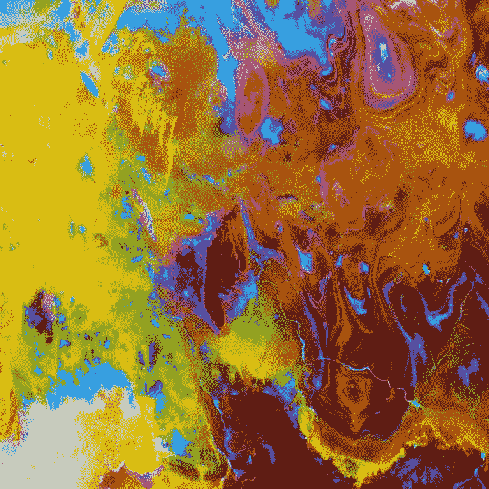
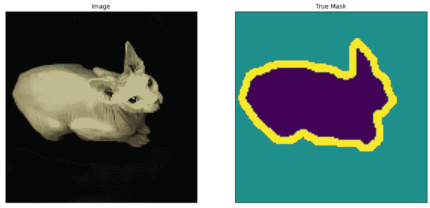
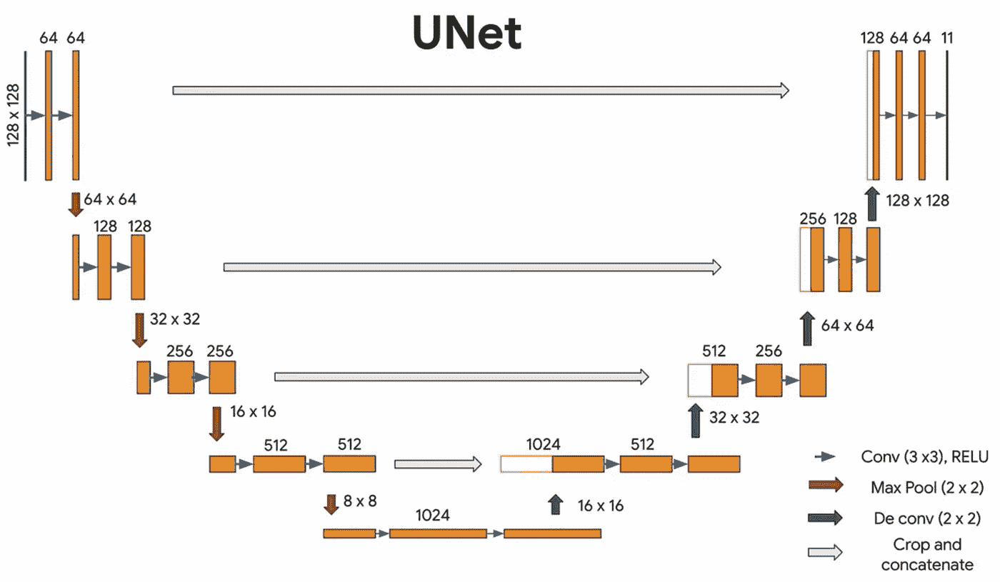
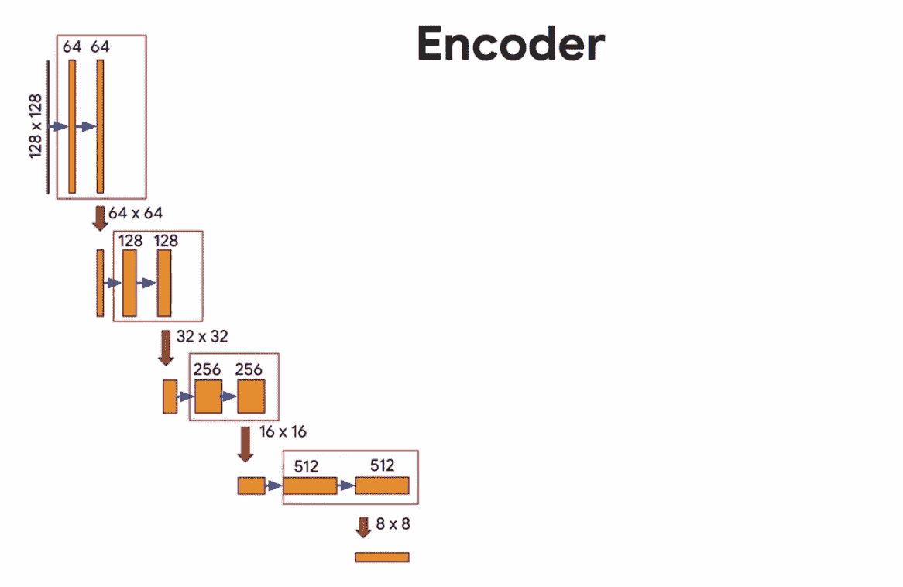
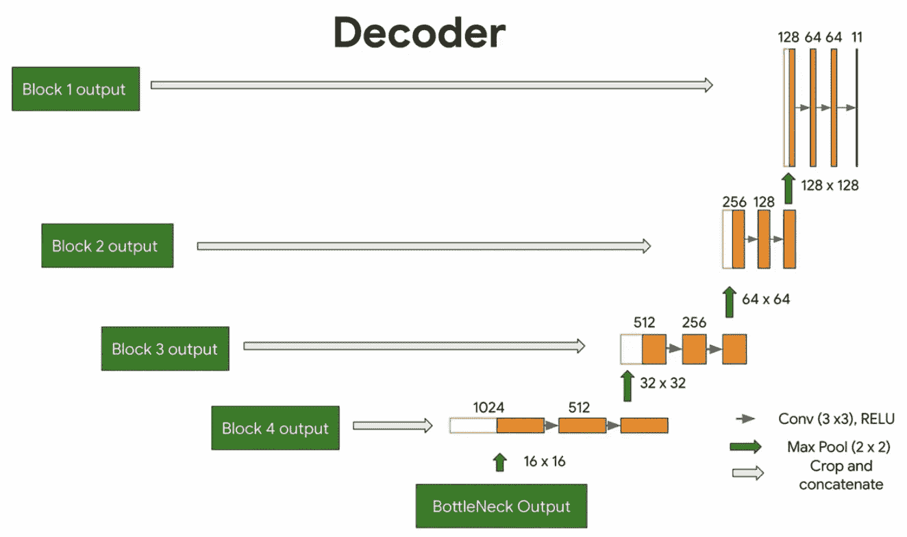
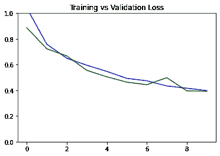
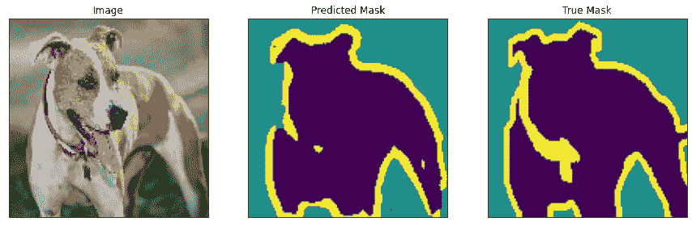

# 基于 UNet 的语义图像分割

> 原文：<https://medium.com/geekculture/semantic-image-segmentation-using-unet-28dbc247d63e?source=collection_archive---------2----------------------->

## 介绍

语义图像分割是计算机视觉中密集分割任务的一种形式，其中模型输出与输入图像具有相同维度(高度和宽度)的输入 RGB 图像的密集特征图。输出要素图由与每个像素的预测类一样多的通道组成。训练模型是通过将输出层的激活保持为 SoftMax 来完成的，并且损失被计算为与地面真实分割掩模相比的分类交叉熵。然后，最终的预测掩膜通过 argmax 函数传递，以实现逐像素标注。因此，输出本身是与输入图像具有相同尺寸的高分辨率图像，其中每个像素被分类到特定类别。因此，这是一个像素级的图像分类。

请注意，它不同于计算机视觉中的实例分割任务，在计算机视觉中，随着像素级图像分类，同一类的不同实例以不同方式表示。

语义图像分割的应用范围从医学图像分割(用于分类各种感兴趣的对象，如肿瘤或血细胞)到自动驾驶汽车中的场景理解任务。

## 数据集的准备

为了这个项目的目的，我们将下载并预处理牛津-IIIT 的 Pets 数据集。牛津-IIIT 宠物数据集是 37 个类别的宠物图像数据集，每个类别大约有 200 个图像。这些图像在比例、姿态和光线方面有很大的差异。所有图像都有一个相关的物种真相注释。该数据集包含 pet 图像、它们的类别、分割掩模和头部感兴趣区域。然而，我们在这里将只使用图像和分段遮罩。示例总数为 7349，其中测试数据集的拆分为 3669，训练数据集的拆分为 3680。来自训练和测试数据集的随机样本如下所示。

Train datapoint example

Test datapoint example

我们现在将通过在 Tensorflow 2 中应用效用图函数来准备训练和测试数据集。首先通过翻转图像来应用简单的增强，然后在归一化像素值之后，我们将图像的大小调整为 128x128x3。我们对训练数据集和测试数据集应用相同的变换，只是我们不扩充测试数据集。另一个预处理步骤是调整分割掩模的像素值。分割掩模中的像素被标记为前景标签 1、背景标签 2 和未分类标签 3。让我们从所有标签中减去 1，重新解释为 pet(标签 0)，background(标签 1)，outline(标签 2)。我们使用批次大小 64 和缓冲区大小 1000 来混洗训练数据集中的图像。

## 用变换卷积进行上采样

转置卷积(有时也称为去卷积或分数步进卷积)是一种使用可学习参数对图像进行上采样的技术。这是与正常卷积完全相反的过程，即输入体积是低分辨率图像，而输出体积是高分辨率图像。正常卷积可以表示为输入图像和滤波器的矩阵乘法，以产生输出图像。通过对滤波器矩阵进行转置，我们可以反转卷积过程，因此称为转置卷积。然而，注意，卷积矩阵的转置仅使用卷积矩阵的设计，其零填充在相应的位置，但是转置卷积矩阵中的其他参数是可学习的。要了解更多信息，请阅读涩谷直树的文章 [*【转置卷积上采样】*](https://naokishibuya.medium.com/up-sampling-with-transposed-convolution-9ae4f2df52d0) 。

## UNet 架构

[*UNet*](https://arxiv.org/abs/1505.04597) 由 Olaf Ronneberger 等人开发，用于生物医学图像分割。该架构包含两条路径。第一条路径是收缩路径(也称为编码器)，用于捕获图像中的上下文。编码器只是一个传统的卷积和最大池层堆栈。第二条路径是对称扩展路径(也称为解码器)，用于使用转置卷积实现精确定位。因此，它是一个端到端的全卷积网络(FCN)，即它只包含卷积层，不包含任何密集层。

UNet Architecture

UNet 由编码器(下采样器)和解码器(上采样器)组成，二者之间存在瓶颈。上图中的灰色箭头对应于将编码器模块输出连接到解码器每一级的跳跃连接。让我们从编码器开始，看看如何实现这些。

## 编码器

这里的编码器将有重复的块(下图中的红框)，所以最好为它创建函数，使代码模块化。这些编码器模块将包含两个由 ReLU 激活的 Conv2D 层，然后是一个 MaxPooling 和 Dropout 层。每个阶段都将增加过滤器的数量，并且由于汇集层的原因，特征的维度将减少。

UNet Encoder

## 瓶颈

编码器模块后面有一个瓶颈，用于提取更多的特征。这没有池层，因此维度保持不变。

## 解码器

最后，我们有解码器，它将特征向上采样回原始图像大小。在每个上采样级别，我们将获取相应编码器模块的输出，并在馈送到下一个解码器模块之前将其连接起来。

UNet Decoder

## 把所有的放在一起

我们最终可以通过链接编码器、瓶颈和解码器来构建 UNet。我们将指定输出通道的数量，在这个特定的集合中，将是 3。这是因为每个像素有三个可能的标签:“宠物”、“背景”和“轮廓”。

我们可以画出训练和验证损失图，看看训练进行得如何。这通常应该显示每个历元的递减值。

Training vs Validation Loss

模型现在可以进行一些预测了。我们将使用我们之前准备的测试数据集来提供模型之前没有见过的输入图像。

Model Prediction on Test Image

## 结论

感谢您对博客的兴趣。如果您有任何意见、反馈和建议，请留下。

完整代码在我的 GitHub repo [*这里*](https://github.com/lohit-kapoor/Semantic-Image-Segmentation-Using-UNet.git) 。