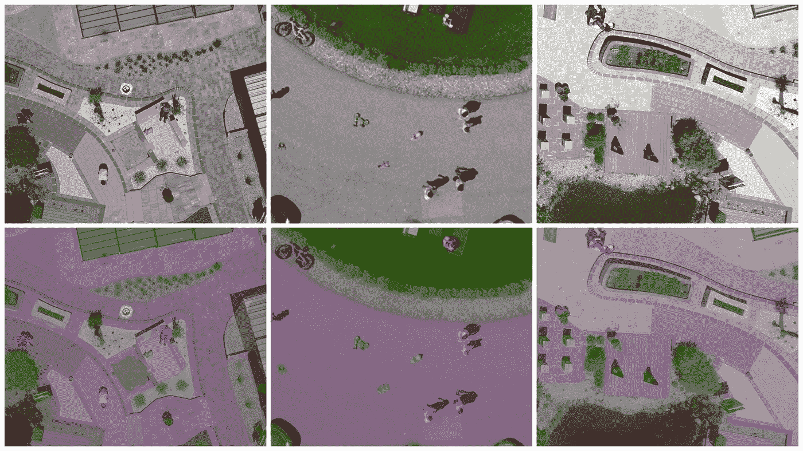
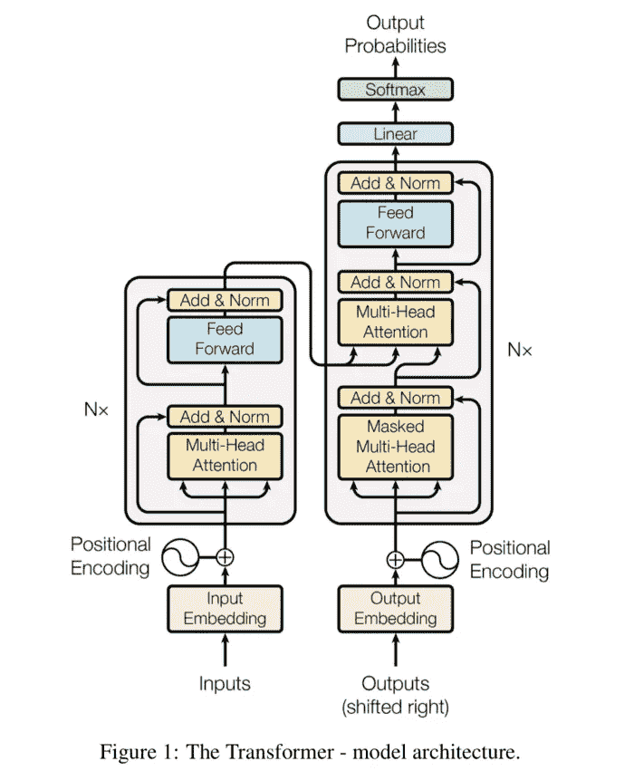
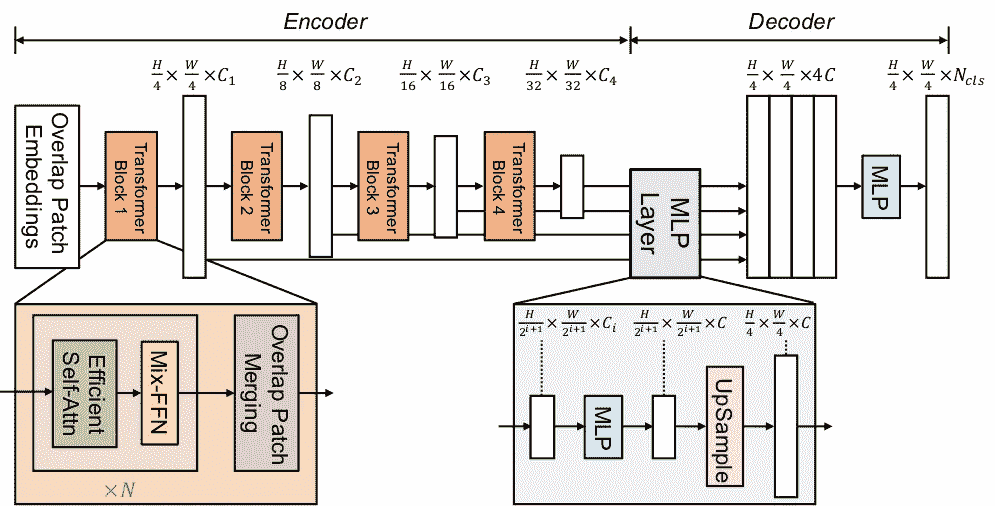
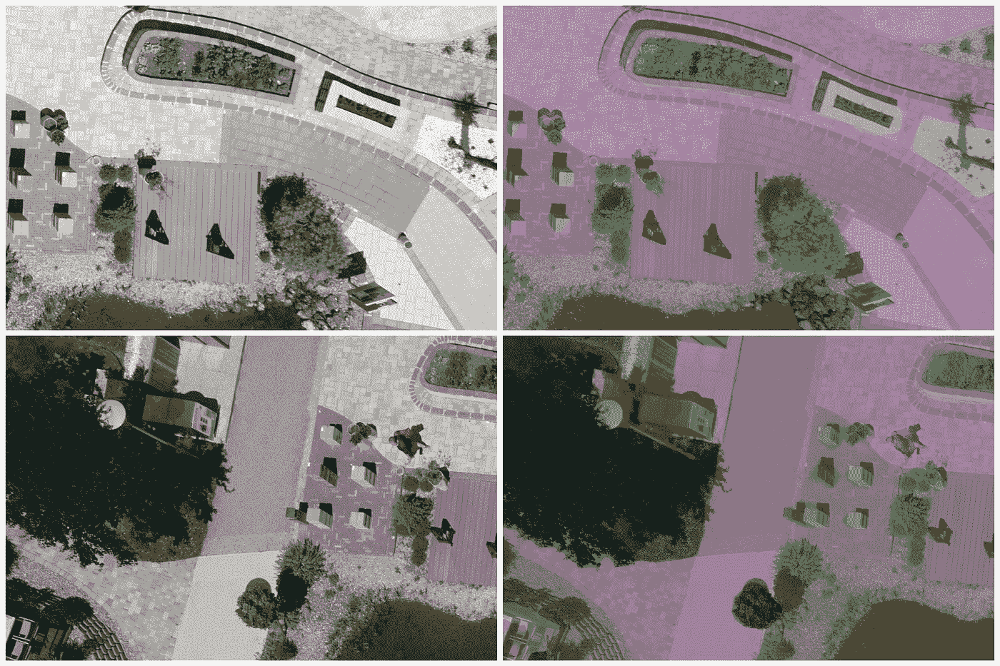

# 用 SegFormer 进行语义分割

> 原文：<https://medium.com/geekculture/semantic-segmentation-with-segformer-2501543d2be4?source=collection_archive---------1----------------------->



Model Prediction on Drone Dataset Image

# 介绍

图像分割是对图像中的每个像素进行分类的过程。这是一项计算机视觉任务，主要任务是检测图像中带有对象的区域。

今天我们将讨论使用 [SegFormer](https://deepai.org/publication/segformer-simple-and-efficient-design-for-semantic-segmentation-with-transformers) 的语义分割。这是一个神经网络架构，其灵感来自于当今热门的建筑——变形金刚。如果没有任何印象的话，你一定是住在岩石下了！

Segformer 架构不像视觉转换器那样依赖于位置编码，因此提高了对不同分辨率图像的推断。Segformer 领先于其他同类产品的另一点是其解码器的设计方式。与所有使用上采样或去卷积的分段架构不同，Segformer 使用速度更快、效率更高的 MLP 解码器。我们将在接下来的章节中更详细地讨论这个架构。

# 变形金刚(电影名)

## 这些变形金刚到底是什么？

变形金刚最初是用来解决文本生成和翻译等问题的。Transformer 是一种新颖的架构，使用编码器和解码器以及自关注机制将一个序列转换为另一个序列。



Figure 1: From ‘Attention Is All You Need’ by Vaswani et al.

# SegFormer 建筑

该架构基于具有编码器-解码器头的变换器架构，其中编码器利用自关注。

编码器结构本质上是分级的，输出多尺度特征。它不需要位置编码，从而避免了当测试分辨率不同于训练时导致性能下降的位置码的[插值](https://deepai.org/machine-learning-glossary-and-terms/interpolation)。

与其他复杂解码器不同，该架构采用简单的 MLP 解码器，该解码器聚合来自不同层的信息，从而将局部注意力和全局注意力相结合，以呈现强大的表示。



Figure 2: SegFormer architecture

# 语义分割

对于这篇博客，我们将使用 SegFormer 在[无人机数据集](https://www.tugraz.at/index.php?id=22387)上训练一个语义分割模型，该数据集可以从 [Kaggle](https://www.kaggle.com/bulentsiyah/semantic-drone-dataset) 下载。

## 数据集概述

语义无人机数据集侧重于对城市场景的语义理解，以提高自主无人机飞行和着陆程序的安全性。该图像描绘了在离地 5 至 30 米的高度从天底(鸟瞰)拍摄的 20 多座房屋。使用高分辨率相机获取 6000x4000px (24Mpx)大小的图像。训练集包含 400 个公开可用的图像。

## 数据扩充

由于图像的大小为 6000x4000px，这对于训练我们的模型来说太大了，我们将应用一个裁剪放大步骤，用滑动窗口机制来挑选 2000x2000px 的作物。这为我们提供了每幅图像 6 次裁剪，从而将数据集大小增加到 2400 幅图像。我们将使用 2100 幅图像进行训练，300 幅图像进行验证。扩充的数据集可以从[的 Google Drive](https://drive.google.com/file/d/14uIrMaB9z0unQUG7f851QV0YG1EcNJyq/view?usp=sharing) 下载。

## 培养

在 PyTorch 中训练 SegFormer 模型就像训练任何其他模型一样简单。我们将遵循的步骤是:

*   用数据加载器加载数据。
*   初始化超参数和优化器。
*   编写训练循环

我们将使用 HuggingFace 的特征提取器，它直接从加载的蒙版中处理分割标签。

```
encoded_inputs = self.feature_extractor(augmented['image'], augmented['mask'], return_tensors="pt")
```

我们有标签 CSV，可用于在分割图像上绘制颜色。

```
classes = pd.read_csv('class_dict_seg.csv')['name']id2label = classes.to_dict()label2id = {v: k for k, v in id2label.items()}
```

我们将使用 HuggingFace 的预训练 SegFormer 模型，并用我们自己的数据集对其进行微调。HuggingFace 的`transformers`库使得使用预训练的模型通过自定义数据集进行微调变得非常容易。加载预先训练好的模型只有几行代码。

```
feature_extractor = SegformerFeatureExtractor(align=False, reduce_zero_label=False)model = SegformerForSemanticSegmentation.from_pretrained(
"nvidia/mit-b5", ignore_mismatched_sizes=True, num_labels=len(id2label), id2label=id2label, label2id=label2id, reshape_last_stage=True)
```

我们将使用训练 SegFormer 时使用的默认超参数来训练带有无人机数据集的模型。HuggingFace 的`transformers`库为优化器`AdamW`提供了微小的变化，以处理预训练 HuggingFace 模型的训练。

```
optimizer = AdamW(model.parameters(), lr=0.00006)
```

在这里，我们准备训练模型。为了博客的缘故，我们只对它进行 10 个纪元的训练，因为在 Colab 上训练需要很长时间，并且用 10 个纪元就能给出不错的结果。

## 推理

上面在无人机数据集上训练的模型被推送到 HuggingFace 模型中枢。

让我们看看推理代码来测试我们的模型。

获取调色板的颜色，我们将使用它在图像上绘制分类分割。

```
df = pd.read_csv('drone_dataset/class_dict_seg.csv')classes = df['name']palette = df[[' r', ' g', ' b']].valuesid2label = classes.to_dict()label2id = {v: k for k, v in id2label.items()}
```

正如我们前面看到的，使用 HuggingFace 加载预训练模型非常容易。

**注意:**我们将使用我们的预训练模型，而不是 Nvidia 的预训练模型。模型被推送到 HuggingFace Model Hub 中名为`deep-learning-analytics/segformer_semantic_segmentation`的存储库中。

```
feature_extractor = SegformerFeatureExtractor(align=False, reduce_zero_label=False)device = torch.device("cuda" if torch.cuda.is_available() else "cpu")model = SegformerForSemanticSegmentation.from_pretrained("deep-learning-analytics/segformer_semantic_segmentation", ignore_mismatched_sizes=True,num_labels=len(id2label), id2label=id2label, label2id=label2id,reshape_last_stage=True)model = model.to(device)
```

我们需要做的唯一一件事就是让加载的图像通过我们之前谈到的`feature_extractor`,为模型推断做好准备。

```
# prepare the image for the model (aligned resize)feature_extractor_inference = SegformerFeatureExtractor(do_random_crop=False, do_pad=False)pixel_values = feature_extractor_inference(image, return_tensors="pt").pixel_values.to(device)outputs = model(pixel_values=pixel_values)# logits are of shape (batch_size, num_labels, height/4, width/4)logits = outputs.logits.cpu()
```

## 结果



Model Prediction Examples on Drone Dataset Images

仅此而已。我们做到了！拍拍你的背，你自己训练了一个变形金刚模型！

你可以在[谷歌实验室](https://colab.research.google.com/drive/1_t3KvF3qg4IJfEhTuftFI1GSlscapNgf?usp=sharing)或者 [Github](https://github.com/Praneet9/SegFormer_Segmentation) 上找到训练和推理的代码

您也可以使用部署在 [HuggingFace Spaces](https://huggingface.co/spaces/deep-learning-analytics/segformer_semantic_segmentation) 上的模型，用您自己的数据来试用该模型。

# 结论

我们实现了一个基于 Transformer 的语义分割模型，它在多个任务中提供了最先进的结果。我们还看到了架构是如何考虑到问题的各个方面而设计的。分层设计有助于以多种尺度传播特征。MLP 解码器有助于加速向前传递，从而显著提高模型的 FPS。我们还尝试了拥抱脸，这使得训练和尝试基于变形金刚的模型变得非常容易。

我希望你能从博客中吸取一些东西。请尝试一下 colab 笔记本，并在下面的评论中分享你的经验。

在[深度学习分析](https://deeplearninganalytics.org/)，我们非常热衷于使用机器学习来解决现实世界的问题。我们已经帮助许多企业部署了创新的基于人工智能的解决方案。如果您看到合作的机会，请通过我们的网站[这里](https://deeplearninganalytics.org/contact-us/)联系我们。

## 重要链接

*   [谷歌 Colab](https://colab.research.google.com/drive/1_t3KvF3qg4IJfEhTuftFI1GSlscapNgf?usp=sharing)
*   [原始无人机数据集](https://www.tugraz.at/index.php?id=22387)
*   [增强无人机数据集](https://drive.google.com/file/d/14uIrMaB9z0unQUG7f851QV0YG1EcNJyq/view?usp=sharing)
*   [Github](https://github.com/Praneet9/SegFormer_Segmentation)
*   [拥抱脸模型轮毂](https://huggingface.co/deep-learning-analytics/segformer_semantic_segmentation)
*   [拥抱脸空间](https://huggingface.co/spaces/deep-learning-analytics/segformer_semantic_segmentation)

# 参考

[](https://github.com/NVlabs/SegFormer) [## GitHub-NV labs/seg former:seg former 的官方 PyTorch 实现

### 图 1:seg former-B0 至 SegFormer-B5 的性能。SegFormer:简单有效的语义分割设计…

github.com](https://github.com/NVlabs/SegFormer) [](https://arxiv.org/abs/2105.15203) [## SegFormer:简单有效的变形语义分割设计

### 我们提出了 SegFormer，一个简单、有效而强大的语义分割框架，它将变形器与语义分割相结合。

arxiv.org](https://arxiv.org/abs/2105.15203) [](https://arxiv.org/abs/1706.03762) [## 你需要的只是关注

### 主导序列转导模型是基于复杂的递归或卷积神经网络在一个…

arxiv.org](https://arxiv.org/abs/1706.03762) [](https://huggingface.co/) [## 拥抱脸-人工智能社区建设未来。

### 我们正在通过开源和开放科学来推进和民主化人工智能的旅程。

huggingface.co](https://huggingface.co/) [](https://www.tugraz.at/index.php?id=22387) [## ICG -德罗内达塞特

### 无人机数据集免费提供给学术和非学术实体用于非商业目的，例如…

www.tugraz.at](https://www.tugraz.at/index.php?id=22387)