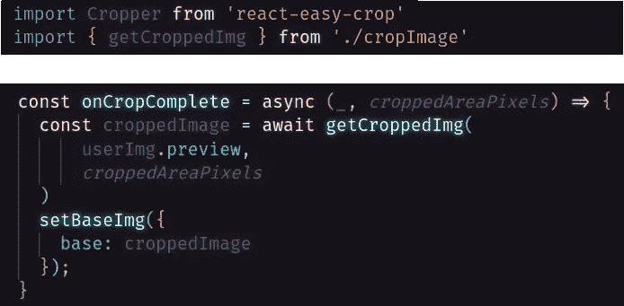
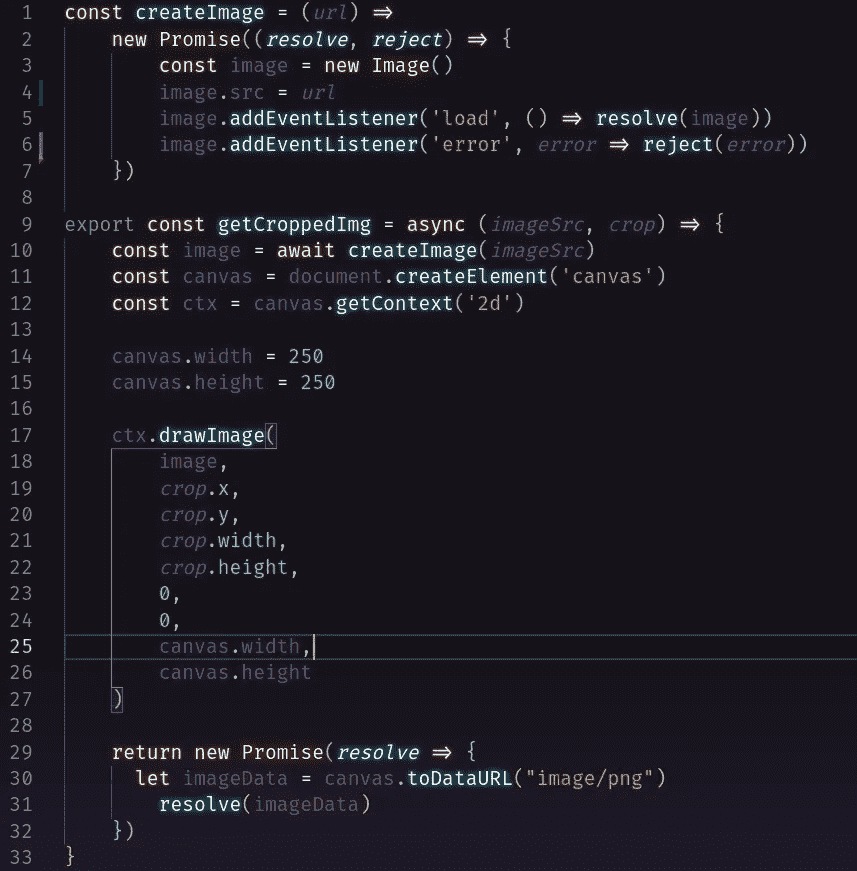
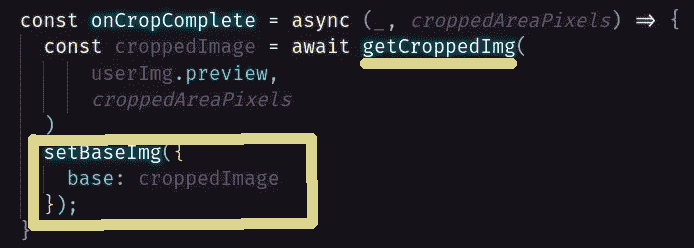
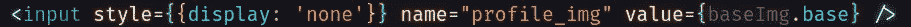
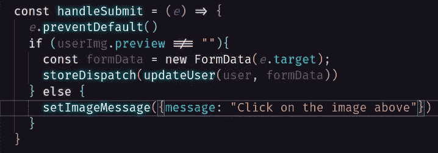
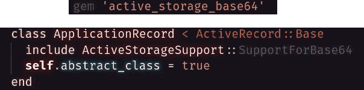
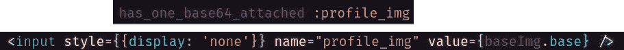
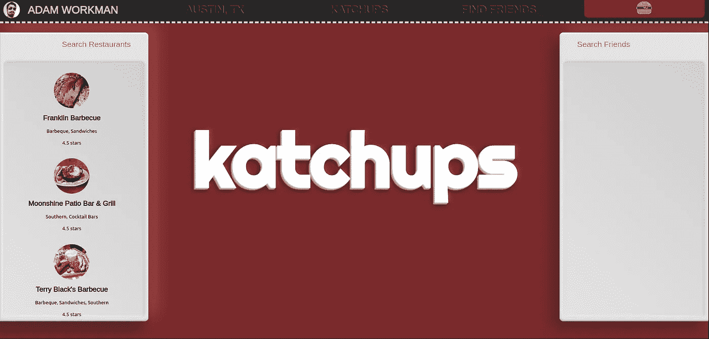

# 将裁剪后的图像从 React 发送到 Rails 进行附件和存储。

> 原文：<https://medium.com/geekculture/send-a-cropped-image-from-react-to-rails-for-attachment-and-storage-f7d46d84abca?source=collection_archive---------13----------------------->

所以，你想保存一个修改过的图像以备后用。假设您希望允许用户上传照片，对其进行裁剪，并将裁剪后的图像保存为他们的头像。在这里，我将介绍一个我发现的解决方案，用于从 React to Rails 获取更改后的图像信息，并通过 ActiveStorage 将该信息附加给用户。我不会讲述如何上传照片，裁剪照片，或者如何设置动态存储。关于这些信息，我建议你查看下面的链接。

~ [上传/活动存储/云存储](https://betterprogramming.pub/how-to-upload-images-to-a-rails-api-and-get-them-back-again-b7b3e1106a13) ~ [裁剪](https://www.npmjs.com/package/react-easy-crop) ~

现在有趣的事情！我正在使用一个叫做 react-easy-crop 的便捷组件来裁剪我的图片(见上面的链接)。它带有回调 onCropComplete，该回调被传递了两个参数 croppedArea 和 croppedAreaPixels，并在用户停止移动媒体或停止缩放时被调用。这似乎是合理的起点。

基本上，我们这里要做的是获取裁剪后的图像，并将该信息设置为一个状态变量。很好很容易！要做到这一点，我们需要从图像的裁剪部分创建一个图像(我们将使用从 onCropComplete 获得的信息)，然后将该图像作为数据返回。cropImage 组件就是为此而构建的。

这里我们创建一个“画布”元素并使用。使用 Context('2d ')在其上创建 2d 形状。我们使用从 onCropComplete(croppedAreaPixles)传入的信息，在画布上仅绘制图像的裁剪部分。drawImage()。然后我们返回 base64 格式的画布。所有这些都是使用基于承诺的函数来暂停执行，直到返回的承诺被履行或拒绝。这是为了确保函数在继续之前有它们需要的信息。一旦我们从 getCroppedImg 接收到图像数据，我们将把该信息保存到一个状态变量中。现在，我们需要将这些信息传输到我们的 Rails 后端。

获取图像信息的一种方法是通过我们上传原始文件的现有表单。因此，在现有的表单中，我们将添加一个输入，其值等于包含更改图像信息的状态变量。这个输入的“名称”将非常重要。您可能希望输入的名称与 ActiveStorage 中的附件名称相同……我们将回到这个问题。

提交处理程序非常简单。我们只是实例化一个新的 FormData 对象并传入我们的表单，然后在获取请求的主体中发送该信息。

一旦信息到达我们的 Rails API，我们需要将它附加到适当的用户。首先，让我们向 ActiveStorage 添加一些功能。让我们将*gem ' active _ storage _ base64 '*添加到我们的 gem 文件中。然后，我们将希望将*include ActiveStorageSupport::supportforbase 64*添加到 application_record.rb。现在，我们可以将 Base64 映像附加到我们的用户！

要将图像附加到用户，只需添加 *has_one_base64_attched :foo 即可。*确保在您的表单中存储图像数据的输入的名称与您的模型中的 *has_one_base64_attached* 的名称相同！这是因为 *has_one_base64_attached* 将寻找一个名为‘profile _ img’的参数来附加到用户。如果没有任何带有该名称的内容，那么它将不会附加任何内容。

取决于你如何设置 ActiveRecord，就是这样！正在上传的图像和前端裁剪，现在被附加到适当的用户。编码快乐！

