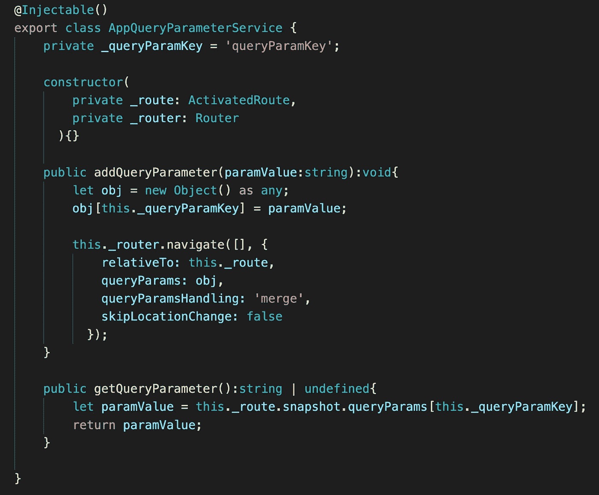
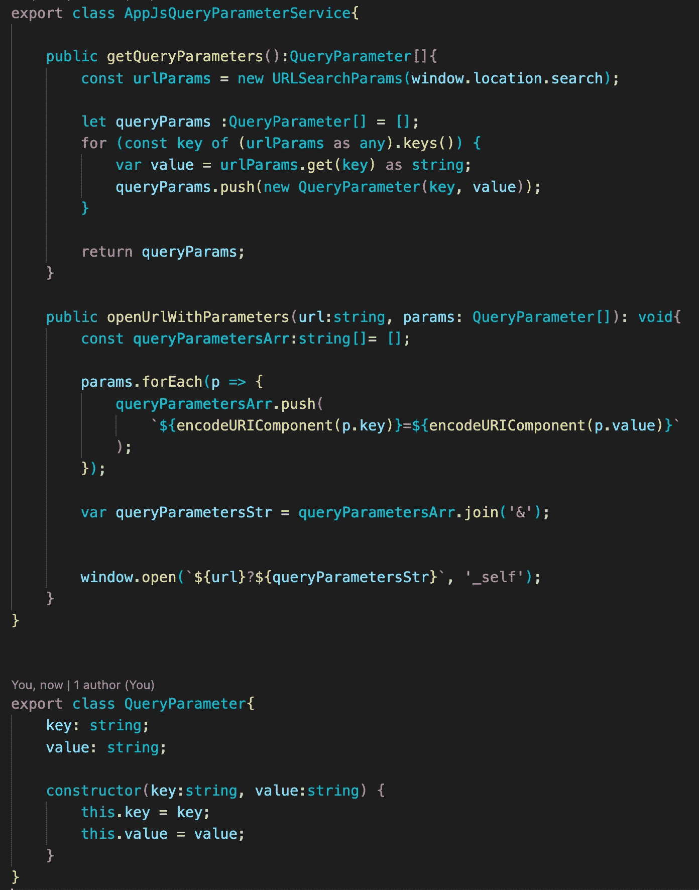
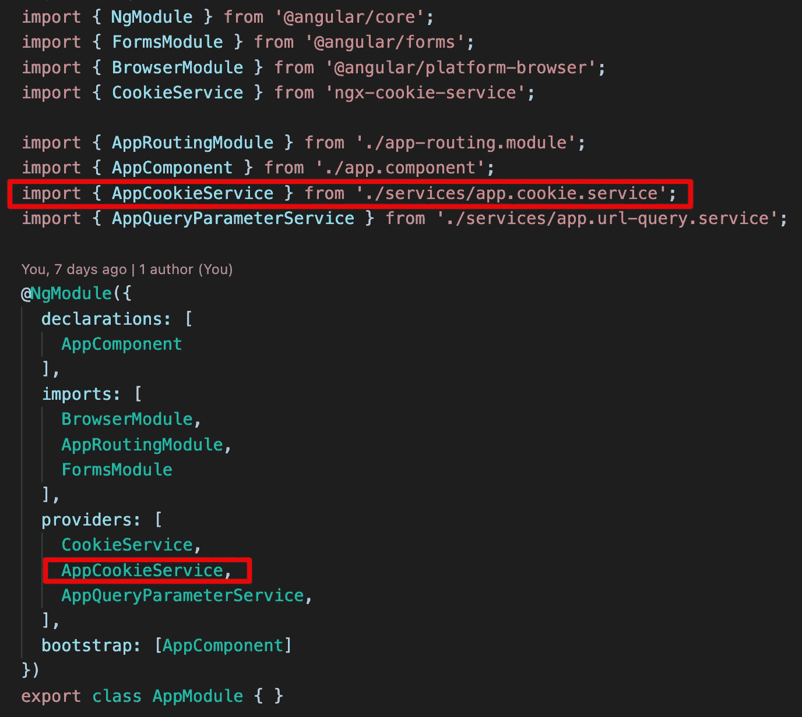
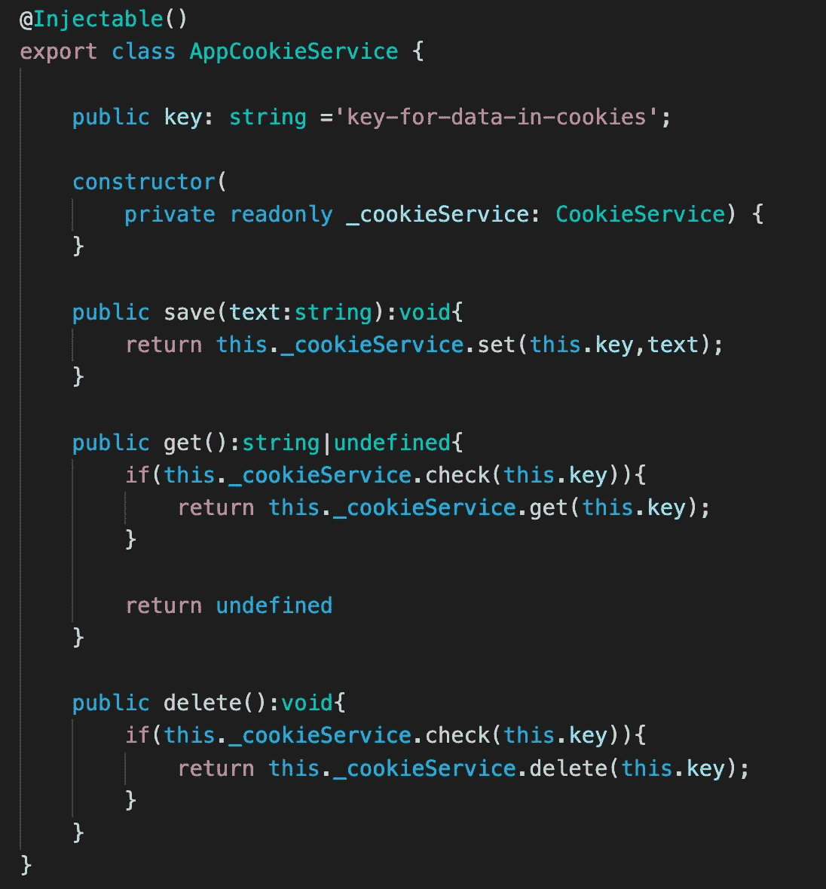

# 从一个应用程序向另一个应用程序发送数据。

> 原文：<https://medium.com/geekculture/send-data-from-one-application-to-another-in-angular-479ca163f90a?source=collection_archive---------1----------------------->

## 应用数据传输。

大公司可能至少有几个应用程序。有时您可能需要将一些数据从一个应用程序发送到另一个应用程序。我们如何做到这一点？我们可以添加数据作为查询参数，或者如果应用程序有相同的域地址，我们可以使用 cookies。

**查询参数**

让我们创建一个查询参数服务。这个服务将有两个方法，一个是在 URL 中添加查询参数和更改 URL。另一种方法将从 URL 获取查询参数。在这个示例方法中，“addQueryParameter”将使用查询参数转到同一个 URL 地址。

我们可以创建一个接受对象的“addQueryParameter”。我们只需要把一个对象转换成一个字符串。不要忘记查询参数的限制。如果你想通过查询参数发送数据，我建议发送少量数据。

**查询 JS 中的参数**

我们可以使用 JS 从 URL 添加和获取查询参数。

**饼干**

如果应用程序在同一个域中运行，我们可以将数据存储在 cookies 或会话存储中。因为您的应用程序具有相同的域，所以它们也使用相同的 cookies。

为了在我们的 angular 应用程序中使用 cookie，我们需要安装 ngx-cookie-service 包。为此，我们需要使用下一个命令:

npm 安装-保存 ngx-cookie-服务

安装完软件包后，我们必须在 provider 部分的模块中添加一个 CookieService。

我们可以在组件中直接使用 ngx-cookie-service 包中的 CookieService，或者创建一个包装器。在这个例子中，我决定制作一个包装器。我们的包装器包装了 CookieService 的几个方法，如 get(key)、set(key、value)、check(key)、delete(key)。唯一的区别是我们的包装器将一个键存储为私有属性。在这种情况下，我们总是确定我们使用相同的密钥。

现在我们有了在 cookies 中保存信息所需的一切。计划很简单:我们将一个应用程序中的信息保存在 cookie 中，然后另一个应用程序从 cookie 中获取信息。当然，我们需要使用同一个密钥。

如果你需要仔细看看这个项目[，这里有链接](https://github.com/8Tesla8/send-data-to-another-app-in-angular)。

*原载于 2022 年 4 月 16 日 http://tomorrowmeannever.wordpress.com**的* [*。*](https://tomorrowmeannever.wordpress.com/2022/04/16/send-data-from-one-application-to-another-in-angular/)