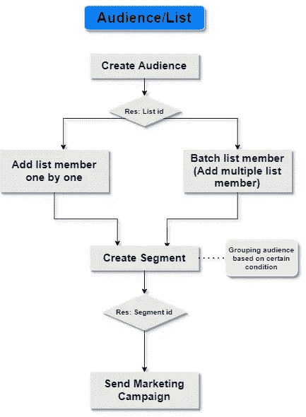
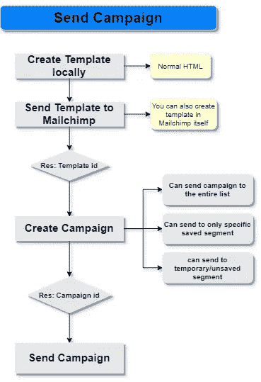

# 使用节点发送电子邮件活动。Js 和 Mailchimp API

> 原文：<https://medium.com/geekculture/send-email-campaign-using-node-js-and-mailchimp-api-9e38a51054b4?source=collection_archive---------2----------------------->

## 创建受众列表，并从该节点发送数字营销活动。Js 应用程序通过使用 Mailchimp 电子邮件提供者。


> *如果你的企业不在互联网上*，那么你的企业将会倒闭”——比尔·盖茨。

如今，将你的生意放到网上是不可避免的，数字营销在其中扮演着重要的角色。有许多电子邮件提供商通过电子邮件发送营销活动。

Mailchimp 是最好的电子邮件服务提供商之一，因为它高度灵活且易于使用。它还有一个非常好的 API 服务，可以很容易地与我们的应用程序集成。

在这里，我们将看到如何在节点中使用 Mailchimp API 来创建受众列表和发送电子邮件营销活动。Js 应用。

要使用 Mailchimp API，您需要在 Mailchimp 中创建一个帐户。然后，你需要 [***生成 API 密匙***](https://mailchimp.com/help/about-api-keys/) 。

# **在节点中创建设置。Js 应用**

生成 API 密钥后，安装 Mailchimp_marketing npm 模块。

> 完整的源代码可以在这个 [***GitHub 资源库***](https://github.com/vijay7755/mailchimp_marketing_campaign) 中找到。

```
npm install [@mailchimp/mailchimp_marketing](http://twitter.com/mailchimp/mailchimp_marketing)
```

然后在节点 index.js 文件中配置 API 键。

```
const mailchimp = require("@mailchimp/mailchimp_marketing")mailchimp.setConfig({
    apiKey: "00000xxxx0000x0x00xx00x00x00000-us6",
    server: "us6",
})
```

现在，我们来看看如何创建一个受众列表(电子邮件列表)并对他们进行分组。然后，我们将向特定群体以及整个名单发送电子邮件活动。

# **观众/名单**



创建受众列表和发送活动包括一系列步骤。

1.  创建受众列表
2.  添加列表成员
3.  将观众分组
4.  发送活动(我们将在下一节介绍这些步骤)

在 Mailchimp 中，受众只不过是邮件列表。它包含公司的详细信息、发送者的详细信息、列表名称等等。要创建列表，使用 [**添加列表**](https://mailchimp.com/developer/marketing/api/lists/add-list/) 端点。

**创建观众列表**

> 假设我们从 **req.body** 得到的参数在下面的所有代码中都是从客户端发送的。

```
const express = require('express')
**const mailchimp = require("**[**@mailchimp/mailchimp_marketing**](http://twitter.com/mailchimp/mailchimp_marketing)**")**const app = express()
app.use(express.static(path.join(__dirname, './index')))**mailchimp.setConfig({
    apiKey: "00000xxxx0000x0x00xx00x00x00000-us6",
    server: "us6",
})**app.post('/audience/create', async (req, res) => {
    const { name, company, address, city, state, zip, country, from_name, from_email, subject, language } = req.bodyconst footerContactInfo = { company, address1: address, city, state, zip, country }const campaignDefaults = { from_name, from_email, subject, language }async function createAudience() {
        try {
            **const audience =** **await mailchimp.lists.createList({
                name: name,
                contact: footerContactInfo,
                permission_reminder: "*|LIST:DESCRIPTION|*",
                email_type_option: true,
                campaign_defaults: campaignDefaults
            })**res.send(audience.id)
        }
        catch (err) {
            res.status(400).send(err)
        }
    }createAudience()})
```

在您的 Mailchimp 帐户中成功创建列表后，将会返回列表 Id。通过使用该 Id，我们可以向列表中添加成员。

> 您必须升级您的 Mailchimp 计划，以创建多个列表。

**添加列表成员**

我们可以逐个添加成员，也可以添加批量电子邮件地址。向列表添加成员需要电子邮件地址和订阅状态。我们可以在合并字段中添加名字、姓氏、电话号码和其他个人信息。可以在电子邮件地址组中添加标签。

***一次添加一个成员***

```
app.post('/audience/add/member', async (req, res) => {
    const { listId, firstname, lastname, email, tag } = req.bodyconst addListMember = async () => {
        try {
            const response = await  **mailchimp.lists.addListMember(listId, {
                email_address: email,
                status: 'subscribed',
                email_type: 'html',
                merge_fields: {
                    FNAME: firstname,
                    LNAME: lastname
                },
                tags: [tag]
            })**
            res.send(response)
        }
        catch (err) {
            res.status(400).send(err)
        }
    } addListMember()
})
```

***添加批量邮件地址(多个成员)***

```
app.post('/audience/add/members', async (req, res) => {
    const { listId, members } = req.bodyconst membersList = []
    members.forEach(member => {
        const memberDetails = {
            email_address: member.email_address,
            email_type: 'html',
            status: 'subscribed',
            merge_fields: {
                FNAME: member.firstname,
                LNAME: member.lastname
            }
        }
        membersList.push(memberDetails)
    })const addMultipleMembers = async () => {
        try {
            const response = await **mailchimp.lists.batchListMembers(listId, {
                members: membersList,
                update_existing: true
            })**
            res.send(response)
        }
        catch (err) {
            res.status(400).send(err)
        }
    }addMultipleMembers()
})
```

**对观众进行分组**

在 Mailchimp 中，段只是将相似风格的成员分组到一个列表中。我们可以根据标签名称(如客户、员工、投资者等)和成员状态(如订阅、退订、待定等)对成员进行分组。
对受众列表进行分组的优势在于，我们可以向特定的细分市场发送营销活动。

```
app.post('/audience/create/segment', async (req, res) => {const { listId, segment_name, emailList } = req.bodyconst conditions = []
    emailList.forEach(email => {
        conditions.push(
            {
                "field": "EMAIL",
                "op": "contains",
                "value": email // email address
            })
    })const createSegment = async () => {
        try {
            const response = await **mailchimp.lists.createSegment(listId, {
                name: segment_name,
                options: {
                    match: 'any',
                    conditions: conditions
                }
            })**
            res.send(response)
        }
        catch (err) {
            res.status(400).send(err)
        }
    }createSegment()
})
```

> 要了解更多有关细分市场的情况， [***请访问此处***](https://mailchimp.com/developer/marketing/docs/alternative-schemas/#segment-condition-schemas) 。

# **电子邮件活动**

我们已经完成了一半。我们已经创建了一个受众列表，向其中添加成员并对他们进行分组(细分)。现在我们可以准备发送电子邮件活动了。

1.  创建模板
2.  创建活动
3.  发送活动



**创建模板**

模板只不过是一个普通的 HTML。我们可以以编程方式创建模板，并将其添加到我们的 Mailchimp 帐户中，或者，我们可以直接在 Mailchimp 用户界面中设计模板。无论哪种方式，在创建模板后，我们将获得模板 id。我们只需要在创建活动时在主体参数中传递模板 id。

在这里，我们将通过编程设计一个模板，并将其发送到我们的 Mailchimp 帐户。

```
app.post('/campaign/create/template', (req, res) => {
    const { templateName } = req.bodyconst createTemplate = async (err, htmlTemplate) => {
        if (err) {
            res.send("An error occured while reading template html file!")
        }
        try {
            **const template = await mailchimp.templates.create({
                name: templateName,
                html: htmlTemplate
            })**
            res.send(template.id)
        }
        catch (err) {
            res.status(400).send(err)
        }
    }
    /* Read the html document as utf8*/
    fs.readFile('./template.html', 'utf8', createTemplate)
})
```

**创建并发送活动**

要创造一场 [***战役***](https://mailchimp.com/developer/marketing/api/campaigns/add-campaign/) ，我们依靠三样东西。受众/列表 id、细分市场 id 和模板 id。除此之外，我们还可以在主体请求中传递一些设置选项。

我们可以向整个列表或仅向特定部分发送活动。在向整个列表发送活动的情况下，只有受众/列表 id 就足够了。我们不需要段 id。

创建活动后，我们将获得发送/触发活动所需的活动 Id。

```
app.post('/campaign/send', async (req, res) => {
    const { **ListId, SegmentId, tempalteId**, subjectLine, previewText, campaignTitle, fromName, replyTo } = req.bodyconst createCampaign = async () => {
        try {
            **const campaign =** **await mailchimp.campaigns.create({
                type: "regular",
                recipients: {
                    segment_opts: {
                        saved_segment_id: SegmentId,
                        match: 'any'
                    },
                    list_id: ListId
                },
                settings: {
                    subject_line: subjectLine,
                    preview_text: previewText,
                    title: campaignTitle,
                    template_id: tempalteId,
                    from_name: fromName,
                    reply_to: replyTo,
                    to_name: "*|FNAME|*",
                    auto_footer: true,
                    inline_css: true,
                }
            })**
            return campaign.id
        }
        catch (err) {
            res.status(400).send(err)
        }
    }const sendCampaign = async (campaignId) => {
        try {
            **await mailchimp.campaigns.send(campaignId)**
            res.redirect("success.html")
        }
        catch (e) {
            res.redirect("fail.html")
        }
    }const campaignId = await createCampaign()
    sendCampaign(campaignId)
})
```

# 结论

我们已经看到了如何通过在节点中集成 Mailchimp API 来创建受众列表、对他们进行分组以及向他们发送电子邮件活动。Js 应用。你还可以用[***Mailchimp API***](https://mailchimp.com/developer/)做更多的事情。

探索愉快！