# 用 HTML5 的表单发送文件，用 Express.js 手柄模板捕捉

> 原文：<https://medium.com/geekculture/send-files-with-html5s-form-and-catching-with-express-js-handlebars-templating-bacc2fa7cd09?source=collection_archive---------11----------------------->


嗨，这是一个关于 Express.js 和 Handlebars 的新帖子，我想介绍一下用默认的表单方式发送文件和获取，从而达到用 js 发送数据和文件的目的。

# 目录的结构

首先，您需要创建一个目录，无论您想选择什么名称，我选择 filesjs 只是为了方便。

# 启动包 JSON

其次，运行这个命令来创建我们的包 JSON，并以这种方式开始安装包。

```
$ npm init -y
```

# 安装 Expres.js 和 Express 把手

要安装依赖项，您需要运行这个命令，I 表示安装，依赖项是下一个

```
$ npm i express express-handlebars
```

# 车把结构

之后，我们需要创建视图目录，布局目录，并创建我们的 server.js 文件，如果你和我做的一样，你可以有这样的东西:


Example Structure for Handlebars

第三，我们需要将 home、404、500、sendFiles 视图添加到我们的项目和主布局或默认布局中。

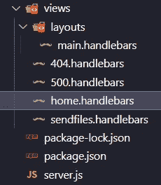

Example views and layouts

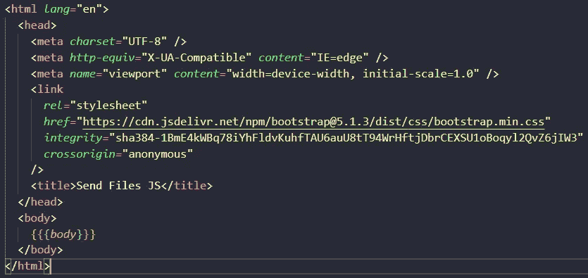

Example default layout in this case main

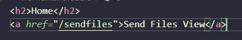

Example Home view

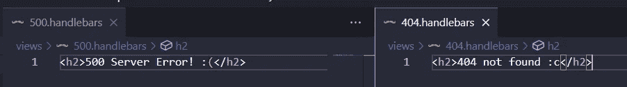

Example 500 and 404 views

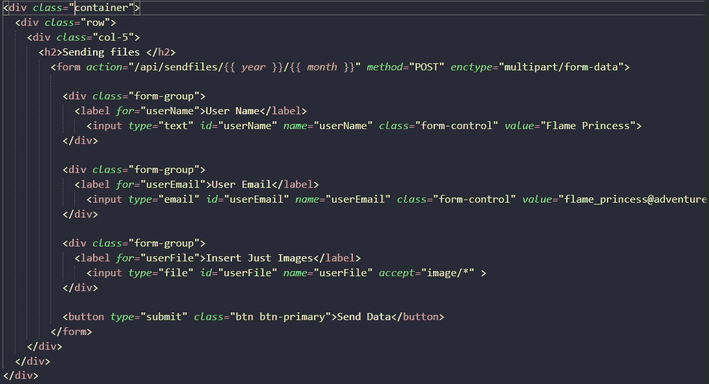

Example sendFiles view

```
<div *class=*"container"><div *class=*"row"><div *class=*"col-5"><h2>Sending files </h2><form *action=*"/api/sendfiles/{{ *year* }}/{{ *month* }}" *method=*"POST" *enctype=*"multipart/form-data"><div *class=*"form-group"><label *for=*"userName">User Name</label><input *type=*"text" *id*="userName" *name=*"userName" *class=*"form-control" *value=*"Flame Princess"></div><div *class=*"form-group"><label *for=*"userEmail">User Email</label><input *type=*"email" *id*="userEmail" *name=*"userEmail" *class=*"form-control" *value=*"flame_princess@adventuretime.org"></div><div *class=*"form-group"><label *for=*"userFile">Insert Just Images</label><input *type=*"file" *id*="userFile" *name=*"userFile" *accept=*"image/*" ></div><button *type=*"submit" *class=*"btn btn-primary">Send Data</button></form></div></div></div>
```

如果您在主布局中看到了上面的示例，我添加了 Bootstrap CDN 来为表单视图添加一些样式，在 sendFiles 视图中，我添加了通用表单行为的所有输入和标签，请注意，我向 URL 添加了{{year}}和{{month}}，因为我们将添加一些动态变量，我还添加了方法，在这种情况下 enctype 是“multipart/form-data”来发送文件

# 我们的服务器

这是我努力做到简洁和整洁的最重要的部分，首先我有 express 框架，然后是 app 和 express handlebars 库，导入 home、sendFiles、API 和 thankyou 这些是接收两个参数请求和响应的函数，但我在我们的 lib 目录中划分了一个名为 handles.js 的 JS 文件以保持整洁，然后我将引擎和设置添加到视图引擎模板中， 第二，我添加了视图，第三，post 视图在这种情况下，我添加了库 multiparty 一个管理多部分/表单数据(文件)的好库，您还需要安装它:

```
$ npm i multiparty
```

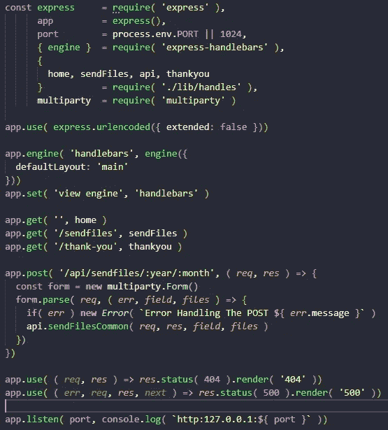

Example Complete Server code

多方的有趣之处在于，它解析来自请求的所有信息，并将其分为字段和文件两部分传递(这是管理数据的完美方式)，但我们需要实例化一个新的表单，并使用解析方法添加 req、error、fields 和 files，最后，我添加了 error 的类，如果发生了什么，并将 req、res、fields 和 files 传递给 sendFilesCommon 函数

第四，我用 404，500 和 listen 方法启动了我们的服务器。

Handles.js 文件部分，在这部分只是对 home，sendfiles 的请求和响应，谢谢。API 有两个函数来管理来自请求的文件和字段，但是如果您仔细观察，您会发现该函数需要我们之前在 post 方法中共享的 req、res、字段和文件


Example handles Js file

```
*exports*.home = ( *req*, *res* ) => *res*.render( 'home' )
*exports*.sendFiles = ( *req*, *res* ) => *res*.render( 'sendfiles', {
year: '2022',
month: 'july'} )
*exports*.thankyou = ( *req*, *res* ) => *res*.render( 'thank-you' )
*exports*.api = {
sendFilesCommon: ( *req*, *res*, *fields*, *files* ) => {
console.log( 'Fields: ', *fields* )
console.log( 'Files ', *files* )
*res*.redirect( 303, '/thank-you')
},
sendFilesFetch: ( *req*, *res*, *fields*, *files* ) => {
console.log( 'fiels: ', *fields* )
console.log( 'files', *files* )
*res*.json({
success: true
})}}
```

运行服务器

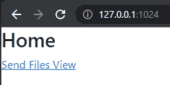

Example Home page

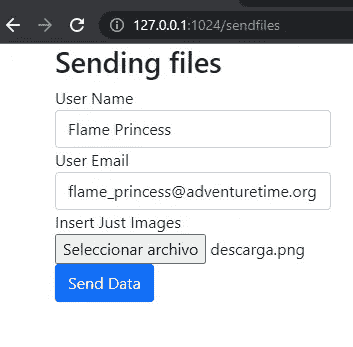

Example sending data with default form’s behave

如果我们单击“发送数据”按钮，我们可以看到它会将我们发送到感谢页面

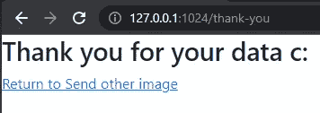

Example thank-you page

如果我们检查控制台输出，我们可以看到来自用户的所有数据

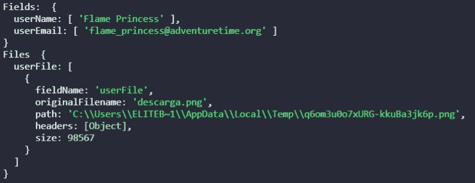

Example output server

# 获取零件

我们需要改变一点我们的服务器和视图，添加脚本部分，我们只需要指定方法和主体在这种情况下，浏览器为我们做所有的工作，检查我没有指定标题(多部分/表单数据),我还使用了新的 FormData()对象，这一切都完成了！

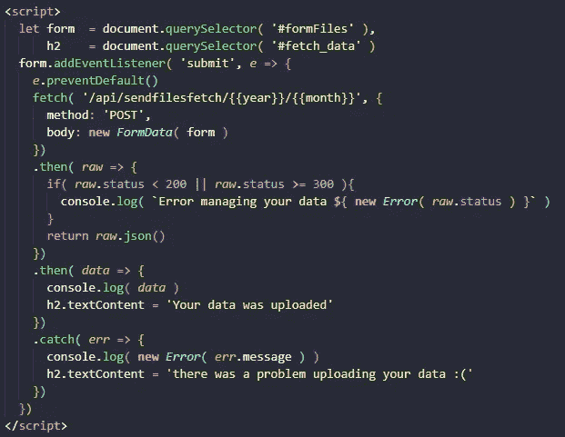

Example adding script to the sendfiles view

此外，一个 fetch API 和添加 h2 来告诉客户端该过程是否成功或者我们是否有错误:(

```
<div *class*="container">
<div *class*="row">
<div *class*="col-5">
<h2>Sending files </h2>
<form *id*="formFiles">
<div *class*="form-group">
<label *for*="userName">User Name</label>
<input *type*="text" *id*="userName" *name*="userName" *class*="form-control" *value*="Flame Princess">
</div>
<div *class*="form-group">
<label *for*="userEmail">User Email</label>
<input *type*="email" *id*="userEmail" *name*="userEmail" *class*="form-control" *value*="flame_princess@adventuretime.org">
</div>
<div *class*="form-group">
<label *for*="userFile">Insert Just Images</label>
<input *type*="file" *id*="userFile" *name*="userFile" *accept*="image/*" >
</div>
<button *type*="submit" *class*="btn btn-primary">Send Data</button></form>
<h2 *id*="fetch_data"></h2></div></div></div><script>
let form  = document.querySelector( '#formFiles' ),
h2    = document.querySelector( '#fetch_data' )
form.addEventListener( 'submit', *e* => {
*e*.preventDefault()
fetch( '/api/sendfilesfetch/{{year}}/{{month}}', {
method: 'POST',
body: **new** *FormData*( form )
})
.then( *raw* => {
if( *raw*.status < 200 || *raw*.status >= 300 ){
console.log( `Error managing your data ${ **new** *Error*( *raw*.status ) }`
)}
return *raw*.json()
})
.then( *data* => {
console.log( *data* )
h2.textContent = 'Your data was uploaded'
})
.catch( *err* => {
console.log( **new** *Error*( *err*.message ) )
h2.textContent = 'there was a problem uploading your data :('
})
})
</script>
```

再次运行服务器

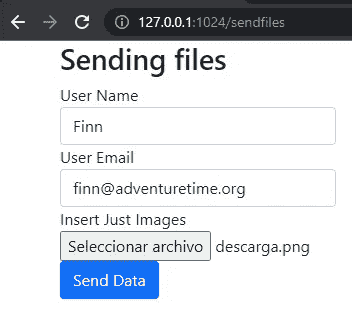

Example send files with fetch

发送文件！

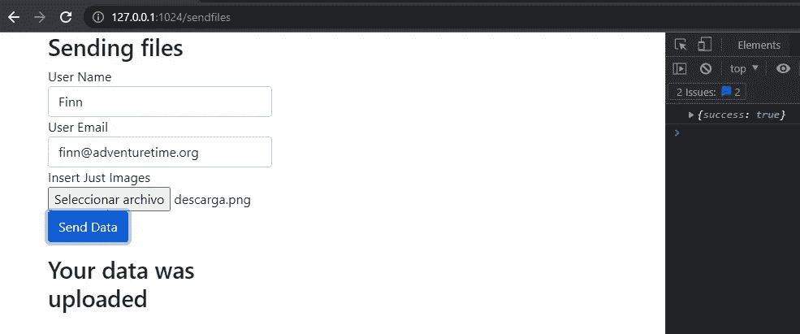

Example successful delivery of the files

酷！我们发送文件，我们收到一个成功真的一切都很酷，但我们需要再次检查控制台

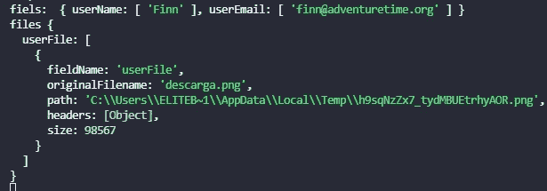

Example output files sent by fetch

酷！！！我们做到了

我们服务器的完整代码

```
const express     = require( 'express' ),
app         = express(),port        = process.env.PORT || 1024,{ engine }  = require( 'express-handlebars' ),
{home, sendFiles, api, thankyou}           = require( './lib/handles' ),
multiparty  = require( 'multiparty' )
app.use( express.urlencoded({ extended: false }))
app.engine( 'handlebars', engine({defaultLayout: 'main'}))
app.set( 'view engine', 'handlebars' )
app.get( '', home )app.get( '/sendfiles', sendFiles )
app.get( '/thank-you', thankyou )
app.post( '/api/sendfiles/:year/:month', ( *req*, *res* ) => {const form = **new** multiparty.Form()form.parse( *req*, ( *err*, *field*, *files* ) => {if( *err* ) **new** *Error*( `Error Handling The POST ${ *err*.message }` )api.sendFilesCommon( *req*, *res*, *field*, *files* )})})
app.post( '/api/sendfilesfetch/:year/:month', ( *req*, *res* ) => {const form = **new** multiparty.Form()form.parse( *req*, ( *err*, *field*, *files* ) => {if( *err* ) **new** *Error*( `Error Handling The POST ${ *err*.message }` )api.sendFilesFetch( *req*, *res*, *field*, *files* )})})
app.use( ( *req*, *res* ) => *res*.status( 404 ).render( '404' ))
app.use( ( *err*, *req*, *res*, *next* ) => *res*.status( 500 ).render( '500' ))
app.listen( port, console.log( `http:127.0.0.1:${ port }` ))
```

# 结论

总之，如今发送数据非常普遍，发送文件也非常方便。我们都在交换数据，例如上传到我们的驱动器或在社交媒体上发送图像。我们总是在上传文件，这就是为什么这个小例子可以帮助你完成下一个 Express.js 和 Handlebars 项目。

# 来源

[](https://www.amazon.com/Web-Development-Node-Express-Leveraging-dp-1492053511/dp/1492053511/ref=dp_ob_title_bk) [## 使用 Node 和 Express 进行 Web 开发:利用 JavaScript 堆栈

### 使用 Node 和 Express 进行 Web 开发:利用 Amazon.com 的 JavaScript 堆栈。*免费*送货到…

www.amazon.com](https://www.amazon.com/Web-Development-Node-Express-Leveraging-dp-1492053511/dp/1492053511/ref=dp_ob_title_bk) [](https://www.bootstrapcdn.com/) [## Bootstrap 和 Font Awesome 的官方 CDN

### 推荐的 Bootstrap，Font Awesome，Bootswatch 和 Bootstrap 图标的免费 CDN。

www.bootstrapcdn.com](https://www.bootstrapcdn.com/)