# 将 Webflow 表单提交发送到 Discord 服务器

> 原文：<https://medium.com/geekculture/sending-webflow-form-submissions-through-to-a-discord-server-33c1464bc7d9?source=collection_archive---------20----------------------->

你有没有想过，你是否可以将所有通过你的 Webflow 站点提交的表单发送到一个 Discord 服务器上，让每个人都可以看到？我也不知道。

但后来我想，如果你是某个机构的一员。想象一下一些年轻的、面向未来的开发人员，他们一直将不和谐作为他们主要的交流方式。

为什么你不能和每个人分享每个新的表单查询呢？

这样做，你就可以避免转发邮件和用不必要的交流打扰对方。我是芬兰人。我不喜欢不必要的交流。

这正是我们今天要做的。免费的。

使用 Webflow 的本地 webhooks、Node & Express 服务器、Heroku 上的免费 dyno 以及模块“Discord.js”，我们将自动化整个过程。

这听起来可能很复杂，但是相信我，如果你有一些基本的 Javascript 知识和学习的意愿，这并不难。

你可能会问:“但是扎皮尔呢?”。

你可以用扎皮尔。

但那一点都不好玩。而且也有点贵。尤其是如果您一个月要为各种应用程序执行大量任务。

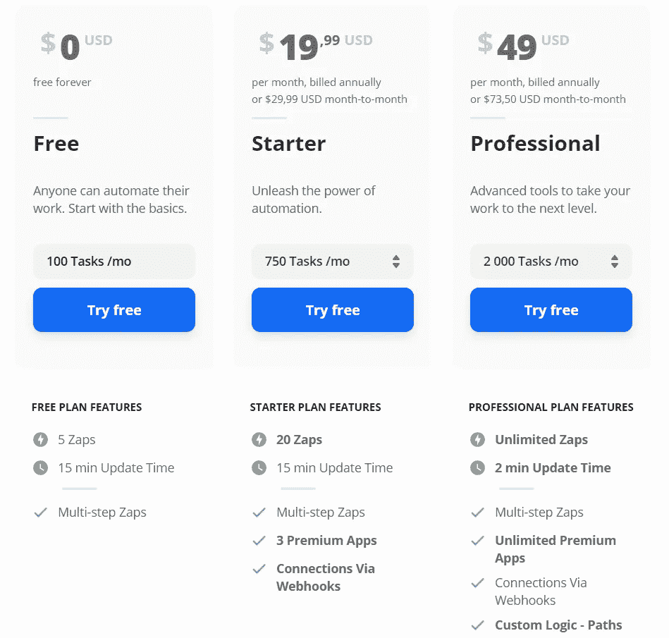

# 先决条件

为了遵循本指南，您需要以下物品:

*   一个 [Webflow 账户](https://webflow.com/?rfsn=2938651.0684dd&utm_medium=affiliate)(这是一个附属链接)
*   一个免费的 [Heroku 账号](https://heroku.com)
*   一个[不和服务器](https://support.discord.com/hc/en-us/categories/200404378-Server-Setup)
*   一些基本的 [Javascript 知识](https://www.codecademy.com/)
*   某种代码编辑器&一个终端。我很喜欢两者兼而有之的 [VSCode](https://code.visualstudio.com/) 。

你还需要在你的电脑上安装 [node.js](https://nodejs.org/en/) 。只需下载安装程序，运行向导，你就可以开始了。

## Webflow

让我们从创建一个新的 Webflow 项目开始。如果你正在阅读本指南，你可能已经知道如何使用 Webflow。

这个 Webflow 项目应该在站点的某个地方有一个表单。我已经创建了一个简单的联系人表单，其中包含*姓名*、*电子邮件* & *消息*字段。

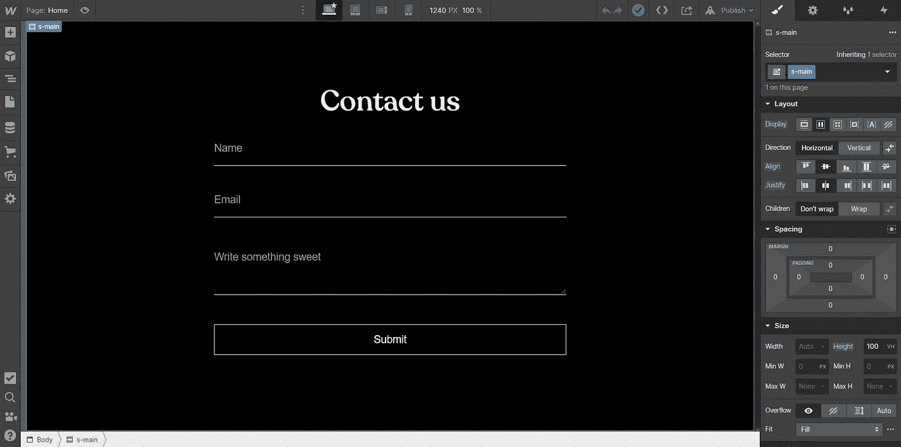

My really simple form

你可以使用你想要的任何类型的字段(除了文件上传，我还没有测试过它是如何工作的),但是确保你记住你为每个字段输入的名字。

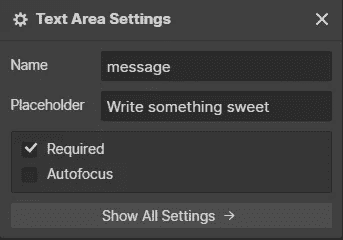

Name entry for my message input field

好了，现在我们有表格了。我们稍后会回来设置我们的 webhooks，但是现在，让我们为我们的服务器编程。

# 服务器

好吧，让我们想想我们要做什么。

我们有一个表单，以及一个 webhook，可以在每个表单子消息的某个地方发送数据。

在这种情况下，我们希望建立自己的服务器，它应该能够接受来自 Webflow 的请求，处理表单数据并将其发送到我们的 Discord 服务器。

你可以把我们的服务器想象成某种形式的妖精，每当 Webflow 想说话的时候就醒来，尖叫着他们说的任何不和谐的话，然后回去睡觉。小妖精会一周 7 天，一天 24 小时这样做。免费的。

好妖精。

## 我们走吧

无论如何，在你的电脑上创建一个新的文件夹。这个文件夹将是你的小洞穴，包含你的服务器运行所需的一切。

在您喜欢的代码编辑器中打开这个文件夹，并打开一个新的终端。在终端中，您希望运行 **npm init -y** 。

这将初始化一个新的 npm 包，并创建一个 package.json 文件，其中包含运行服务器所需的所有依赖项。

“-y”标志将允许您运行整个向导，而无需输入任何信息。我们现在不关心这个。

在 package.json 文件中，您希望添加一个命令，让 Heroku 知道应该如何启动您的服务器。只需在“脚本”下添加一个**“开始”:“node index . js”**。它应该是这样的:

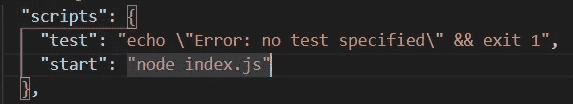

在你的文件夹中，创建一个名为 **index.js** 的文件。这将是你的唯一一个包含精灵(服务器)的文件。

## 安装模块

如上所述，我们需要安装几个模块:

Express.js —主节点服务器框架，大大简化了设置服务器的过程。

**Discord . js**—Discord API 包装器，简化了与 Discord 机器人的通信。

**Dotenv** —一个让你在. env 文件中存储环境变量的包。

您可以通过在您的终端中运行命令**NPM install express discord . js dotenv**来安装它们。

好了，现在我们可以在代码中访问这些库了。通过编写以下代码将它们全部导入。

```
const express = require('express');const Discord = require('discord.js');require('dotenv').config()
```

现在，让我们从设置我们的 express 服务器开始。我们需要一个简单的 POST 路由，Webflow 可以将它的数据发送到这个路由。

我只是要粘贴一些代码，但是你可以通过点击[这里](https://expressjs.com/en/guide/routing.html)阅读更多关于 express 和它的路线是如何工作的。

```
const app = express();const PORT = process.env.PORT || 3000;app.use(express.json());app.post('/form', (req, res) => {});app.listen(PORT, () => { console.log("We're up and running!") });
```

这是做什么的？

第一个常量: **app** 只是将 Express 模块的一个对象存储在其中，使我们能够在剩下的代码中使用它。

**PORT** 正在设置服务器运行的端口。如你所见，我们使用了 **process.env.PORT** ，Heroku 在服务器上运行时需要它来设置自己的端口。在本地运行服务器时， **|| 3000** 是默认端口(如果您想在部署之前尝试在您的机器上本地运行它)。

下面我们将设置 **express.json()** 为中间件。这将确保我们可以处理 JSON 数据，这正是 Webflow 通过其 webhook 发送的数据格式类型。

然后我们设置一个路由: **'/form'** ，指定它将通过 **app.post()接收 POST 请求。**

这个方法将让我们使用参数 **req** 和 **res** ，它们是*请求*和*响应*的常见简短关键字。正是在这个方法中，我们将接收、处理并向 Discord 发送数据。

最后，我们有一个 app.listen()方法。该方法接受端口作为参数，监听任何请求，并简单地在控制台记录一条短消息，让我们知道服务器已经启动并正在运行。

我们一会儿会回到这个话题，但是让我们先来设置一下所有与不和谐有关的东西。

## 不调和

将以下代码放在 app.post()路径上方的某个位置。

```
const Discord = require('discord.js');const d_token = process.env.TOKEN;const d_channel = process.env.CHANNEL;const client = new Discord.Client();client.login(d_token);
```

首先，我们将导入 **discord.js** 包，并将其存储在一个 discord 常量中。然后，我们将把我们的**令牌** & **通道 id** (前面提到过)存储在几个常量中，从我们的。env 文件通过 **process.env. <关键字>。**

我们会制造新的不和。常量**客户端**中的 Client() 对象，我们将使用它来运行它的登录方法，将我们的令牌作为参数发送进来。

```
client.on("ready", () => {client.user.setPresence({ activity: { name: "🥳" }, status: "online" }).catch((e) => console.log(e));});
```

在下面，我们会让我们的机器人运行起来。客户端有一个 **on()** 方法，让我们通过它的。setPresence()方法。

作为最后一点小奖励，我们将通过 catch 语句处理任何可能发生的错误，将它们记录下来，以便稍后在 Heroku 日志中看到它们。

好了，现在我们的机器人可以开始运行了。所以让我们继续使用它向我们的 **/form** 路由发送关于任何请求的消息。

## 前一条路线

从这里开始编写的所有代码都在我们的 app.post('/form ')路径中。

```
let form_name = req.body.data.name;let form_email = req.body.data.email;let form_message = req.body.data.message;
```

在这些变量中，我们将存储 Webflow 通过请求发送的数据。根据表单中的字段，这些可能会有所不同。

你可能还记得，我只有三个名为*姓名*、*电子邮件*和*消息*的字段。这些都存储在通过 webhook 发送的数据对象中。

为了访问这个对象，我们使用我们的 **req** (request)参数，进入它的主体，将我们自己推到 Webflow 发送给我们的数据对象。最后，我们取出通过表单发送的每个参数。

如果你的形式和我的不同会怎么样？嗯，很简单。

假设您的表单也有一个名为 budget 的 budget 字段。那么你只需要把它存储在另一个变量中，比如:

```
let form_budget = req.body.data.budget;
```

等等等等第四个。

```
const form_data = new Discord.MessageEmbed().setColor('#0099ff').setTitle('New form submission').setURL(process.env.SITE).setAuthor(form_name).setDescription(form_message).setThumbnail('https://cdn.theorg.com/49515591-1fdb-45b7-8816-b490414a41ad_thumb.png').addField('Email', form_email, true).setTimestamp().setFooter('Sent through successfully!');
```

现在这可能看起来有点复杂，但这只是 *Discord.js* 对发送到 Discord 服务器的消息进行格式化的方式。

如你所见，我将数据存储在一个名为 **form_data** 的常量中，并通过 Discord.js 为我们创建的一些集成方法放置请求数据变量(form_name、form_email、form_message)。[点击此处，了解更多关于不和谐信息的格式。](https://discordjs.guide/popular-topics/embeds.html#embed-preview)

我甚至为消息设置了蓝色，并将 Webflow 徽标作为缩略图。

好了，现在我们准备好将消息发送到我们的 Discord 服务器。最后。

```
client.channels.cache.get(d_channel).send(form_data).catch((e) => console.log(e));
```

Discord.js 在其文档中指定了一系列方法，让您可以向特定的服务器发送消息。

在本例中，它是 **client.channels.cache.get(服务器 id)。**发送(数据)。

您可以看到我正在从我的。env 文件，并发送我之前提到的 **form_data** 变量作为要发送的数据。

然后，我捕捉可能发生的任何错误，将它们记录在 Heroku 日志中(或者，如果您在本地运行服务器，则记录在本地终端日志中)。

现在我们差不多完成了。

在做这个项目的时候，我注意到 Heroku 真的不喜欢我只是接受请求而不回应任何事情。它使请求超时，并在尝试重新建立连接时开始发送消息循环。

然而，我们有一个非常简单的方法来解决这个问题。只需将以下代码放在 app.post() route 的底部。

```
res.set("Connection", "close");res.status(200).json({ data: 'Form submitted successfully' });
```

太美了。

这将关闭连接，并返回一条没有人会看到的消息。但如果成功了，就成功了！

现在我们结束了。以下是我们的 goblin 服务器的完整 index.js 代码:

[https://gist . github . com/robingranqvist/5cf 61 BF 51 f 1809 b 488963 DC 8 ad 5954 c 3](https://gist.github.com/robingranqvist/5cf61bf51f1809b488963dc8ad5954c3)

## 将我们的服务器部署到 Heroku

我们正处于流程的最后一步:部署。

这相当简单，可以通过几种方式实现:

*   通过 Heroku CLI
*   通过 Github 回购

我选择第二种方法，因为我想把我的代码保存在 Github 上，让任何想进一步开发这个项目的人都可以使用它。

在将回购文件推送到 Github 之前，一个极其重要的部分是添加一个. gitignore 文件，其中包含您的。env 文件以及 node_modules。你不想在 Github 上公开你的令牌。它只是一个简单的文件，名为。gitignore ”,在单独的一行上有每个被忽略的文件或文件夹。大概是这样:

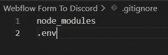

创建文件并将其推送到 Github repo 非常简单。我就不细说了。相反，你可以通过[点击这里](https://docs.github.com/en/github/importing-your-projects-to-github/adding-an-existing-project-to-github-using-the-command-line)来阅读。

当您的回购被推送并准备好时，登录 Heroku 并创建一个新的应用程序。

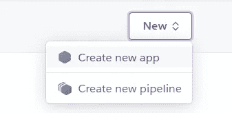

你想取什么名字就取什么名字，选择它的位置。我要去欧洲，因为我在那里。

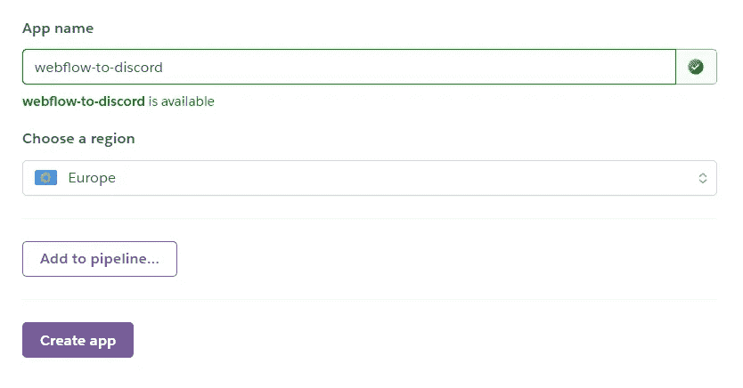

现在您可以选择您的部署方法了。

如前所述，我将直接通过 Github 进行部署。

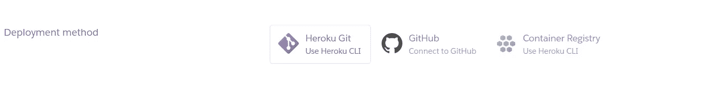

在 Heroku 上授权您的 Github 帐户后，您将能够选择您想要使用的回购。只需按“搜索”，找到你的回购，点击**连接**。

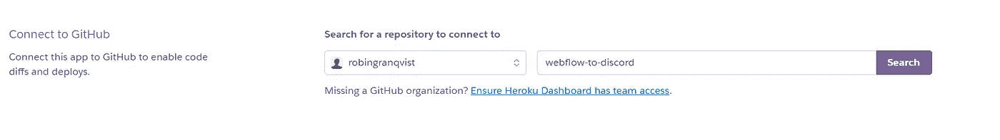

现在我们连在一起了。我们想确保 Heroku 监听新的推送并自动部署新代码，所以我们启用了自动部署。

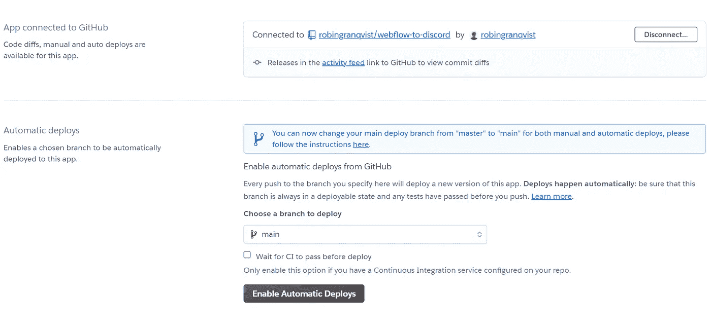

只需选择您的分支(可能是主分支)，然后按下**启用自动部署**。完成后，您应该会看到类似于以下内容的日志:

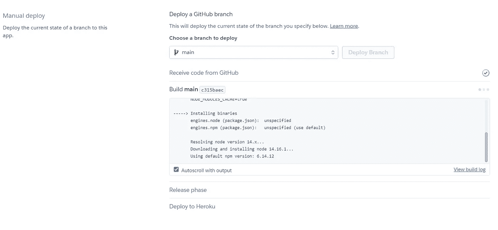

如果一切正常，您应该在几秒钟后看到成功部署的消息。这意味着我们的服务器已经部署完毕，正在运行。

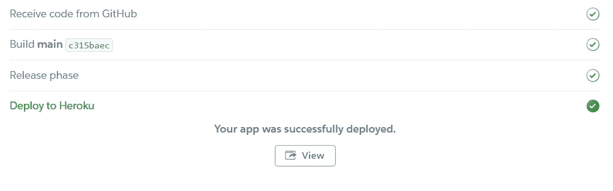

部署后，导航到 Heroku 项目设置并向下滚动到**配置变量**。

在这里，您希望从您的。环境文件。完成后，它应该看起来像这样:


如果一切都设置正确，你现在应该在你的不和谐服务器上看到你的机器人在线。不要担心它过一会儿就下线了。我们只需要它在每个发送的 webhook 上唤醒。

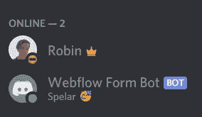

现在我们准备在 Webflow 中设置我们的 webhook。

## Webflow webhooks

webhook 就是每当一件事情被另一件事情触发时发生的一件事情。

这是一个相当奇怪的解释，所以让我们用官方的解释:“由某个事件触发的用户定义的 HTTP 回调”。

在我们的例子中，每次 Webflow 注意到一个表单被发送，它就会触发一个包含表单数据的 webhook，将表单数据发送到我们的服务器。

转到您的 Webflow 项目设置，然后按“集成”。滚动到底部，你会看到网页挂钩设置。

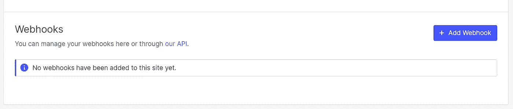

按下**添加 webhook** ，你就可以选择你的触发类型了。我们将选择表单提交。

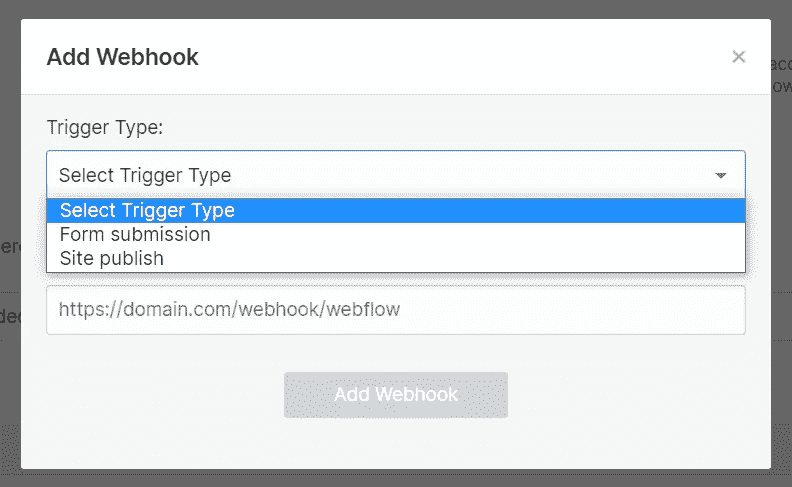

在 url 输入中，只需复制并粘贴 Heroku 在部署您的 app 后给您的 URL。

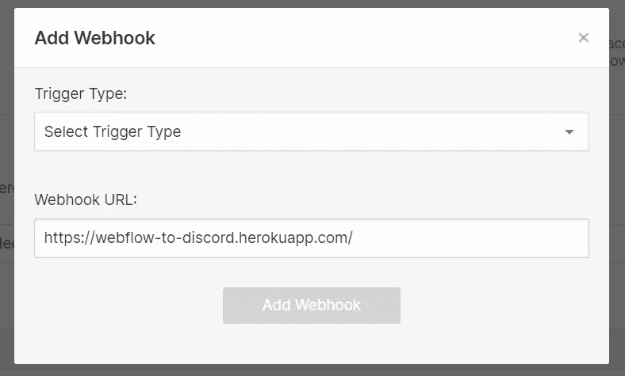

现在，我们要确保指定我们的路线。在我的例子中，它被命名为'/form '。我就补充一下。

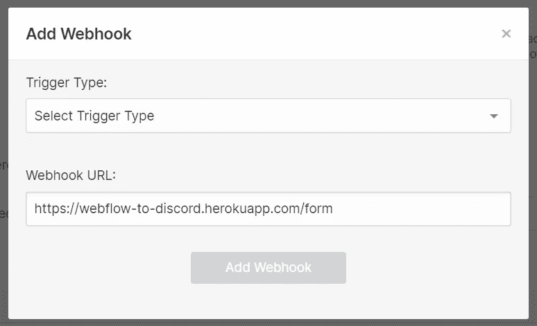

好了，现在只需添加网页挂钩，保存您的设置并发布您的网站。让我们来测试一下。

到您的站点，通过您的表单发送一条消息，您会在您的服务器上看到类似这样的内容。干得好！

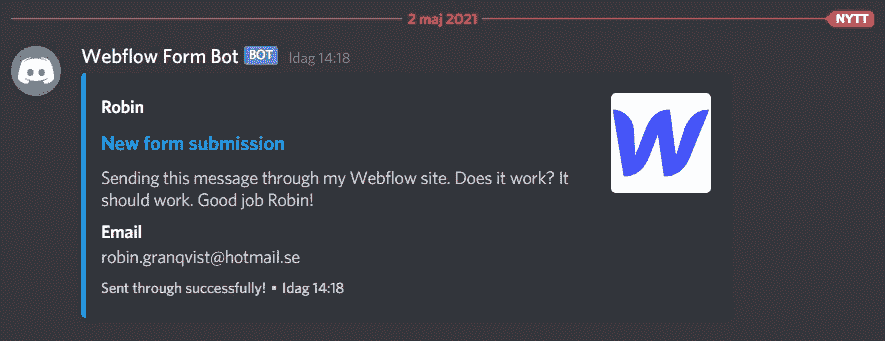

您现在已经成功设置了一个服务器小精灵，它可以唤醒 Webflow 和 Discord 并在它们之间进行通信。

仅此而已。

但是为什么要在这里停下来呢？你可以做很多事情。

为什么不在每次你或你的团队发布你的站点时发布一条消息呢？它可能看起来像这样:

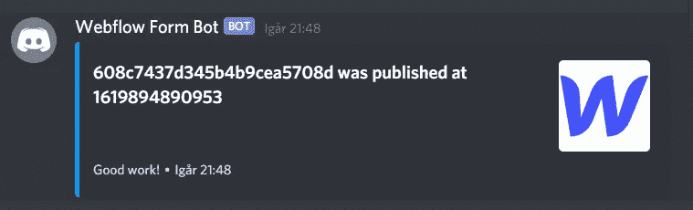

或者，您可以通过更改站点的名称并将 unix 时间码格式化为可读格式，使其更加格式化。

如果你喜欢的话，你也可以在网上商店出售产品时发送一条通知消息。

Webflow 还允许您使用几个 webhooks。在他们的 [API 文档中阅读更多关于他们的内容。](https://developers.webflow.com/#webhooks)

好的，玩得开心:)/Robin