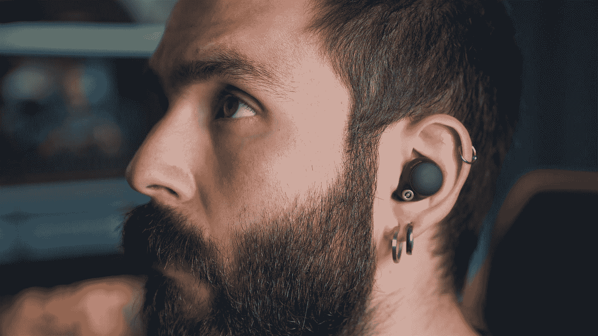

# 感觉科技和现实生活中的超能力

> 原文：<https://medium.com/geekculture/sensetech-and-real-life-superpowers-77e98f7485d5?source=collection_archive---------15----------------------->

## 感官替代可能是成为超人的关键

Photo by [Onur Binay](https://unsplash.com/@onurbinay?utm_source=medium&utm_medium=referral) on [Unsplash](https://unsplash.com?utm_source=medium&utm_medium=referral)

我被带到一个有 12 个人的房间里，你的任务是诊断哪些人患有帕金森病，哪些人没有。没有诡计。其中一半已经被官方确诊，另一半没有任何诊断。你只是一个普通人，这是一个实验…