# 使用递归神经网络的句子校正

> 原文：<https://medium.com/geekculture/sentence-correction-using-recurrent-neural-network-6321527ee08b?source=collection_archive---------8----------------------->

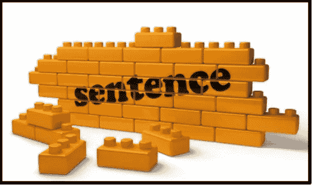

# **简介:**

社交媒体是一个平台，人们可以通过在虚拟网络中创建、交换或分享他们的想法来相互交流。大多数人都在使用社交媒体用文字来表达他们的感受。大多数 ML/DL 模型使用这些文本来确定情绪或预测任何犯罪活动和许多与 NLP 相关的任务。ML 和 DL 模型是用传统语言训练的，对于任何 NLP 相关的任务，大多数是英语。现在，人们在他们的文本中使用简短的形式/缩写，比如(ppl 表示人，2 表示 to，wen/whn 表示时间等等),这可能对基于 NLP 的任务没有太大帮助。

# **目录**

*   ***商业问题***
*   ***深度学习问题***
*   ***数据集概述***
*   ***损失***
*   ***EDA***
*   ***数据预处理***
*   ***深度学习模型***
*   ***车型评价***
*   ***模型预测***
*   ***错误分析***
*   ***最终管道***
*   ***模型推断***
*   ***参考文献***

# **业务问题:**

构建用于将损坏的文本数据改变为标准英语分布的模型，导致许多基于 NLP 的模型的性能提高。这里，输入数据将具有随机损坏，这是目标数据的超集，将它们转换成目标数据，同时保留文本的语义。

# **深度学习问题**:

将随机损坏的或 sms 文本转换成正确的英语语言，同时保留文本的语义。

# **数据集概述**:

根据我们的问题陈述，这是公开可用的数据集。

[https://www.comp.nus.edu.sg/~nlp/corpora.html](https://www.comp.nus.edu.sg/~nlp/corpora.html)

该数据集包含社交媒体文本及其规范化文本和规范化文本的中文翻译。对于我们的问题，我们只需要社交媒体文本和他们的规范化英语文本。社交媒体文本包含 2000 个数据集。

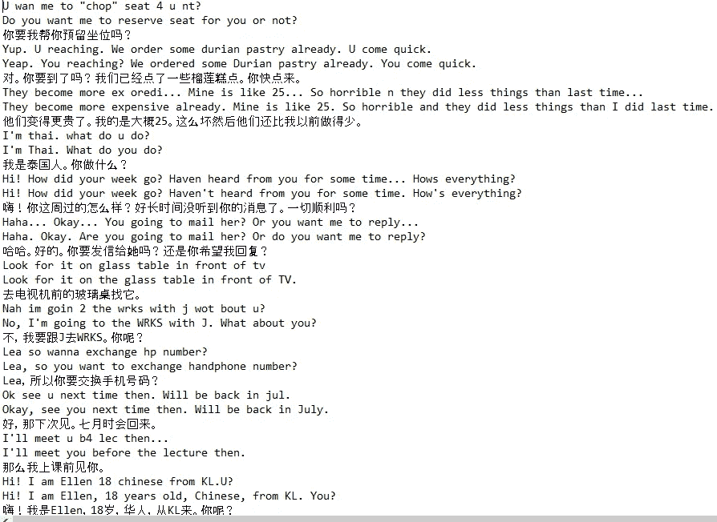

Dataset Overview

因为我们的数据是 txt 格式，一行是 SMS 文本，第二行是标准英语，第三行是标准英语的中文翻译。我们将只使用短信文本和标准英语进行问题陈述。拆分后，将 txt 格式转换为包含 2 列 SMS_TEXT 和 ENGLISH_TEXT 的 csv 文件。

# **损失:**

正如在研究论文中提到的，我们将使用范畴交叉熵。它也被称为 softmax 加交叉熵损失，训练模型输出所有类别的概率。它用于多类分类。

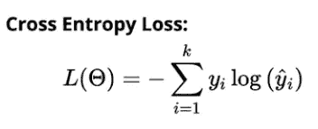

img source: [https://leakyrelu.com/2020/01/01/difference-between-categorical-and-sparse-categorical-cross-entropy-loss-function/](https://leakyrelu.com/2020/01/01/difference-between-categorical-and-sparse-categorical-cross-entropy-loss-function/)

# **埃达:**

在继续之前，我们应该检查是否有丢失的值。

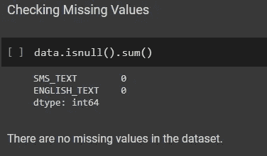

现在，我们将根据每一列执行不同的 EDA。

## 短信 _ 文本

*   **短信中的句子长度 _TEXT**

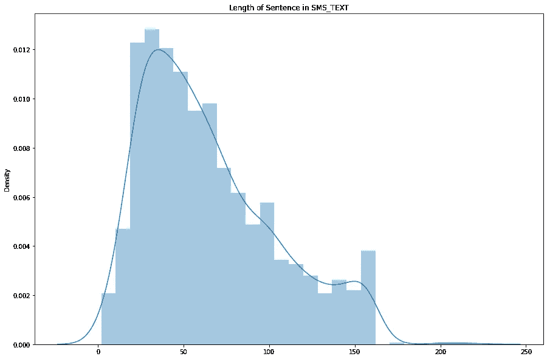

从上面的分布图我们可以看出，大部分句子的长度在 20-80 之间。很少有句子长度超过 150。

*   **字数**

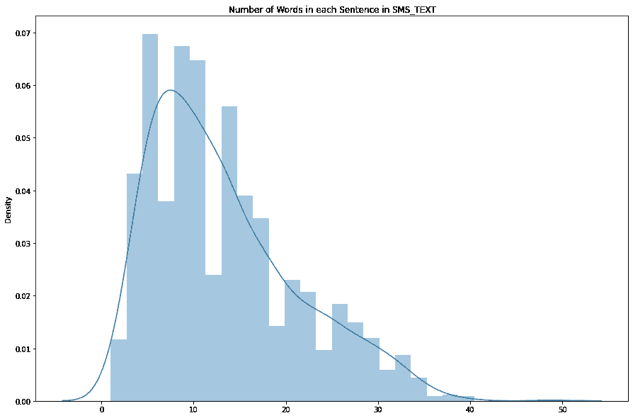

大多数句子有 5 到 20 个单词。很少有句子的字数超过 30 个。

*   **计算句子长度的百分位值:**句子长度的第 99.8 百分位值是 161，第 99.9 百分位值是 202。99.8 百分位和 99.9 百分位有着巨大的差异。所以我们应该考虑 SMS_text=161 的最大长度。没有长度在 161 到 202 之间的句子。
*   **计算单词数的百分位值:**句子中第 99.9 百分位有 39 个单词，第 100 百分位有 49 个单词。句子中的最大字数应为 39。
*   **SMS _ TEXT 中每个字符的出现次数:**

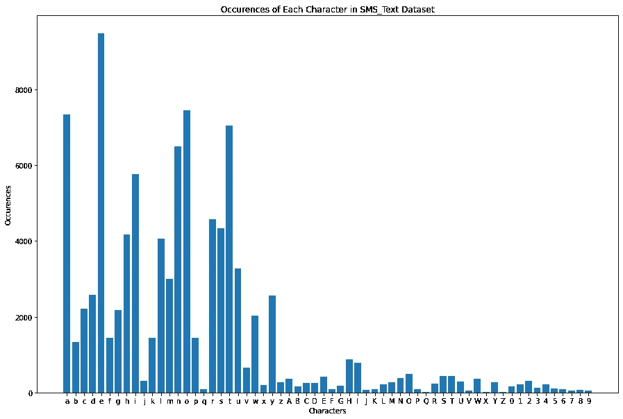

从上面可以看出，字母 e 出现的频率最高。后跟字符‘a’、‘t’和‘o’。

*   **位置标签的频率**

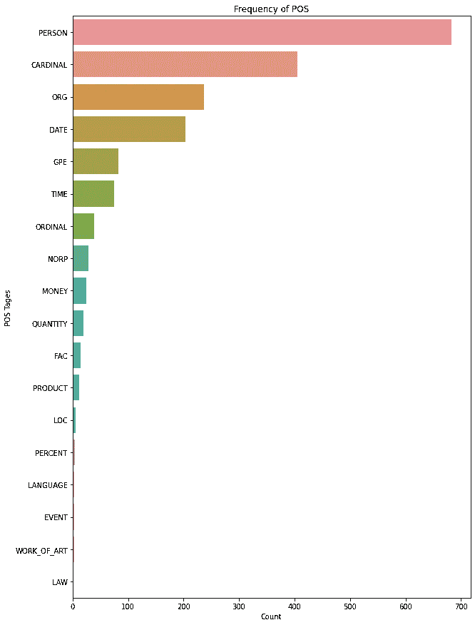

从上面的图中我们可以看出，带 Person 的 POS 标签出现的频率最高。它在 SMS_Text 列中的频率大约为 700。

*   **短信中最常出现的 25 个停用词 _TEXT**

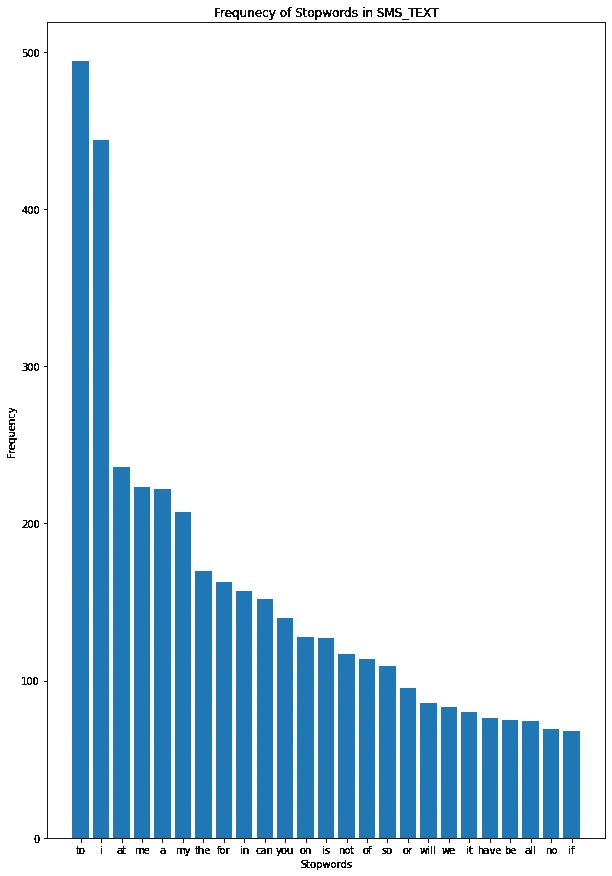

从上面的图中我们可以看到，像“to”和“I”这样的停用词在 SMS_Text 列中出现的频率最高。

## 2.英语文本

*   **句子长度**

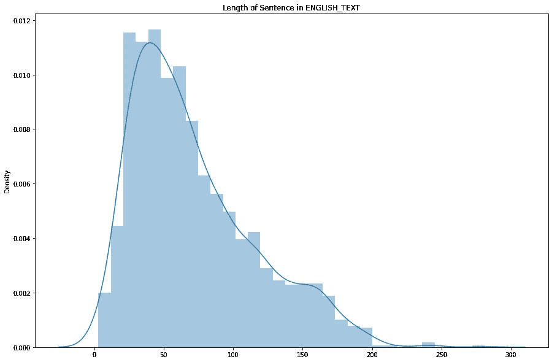

从上面的情节我们可以看出，很少有句子的长度超过 200。

*   **字数**

从上面的情节可以看出，字数在 40 以上的句子很少。

*   **计算百分位值句子长度**:第 99.7 百分位值为 200，第 99.8 百分位值为 215。很少有句子长度超过 200，所以英语句子的最大长度是 200。
*   **计算字数的百分位值**:句子中第 99.9 百分位有 48 个字，第 100 百分位有 59 个字。句子中的最大字数应为 48。
*   **每个字符在英文文本中的出现次数:**

像“e”、“o”、“a”和“t”这样的字符在英语文本列中出现频率最高。

*   **POS _ Tags 的频率**

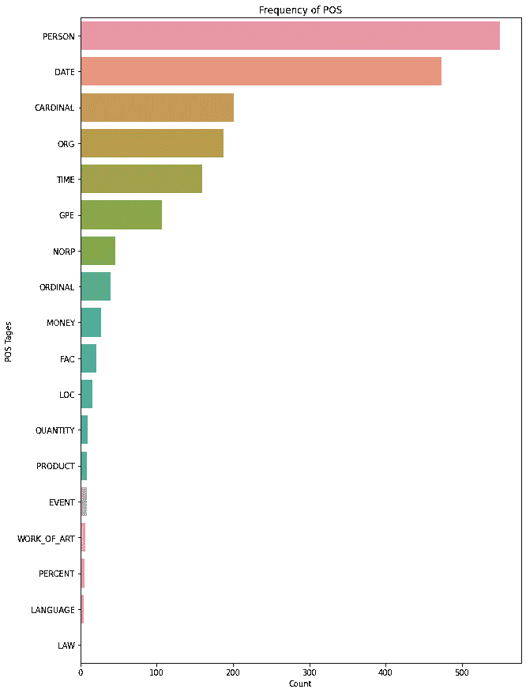

从上面的图表中我们可以看出，在 English_Text 中，带有 Person 的词性标记出现的频率最高。它的频率在 500 左右。

*   **英文文本中最常出现的 25 个停用词**

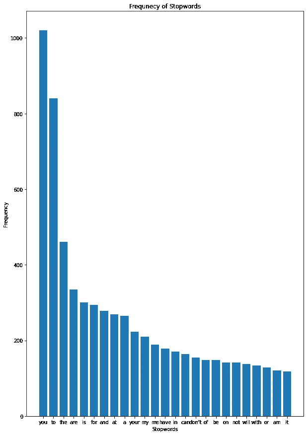

从上面的图表中我们可以看出,“you”这个停用词在英语课文中出现的次数最多。

# **数据预处理:**

数据预处理有两种方式:

*   **字符级**:基于 eda，我们只保留了 SMS_text 中长度小于 170 和 English_text 中长度小于 200 的句子。我们已经删除了英文文本列，并创建了 2 列:英文输入包含每句话前的开始标记' \t '，英文输出包含每句话后的结束标记' \n '。在第一个数据中，我们将在英语输入和输出中添加' \n '标记，以便我们的模型可以学习结束标记。基于上述预处理步骤，只有 7 个句子从数据集中被丢弃。
*   **单词级别**:基于 eda，我们只保留了那些 SMS_Text 长度小于 39，English_Text 长度小于 40 的句子。我们已经删除了 English_Text 列，并创建了两个与 charcter level 相同的列，唯一不同的是开始标记是<开始>和结束标记是<结束>。基于上述预处理步骤，只有 12 个句子从数据集中被丢弃。

在研究论文中，提到了也要寻找严格可打印的字符(这里他们要求我们检查所有的字符是否都是英文字符)。在我们的预处理步骤中，我们没有检查它，因为有一些字符可能代表一些英语单词

**例如:SMS _ TEXT:Yar or……但是如果晚些时候去或者我们必须自己去……那么……你现在还在睡觉还是在吃饭还是在睡觉…**

**ENGLISH_TEXT:是的。但是如果晚一点去，我们必须自己去。那怎么做？你还在睡觉吗？我正在吃饭，你还在睡觉。**

从上面的 eg**ü**表示单词 **You** ，如果我们去掉ü，句子的语义就变了。

# **资料准备:**

1.  **字符级**:将数据集分割成 99:1 的训练和测试。

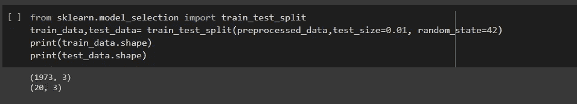

然后，我们创建字符级记号赋予器的对象，没有过滤器，小写=false。用训练数据集拟合我们的标记器，并将训练和测试数据集转换成序列，这为我们提供了模型输入和输出的词汇表。然后，我们用输入和输出句子中最长的预处理句子填充序列。然后，我们为输入和输出句子创建了字符级嵌入矩阵，它将被我们的模型嵌入层用作权重。从上面的处理步骤中，我们得到了 103 个字符的输入句子词汇和 92 个字符的输出句子词汇。

**2。单词级:**将数据集按照 99:1 的比例拆分成训练和测试。

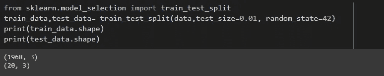

然后，我们用过滤器创建单词级标记器的对象，小写=false，oov_token=True。用训练数据集拟合我们的标记器，并将训练和测试数据集转换成序列，从而为我们提供模型的输入和输出词汇。然后，我们用输入和输出句子中最长的预处理句子填充序列。然后，我们使用 fasttext 为输入和输出句子创建单词级嵌入矩阵，该矩阵将被我们的模型嵌入层用作权重。通过以上预处理步骤，我们得到了 3702 个单词的输入句**词汇和 3040 个单词的输出句词汇。**

# **深度学习模型:**

这里我们将使用编码器解码器模型，其中编码器和解码器具有 GRU 或 LSTM 的单层

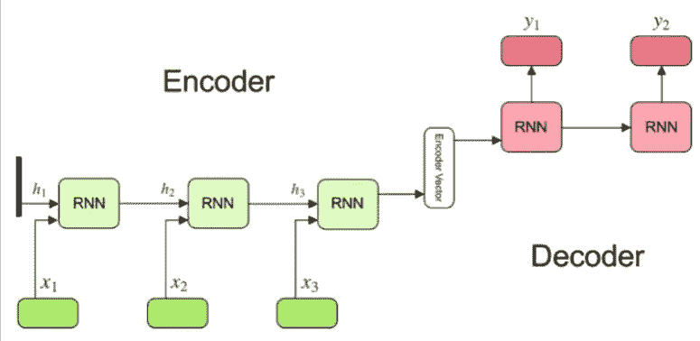

image source: [https://www.kdnuggets.com/2019/08/deep-learning-transformers-attention-mechanism.html](https://www.kdnuggets.com/2019/08/deep-learning-transformers-attention-mechanism.html)

## **1。带有一个热编码输入的序列到序列模型**:

在这种情况下，句子被转换成一个字符维数的热编码向量。它将检查每个单词的字符是否存在。如果存在，它将被标记为 1，其余的将被标记为 0。假设，如果一个单词中有 4 个字符，那么一个热编码表示将是[[1000][0100][0010][0001]]。

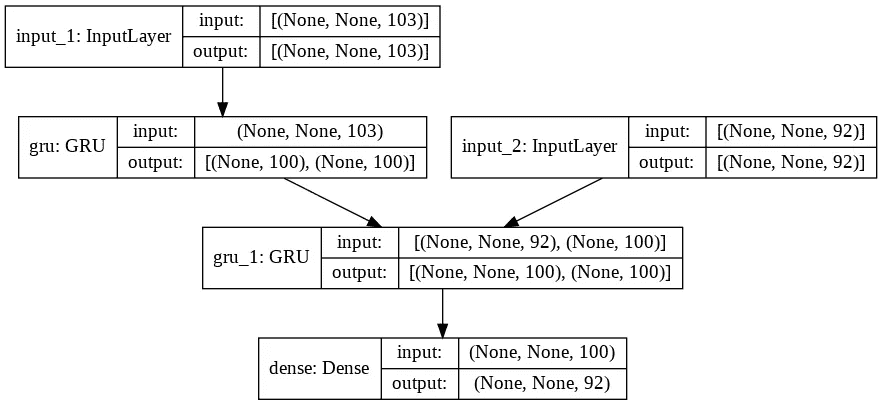

Encoder Decoder Architecture with GRU 100 units

这里我们使用 **100 个单位的 GRU** ，分类交叉熵作为损失，Adam 优化器的学习率为 **0.0001** ，我们得到的损失为 **0.5648** 。

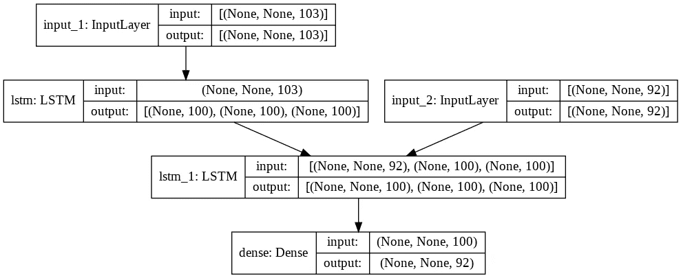

Encoder Decoder Architecture with LSTM 100 units.

这里我们使用 **100 单位的 LSTM** ，**分类交叉熵**作为损失， **Adam 优化器**的学习率**为 0.0001** ，我们得到损失**为 0.5587。**

## **2。带有字符级标记化的序列到序列模型**:

在这种情况下，句子被标记为字符级标记，并被传递给编码器和解码器模型。

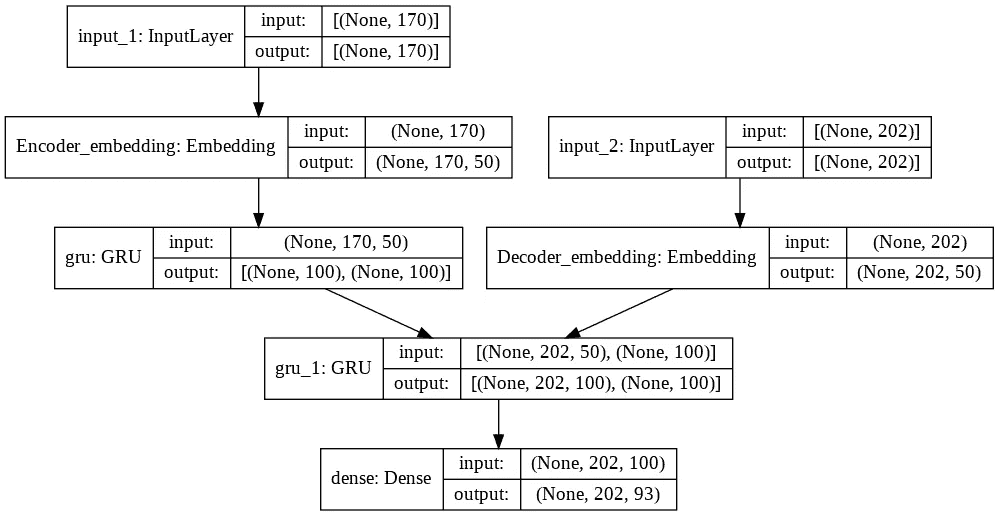

Encoder Decoder architecture with 100 units of Gru

这里我们使用 **100 单位的 GRU** 、**稀疏分类交叉熵**作为损失、**学习率为 0.01 和 0.001** 的**亚当优化器**，我们得到**损失分别为 0.8484 和 0.7583。**

Encoder Decoder model with 100 units of LSTM.

这里我们使用 **100 个单位的 LSTM** ，**稀疏分类交叉熵**作为损失， **Adam 优化器**的学习率为 **0.01** ，我们得到的损失为 **0.6794。**

## **3。具有字符级标记化和 Bahadanau 注意的序列到序列模型**:

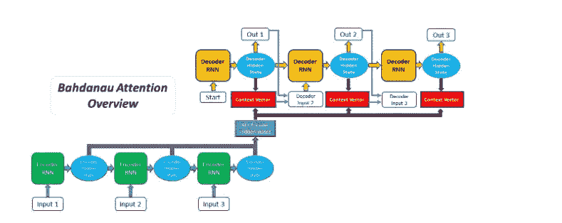

image source: [https://blog.floydhub.com/attention-mechanism/amp/](https://blog.floydhub.com/attention-mechanism/amp/)

从编码器获得输出后，我们将计算每个编码器输出相对于解码器输入和每个时间步长的隐藏状态的注意力得分。它告诉解码器将给予每个编码器输出多少关注或权重，以生成下一个解码器输出。这里我们用 **100 个单位的 LSTM，稀疏分类交叉熵**作为损失， **Adam 优化** r 用**学习率 0.01** ，我们得到**损失 0.3930。**

## **4。具有单词级标记化和 Bahadanau 注意力的序列到序列模型**:

在这种情况下，句子被标记为单词级别，并且这些标记化的句子被用于使用 **fasttext 模型**创建**嵌入矩阵**，该嵌入矩阵将在编码器和解码器嵌入层中用作权重。这里对于任何学习率，模型都是**过拟合的。**

# 模型评估:

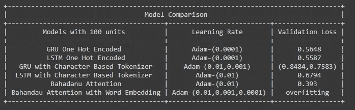

Model Comparison

从以上模型来看，**人物级模型加巴哈度关注** **损失最小**。因此，我们将考虑使用 **Bahadanau 注意力模型**来预测句子。

# 模型预测:

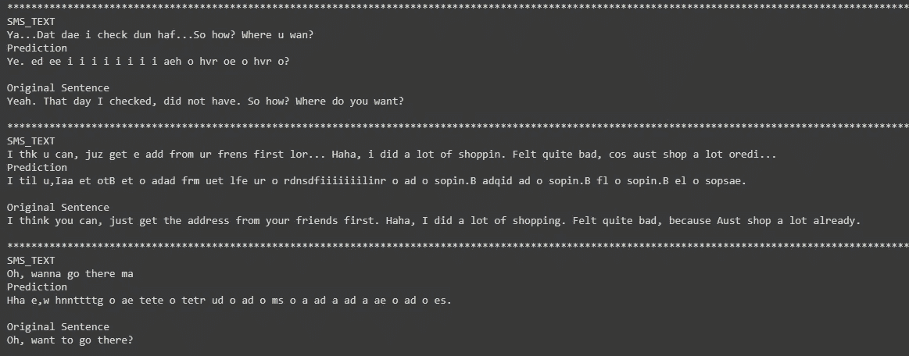

Bahadanu Attention Model Sentence Prediction.

从预测中，我们可以观察到我们的模型对于任何句子都表现得不够好。这可能是因为用于训练模型的数据集非常少。

# **错误分析:**

让我们检查模型的预测句子和原始句子的平均 bleu 分数。我们计算出验证数据集的平均 bleu 分数为 **0.6743** 。**最低 bleu 得分为 0.5220，最高 bleu 得分为 0.7496。**

让我们绘制验证数据的 bleu 分数。

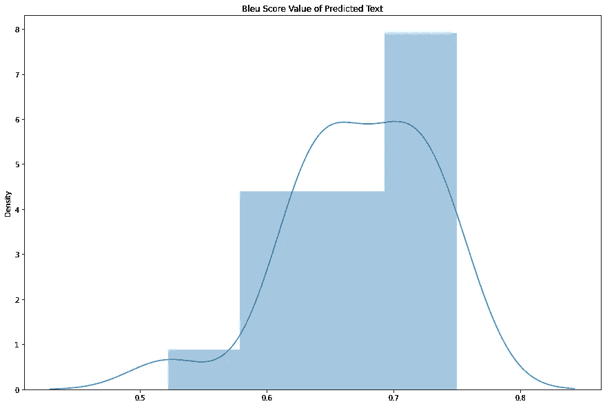

从上面的图中，我们可以观察到大多数 bleu 分数在 **0.65 到 0.75** 的范围内。可能有这样的情况，我们得到的 bleu 分数最低，因为与最高 bleu 分数相比，句子中出现了更多的罕见词。

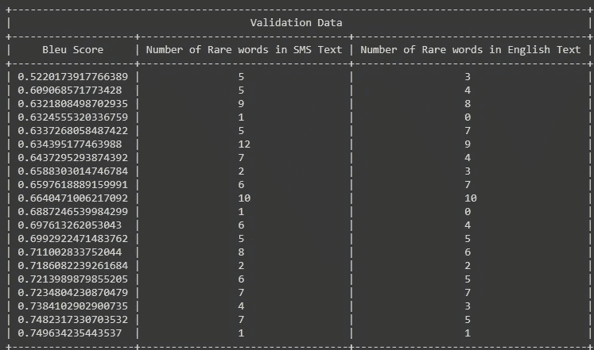

这里，**我统计了数据集中出现频率小于等于 10** 的验证数据集中的生僻字。基于文本中稀有词的数量，我们的 bleu 分数没有变化。有一些文本的 bleu 分数很高，并且与 SMS 和英语文本中具有最低 bleu 分数的文本中存在的稀有单词相比，具有许多稀有单词。

# **最终 Pipleine:**

在这个预测函数中，我们将能够发送列表中的多个句子。该模型将能够并行预测句子。

# 模型推断:

Model Inference Video

# **未来作品:**

*   除了 2000 个句子之外，没有其他可用的数据集，这对于深度学习模型来说更少。我们没有做任何数据扩充来增加数据，所以数据的增加可能会带来更好的模型性能。
*   在编码器和解码器模型中，我们只使用了 LSTM 和 GRU，使用双向 LSTM 可能会提高模型的性能。
*   我们也可以检查基于字符的迁移学习模型，这可能会给我们很好的预测

# **参考:**

*   研究论文:[https://cs224d.stanford.edu/reports/Lewis.pdf](https://cs224d.stanford.edu/reports/Lewis.pdf)
*   [https://keras . io/examples/创成式/lstm _ character _ level _ text _ generation/](https://keras.io/examples/generative/lstm_character_level_text_generation/)
*   [https://www.appliedaicourse.com/](https://www.appliedaicourse.com/)
*   [https://www . tensor flow . org/tutorials/text/NMT _ with _ attention](https://www.tensorflow.org/tutorials/text/nmt_with_attention)

## **Github 库:**

*   [https://github.com/Nipun-1997/SentenceCorrection](https://github.com/Nipun-1997/SentenceCorrection)

希望你喜欢这个博客。详情请通过 LinkedIn 联系我

## 领英简介:

*   [https://www.linkedin.com/in/nipun-agrawal-200597110](https://www.linkedin.com/in/nipun-agrawal-200597110)