# 使用递归神经网络的句子校正

> 原文：<https://medium.com/geekculture/sentence-correction-using-recurrent-neural-networks-3779b4ed0acc?source=collection_archive---------25----------------------->

image source:[https://www.shutterstock.com/image-vector/creative-colorful-sentence-text-design-written-1828761893](https://www.shutterstock.com/image-vector/creative-colorful-sentence-text-design-written-1828761893)

# 目录 **:**

*   介绍
*   商业问题
*   映射到深度学习问题
*   数据解释
*   自然语言处理的数据扩充
*   探索性数据分析
*   预处理
*   标记化和填充
*   深度学习模型
*   波束搜索解码器和推理装置
*   最终管道

# 简介:

本文提出了一种有效的预处理方法来改变文本数据，使其更接近标准英语，这将提高最新的自然语言处理模型的性能。我们经常会遇到不符合标准英语的规则、措辞和语义的文本数据。文本数据的预处理在提高自然语言处理模型的性能方面起着重要的作用。

***研究论文:***[https://cs224d.stanford.edu/reports/Lewis.pdf](https://cs224d.stanford.edu/reports/Lewis.pdf)

# 业务问题:

社交媒体是最强大的平台之一，人们通过在虚拟网络中创建和交换想法来相互交流。因此，ML/DL 模型使用这些文本/数据来确定情绪、行为和许多其他类似的 NLP 相关任务。

标准英语用于训练这些模型来完成 NLP 相关的任务。但事实上，大多数时候人们在他们的文本中使用简短的形式/缩写，这可能对训练这些模型或执行 NLP 任务没有帮助。将文本从非标准英语更改为标准英语将有助于提高许多基于 NLP 的模型的性能。这里，非标准英语或使用缩写的英语是目标数据的子集，因此我们尝试将这些文本转换为标准英语，同时保留文本的语义。

# 深度学习问题:

递归神经网络已被证明更善于捕捉英语的高级动态和长期依赖性。因此，我们使用 rnn 作为隐藏单元，将非标准英语 SMS 文本转换为标准英语 SMS 文本，同时保留文本的语义，唯一目的是提高 NLP 模型的性能。

**损失函数-**

类别交叉熵在这里被用作损失函数。类别交叉熵是用于多类别分类任务的损失函数。在这些任务中，一个示例只能属于许多可能类别中的一个，模型必须决定属于哪一个。
形式上，它是为了量化两个概率分布之间的差异而设计的。

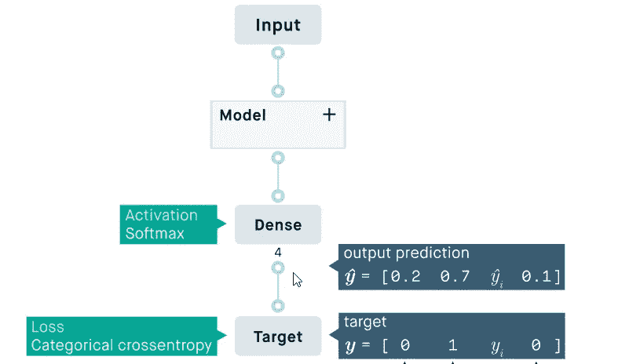

image source: [https://peltarion.com/knowledge-center/documentation/modeling-view/build-an-ai-model/loss-functions/categorical-crossentropy](https://peltarion.com/knowledge-center/documentation/modeling-view/build-an-ai-model/loss-functions/categorical-crossentropy)

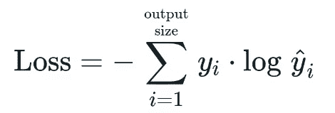

image source: [https://peltarion.com/knowledge-center/documentation/modeling-view/build-an-ai-model/loss-functions/categorical-crossentropy](https://peltarion.com/knowledge-center/documentation/modeling-view/build-an-ai-model/loss-functions/categorical-crossentropy)

# 数据解释:

这个深度学习问题要用的数据集是公开的。

 [## 数据

### 这个数据集包含了华尔街日报(WSJ)中介词短语的介词词义…

www.comp.nus.edu.sg](https://www.comp.nus.edu.sg/~nlp/corpora.html) 

该数据集由大约 2000 条短信组成，其中每条短信都有非标准英语版本、标准英语版本和中文版本。对于我们的问题，我们将只使用非标准英语版本和标准英语版本。

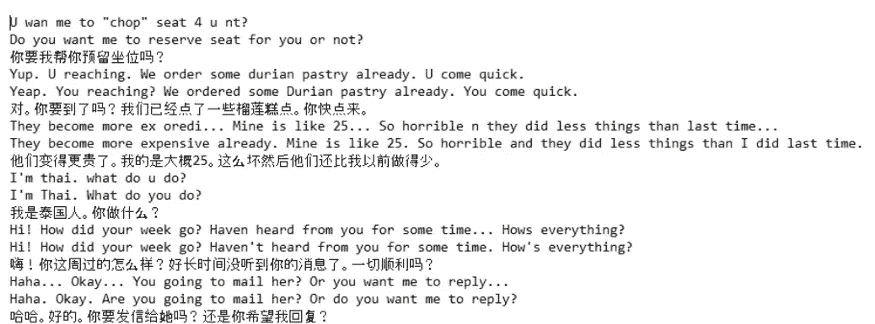

Source Dataset

# 自然语言处理的数据扩充；

数据越多，性能越好。然而，注释大量数据是一种奢侈。因此，适当的数据扩充有助于提高模型性能。使用 **nlpaug** 库，进行了两种类型的扩增。

*   **同义词** —这个增强器基于文本输入应用语义。它利用语义来代替单词。
*   **单词嵌入** —该增强器基于单词嵌入将操作应用于文本输入。它利用单词嵌入来寻找前 n 个相似的单词进行扩充。

# 探索性数据分析:

数据可视化是信息和数据的图形化表示。我们的眼睛被颜色和图案所吸引。当我们看到一张图表或一个曲线图时，我们可以很快理解趋势或识别异常值。

## 短信文本

**句子长度-**

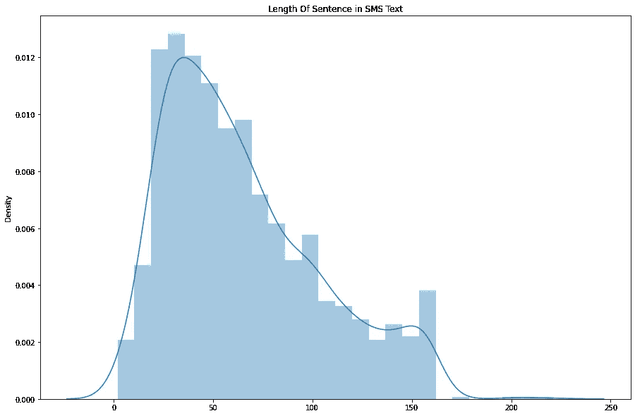

Sentence Length in SMS texts

观察-

*   上图显示了短信中句子长度的密度分布。
*   我们可以看到大多数短信的长度在 30-70 左右。
*   很少有句子的长度在 150 到 170 之间。
*   从以上计算的百分位值，我们可以看到，从 99.1 到 99.8，该值持续增加，但是从 99.8 到 99.9，该值突然增加。这可以被认为是我们数据集的异常值，因此我们只能保留句子长度= < 161.

**字数-** 的 SMS 文本

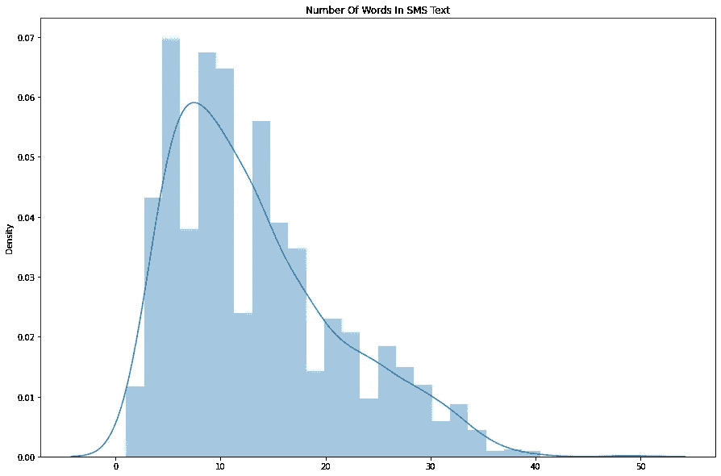

Number of Words in SMS Texts

观察-

*   上图显示了短信文本中字数的密度分布。
*   大多数句子有 5 到 15 个单词。
*   很少有句子的字数超过 30 个。
*   从计算的百分位值中，我们可以看到第 99 百分位值是 34，第 100 百分位值是 49。
*   我们进一步研究了从 99.1 到 100 的计算百分位值。我们可以看到，99.9 的值是 39，这意味着短信文本中 99.9 %的句子有 39 个或少于 39 个单词。
*   因此，我们可以忽略字数超过 39 的短信文本/句子。

**最常出现的 25 个停用词-**

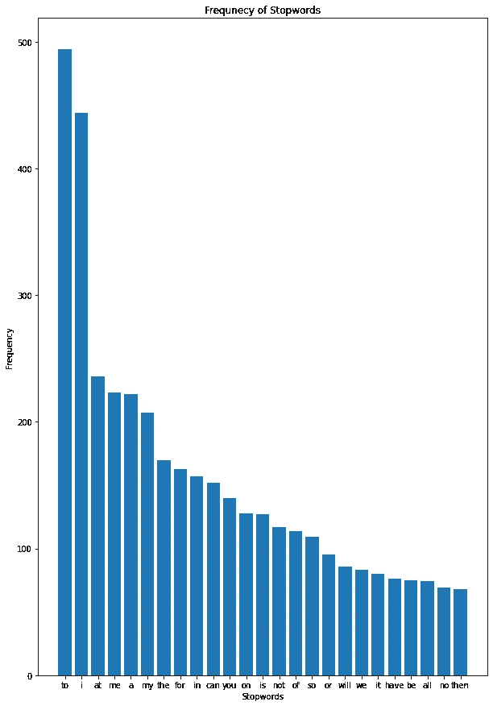

Top 25 frequently occurring stop words

观察-

*   在所有停用词中,“to”是最常用的停用词。
*   在最常使用的前 25 个中，“if”是最少使用的。

## 标准英语文本

**句子长度-**

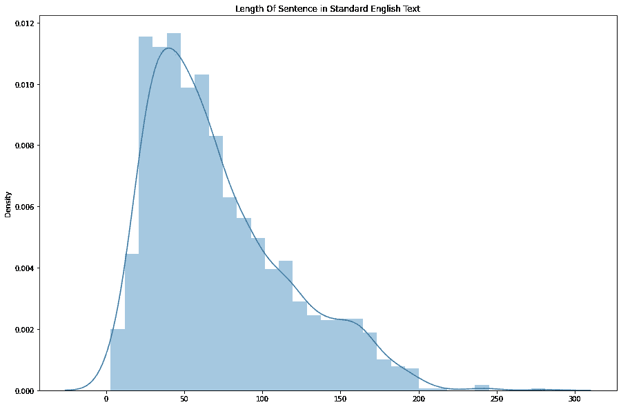

Sentence Length in Standard English Text

观察-

*   上图显示了短信中句子长度的密度分布。
*   我们可以看到，大多数标准英语文本的长度约为 30-70。
*   很少有句子的长度在 150 到 170 之间。
*   从计算的百分位值中，我们可以看到第 99.7 百分位值是 200。
*   我们只有大约 6 个句子，句子长度在 200 到 281 之间。
*   因此，我们可以将最大句子长度保持为 200，并在开始预处理之前删除剩余的句子。

**字数-**

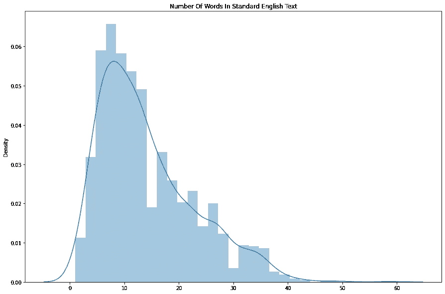

Number of words in standard English text

观察-

*   上图显示了标准英语文本中单词数量的密度分布。
*   大多数句子有 5 到 15 个单词。
*   很少有句子的字数超过 30 个。
*   基于计算的百分位数值，第 99.9 百分位数值是 48，这意味着大多数标准英语句子有 48 个或少于 48 个单词。
*   因此，在预处理时，如果标准英语句子超过 48 个单词，我们可以过滤掉数据。

**最常出现的 25 个停用词-**

Frequency of stop words

*   在所有的停用词中，“你”是使用频率最高的停用词。
*   在最常使用的前 25 个中，“it”是最少使用的。

# 预处理:

在任何机器学习或深度学习任务中，清理或预处理数据与建模一样重要。当涉及到像文本这样的非结构化数据时，这个过程就更加重要了。

一些常见的文本预处理/清理步骤是:

*   下部外壳
*   删除标点符号
*   停用词的删除
*   去除常用词
*   移除 HTML 标签
*   聊天词汇转换
*   拼写纠正等等。

# 标记化和填充:

记号化是一种将文本转换成称为记号的更小单元的方法。这些标记可以是字符或单词的形式。为了使文本具有模型可理解的格式，添加了 *<开始>* 和 *<结束>* 标记。编码器输入是 SMS 文本。解码器输入将是在句子前带有开始标签( *< start >* )的英语文本，并且解码器输出是带有结束标签( *< end >* )的同一句子的一个时移版本。

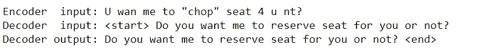

Sample input

Keras 提供了 [*Tokenizer 类*](https://keras.io/api/preprocessing/text/#tokenizer) 用于准备深度学习的文本文档。必须构造记号赋予器，然后使其适合原始文本文档或整数编码的文本文档。

Keras 深度学习库中的 [*pad_sequences()函数*](https://keras.io/preprocessing/sequence/) 可以用来填充变长序列。

# 深度学习模型:

## **编码器-解码器架构-**

编码器-解码器架构有两个模块，即编码器和解码器。这些模块中的每一个都包含几个递归神经网络(RNN)栈。

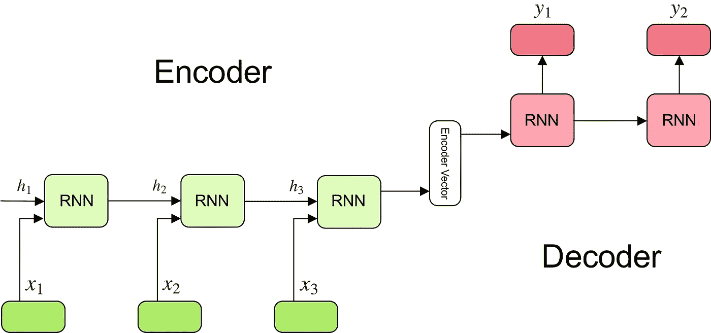

image source: [https://towardsdatascience.com/understanding-encoder-decoder-sequence-to-sequence-model-679e04af4346](https://towardsdatascience.com/understanding-encoder-decoder-sequence-to-sequence-model-679e04af4346)

**编码器-**

*   一个编码器将有几个堆栈的递归神经网络(RNN)，如 LSTM，GRU 等。
*   编码器接收输入序列，并将信息封装为内部状态向量。
*   编码器的输出被忽略，只有内部状态被用作解码器的输入。

**解码器-**

*   一个解码器也将有几个堆栈的递归神经网络(RNN)，如 LSTM，GRU 等。
*   与编码器部分不同，解码器的工作在训练和测试阶段是不同的。
*   在训练阶段，我们用 *<开始>* 令牌输入，以便解码器开始生成下一个字。在最后一个字之后，我们让解码器学习预测 *<结束>* 令牌。我们使用教师强制技术，该技术使用输入作为基础事实，而不是来自前一时间步的输出
*   在测试阶段，初始状态被设置为编码器的最终状态。在第一时间步，我们提供 *<开始>* 令牌作为输入，以便解码器知道何时开始预测。每个时间步长的输入将是前一个时间步长的输出。然后，我们停止预测解码器何时预测 *<结束>* 或者我们是否达到最大目标长度。

## 1.具有一个热编码输入的序列到序列模型:

在这种情况下，句子被转换成**基于字符的记号**，并且这些字符中的每一个都是一个独热编码向量。

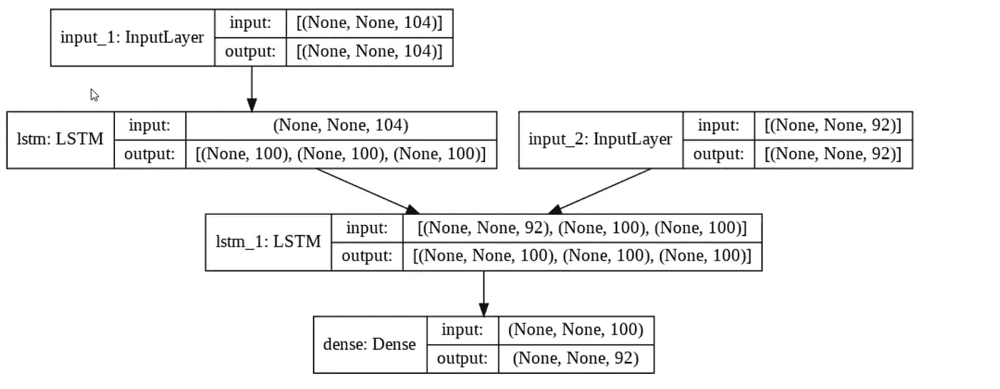

Encoder-Decoder with LSTM as hidden units

使用 **100 个单位的 LSTM** ，没有数据扩充，分类交叉熵为损失，Adam 优化器的学习率为 **0.0001** ，我们得到的损失为 **0.5906** 。

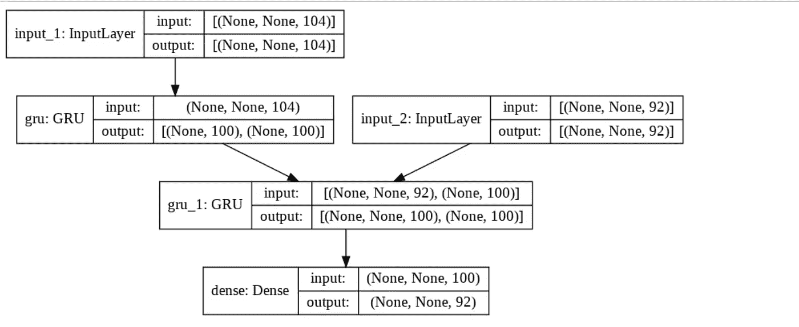

Encoder-Decoder with GRU as hidden units

使用 **100 单位的 GRU** ，没有数据扩充，分类交叉熵为损失，Adam optimizer 的学习率为 **0.0001** ，我们得到的损失为 0.5729。

## 2.具有单词级标记化的序列到序列模型:

在这种情况下，句子被转换成基于单词的标记。使用 **100 单位的 LSTM** ，没有数据扩充，分类交叉熵为损失，对于任何学习率，模型都没有给我们好的结果。

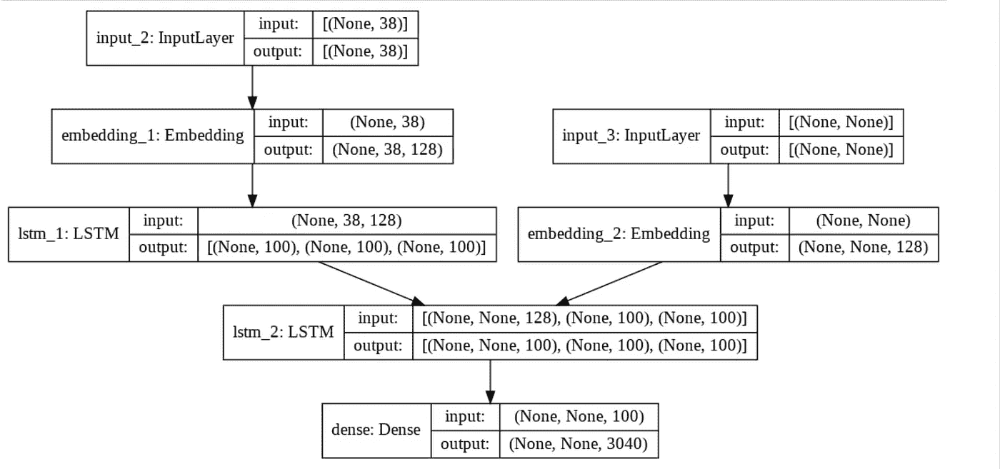

## 3.具有单词级标记化和 Bahadanau 注意力的序列到序列模型:

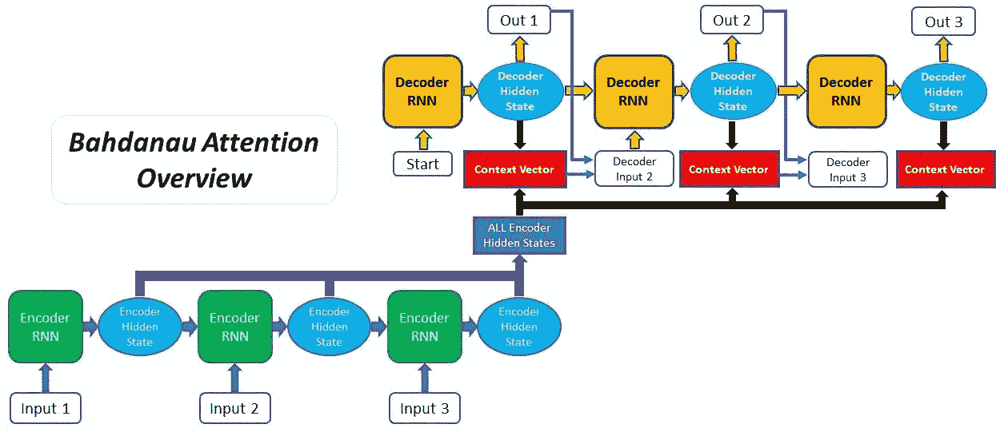

image source: [https://blog.floydhub.com/attention-mechanism/amp/](https://blog.floydhub.com/attention-mechanism/amp/)

这使得编码器-解码器模型处理长句具有挑战性。因此出现了一种叫做“注意”的技术，它极大地提高了机器翻译系统的质量。注意力允许模型根据需要关注输入序列的相关部分。

在这种情况下，句子被标记为单词级别，并且这些标记化的句子被用于使用**快速文本模型**创建**嵌入矩阵**，其将被用作编码器嵌入层中的权重。

用 300 个单位的 LSTM，**用数据扩充**和分类交叉熵作为损失，我们得到 98%的训练准确度，交叉熵损失为 0.0208，以及 0.77 的 ***平均 BLEU 分数。***

从上面的结果可以看出，Bahadanau 注意力模型给了我们一个非常好的分数。这个分数很大程度上受预处理之前执行的数据扩充技术的影响。因此，我们将考虑使用 **Bahadanau 注意力模型**来预测句子。

# 模型预测:

## 波束搜索解码器和推理装置；

**波束搜索解码器-**

> *在 NMT，新句子由简单的波束搜索解码器翻译，该解码器找到近似最大化训练的 NMT 模型的条件概率的翻译。波束搜索策略从左到右逐字生成翻译，同时在每个时间步长保持固定数量(波束)的活动候选。通过增加波束大小，可以以显著降低解码器速度为代价来提高翻译性能。*

— [神经机器翻译的波束搜索策略](https://arxiv.org/abs/1702.01806)，2017。

Beam Search Decoder

**推理设置:**

建立推理模型来判定句子。这里给出多个句子作为输入，推理模型能够预测输出。

Inference Setup

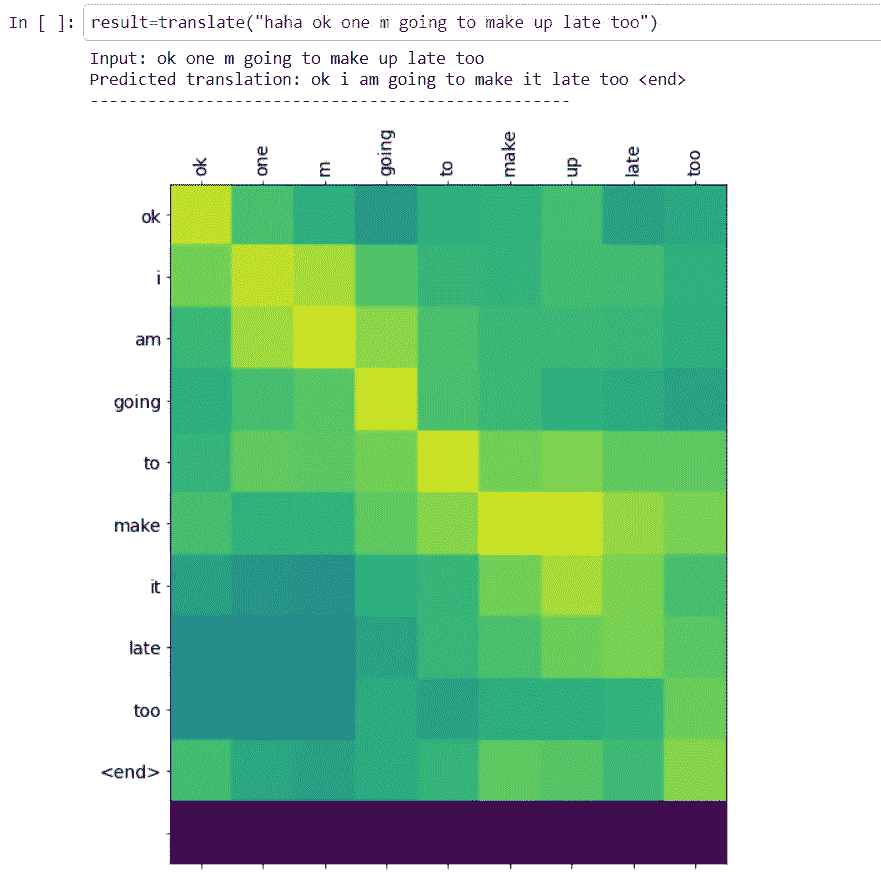

Attention plot

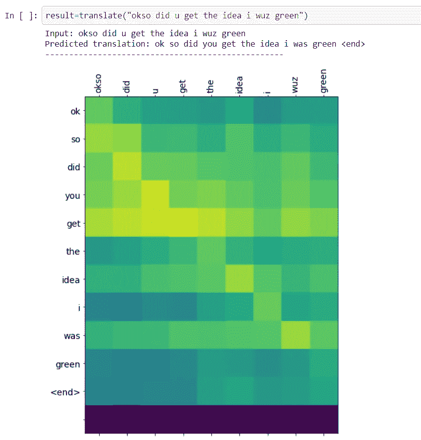

Attention plot

## 预测文本的 BLEU 分数分布图-

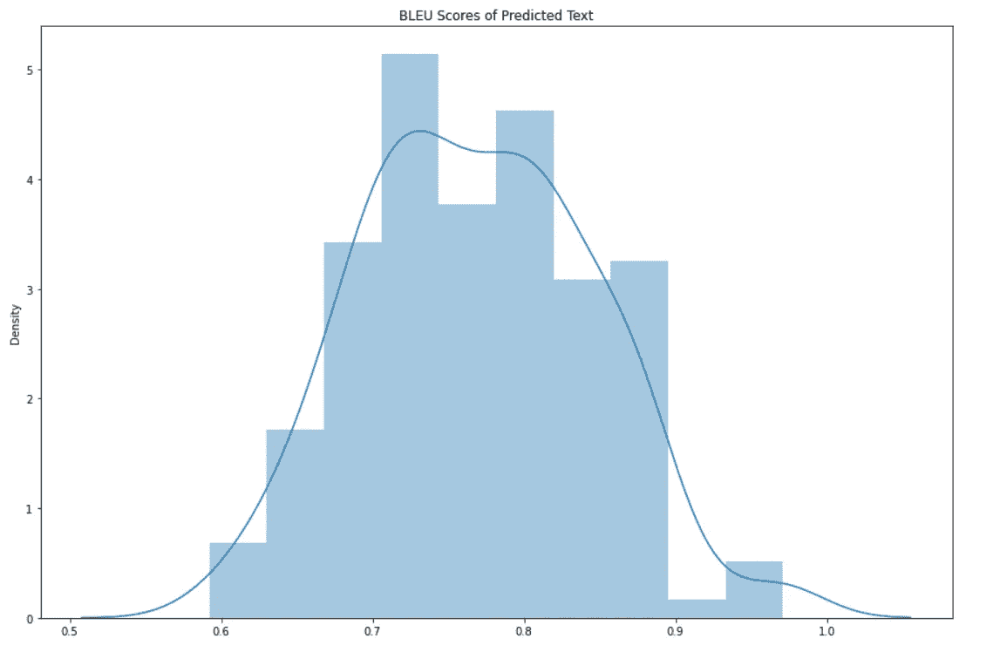

从上面的情节中，我们可以看到大多数句子的 BLEU 得分在 0.7 到 0.9 之间，最高分为 0.97，最低分为 0.59。

# 最终管道:

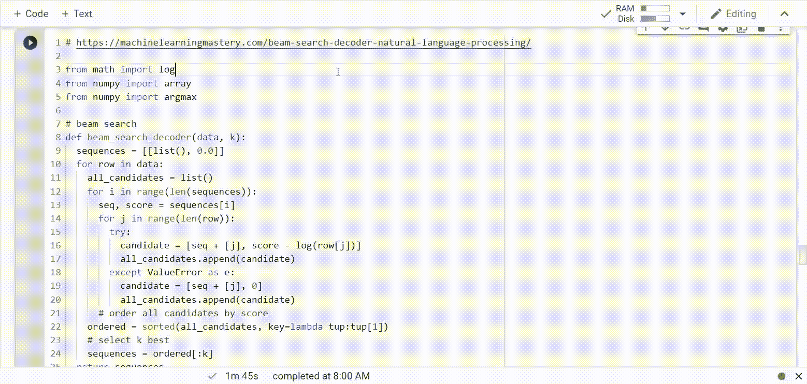

Final Pipeline

# 未来作品:

1.  由于使用< 2000 data points, we could try to use other techniques of data augmentation.
2.  Using a different RNN such as the Bi-directional RNN might also improve the model performance.

# References :

1.  [https://keras . io/examples/generative/lstm _ character _ level _ text _ generation/](https://keras.io/examples/generative/lstm_character_level_text_generation/)时源数据集的大小非常小
2.  [https://www . tensor flow . org/text/tutorials/NMT _ with _ attention # the _ attention _ head](https://www.tensorflow.org/text/tutorials/nmt_with_attention#the_attention_head)
3.  [https://machine learning mastery . com/beam-search-decoder-natural-language-processing/](https://machinelearningmastery.com/beam-search-decoder-natural-language-processing/)
4.  [https://jalammar . github . io/visualizing-neural-machine-translation-mechanics-of-seq 2 seq-models-with-attention/](https://jalammar.github.io/visualizing-neural-machine-translation-mechanics-of-seq2seq-models-with-attention/)
5.  [应用人工智能课程](https://www.appliedaicourse.com/)

## Github 资源库:

你可以在这个 GitHub [链接](https://github.com/srinidhikarjol/Sentence-Correction-using-Recurrent-Neural-Networks)上找到完整的代码。

## Linkedin 个人资料:

也可以在 [LinkedIn](https://www.linkedin.com/in/srinidhi-karjol-aba072103/) 和我联系。