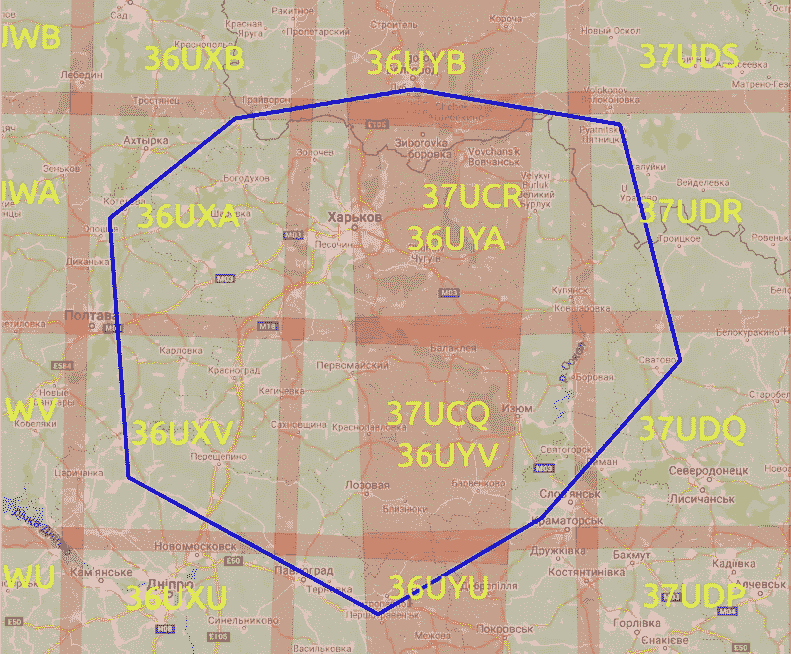
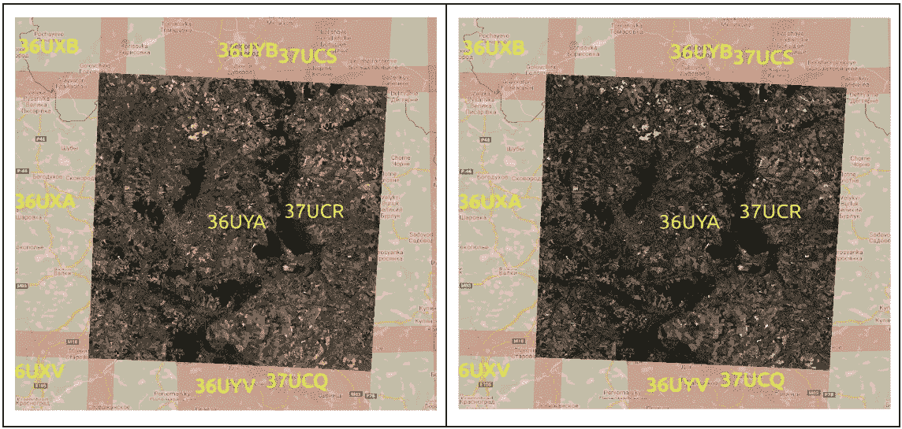
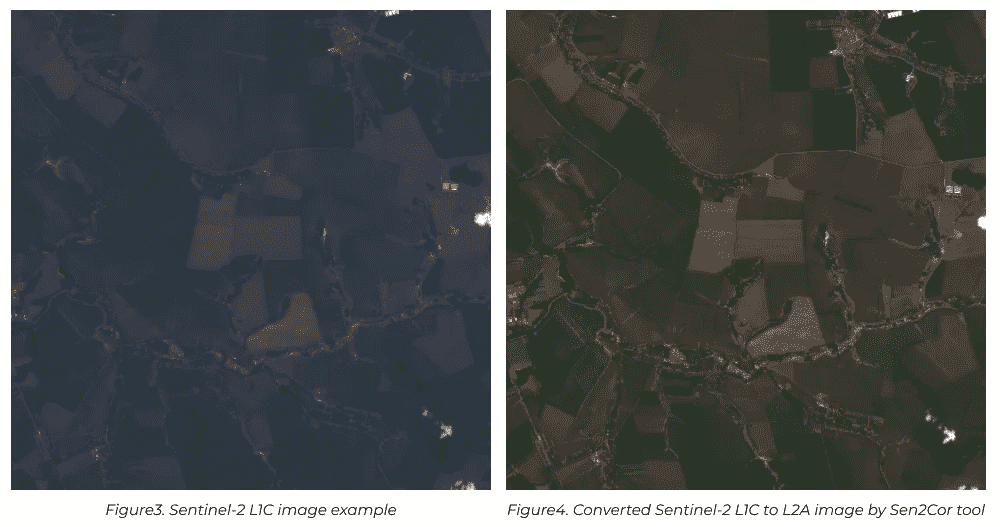

# Sentinel2tools:用于下载 Sentinel-2 卫星图像的简单库

> 原文：<https://medium.com/geekculture/sentinel2tools-simple-lib-for-downloading-sentinel-2-satellite-images-f8a6be3ee894?source=collection_archive---------10----------------------->

## 了解我们的开源项目，该项目可以帮助开发人员和数据科学家解决构建解决方案中最常见的问题之一，即下载和初步处理原始卫星图像。

在中，近年来卫星图像已被广泛应用于各种领域，如监测农田、历史分析作物类型、森林砍伐问题、边界检测等。定期获取高质量和高分辨率的图像有助于提高模型的性能并构建精确的解决方案。

[陆地卫星](https://www.usgs.gov/core-science-systems/nli/landsat)和[哨兵](https://sentinel.esa.int/web/sentinel/home)最常用于获取卫星图像。它们是产生多光谱图像的开源任务。然而，由欧洲委员会和欧洲航天局提供的 Sentinel-2 任务图像携带了一个超光谱成像仪，具有 13 个波段，覆盖可见光和近红外(VNIR)和短波红外(SWIR)波长区域。这些波段的空间分辨率为 10-60 米，覆盖范围在纬度 56 度和+84 度之间，扫描带宽度为 290 公里。哨兵-2A 在赤道的最短重游时间为 10 天。

哨兵-2 任务提供 1C 级(L1C，自 2015 年起)和 2A 级(L2A，自 2017 年起)数据产品类型。L1C 测量值是大气反射率的顶部，L2A-是大气反射率的底部。这些产品类型之间的主要区别是 L2A 有大气校正(从图像的大气反射的那部分光被去除)。这就是为什么 L2A 产品类型更适合分析的原因。

最常见的建筑解决方案问题是原始卫星图像的下载和初步处理。


Photo by [NASA](https://unsplash.com/@nasa?utm_source=medium&utm_medium=referral) on [Unsplash](https://unsplash.com?utm_source=medium&utm_medium=referral)

# 加载 Sentinel-2 图像的标准方法

获得 Sentinel-2 图像的基本方法之一是使用 [sentinel hub](https://www.sentinel-hub.com/) 。他们的 python 包支持从 Amazon Web Service 获取数据。它提供 Sentinel-2 L1C 图像，并要求请求者支付 Sentinel-2 L2A 图像的费用。

谷歌云上的 Sentinel-2 [开源数据集](https://cloud.google.com/storage/docs/public-datasets/sentinel-2)可以免费加载 L2A 和 L1C 卫星产品，但这需要了解数据集结构。另一方面，用户必须通过分析元数据文件、寻找合适的日期以及手动下载每张图像来选择高质量的图像(例如，小的云覆盖区域)，这可能会太长并且令人讨厌。此外，很难检查选择的图像是否覆盖了整个用户感兴趣的地理区域(AOI)。

为了自动下载管道，并确保免费访问哨兵-2 图像，我们要介绍**哨兵 2 工具**。这是一个开源项目——一个位于谷歌云平台上的 Sentinel-2 数据集的方便而直接的包装器。它可以帮助开发人员和数据科学家避免代码重复，减少手动过滤的时间，并为给定的 AOI 搜索合适的卫星图像，同时允许同时下载 L1C 产品类型到 L2A 的转换。

# 如何使用 sentinel2tools 工具

## 装置

要安装 sentinel2tools，请使用 pip 包，如下所示:

```
pip install 
git+https://github.com/QuantuMobileSoftware/sentinel2tools.git@<commit-ref>
```

其中 <commit-ref>—主分支上的最新提交引用。当前:</commit-ref>

```
ca232cb66106db6cac729defdab91aad9aecb15b.
```

## 使用

Sentinel-2 产品是固定大小的基本颗粒和单一轨道的组合。一个颗粒是最小的不可分割的分区(包含所有可能的光谱带)。对于 1C 级和 2A 级，颗粒也称为瓦片，是 UTM/WGS84 投影中的 100×100 km2 [正射影像。](https://sentinel.esa.int/web/sentinel/missions/sentinel-2/data-products)

*   **感知 2 重叠**

Sentinel2Overlap 是 sentinel2tools 库中的一个类，它以 [GeoJSON 格式](https://geojson.org/)查找与给定感兴趣区域相交的图块。它对各种地理数据结构进行编码。在当前的实现中，库支持。带有多边形的 geojson 文件。geojson.io 好心帮忙准备指定格式。

```
from sentinel2download.overlap import Sentinel2Overlap

aoi_path = "./test_geojson/Kharkiv.geojson"

overlap = Sentinel2Overlap(aoi_path)
tiles = overlap.overlap()
print(f"Overlapped tiles: {tiles}")
```

其中 aoi 路径-的路径。输入 AOI(例如，乌克兰哈尔科夫地区)的 geojson 文件，参见图 1。

```
Overlapped tiles: ['36UXA', '36UXU', '36UXV', '36UYA', '36UYB', '36UYU', '36UYV', '37UCQ', '37UCR', '37UDQ', '37UDR']
```



Figure1\. Sentinel-2 overlapped tiles for given AOI built by QGIS Desktop tool (CRS: WGS 84 / Pseudo-Mercator)

*   **Sentinel2Downloader**

Sentinel2Downloader 是库中下载卫星图像和元数据文件的第二个类(参见图 2)。它将指定图块的列表和用于图像过滤的附加参数作为输入。用户必须创建一个 Google API 密钥来开始下载卫星图像。创建 key.json 文件后，将其传递给 Sentinel2Downloader 的构造函数。

这些选项可以在 download()方法中指定:
—产品类型(‘L2A’或‘L1C’)，
—开始日期，
—结束日期，
—存储图像的输出目录的路径，
—内核数量(用于并发下载)，
— sentinel-2 波段(例如，TCI —真彩色图像)，
—约束条件(用于过滤最佳图像)。注意 NODATA_PIXEL_PERCENTAGE 约束不适用于“L1C”产品类型。这里给出了更多可用的约束。

```
from sentinel2download.downloader import SentinelDownloader

CONSTRAINTS = {'NODATA_PIXEL_PERCENTAGE': 15.0, 
               'CLOUDY_PIXEL_PERCENTAGE': 10.0, }

loader = Sentinel2Downloader(api_key="google_api_key.json")

loaded = loader.download(product_type="L2A",
                        tiles=["36UYA", ],
                        start_date="2020-09-01",
                        end_date="2020-09-20",
                        output_dir="./sentinel2imagery",
                        bands={"TCI", "B04", },
                        cores=2,
                        constraints=CONSTRAINTS)
```



Figure2\. Sentinel-2 L2A downloaded images: TCI and B04 spectral bands. (CRS: WGS 84 / Pseudo-Mercator)

*   **感知 2 转换器**

如上所述，大气校正适用于 L2A 图像。但是，如果您需要 2015 年的图像或 AOI 没有的高质量 L2A 图像，Sen2Cor 处理器使用 Sentinel2Converter 类将 L1C 转换为 L2A(见图 3-4)。

sentinel2tools 库中添加了 sen 2 color 工具。您可以从脚本文件夹将其安装到您的系统中。

```
from sentinel2preprocessing.conversion import Sentinel2Converter

converter = Sentinel2Converter()
converted_products = converter.convert(download_dir, conversion_dir)
```

其中，download_dir —包含已加载项目的目录的路径，conversion_dir —包含已存储、已转换项目的目录的路径。请注意，您必须在 loader 中提供标志 full_download=True，以获得正确的 conversion.download()方法。



# 结论

Sentinel2tools 库提供了一套工具，用于下载、过滤 Sentinel-2 卫星图像以及 L1C 和 L2A 产品之间的转换。该项目是开源的，允许同时免费获取图像。该库的使用非常简单；开始时只需要几行代码。库有独立的模块(Seninel2Overlap，Sentinel2Downloader，Sentinel2Converter)，需要的可以随意使用。我们已经为未来的功能开发、改进以及与开发者的合作做好了准备。