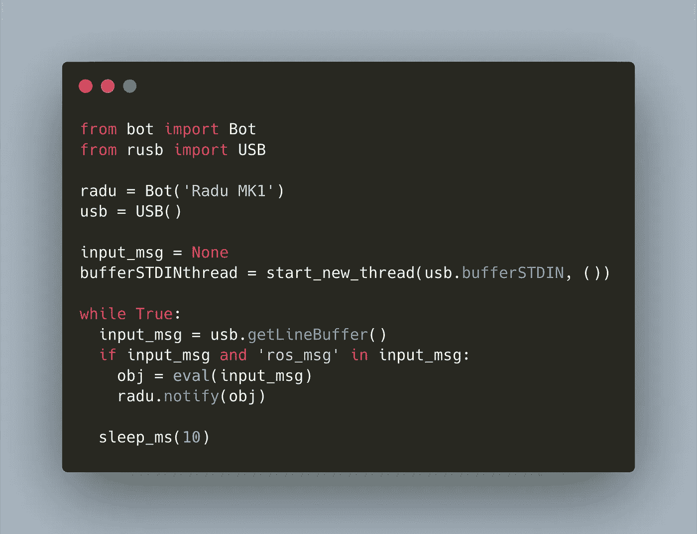
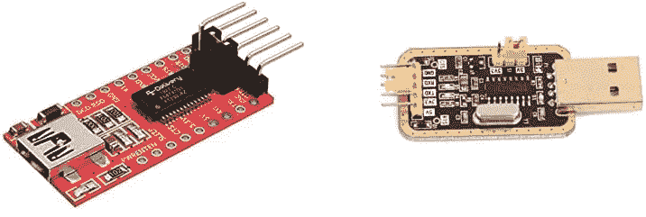

# 树莓 Pi 和树莓 Pico 之间的串行连接

> 原文：<https://medium.com/geekculture/serial-connection-between-raspberry-pi-and-raspberry-pico-d6c0ba97c7dc?source=collection_archive---------0----------------------->



2021 年初，我开始了我的机器人项目。其中一个子项目是熟悉 Arduino 和 C 编程。Arduino 在传感器和致动器库方面无可匹敌，在“连接和工作”体验方面也无与伦比。然而，在年中，我决定改用 Raspberry Pico 和 MicroPython 来实现我的机器人。这一选择的动机是将一种且仅一种编程语言用于机器人中间件、SBD 和微控制器，并利用 RealSense D435 相机提供的强大 Python 库进行图像识别。

为此，我需要重新学习运行 MicroPython 的 Raspberry Pico 和运行 Python 的 Raspberry Pi 之间串行连接的基本知识。这篇文章解释了成功连接的基础。

*本文原载于我的博客*[*admantium.com*](https://admantium.com/blog/micro16_micropython_serial_connection/)

# 硬件连接选项

要从 Pi 连接到 Pico，有三种选择:

*   直接 USB 到 USB
*   直接 Tx/Rx 引脚
*   USB-TTL 至 Rx/Rx

由于 Raspberry Pico 仍然相对年轻，MicroPython 堆栈的技术成熟度会影响这些连接中的哪一个可以被使用。

当你使用选项 A 或 C 时，你可以跳到例子中。如果要使用选项 B，需要按照下一节描述的步骤使能 Tx/Rx 引脚。

# 如何在 Raspberry Pi 上使能 Tx/Rx 引脚

在这篇[伟大的文章](https://spellfoundry.com/2016/05/29/configuring-gpio-serial-port-raspbian-jessie-including-pi-3-4/)之后，你需要做以下事情:

*   通过 Raspi-Config 初始化串行端口

```
$> sudo raspi-config => 3\. Interface Option
  => P6\. Serial Port
    =>  Would you like a login shell to be accessible over serial?
        Answer with 'No'
    =>  Would you like the serial port hardware to be enabled?
        Answer with 'Yes'
```

*   禁用`/dev/ttyS0`服务

```
$> sudo systemctl stop serial-getty@ttyS0.service
$> sudo systemctl disable serial-getty@ttyS0.service
```

*   从引导中移除控制台

```
$> sudo nano /boot/cmdline.txt
    => Remove or comment out a line that says 'console=serial0,115200'
```

有趣的是，Pi 仍将通过 Tx/Rx 引脚发送系统消息——这可能是您一直在寻找的一个特定用例。下面是我关闭 Pi 时的示例输出。

```
>> [  OK  ] Stopped LSB: automatic crash report generation.
>> [  OK  ] Stopped User Manager for UID 1000.
>> [  OK  ] Stopped Login Service.
>> RPI 4 Model B (0xc03111)
```

# 从 Pi 向 Pico 发送数据

在所有示例中，从 Raspberry Pi 向 Pico 发送数据的代码都是相同的，只是稍有修改:Pico 连接的端口。

使用以下样板代码:

```
# sender.py
import time
import serialser = serial.Serial(
  port='/dev/ttyS0', # Change this according to connection methods, e.g. /dev/ttyUSB0
  baudrate = 115200,
  parity=serial.PARITY_NONE,
  stopbits=serial.STOPBITS_ONE,
  bytesize=serial.EIGHTBITS,
  timeout=1
)msg = ""
i = 0while True:
    i+=1
    print("Counter {} - Hello from Raspberry Pi".format(i))
    ser.write('hello'.encode('utf-8'))
    time.sleep(2)
```

解释:

*   第 2 行:导入启用串行连接的`serial`库
*   第 4 行:创建一个串行对象，其配置与默认 Pico UART 配置完全相同(波特率 115200，字节大小 8 位等。).`port`部分需要根据连接方法进行定制——详见下文
*   第 19 行:要发送数据，首先`encode`字符串数据，然后`write`它到串行对象

现在让我们来看看接收器端。

# 接收数据:USB 到 USB 连接

在撰写本文时，运行在 Pico 上的 MicroPython 的最新版本是`MicroPython v1.16 on 2021-06-18`。该版本没有内置的 USB 串行通信库。

然而，在这个 [Pico 论坛线程](https://www.raspberrypi.org/forums/viewtopic.php?t=302889)中，一个用户提供了一个纯粹的 MicroPython 实现，它在第二个 Pico CPU 内核上产生一个线程，该线程主动侦听通过 USB 传入的字节。我在我早期的机器人原型中尝试了这个代码，并可以使用它通过 Pico 上的 USB 接收命令我的机器人移动的消息。

以下是我的工作示例:

```
# receiver.py / USB => USB
import sys
sys.path.append('/radu')import osfrom bot import Bot
from rusb import USBfrom _thread import start_new_thread
from time import sleep_msradu = Bot('Radu MK1')
usb = USB()input_msg = None
bufferSTDINthread = start_new_thread(usb.bufferSTDIN, ())while True:
  input_msg = usb.getLineBuffer()
  if input_msg and 'ros_msg' in input_msg:
    obj = eval(input_msg)
    radu.notify(obj) sleep_ms(10)
```

# 接收数据:Tx/Rx 引脚连接

Tx/Rx 引脚之间的直接连接意味着:

*   连接地:Pi 引脚 6 至 Pico 引脚 3
*   将 Tx 连接到 Rx: Pi 引脚 8 (GPIO 14)连接到 Pico 引脚 1 (GPIO 0)
*   将 Tx 连接到 Rx: Pi 引脚 10 (GPIO 15)连接到 Pico 引脚 2 (GPIO 1)

如上所述，您还需要配置您的 Raspberry Pi 来启用这些引脚。完成后，使用以下代码:

```
# receiver.py / Tx/Rx => Tx/Rx
import os
import machine
from time import sleepuart = machine.UART(0, 115200)
print(uart)b = None
msg = ""while True:
    sleep(1)
    if uart.any():
        b = uart.readline()
        print(type(b))
        print(b)
        try:
            msg = b.decode('utf-8')
            print(type(msg))
            print(">> " + msg)
        except:
            pass
```

在该计划中:

*   第 5 行:通过访问 Pico 的内部`machine.UART`实例来创建一个`uart`实例。这用与发送者代码配置相同的值来定义。请注意， [MicroPython 文档](https://docs.micropython.org/en/latest/library/machine.UART.html)还允许您创建不同配置的 UART 实例，例如使用较慢的波特率。
*   第 12 行:当 UART 连接上至少有一个字符可用时，条件`uart.any()`返回一个正整数。
*   第 13 行:要读取数据，要么使用`read(i)`，其中`i`是字符数，要么使用`readline()`读取所有字符，直到到达一个新行。处理单个字符更有效、更快，如果需要交换复杂的信息，处理完整的行更可靠。
*   第 16 行:一个`try - except`块开始，其中...
*   第 17 行:…接收到的消息被解码，然后打印出来。如果有任何错误，程序将继续运行，而不会引发错误。

# 接收数据:USB-TTL 至 Tx/Rx 引脚连接

首先，你需要一个 USB-TTL 适配器，它至少有两种不同的芯片组:FT232RL 和 CH340g。



来源: [Amazon.de](https://images-eu.ssl-images-amazon.com/images/I/51sVhZNyGxL._SY445_SX342_QL70_ML2_.jpg) ， [Amazon.de](https://images-eu.ssl-images-amazon.com/images/I/61HcN9SmudL.__AC_SX300_SY300_QL70_ML2_.jpg) 。

将适配器插入 Picos USB 端口，然后使用`dmesg`查看该设备是如何配置的。

```
[326612.390873] usb 1-2: new full-speed USB device number 54 using xhci_hcd
[326612.543888] usb 1-2: New USB device found, idVendor=1a86, idProduct=7523, bcdDevice= 2.64
[326612.543893] usb 1-2: New USB device strings: Mfr=0, Product=2, SerialNumber=0
[326612.543895] usb 1-2: Product: USB Serial
[326612.546221] ch341 1-2:1.0: ch341-uart converter detected
[326612.549000] usb 1-2: ch341-uart converter now attached to ttyUSB0
```

最后一行是`ttyUSB0`，所以发送者代码需要修改如下:

```
# sender.py / USB-TTL => Tx/Rx
# ...
ser = serial.Serial(
  port='/dev/USB0'
  # ...
)
```

接收数据的代码与直接 Tx/Rx 连接相同。

# 示例输出

现在让我们看看我们的代码在运行。

在 Raspberry Pi 上执行`sender.py`会输出以下信息:

```
>>>
Counter 1 - Hello from Pi4
Counter 2 - Hello from Pi4
Counter 3 - Hello from Pi4
Counter 4 - Hello from Pi4
```

在 Raspberry Pico 上运行`receiver.py`显示:

```
%Run -c $EDITOR_CONTENT
(sysname='rp2', nodename='rp2', release='1.16.0', version='v1.16 on 2021-06-18 (GNU 10.2.0 MinSizeRel)', machine='Raspberry Pi Pico with RP2040')
UART(0, baudrate=115200, bits=8, parity=None, stop=1, tx=0, rx=1, txbuf=256, rxbuf=256, timeout=0, timeout_char=1, invert=None)
<class 'bytes'>
b'hello\n'
<class 'str'>
>> hello
```

# 结论

本文解释了使用(微)Python 连接 Raspberry Pi 和 Raspberry Pico 的三个选项。第一种选择是 USB 到 USB，需要一个外部的 MicroPython 库来接收数据。第二种选择是从两台机器直接连接 Rx/Tx。在对您的 Pi 进行一些配置之后，这就可以稳定地工作了。第三种选择是使用 USB FTL 连接 Tx/Rx。不需要任何配置，开箱即用。

考虑源代码，在 Pi 上是`pyserial`库:打开一个与 Pico 配置相同的串行连接对象(波特率，停止位)并用`serial.write()`发送编码数据。在 Pico 上，是 building `machine.UART`对象，它访问内置 UARTs 或者是可配置的。使用`uart.readline()`接收字节，然后使用`decode()`接收数据。