# 系列:为生产准备 React 原生应用(Android)——第 1 部分

> 原文：<https://medium.com/geekculture/series-preparing-your-react-native-app-for-production-android-part-1-e7eae578235b?source=collection_archive---------2----------------------->

Photo by [Bill Jelen](https://unsplash.com/@billjelen?utm_source=medium&utm_medium=referral) on [Unsplash](https://unsplash.com?utm_source=medium&utm_medium=referral)

如果您曾经想知道如何构建 React 原生应用的生产或发布版本，那么您来对地方了。在继续之前，本教程仅针对我们的 React 原生应用的 **android 版本**。

# 目录📖

1.  从头开始创建 React 本机应用程序
2.  开发我们的应用程序的 0.0.1 版本
3.  为 android 构建我们的应用程序的生产就绪版本

## TLDR；

如果你没有一个应用程序，你就不会在这里。您可以随意跳到表格内容的第三(3)个主题。出于教育目的，我将从头开始。此外，这是一个很长的系列，因此我创造了细节。

# 步骤 1:创建 React 本机应用程序

在这一节中，我将跳过 React 本地环境的设置。查看关于如何为 React Native 设置开发环境的[详细指南](https://reactnative.dev/docs/environment-setup)。

**先决条件:**

*   节点、npm 和 npx
*   Android Studio、Android 模拟器或物理 Android 设备
*   文本编辑器(推荐:vscode)

**步骤:**

1.  在您的终端中，运行命令:

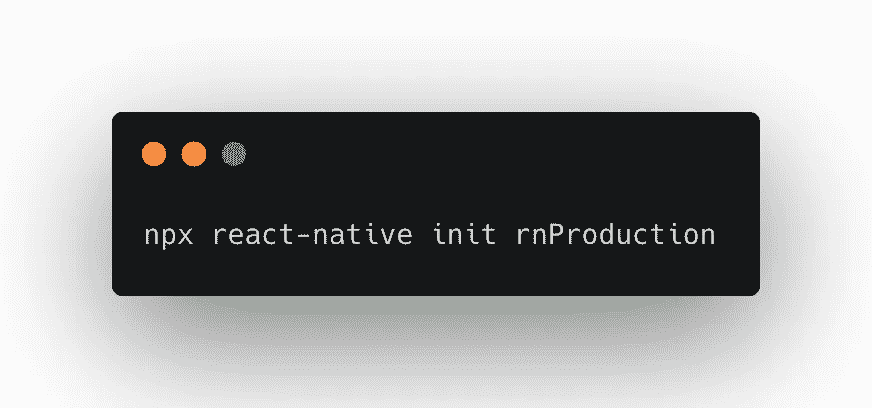

*成功完成后，应该会看到类似下面的内容:*

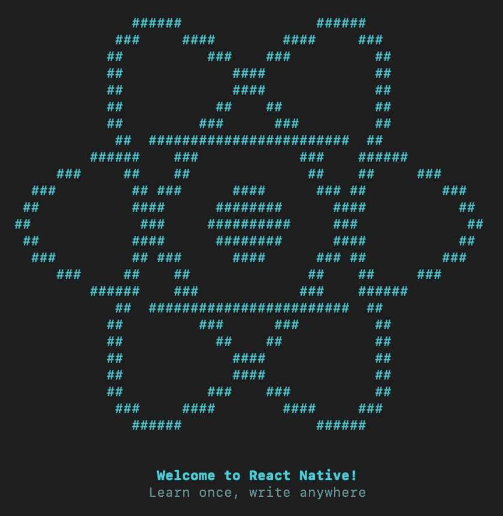

2.在您首选的文本编辑器或 ide(集成开发环境)中打开项目

3.通过运行以下命令启动开发环境:

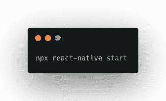

starting a local server

4.通过运行以下命令，在 android 模拟器或物理 android 设备上运行应用程序:

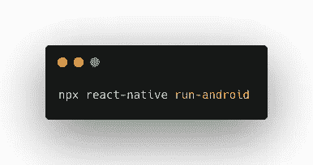

run app on an emulator or physical device

*下面是第一次运行应用程序后的结果。*

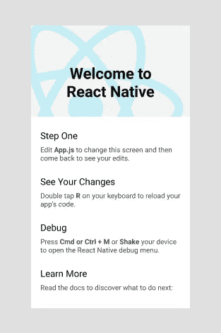

Welcome screen on the first run

## 概述:

在第一步中，我们从头开始创建一个 react-native 应用程序，并在本地运行我们的应用程序。

# 第二步:开发我们的应用程序🛠的 0.0.1 版本

在这一部分，我们将假装构建我们应用程序的第一个 MVP(最小可行产品)版本。我将通过在 **App.js** 文件中呈现应用程序的版本来实现这一点。

没有什么太多，只是一些简单的东西。😊

**步骤:**

1.  通过导入`package.json`文件来渲染 app 的版本号。

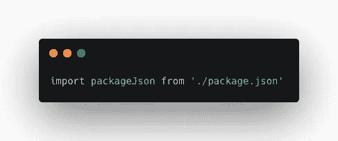

import package.json file

2.应用程序风格。

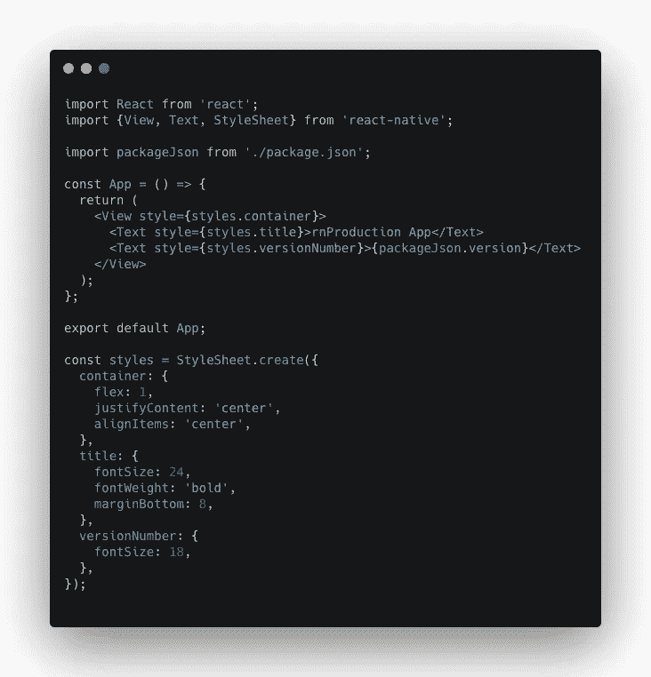

3.完成了。

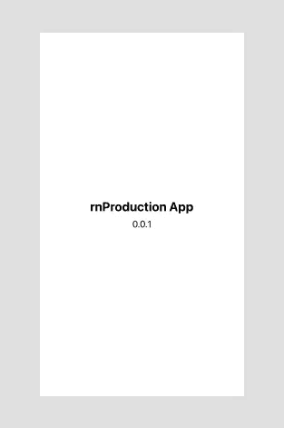

Our MVP app

# **第三步:为 android 🛠构建我们的应用程序的生产就绪版本🚀**

这是我们期待已久的关键一步，对吗？😊构建生产就绪版本需要一些步骤。在本节中，我们将了解:

1.  你会遇到的一些关键术语及其含义
2.  生成释放密钥
3.  设置梯度变量
4.  将签名配置添加到你的应用的 Gradle 配置
5.  生成发布 APK
6.  测试应用程序的发布版本

## 1.您将遇到的一些关键术语及其含义:

**安卓密钥库系统:**

Android 密钥库系统允许你将密钥存储在一个名为**密钥库**的容器中，以使它们更难从设备中提取出来。

**安卓密钥库:**

android **密钥库**是授权证书或公钥证书的容器，通常被基于 Java 的应用程序用于通过 HTTPS 提供的**加密**、**认证**和**。**

**调试密钥库:**

调试密钥库是一个随机生成的证书(密钥库),用于**签署**一个 APK(Android 包)。调试密钥库是由我们的构建工具 **(Android SDK)** 在开发或调试模式下首次在仿真器或物理设备上运行我们的应用程序时生成的。

调试键可以用来做什么？

*   调试密钥库用于签署 APK，因此我们可以在通过 USB 连接到我们开发机器的仿真器或物理 android 设备上运行我们的应用程序。

***不能用调试键做什么？***

*   您不能使用调试密钥将您的应用分发到 play store 或其他平台。

> **NB** :默认情况下，调试配置使用密码已知的**调试密钥库**和密码已知的**默认密钥**。此外，调试密钥库可以位于$HOME/中。android/debug.keystore，如果不存在，则由**创建**。
> `$ keytool -genkey -v -keystore debug.keystore -storepass android -alias androiddebugkey -keypass android -keyalg RSA -keysize 2048 -validity 10000`

**发布密钥库:**

发布密钥库是一个定制生成的证书，当您想要在**发布或生产模式下运行**或**构建应用程序的发布版本**时使用，这样您就可以**直接向用户发布**或**在应用程序市场(如 Google Play、Firebase App Distribution 等)上发布**。

> **发布密钥库和调试密钥库的区别**
> 
> 有两种模式，**调试模式**和**释放模式**。**调试密钥库**在我们**开发和测试**我们的应用程序时使用，而**发布密钥库**在我们想要**将我们的应用程序发布或发布**到像 Google Play 这样的应用程序市场时使用。

**APK(安卓包):**

Android 包是 Android 操作系统和其他几个基于 Android 的操作系统使用的包文件格式，用于分发和安装移动应用程序、移动游戏和中间件。 ***(维基百科)***

**已签名的 Apk:**

一个**签名的 apk** 是一个 **android** 包文件，它已经用一个证书进行了数字签名，开发者持有该证书的私钥。您可以使用**调试键**或**释放键**对应用程序进行签名。设备不会安装未签名的 APK 或捆绑文件。

**格雷尔:**

Gradle 是一个 build 系统，负责代码编译、测试、部署等。

## 2.生成释放密钥

我们将使用一个称为密钥工具的工具来生成我们的 release-key.keystore 文件。请注意，如果您的系统上没有关键工具，请在继续操作之前让它工作。

在生成 release Keystore 之前，让我们看看项目中的 android 文件夹是什么样子的:

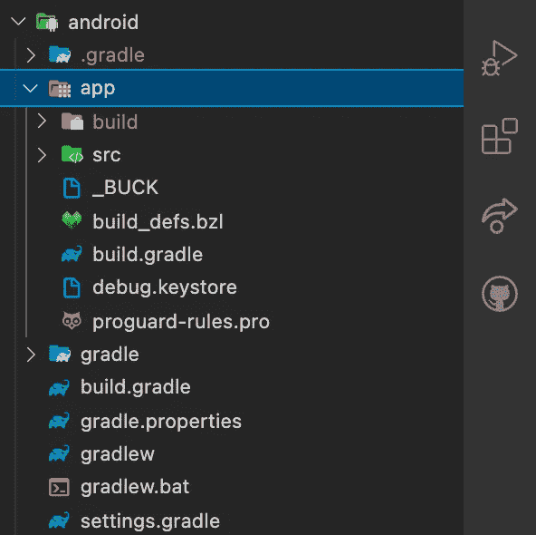

Before the release-key.keystore file is generated

您可以看到我们只有 debug.keystore 文件。正如我前面所说，这有助于我们签署我们的 apk，以便我们可以在调试模式下开发和测试我们的应用程序。

a) **运行命令:**

> keytool-genkey pair-v-storetype PKCS12-keystore release-key . keystore-alias rn production-key-key LG RSA-keysize 2048-validity 10000

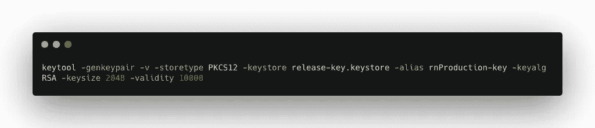

generate release key

> **分解命令:
> -** 密钥库名称:“**release-Key . Keystore**”
> -密钥别名:“ **rnProduction-key** ”

b) **出现提示时，输入密钥和密钥库密码:**

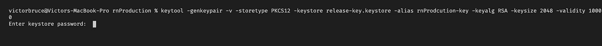

**💡*专业提示:*** *永远不要忘记您的* ***密钥库文件*** ***名称、密钥别名、密钥库和密钥密码*** *，因为设置您的 Gradle 变量将需要它们。*

c) **出现提示时，填写其余的详细信息，如名字、姓氏等**

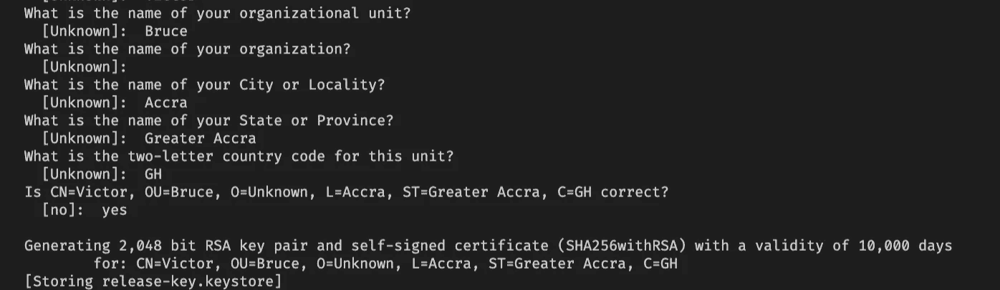

Fill in the details when prompted

生成后，release-key.keystore 文件将放在项目文件夹的根目录下。将文件拖放到`**android/app**`文件夹中。下面是生成 release-key.keystore 文件后 android 文件夹的外观结果:

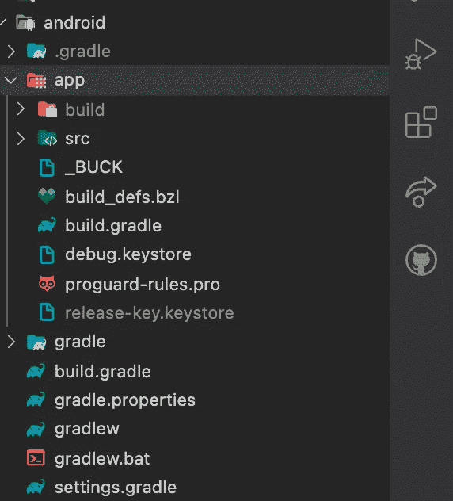

Here, you can see the release-key.keystore file inside the android/app folder.

## 3.设置梯度变量:

如前所述，Gradle 是一个**构建系统**，负责代码编译、测试、部署等。在构建生产应用程序的过程中，Gradle 需要一些信息来完成构建。这些是*任务*、*类型*、*属性*等。

对于**属性密钥**，我们必须向 Gradle 提供以下密钥对值:

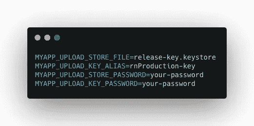

Gradle properties

a) ✏️编辑文件`~/.gradle/gradle.properties`或`android/gradle.properties`，并添加上图中的值。

在我们的例子中，我将打开`~/.gradle/gradle.properties`文件并在那里传递值。这种方法更安全，因为当您将项目提交到版本控制站点(如 Github)时，您的密钥和密钥库密码不会暴露。

❗️ **注意:**如果没有看到**里面的`gradle.properties`文件的话~/。gradle 文件夹**，创建一个即可。

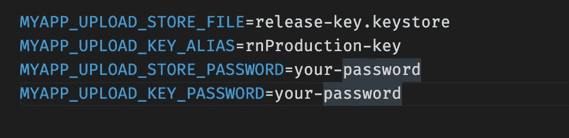

~/.gradle/Gradle.properties file

## 4.将签名配置添加到你的应用的 Gradle 配置

到目前为止，我们仅有的**签名配置**是在调试模式下由我们的构建工具自动生成的**调试**。下面是我们的**Android/app/build . gradle**的样子:

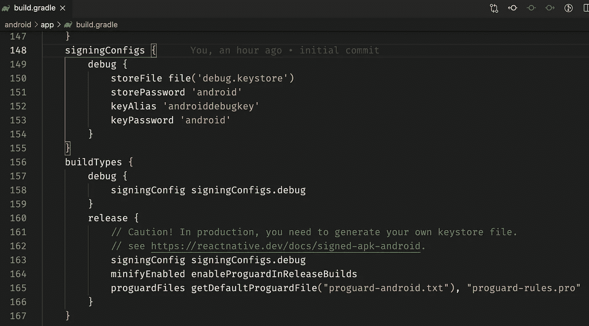

android/app/build.gradle file

现在，我们将对**签名配置**和**构建类型**进行更改，添加一个发布构建，并将我们的构建类型指向发布构建。

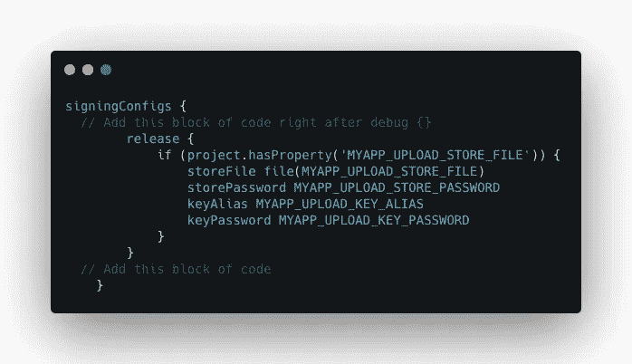

add the release build to signingConfigs

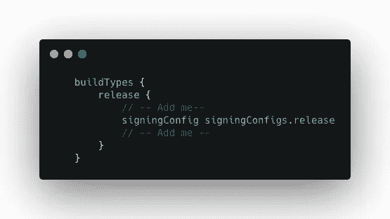

Point the buildTypes to sginingConfgis.release

👇下面是上述步骤的最终结果:

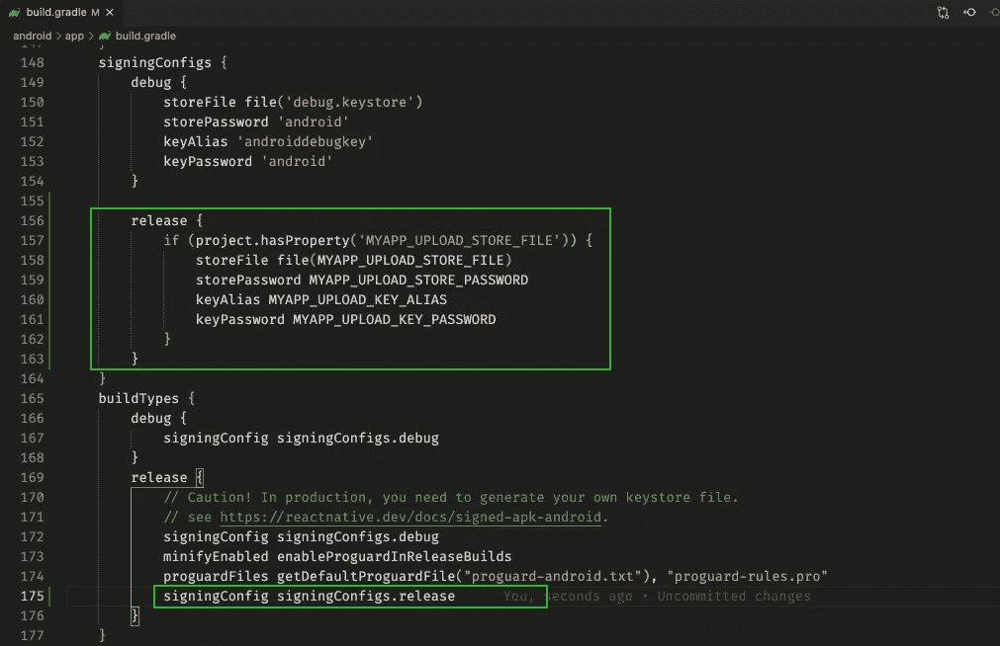

After adding a signingConfig to build.gradle

## 5.生成发布 APK

a)将目录切换到 android 文件夹:`**cd android**`

b)运行命令`./gradlew assembleRelease`将您的应用程序捆绑到一个 apk 文件中

## 6.测试应用程序的发布版本

您可以通过运行命令`npx react-native run-android --variant=release`来彻底测试您的应用程序的生产版本。但在此之前，你必须从你运行的模拟器或物理设备上卸载应用程序的调试版本。

❗️ **注意**:只有当你已经如上所述设置了签名时`--variant=release`才可用。

# 概述:

在这篇博客教程中，我们看了如何:

👉从头开始创建 react-native 应用程序

👉构建了一个“假”MVP 版本的应用程序

👉通过生成发布密钥并签署我们的应用程序，为应用程序的生产做准备

在下一篇文章中，我们将看到如何将生产就绪型应用程序发布到 Firebase 应用程序发行版，以便用户测试我们的应用程序。

谢谢大家！🙏

**第二部分**:[https://victor Bruce 82 . medium . com/series-publish-your-production-ready-react-native-application-to-firebase-app-14651017 d443](https://victorbruce82.medium.com/series-publish-your-production-ready-react-native-application-to-firebase-app-14651017d443)

**参考文献:**

[https://www . geeks forgeeks . org/Android-build-Gradle/#:~:text = Gradle % 20 is % 20a % 20 build % 20 system，the % 20 actual % 20 build % 20 process % 20 occurs](https://www.geeksforgeeks.org/android-build-gradle/#:~:text=Gradle%20is%20a%20build%20system,the%20actual%20build%20process%20happens)。

 [## 出版到谷歌 Play 商店反应本土

### Android 要求所有应用程序在安装前都要用证书进行数字签名。为了…

反应性发展](https://reactnative.dev/docs/signed-apk-android) 

https://developer.android.com/studio/publish/app-signing

 [## android 中 debug.keystore 有什么用？

### 感谢贡献一个堆栈溢出的答案！请务必回答问题。提供详细信息并分享…

stackoverflow.com](https://stackoverflow.com/questions/27838636/what-is-the-use-of-debug-keystore-in-android)  [## Android:生成发布/调试密钥库(示例)

### 要在命令行生成用于签署 Android 应用程序的密钥库，请使用:$ keytool-genkey-v-keystore my-key . keystore…

coderwall.com](https://coderwall.com/p/r09hoq/android-generate-release-debug-keystores)