# SerpApi 演示项目:沃尔玛咖啡探索性数据分析

> 原文：<https://medium.com/geekculture/serpapi-demo-project-walmart-coffee-exploratory-data-analysis-315908eb1003?source=collection_archive---------13----------------------->


# 介绍

这个 Python 演示项目实际展示了如何使用 SerpApi 的[沃尔玛搜索引擎结果 API](https://serpapi.com/walmart-search-api) 以及如何将提取的数据用于探索性数据分析。

SerpApi 是一个 Api，让你从 [26 个搜索引擎](https://serpapi.com/search-api)以 [10 种语言](https://serpapi.com/integrations)接收结构化的 JSON 数据。

你可以在 GitHub 上自己探索这个项目:`[dimitryzub/walmart-stores-coffee-analysis](https://github.com/dimitryzub/walmart-stores-coffee-analysis)`

我们将涵盖:

1.  从沃尔玛有机结果中提取数据。
2.  使用 SerpApi 分页从所有商店页面提取数据。
3.  从 500 家沃尔玛商店提取数据。 [SerpApi 向 JSON Walmart 商店位置](https://serpapi.com/walmart-stores)提供总共 4.460 家商店。
4.  我探索性数据分析的全过程。

📌注意:下面的脚本以一种`sync`的方式提取数据，这种方式比较慢。

SerpApi 提供了`[async](https://github.com/serpapi/google-search-results-python#batch-asynchronous-searches)` [参数](https://github.com/serpapi/google-search-results-python#batch-asynchronous-searches)，允许处理更多的结果，而无需等待 SerpApi 响应。这些结果将在 SerpApi 后端进行处理，并且可以在 31 天内检索到[。](https://serpapi.com/search-archive-api)

如果你对提取不到 5 小时的大量数据(10.000 多个请求)感兴趣，[注册我们的博客](https://serpapi.com/blog/#/portal/signup/free)，这样你就不会错过了。

# 提取沃尔玛数据

# 说明

首先，我们需要安装库:

```
$ pip install pandas matplotlib seaborn jinja2 google-search-results
```

*   `[pandas](https://pandas.pydata.org/)`强大的数据分析操纵工具。
*   `[matplotlib](https://matplotlib.org/stable/)Matplotlib`是一个用于可视化数据的综合 Python 库。
*   `[seaborn](https://seaborn.pydata.org/)`一个建立在`matplotlib`之上的高级界面，用于绘制有吸引力和信息丰富的统计图形。
*   `[jinja2](https://jinja.palletsprojects.com/en/3.1.x/)` Python 模板引擎。用于`pandas`工作台即。
*   `[google-search-results](https://github.com/serpapi/google-search-results-python)` SerpApi Python API 包装器。

其次，我们需要导入库

```
from serpapi import WalmartSearch
from urllib.parse import (parse_qsl, urlsplit)
import pandas as pd
import os, re, json
```

*   `[urllib.parse](https://docs.python.org/3/library/urllib.parse.html)`用于 SerpApi 分页目的。
*   `[os](https://docs.python.org/3/library/os.html)`读取秘密 API 密钥。不要公开展示你的 API 密匙。
*   `[re](https://docs.python.org/3/library/re.html)`从`string`中提取部分数据。
*   `[json](https://docs.python.org/3/library/json.html)`大部分用于漂亮印刷。

接下来，我们读取沃尔玛商店的 JSON 文件:

```
# to get store ID
store_ids = pd.read_json('<path_to>/walmart-stores.json')
```

接下来，我们创建一个咖啡类型的常量变量。这将用于稍后从列表的标题中检查咖啡类型:

```
COFFEE_TYPES = [
    'Espresso',
    '...',
    'Black Ivory Coffee'
]
```

之后，我们迭代`store_ids`并将商店 id 传递给`[store_id](https://serpapi.com/walmart-search-api#api-parameters-advanced-filters-store-id)` [SerpApi 查询参数](https://serpapi.com/walmart-search-api#api-parameters-advanced-filters-store-id):

```
for store_id in store_ids['store_id']:
    params = {
        'api_key': os.getenv('API_KEY'),  # serpapi api key
        'engine': 'walmart',              # search engine
        'device': 'desktop',              # device type
        'query': 'coffee',                # search query
        'store_id': store_id
    } search = WalmartSearch(params)       # where data extraction happens
```

在下一步中，我们需要创建一个`list`来临时存储提取的数据，并创建一个仅用于演示的页码计数器:

```
data = []
page_num = 0
```

下一步是创建一个`while`循环，它将遍历所有商店页面:

```
while True:
    results = search.get_json()      # JSON -> Python dict
```

之后，我们需要检查 SerpApi 是否返回了任何错误，如果有，则检查`break`:

```
if results['search_information']['organic_results_state'] == 'Fully empty':
    print(results['error'])
    break
```

增加一个页面计数器并打印出来:

```
page_num += 1
print(f'Current page: {page_num}')
```

之后，我们需要提取数据，并尽可能将其标准化:

```
for result in results.get('organic_results', []):
    title = result.get('title').lower() # https://regex101.com/r/h0jTPG/1
    try:
        weight = re.search(r'(\d+-[Ounce|ounce]+|\d{1,3}\.?\d{1,2}[\s|-]?[ounce|oz]+)', title).group(1)
    except: weight = 'not mentioned' # ounce -> grams
    # formula: https://www.omnicalculator.com/conversion/g-to-oz#how-to-convert-grams-to-ounces
    # https://regex101.com/r/wWMUQd/1
    if weight != 'not mentioned':
        weight_formatted_to_gramms = round(float(re.sub(r'[^\d.]+', '', weight)) * 28.34952/1, 1) # loop through COFFEE_TYPES and checks if result.title has coffee type
    # found match or matches will be stored as a list with ',' separator
    coffee_type = ','.join([i for i in COFFEE_TYPES if i.lower() in title])
```

之后，我们需要将数据追加到临时的`list`:

```
data.append({
    'title': title,
    'coffee_type': coffee_type.lower(),
    'rating': result.get('rating'),
    'reviews': result.get('reviews'),
    'seller_name': result.get('seller_name').lower() if result.get('seller_name') else result.get('seller_name'),
    'thumbnail': result.get('thumbnail'),
    'price': result.get('primary_offer').get('offer_price'),
    'weight': weight,
    'weight_formatted_to_gramms': weight_formatted_to_gramms
})
```

然后检查`serpapi_pagination`哈希键中是否有`next`页并分页，否则`break``while`循环:

```
# check if the next page key is present in the JSON
# if present -> split URL in parts and update to the next page
if 'next' in results.get('serpapi_pagination', {}):
    search.params_dict.update(dict(parse_qsl(urlsplit(results.get('serpapi_pagination', {}).get('next')).query)))
else:
    break
```

最后，在所有循环完成后，我们需要保存数据。我用`pandas` `[to_csv](https://pandas.pydata.org/docs/reference/api/pandas.DataFrame.to_csv.html)`和`[to_json](https://pandas.pydata.org/docs/reference/api/pandas.DataFrame.to_json.html)`方法选择 JSON 和 CSV:

```
pd.DataFrame(data=data).to_json('coffee-listings-from-all-walmart-stores.json', orient='records')
pd.DataFrame(data=data).to_csv('coffee-listings-from-all-walmart-stores.csv', index=False)
```

# 完整代码

在线 IDE (Replit)中也有一个[代码示例，您可以随意使用:](https://replit.com/@DimitryZub1/Scrape-Walmart-Listings-from-Walmart-Stores-with-Pagination#main.py)

```
from serpapi import WalmartSearch
from urllib.parse import (parse_qsl, urlsplit)
import pandas as pd
import os, re, json store_ids = pd.read_json('<path_to>/walmart-stores.json')COFFEE_TYPES = [
    'Espresso',
    'Double Espresso',
    'Red Eye',
    'caramel flavored',
    'caramel',
    'colombian',
    'french',
    'italian',
    'Black Eye',
    'Americano',
    'Long Black',
    'Macchiato',
    'Long Macchiato',
    'Cortado',
    'Breve',
    'Cappuccino',
    'Flat White',
    'Cafe Latte',
    'Mocha',
    'Vienna',
    'Affogato',
    'gourmet coffee',
    'Cafe au Lait',
    'Iced Coffee',
    'Drip Coffee',
    'French Press',
    'Cold Brew Coffee',
    'Pour Over Coffee',
    'Cowboy Coffee',
    'Turkish Coffee',
    'Percolated Coffee',
    'Infused Coffee',
    'Vacuum Coffee',
    'Moka Pot Coffee',
    'Espresso Coffee',
    'Antoccino',
    'Cafe Bombon',
    'Latte',
    'City roast',
    'American roast',
    'Half City roast',
    'New England roast',
    'Light City roast',
    'Blonde roast',
    'Cinnamon roast',
    'Breakfast roast',
    'Full City roast',
    'Continental roast',
    'High roast',
    'New Orleans roast',
    'Espresso roast',
    'Viennese roast',
    'European roast',
    'French roast',
    'Italian roast',
    'Galao',
    'Caffe Americano',
    'Cafe Cubano',
    'Cafe Zorro',
    'Doppio',
    'Espresso Romano',
    'Guillermo',
    'Ristretto',
    'Cafe au lait ',
    'Coffee with Espresso',
    'Dead eye',
    'Botz',
    'Nitro Coffee',
    'Bulletproof Coffee',
    'Black tie',
    'Red tie',
    'Dirty chai latte',
    'Yuenyeung',
    "Bailey's Irish Cream and Coffee",
    'Caffè Corretto',
    'Rüdesheimer Kaffee',
    'Pharisee',
    'Barraquito',
    'Carajillo',
    'Irish coffee',
    'Melya',
    'Espressino',
    'Caffè Marocchino',
    'Café miel',
    'Cafe Borgia',
    'Café de olla',
    'Café Rápido y Sucio',
    'Coffee with a flavor shot',
    'Caffè Medici',
    'Egg coffee',
    'Kopi susu',
    'Vienna Coffee',
    'Iced lattes',
    'Iced mochas',
    'Ca phe sua da',
    'Eiskaffee',
    'Frappé',
    'Freddo Espresso',
    'Freddo Cappuccino',
    'Mazagran',
    'Palazzo',
    'Ice Shot',
    'Shakerato',
    'Instant Coffee',
    'Canned Coffee',
    'Coffee Milk',
    'South Indian Coffee',
    'Pocillo',
    'Arabica',
    'Robusta Beans',
    'Liberica Beans',
    'Excelsa Beans',
    'White Roast Coffee',
    'Light Roast',
    'Medium Roast',
    'Medium-Dark Roast',
    'medium dark',
    'medium dark roast',
    'Classic Roast',
    'black silk ground coffee',
    'black rifle coffee',
    'Dark Roast',
    'Kopi Luwak Coffee',
    'Jacu Bird Coffee',
    'Black Ivory Coffee'
]for store_id in store_ids['store_id']:
    params = {
        'api_key': os.getenv('API_KEY'),  # serpapi api key
        'engine': 'walmart',              # search engine
        'device': 'desktop',              # device type
        'query': 'coffee',                # search query
        'store_id': store_id
    } search = WalmartSearch(params)       # where data extraction happens
    print(params)                        # just to show the progress data = []
    page_num = 0 while True:
        results = search.get_json()      # JSON -> Python dict if results['search_information']['organic_results_state'] == 'Fully empty':
            print(results['error'])
            break page_num += 1
        print(f'Current page: {page_num}') for result in results.get('organic_results', []):
            title = result.get('title').lower() if result.get('title') else result.get('title') # https://regex101.com/r/h0jTPG/1
            try:
                weight = re.search(r'(\d+-[Ounce|ounce]+|\d{1,3}\.?\d{1,2}[\s|-]?[ounce|oz]+)', title).group(1)
            except: weight = 'not mentioned' # ounce -> grams
            # formula: https://www.omnicalculator.com/conversion/g-to-oz#how-to-convert-grams-to-ounces
            # https://regex101.com/r/wWMUQd/1
            if weight != 'not mentioned':
                weight_formatted_to_gramms = round(float(re.sub(r'[^\d.]+', "", weight)) * 28.34952/1, 1) coffee_type = ",".join([i for i in COFFEE_TYPES if i.lower() in title]) data.append({
                'title': title,
                'coffee_type': coffee_type.lower(),
                'rating': result.get('rating'),
                'reviews': result.get('reviews'),
                'seller_name': result.get('seller_name').lower() if result.get('seller_name') else result.get('seller_name'),
                'thumbnail': result.get('thumbnail'),
                'price': result.get('primary_offer').get('offer_price'),
                'weight': weight,
                'weight_formatted_to_gramms': weight_formatted_to_gramms
            }) # check if the next page key is present in the JSON
        # if present -> split URL in parts and update to the next page
        if 'next' in results.get('serpapi_pagination', {}):
            search.params_dict.update(dict(parse_qsl(urlsplit(results.get('serpapi_pagination', {}).get('next')).query)))
        else:
            breakpd.DataFrame(data=data).to_json('coffee-listings-from-all-walmart-stores.json', orient='records')
pd.DataFrame(data=data).to_csv('coffee-listings-from-all-walmart-stores.csv', index=False)
```

# 探索性分析

# 关键要点

1.  最受欢迎的咖啡销售商是沃尔玛。
2.  最受欢迎的咖啡类型是中度烘焙。
3.  更多的重量(克)并不等于更高的价格。

*   低克咖啡可能比高克咖啡贵。

1.  最高的咖啡重量是 2835 克(2.8 公斤)。
2.  “Folgers classic roast ground coffee”有 15k+评论，这是数据集的最大值。
3.  大约 300-500 克是最常见的重量。
4.  最高的咖啡价格是 77 美元(Lavazza perfetto 单杯 k 杯)

# 要回答的问题

我在探索之初就写下了那些问题，以跟踪他们的进展。请记住，这些问题只反映了我的个人兴趣。

*   什么咖啡标题评论最多？
*   什么咖啡名最有收视率？
*   最受欢迎的畅销书是什么？
*   什么咖啡名的价格最高/最低？
*   总重量是多少克？
*   什么咖啡的重量最高/最低(克)？
*   最受欢迎的咖啡类型是什么？
*   最常喝的咖啡克数？
*   总重量是多少克？
*   更高的重量(克)=更高的价格？
*   更低的重量(克)=更低的价格？

# 过程

安装库并告诉`[matplotlib](https://matplotlib.org/stable/)`在`[%](https://ipython.readthedocs.io/en/stable/interactive/tutorial.html#magics-explained)` [神奇函数](https://ipython.readthedocs.io/en/stable/interactive/tutorial.html#magics-explained)的帮助下内联绘图(在笔记本内部)，该函数将`matplotlib`的后端设置为`inline`后端:

```
%pip install pandas matplotlib seaborn jinja2 # install libraries
%matplotlib inline
```

接下来，我们导入之前使用[沃尔玛搜索引擎结果 API](https://serpapi.com/walmart-search-api) 从 SerpApi 中提取的`[pandas](https://pandas.pydata.org/)`和`[read_csv()](https://pandas.pydata.org/docs/reference/api/pandas.read_csv.html)`:

```
import pandas as pdcoffee_df = pd.read_csv('/workspace/serpapi-demo-projects/walmart-coffee-analysis/data/coffee-listings-from-all-walmart-stores.csv')
coffee_df.head()
```

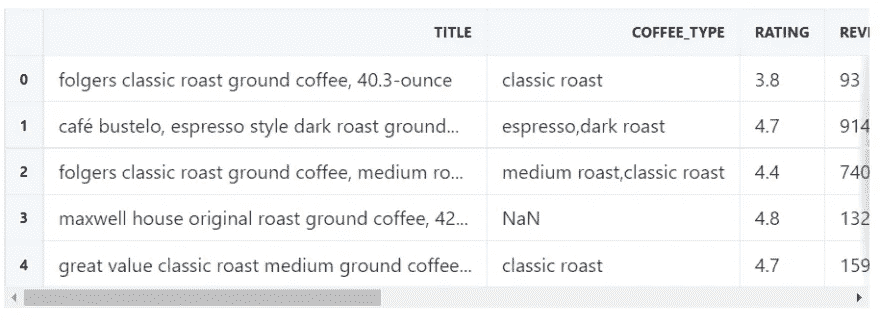

现在我想检查一下关于`[DataFrame](https://pandas.pydata.org/docs/reference/api/pandas.DataFrame.html)`的全部信息。在这里，我正在查看每一列的`Dtype`，如果它是正确的:

```
coffee_df.info()
```

产出:

```
<class 'pandas.core.frame.DataFrame'>
RangeIndex: 1400 entries, 0 to 1399
Data columns (total 9 columns):
  #   Column                      Non-Null Count  Dtype  
---  ------                      --------------  -----  
  0   title                       1400 non-null   object 
  1   coffee_type                 1121 non-null   object 
  2   rating                      1400 non-null   float64
  3   reviews                     1400 non-null   int64  
  4   seller_name                 1400 non-null   object 
  5   thumbnail                   1400 non-null   object 
  6   price                       1400 non-null   float64
  7   weight                      1400 non-null   object 
  8   weight_formatted_to_gramms  1400 non-null   float64
dtypes: float64(3), int64(1), object(5)
memory usage: 98.6+ KB
```

接下来，我希望看到整体数字信息，如平均值、最小值、最大值，以及它们是否有意义:

```
coffee_df.describe()
```

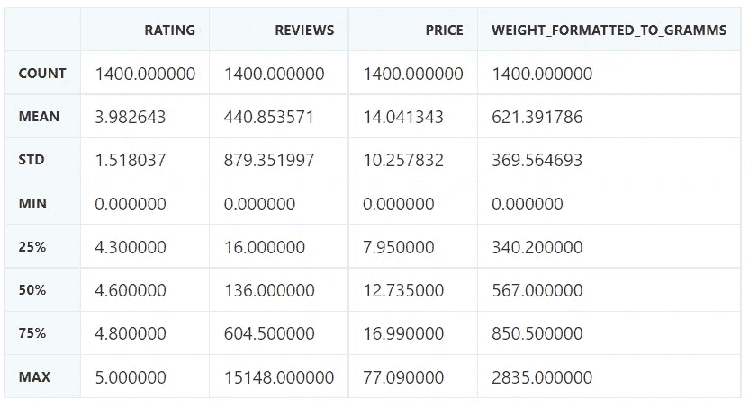

```
coffee_df.shape# (1400, 9)
```

这里我想使用`[DataFrame.corr()](https://pandas.pydata.org/docs/reference/api/pandas.DataFrame.corr.html)`快速浏览一下数字列之间的相关性:

```
import seaborn as sns
import matplotlib as pltax = sns.heatmap(coffee_df.corr(numeric_only=True), annot=True, cmap='Blues')
ax.set_title('Correlation between variables')
```

在这里，我们可以看到咖啡的重量和价格之间有很小的关联，这很符合逻辑:

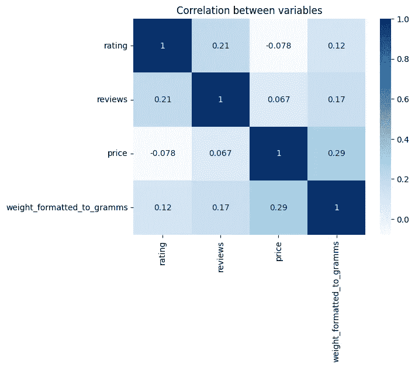

## 什么咖啡标题评论最多？

答案:福尔杰经典烘焙研磨咖啡，中等 ro… / 15148 评论

## 什么咖啡名最有收视率？

答案:社区咖啡馆特殊脱咖啡因中深烘焙咖啡单杯 36 ct 盒装兼容 keurig 2.0 k 杯啤酒/5 级和 108 级评论

```
coffee_df.query('reviews == reviews.max()')[['title', 'reviews']]
```

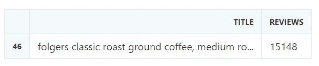

```
coffee_df.query('rating == rating.max()')[['title', 'rating', 'reviews']].sort_values(
    by='reviews', ascending=False
).style.hide(axis='index').background_gradient(cmap='Blues')
```

## 最受欢迎的畅销书是什么？

答案:沃尔玛

```
plt.title('Most Popular Coffee Seller on Walmart')# value_counts() to count how many times each seller is repeated
# head() display only top 10
# sort_values() to sort from highest to lowest
# and plot the dataax = coffee_df['seller_name'].value_counts().head(10).sort_values().plot(kind='barh', figsize=(13,5))
ax.bar_label(ax.containers[0])plt.xlabel('Number of listings')
plt.show()
```

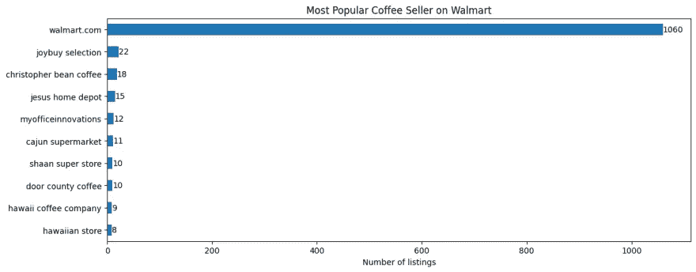

## 总重量是多少克？

答案:869948.5 克，也就是 870 公斤🤓

```
# sum of the all grams
grams = coffee_df['weight_formatted_to_gramms'].sum()
kilorgrams = round(coffee_df['weight_formatted_to_gramms'].sum() / 1000)print(f'Grams: {grams}\nKilograms: {kilorgrams}')Grams: 869948.5
Kilograms: 870
```

## 什么咖啡名的价格最高/最低？

回答最高:lavazza perfetto keurig brewer 单杯 k 杯咖啡盒，深色烘焙，10 盒(每盒 6 个)/价格 77.09 美元

回答最低:

*   folgers 经典烘焙速溶咖啡，单份包装/价格 1 美元
*   经典无咖啡因速溶咖啡水晶包，6 支/价格 1 美元

最高价格

```
# https://pandas.pydata.org/docs/reference/api/pandas.DataFrame.query.html
coffee_df.query('price == price.max()')[['title', 'price']]
```

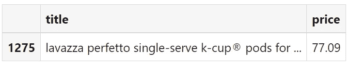

最低价格

*   folgers 经典烘焙速溶咖啡，单份包装/价格 1 美元
*   folgers 经典无咖啡因速溶咖啡水晶包，6 支/价格 1 美元

```
# condition with .min() won't work: coffee_df.loc[(coffee_df['price'] != 0) & (coffee_df['price'].min()), ['price']]# != 0 to exclude 0 values
coffee_df.loc[(coffee_df['price'] != 0) & (coffee_df['price'] < 1.1), ['title', 'price']]
```

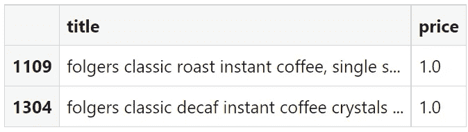

## 什么咖啡的重量最高/最低(克)？

回答最高:

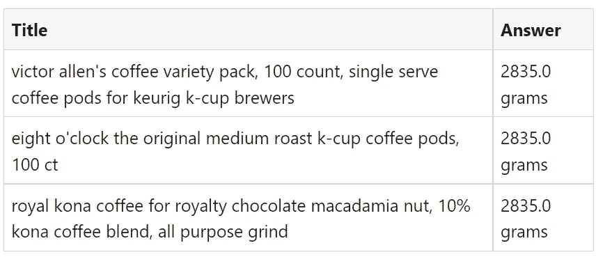

回答最低:

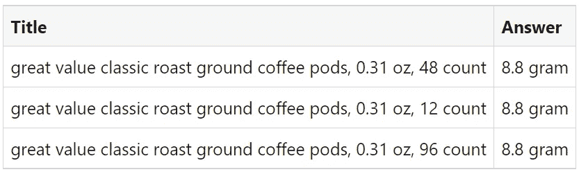

最高重量

```
coffee_df.query('weight_formatted_to_gramms == weight_formatted_to_gramms.max()')[
    ['title', 'weight_formatted_to_gramms']
]
```

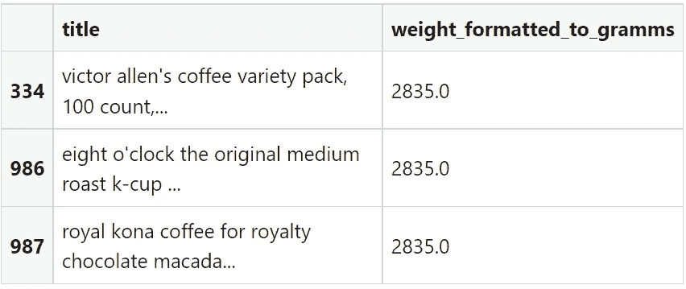

最低重量

由于未正确提取数据，有 7 个指数的值为 0.0。

```
coffee_df.query('weight_formatted_to_gramms == weight_formatted_to_gramms.min()')[
    'weight_formatted_to_gramms'
]
```

产出:

```
305     0.0
425     0.0
703     0.0
890     0.0
957     0.0
991     0.0
1188    0.0
Name: weight_formatted_to_gramms, dtype: float64
```

我决定检查重量不等于`0` `and`重量不高于`10`克:

```
coffee_df.loc[
    (coffee_df['weight_formatted_to_gramms'] != 0.0)
    & (coffee_df['weight_formatted_to_gramms'] < 10),
    ['title', 'weight_formatted_to_gramms'],
]
```

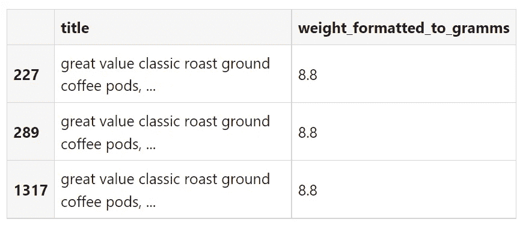

## 最受欢迎的咖啡类型是什么？

答案(前 3 名):

1.  中度烘焙
2.  深色烤肉
3.  阿拉伯咖啡

📌注意:有 125 种不同的咖啡，其中一些可能会丢失。

看看`extraction.py`下的`COFFEE_TYPES`和`list`

拆分咖啡类型并扩展到一个新的列表中

```
# https://pandas.pydata.org/docs/reference/api/pandas.DataFrame.fillna.html
coffee_types = coffee_df['coffee_type'].fillna(method='ffill') # fill with Nonecoffee_types_new = []# split by comma and extend the new list with split values
# https://stackoverflow.com/a/27886807/15164646
for coffee_type in coffee_types:
    coffee_types_new.extend(coffee_type.split(','))
```

获取最常见的咖啡类型

```
coffee_types_new_series = pd.Series(coffee_types_new).dropna()plt.title('Most Popular Coffee Types')ax = coffee_types_new_series.value_counts().sort_values(ascending=True).plot(kind='barh', figsize=(15,10))
ax.bar_label(ax.containers[0]) # bar annotationplt.ylabel('Coffee Type')
plt.xlabel('Number of Occurrences')plt.show()
```

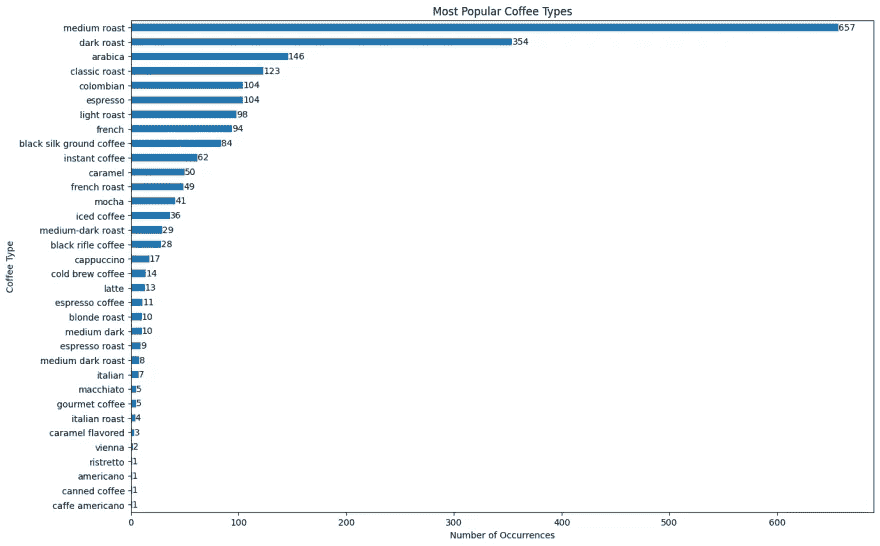

## 最常喝的咖啡重量？

答案:~ 300–500 克

```
sns.jointplot(data=coffee_df, x='price', y='weight_formatted_to_gramms', kind='hex')
```

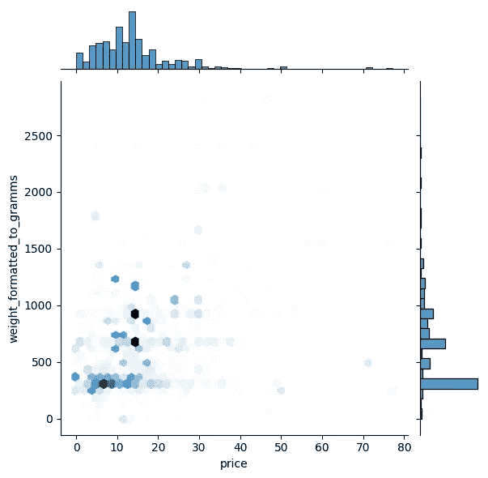

附加图

```
g = sns.PairGrid(coffee_df[['price', 'weight_formatted_to_gramms']], height=4)
g.map_upper(sns.histplot)
g.map_lower(sns.kdeplot, fill=True)
g.map_diag(sns.histplot, kde=True)
```

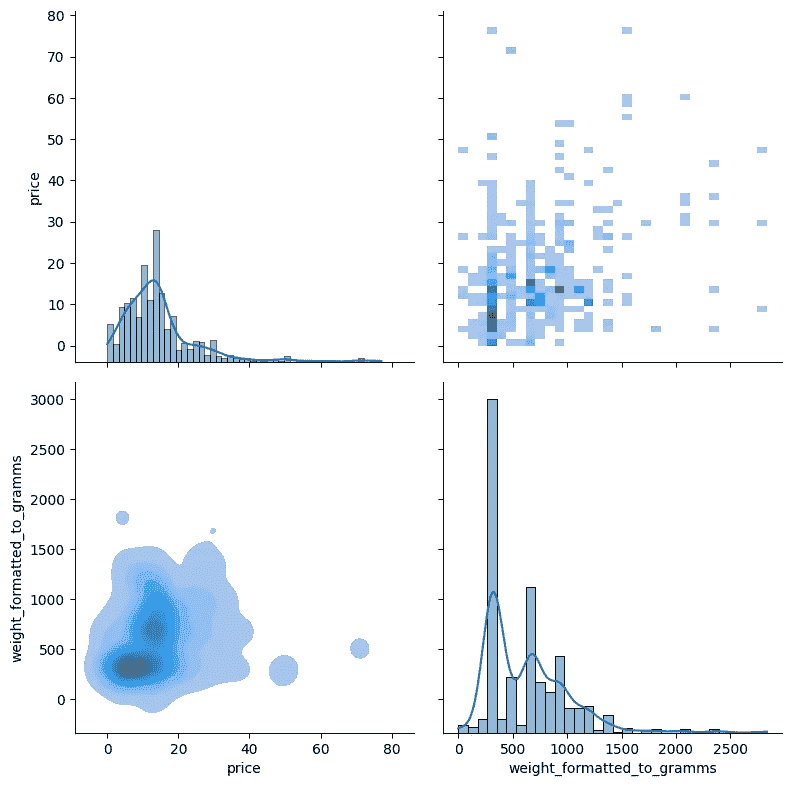

```
sns.displot(
    coffee_df,
    x='price',
    y='weight_formatted_to_gramms',
    kind='kde',
    fill=True,
    thresh=0,
    levels=100,
    cmap='mako',
)
```

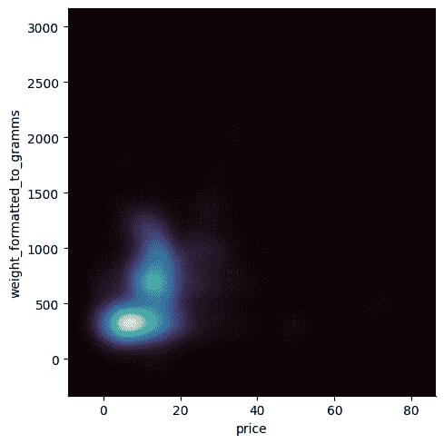

## 更高的重量(克)=更高的价格？

答:这取决于数据集。

## 更低的重量(克)=更低的价格？

答:这取决于数据集。

```
sns.jointplot(data=coffee_df, x='price', y='weight_formatted_to_gramms', kind='reg')
```

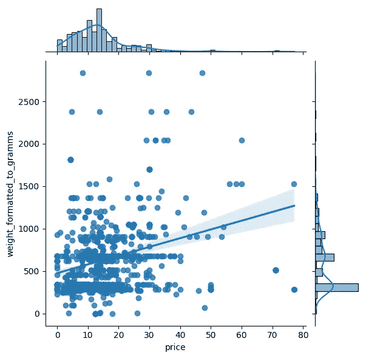

```
ax = sns.scatterplot(
    data=coffee_df,
    x='price',
    y='weight_formatted_to_gramms',
    hue='price',
    size='price',
    sizes=(40, 300),
)# https://stackoverflow.com/a/34579525/15164646
sns.move_legend(ax, 'upper left', bbox_to_anchor=(1, 1.02)) # 1 = X axis, 1.02 = Y axis of the legend.
```

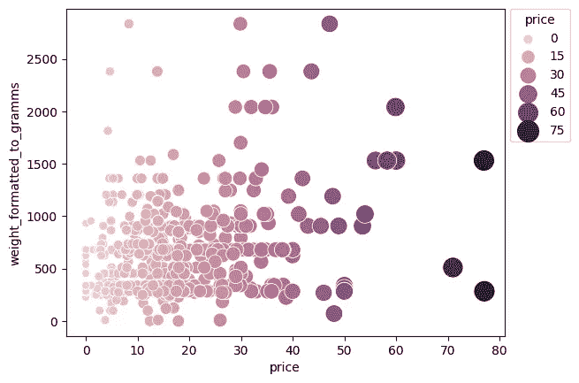

# 结论

在这篇博文中，我们介绍了:

*   [沃尔玛引擎结果 API](https://serpapi.com/walmart-search-api) 。
*   [沃尔玛门店位置的 JSON](https://serpapi.com/walmart-stores)。
*   SerpApi 分页。
*   用`pandas`、`matplotlib`和`seaborn`进行探索性数据分析。
*   分组
*   整理
*   测绘

加入我们的[Twitter](https://twitter.com/serp_api)|[YouTube](https://www.youtube.com/channel/UCUgIHlYBOD3yA3yDIRhg_mg)

添加一个[特征请求](https://github.com/serpapi/public-roadmap/issues)💫还是一个 [Bug](https://github.com/serpapi/public-roadmap/issues) 🐞