# 在 AWS 中无服务器地提供 NCBI 分类法

> 原文：<https://medium.com/geekculture/serve-ncbi-taxonomy-in-aws-serverlessly-d2725b5e2c41?source=collection_archive---------3----------------------->

世界正在快速走向云计算。这是因为云非常容易、便宜、可访问且安全。亚马逊网络服务(AWS)等云提供商为他们的客户接管了许多重复的 tedius IT 维护任务。因此，云用户可以专注于自己的业务逻辑。云还提供了不同的定价选项，可能比本地服务器更具成本效益。此外，与内部部署的云不同，通过互联网访问云是非常容易和安全的。

在本教程中，我将向您展示我如何在 AWS 中管理无服务器的 NCBI 分类法 API 服务。在微生物生物信息学中，最常见的任务之一是遍历 [NCBI 分类学](https://www.ncbi.nlm.nih.gov/taxonomy)，因为生物学家需要在计算机程序中明确定义分类学名称。这包括这些操作:检索学名、分类学等级、给定 taxid 的亲代分类单元和子代分类单元，反之，检索给定分类学名称的 taxid:

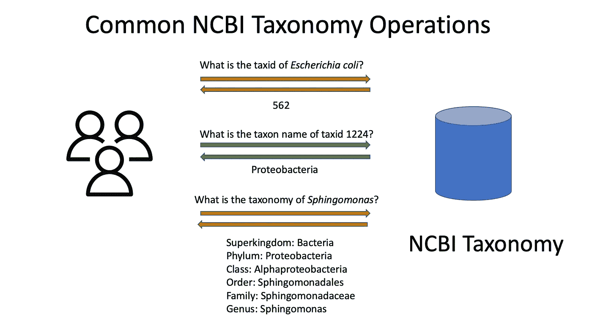

问题是:NCBI 以一组文本文件的形式向我们提供了所有这些信息，而且它们的结构也不容易理解。任务很明确:使这些信息可以通过编程访问。并且访问应该很快，因为这些操作执行得非常频繁。

之前，我已经为这个目的写了[一篇博文](http://dgg32.blogspot.com/2013/07/pyphy-wrapper-program-for-ncbi-sqlite.html)和一个 Python 库 [Pyphy](https://github.com/dgg32/pyphy) 。除了我的方法，Python 世界中还有其他实现( [etetoolkit](http://etetoolkit.org/docs/2.3/tutorial/tutorial_ncbitaxonomy.html) 、 [ncbi-taxonomist](https://pypi.org/project/ncbi-taxonomist/) 和 [taxadb](https://github.com/HadrienG/taxadb) )。但是我想到了一些缺点:

1.  它是特定于语言的。所以用户需要用 Python 这样的语言编写他们的程序来使用这些库。
2.  它是本地的。无论是谁想要使用它，都需要在他们的本地环境中设置所有的东西。之后，每个本地副本都需要单独更新。你不能通过互联网访问我的安装。
3.  它的伸缩性很差。它的性能取决于安装它的硬件。并且没有办法在需要时自动扩展它。

出于这个原因，我将 Pyphy 移入 AWS cloud，并使其成为一个 REST API 服务。它基本上一次解决了所有三个缺点:

1.  它是语言不可知的。不仅几乎所有编程语言都可以使用 REST API，事实上，你甚至可以只使用一个类似于 [Postman](https://www.postman.com/) 的 app，甚至是一个浏览器来进行交互。
2.  它在云上。只要它启动并运行，每个接入互联网的人都可以立即使用它，而无需安装任何东西。
3.  它可以伸缩。可以设置它，以便亚马逊可以增加计算资源来满足需求激增。

我想过各种办法让 Pyphy 上 AWS。但最终我选择了最简单最便宜的方法:

*   后端:极光无服务器。我通过 Cloud9 会话上传了数据。
*   前端:带有 Lambda 函数的 API 网关

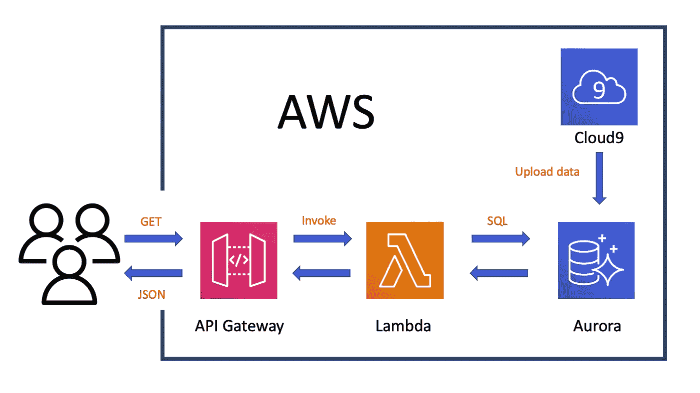

Architecture of the serverless NCBI taxonomy API

然而，无服务器 Aurora 在一段时间的不活动后会跳过一些调用，因为它需要在不活动后唤醒(Stackoverflow 讨论和解决方案是[这里](https://stackoverflow.com/questions/58192747/aws-aurora-serverless-communication-link-failure))。因此，如果您需要持久服务，请考虑使用预配的 Aurora。

成品看起来像:

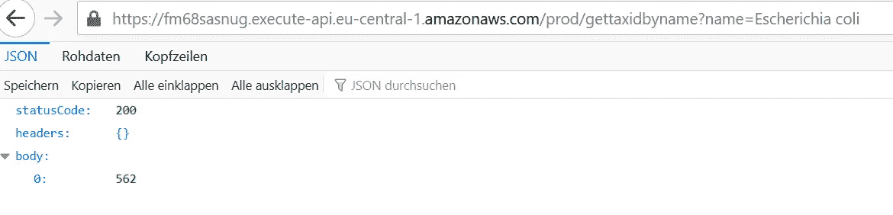

代码可以在我的 Github 库[这里](https://github.com/dgg32/NCBI-taxonomy-in-AWS)找到。

# 1.数据准备

首先从 FTP 下载 [NCBI 分类数据](https://ftp.ncbi.nih.gov/pub/taxonomy/taxdmp.zip)。出于我的目的，我只需要“names.dmp”和“nodes.dmp”。文件“nodes.dmp”包含 taxid、父 taxid 和 rank，而“names.dmp”包含 taxid 和它们的各种分类名称和同义词之间的映射。

为了简化我的数据库设计，我将它们合并到两个 tsv 文件中:“tree.tsv”和“synonym.tsv”。“tree.tsv”将主要信息保存在一个地方，而“synonym.tsv”提供一些 taxids 的同义词的辅助信息。我用一个 Python 脚本“prepyphy.py”完成了这个任务。我在本地机器上完成了这一步。当然，你可以用“原生云”的方式来做:上传两个“dmp”文件和我的“prepyphy.py”到 AWS Cloud9 并执行相同的任务。

# 2.设置无服务器 Aurora

现在是时候去 AWS 了。登录 AWS 账户后，打开 Amazon RDS，创建一个无服务器 Aurora:在“容量类型”下选择“无服务器”:

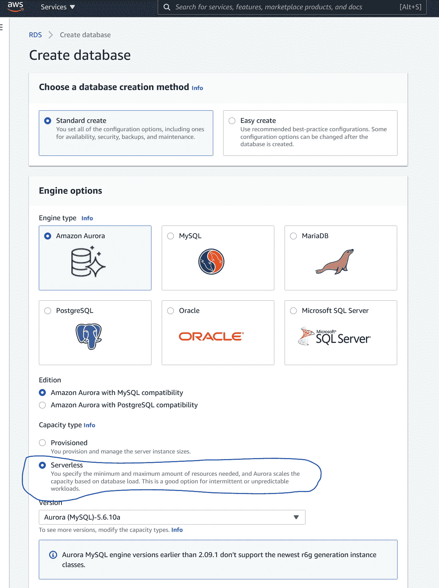

我将我的数据库集群标识符命名为“ncbi ”,并创建了一个主用户名和主密码。稍后数据导入需要此凭据。

至于“连通性”，为本教程创建一个新的 VPC“pyphy”。在“附加配置”下，请检查“数据 API”进行调试。所有其他选项和参数都是默认的。单击“创建数据库”让 AWS 准备数据库。

# 3.将数据导入 Aurora

现在切换到 Cloud9。选择与我们的 Aurora 数据库相同的区域。首先点击“创建环境”，将其命名为“pyphy-import”。在步骤 2“配置设置”，展开“网络设置(高级)”并选择相同的 VPC 作为我们的极光数据库。然后继续完成 Cloud9 环境的创建。

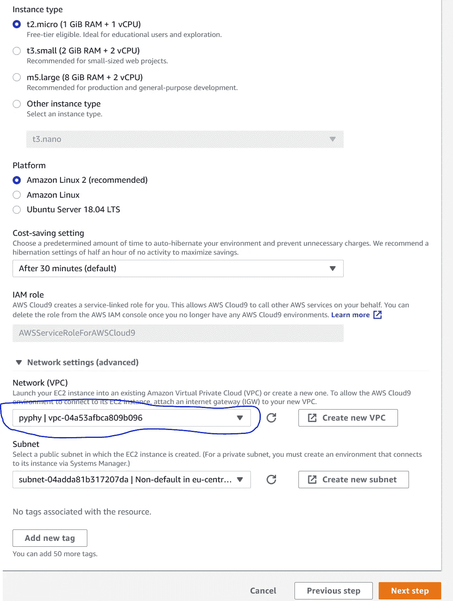

## 3.1.允许 Cloud9 和 Aurora 之间的连接

在继续之前，我们需要配置安全组，以便我们的 Cloud9 环境可以与我们的数据库集群通信。首先，单击我们新创建的“pyphy-import”环境的详细页面，复制安全组标识符。

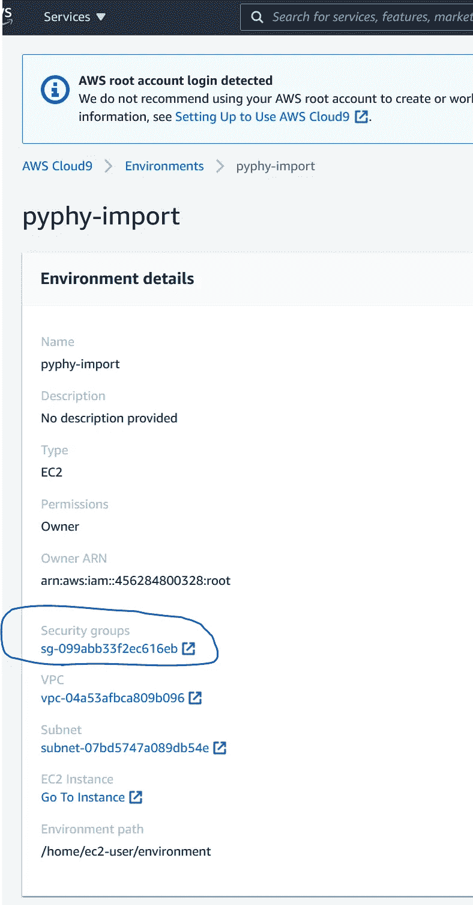

然后前往 RDS 页面，点击进入我们的数据库“ncbi”的详细页面。在其“连接和安全”选项卡下，记下“端点”。然后点击打开“VPC 安全组”链接。

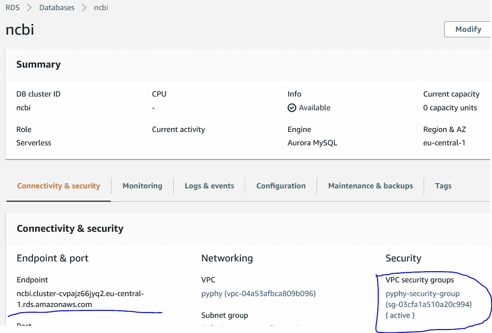

在安全组页面中，单击“入站”和“编辑”，添加一个“MYSQL/Aurora”类型的规则。在“Source”中，选择“Custom”并将 Cloud9 环境安全组名称粘贴到文本字段中。

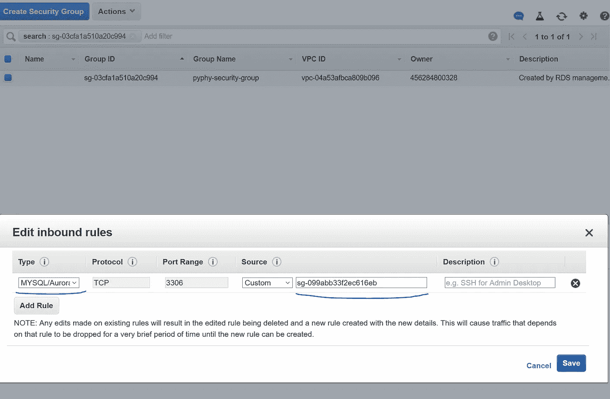

## 3.2.将 tsv 文件导入 Aurora

现在我们已经为数据导入做好了准备。在我们新创建的 Cloud9 环境中，点击“File -> Upload Local Files…”来上传“synonym.tsv”和“tree.tsv”。

在屏幕下半部分的控制台面板中，我们可以使用普通的 mysql 命令通过以下方式登录到我们的 Aurora 数据库:

```
mysql -h [database endpoint] -P 3306 -u [database master username] -p
```

【数据库端点】是我们在 **3.1** 中记下的 URL。主用户名是我们在 **2** 中创建极光数据库时设置的。该命令将从步骤 **2** 询问主密码。登录后，我们可以发出一系列命令来设置数据库“pyphydb”。在其中，我们可以导入和索引两个表:“树”和“同义词”。

完成后，我们可以通过在“查询编辑器”中发出一个查询来检查 Amazon RDS 中是否一切正常。在“连接到数据库”弹出窗口中，输入数据库集群名“ncbi”、主用户名和密码以及数据库名“pyphydb”。请注意，安装无服务器 Aurora 可能需要几分钟时间。一旦进入，发出一个简单的 SQL

```
USE pyphydb;
SELECT * FROM tree WHERE taxid=2;
```

要确认数据已正确导入，请执行以下操作:

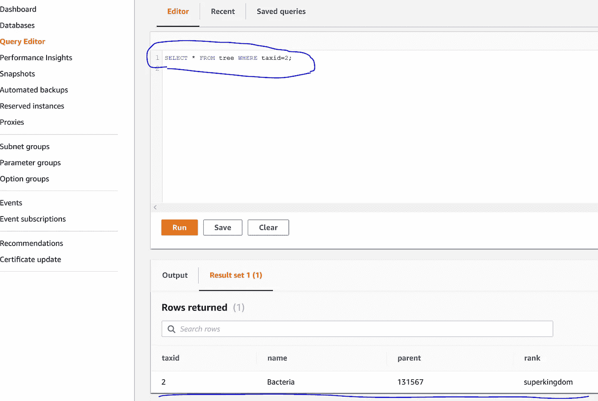

# 4.设置 AWS Lambda

后端数据库完成后，是时候转移到前端了。我们的前端由两个 AWS 组件组成:Lambda 函数和 API 网关。后者负责 URL 处理。Lambda 负责查询我们的 Aurora 数据库。为了理解这一点，想象一下爱丽丝和鲍勃都在面包店工作。爱丽丝站在前面，接受顾客的订单。然后她给鲍勃一个简明的信息，鲍勃去储藏室拿面包给爱丽丝。爱丽丝把面包递给顾客。在我们的例子中，Alice 是 API 网关，Bob 是 Lambda 函数。存储是 Aurora 数据库。

目前，在 AWS 中使用 Lambda 函数存在一些问题。在我们的例子中，我们需要 Python 库“pymysql”来与我们的 Aurora 数据库交互。但是我无法在 Lambda web 编辑器中安装它。相反，我需要创建一个部署包(文件也在我的[存储库](https://github.com/dgg32/NCBI-taxonomy-in-AWS)中)并将它上传到 Lambda。

为此，我在本地机器上创建了一个文件夹，并通过发出以下命令在其中安装了“pymysql ”:

```
pip install PyMySQL -t .
```

事后，我写了三个 Python 脚本。“functions.py”负责 SQL 查询并返回所需的输出。“lambda_function.py”将处理来自 API 网关的消息，并将请求路由到正确的函数。“rds_config.py”存储数据库凭证。请记住在“rds_config.py”中输入所有数据库凭据。在文件夹级别压缩这些文件(不要压缩文件夹)。称之为 deployment.zip。

现在在 Lambda 中，点击“创建函数”->“从头开始创作”。输入函数名，如“pyphy”，并在“运行时”下选择“Python 3.8”。在“高级设置”下，选择与我们的 Cloud9 环境相同的 VPC 和相同的安全组。

一旦进入 Lambda 的编辑器，单击“Actions”->“Upload a . zip file”上传 deployment.zip。过一会儿，你可以在主区域看到代码。确保“运行时设置”中的处理程序为“lambda_function.lambda_handler”。单击橙色的“部署”按钮，使“pyphy”Lambda 函数在线。

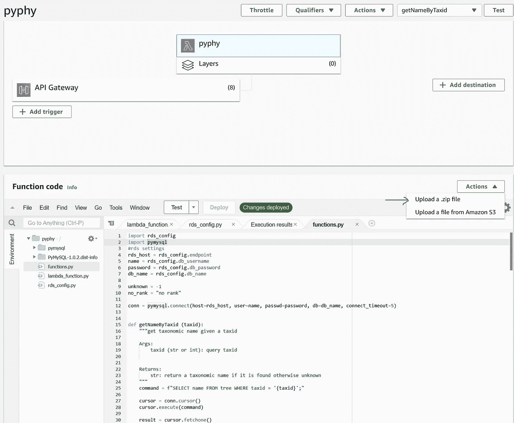

# 5.设置 AWS API 网关

首先，我将我的 API URL 构造成这样:

```
method?field=identifier
```

例如，为了获得“黄杆菌”的 taxid，我可以发出以下查询 URL:

```
[https://[api gateway invoke URL]/gettaxidbyname?name=Flavobacteriia](https://fm68sasnug.execute-api.eu-central-1.amazonaws.com/prod/gettaxidbyname?name=Flavobacteriia)
```

到目前为止，我已经在**步骤 4** 的 Lambda 函数中实现了六个方法。它们应该足以处理最常用的 NCBI 分类法操作。除了需要“name”字段的方法“gettaxidbyname”之外，其他五个函数都需要“taxid”字段。

我们需要在 API Gateway 中定义这些。在 API 网关页面中，单击“创建 API”。在第三个“REST API”(不是“私有”的那个)中点击橙色的“Build”按钮。确保选择了“新 API ”,并给 API 起一个类似“pyphy”的名字。

## 5.1 创建第一个资源及其 GET 方法

创建完成后，我们将进入 API 编辑器页面。单击“操作”下拉菜单，然后单击“创建资源”。在“资源名*”中，输入我们的第一个方法名“getnamebytaxid”，点击“创建资源”。当“/getnamebataxid”突出显示时，再次单击“操作”下拉菜单，然后单击“创建方法”。在“/getnamebataxid”资源下会出现一个小下拉列表。打开小下拉菜单，选择“获取”并单击小“检查”图标进行确认。在右侧面板上，会出现一个设置页面。确保“集成类型”是“Lambda 函数”。在“Lambda Function”输入字段中输入“pyphy”(应该会显示一个提示下拉列表，让我们自动完成)。点击“保存”。

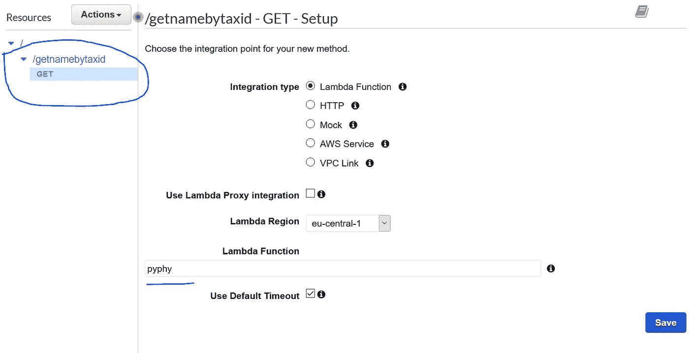

现在“方法执行”面板出现。单击第一个框中的“方法请求”。展开“URL 查询字符串参数”，点击“添加查询字符串”添加“taxid”。单击“必需”下的复选框。

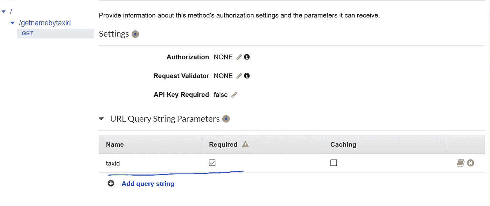

点击“←方法执行”返回“方法执行”。现在点击“集成请求”并展开“映射模板”。选择“没有定义模板时(推荐)”。点击“添加映射模板”，输入“应用程序/json”，点击小“检查”图标确认。下面会出现一个文本框。输入并保存:

“/getnamebataxid”的配置到此结束。

## 5.2 对其他四个“bytaxid”资源重复相同的操作

现在我们可以设置另外四个“bytaxid”资源“/getdictpathbytaxid”、“getparentbytaxid”、“getrankbytaxid”和“/getsonsbytaxid”。程序完全一样。

## 5.3 添加最终资源

最后一个资源“/gettaxidbyname”需要一个“名称”输入字段。它的设置与上面的几乎相同，不同之处仅在于:

1.  在“方法请求”下的“URL 查询字符串参数”中，“名称”是必填字段。
2.  在“集成请求”下的“映射模板”中，文本框应为:

## 5.4 部署 API

现在是时候部署 API 了。单击“操作”，然后单击“部署 API”。在弹出窗口中，输入“生产”作为部署阶段，然后单击“部署”。这将导致右侧面板中出现一个新页面。在“调用 URL”下，我们可以找到我们自己的 URL 端点。

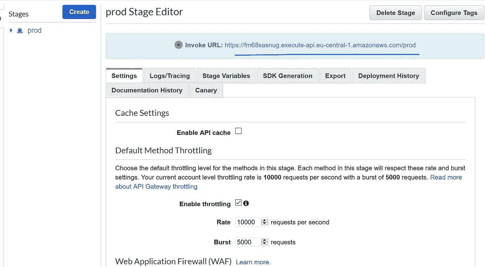

## 5.5 测试 API

现在让我们测试 API 是否工作。

1.  通过发出以下命令获取“大肠杆菌”的 taxid:

```
[https://[your Invoke URL]/prod/gettaxidbyname?name=Escherichia%20coli](https://fm68sasnug.execute-api.eu-central-1.amazonaws.com/prod/gettaxidbyname?name=Escherichia%20coli)
```

我在正文部分找到了“562 ”:


2.发出以下命令获取 taxid 1224 的名称:

```
[https://[your Invoke URL]/prod/getnamebytaxid?taxid=1224](https://fm68sasnug.execute-api.eu-central-1.amazonaws.com/prod/getnamebytaxid?taxid=1224)
```

我得到了“变形菌”:

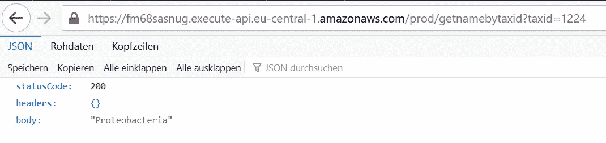

3.通过发出以下命令获取鞘氨醇单胞菌(taxid 13687)的分类路径

```
[https://[your Invoke URL]/prod/getdictpathbytaxid?taxid=13687](https://fm68sasnug.execute-api.eu-central-1.amazonaws.com/prod/getdictpathbytaxid?taxid=13687)
```

我回来了:

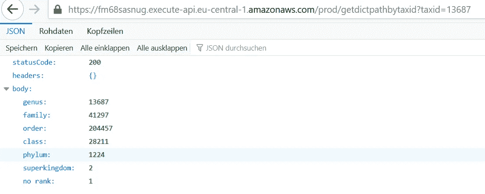

# 6.结论

成功！现在我们有了一个在线 API，可以用 NCBI 分类法为全世界服务。它是语言无关的，可扩展的，易于使用的。维护起来也相对容易:只要上传 tree.tsv 和 synonym.tsv 的更新版本就搞定了。

当然，在 AWS 中还有其他方法可以实现同样的目标。例如，我可以考虑使用应用程序负载平衡器将输入流量分发到 Fargate，该 Fargate 使用 node.js 查询 Aurora 数据库。也许我可以摆脱 Aurora，运行一个由 EKS 协调的节点舰队。

本教程显示了设置整个事情的艰难的方式。我现在打算用 Terraform 来总结这个教程，这样整个基础设施就可以在一瞬间搭建起来。此外，Ansible 和 Chef 等其他工具也可以用来配置数据库。在这样一个项目中学习的可能性真的是无穷无尽的。

现在，轮到你发挥你的创造力给我展示一些有趣的 AWS 项目了！

*更新:在我的新文章《* [*五个命令通过 Pulumi*](/star-gazers/five-commands-build-two-ncbi-apis-on-the-cloud-via-pulumi-9ecf116e9dc0) *在云上构建两个 NCBI API》中，我在 Pulumi 的帮助下对基础设施进行了编码。所以现在设置只需要三个命令。*

[](https://dgg32.medium.com/membership) [## 加入媒介与我的介绍链接-黄思兴

### 作为一个媒体会员，你的会员费的一部分会给你阅读的作家，你可以完全接触到每一个故事…

dgg32.medium.com](https://dgg32.medium.com/membership)