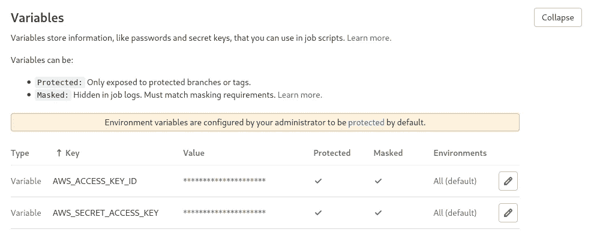
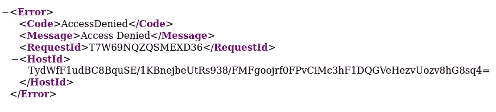
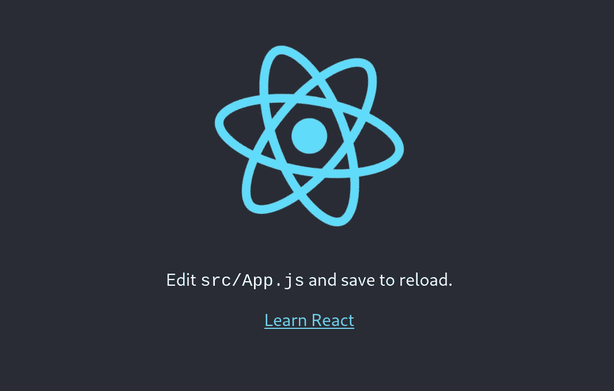

# 使用 Gitlab 和 Terraform，通过 AWS Cloudfront 为您的 React 应用提供服务

> 原文：<https://medium.com/geekculture/serve-your-react-app-with-aws-cloudfront-using-gitlab-and-terraform-322b2526943e?source=collection_archive---------3----------------------->


Photo by [Alex Machado](https://unsplash.com/@alexmachado?utm_source=medium&utm_medium=referral) on [Unsplash](https://unsplash.com?utm_source=medium&utm_medium=referral)

在本文中，我们将看到如何使用 Terraform 为 AWS 配置和 Gitlab CI 为部署在 Cloudfront 后面部署 React 应用程序。

# **地形初始化**

我们将在本教程中使用 terraform，所以让我们从初始化工作空间开始。

```
$ mkdir terraform-react && cd terraform-react
$ terraform init
```

# S3 桶创作

我们首先需要的是一个空的 S3 桶，我们将把 React 编译后的文件上传到这个桶中。

创建一个新的 main.tf 文件，并为我们的 bucket 添加配置。 ***本教程使用的桶名为“我的-反应-桶”。在 AWS 上，存储桶名称是全局唯一的，因此您需要为自己唯一的存储桶更改名称。***

> **注意:**我们希望我们的文件只被 Cloudfront 访问，所以我们添加了 AWS _ S3 _ bucket _ public _ access _ block terra form 块来禁止我们的文件公开。

```
$ terraform init
$ terraform applyTerraform used the selected providers to generate the following execution plan. Resource actions are indicated with the following symbols:
  + createTerraform will perform the following actions:# aws_s3_bucket.static_react_bucket will be created
  + resource "aws_s3_bucket" "static_react_bucket" {
      + acceleration_status         = (known after apply)
      + acl                         = "private"
      + arn                         = (known after apply)
      + bucket                      = "my-react-bucket"
      + bucket_domain_name          = (known after apply)
      + bucket_regional_domain_name = (known after apply)
      + force_destroy               = false
      + hosted_zone_id              = (known after apply)
      + id                          = (known after apply)
      + region                      = (known after apply)
      + request_payer               = (known after apply)
      + tags                        = {
          + "Name" = "my-react-bucket"
        }
      + tags_all                    = {
          + "Name" = "my-react-bucket"
        }
      + website_domain              = (known after apply)
      + website_endpoint            = (known after apply)+ versioning {
          + enabled    = true
          + mfa_delete = false
        }
    }# aws_s3_bucket_public_access_block.block_public_access will be created
  + resource "aws_s3_bucket_public_access_block" "block_public_access" {
      + block_public_acls       = true
      + block_public_policy     = true
      + bucket                  = (known after apply)
      + id                      = (known after apply)
      + ignore_public_acls      = true
      + restrict_public_buckets = true
    }Plan: 2 to add, 0 to change, 0 to destroy.Do you want to perform these actions?
  Terraform will perform the actions described above.
  Only 'yes' will be accepted to approve.Enter a value: yesaws_s3_bucket.static_react_bucket: Creating...
aws_s3_bucket.static_react_bucket: Creation complete after 3s [id=my-react-bucket]
aws_s3_bucket_public_access_block.block_public_access: Creating...
aws_s3_bucket_public_access_block.block_public_access: Creation complete after 1s [id=my-react-bucket]Apply complete! Resources: 2 added, 0 changed, 0 destroyed.
```

# gitlab 的 IAM 访问

Gitlab CI 将被配置为自动将我们的 React 代码上传到我们新创建的 S3 存储桶。在 AWS 中，权限由一个名为 IAM(身份和访问管理)的服务管理。让我们为 Gitlab 用户创建一个新策略，让它访问我们的 bucket。

去[https://console.aws.amazon.com/iam/home?region=us-east-1#/users](https://console.aws.amazon.com/iam/home?region=us-east-1#/users) 并创建一个名为“gitlab-user”的仅具有编程访问权限的新用户。暂时不要给予任何许可，我们将通过 terraform 处理此事。**下载访问密钥，因为我们将需要它们来配置 Gitlab CI。**

在 terraform- react 文件夹中创建一个新的 iam.tf 文件，内容如下:

```
$ terraform apply
...
Plan: 2 to add, 0 to change, 0 to destroy.Do you want to perform these actions?
  Terraform will perform the actions described above.
  Only 'yes' will be accepted to approve.Enter a value: yesaws_iam_policy.ci_policy: Creating...
aws_iam_policy.ci_policy: Creation complete after 2s [id=arn:aws:iam::XXXXXXXXXXXX:policy/gitlab-ci-policy]
aws_iam_policy_attachment.gitlab_ci_attachment: Creating...
aws_iam_policy_attachment.gitlab_ci_attachment: Creation complete after 1s [id=gitlab-ci-attachment]Apply complete! Resources: 2added, 0 changed, 0 destroyed.
```

我们现在有一个 gitlab-user IAM 用户，他被允许在我们的 S3 桶上上传文件。接下来，我们将配置 Gitlab CI 来自动化部署。

# 配置 Gitlab CI

**首先**，我们需要告诉 gitlab CI 在运行管道时使用我们的用户。为此，转到 CI 设置(设置- > CI/CD - >变量)。

用之前获得的值添加变量 AWS_ACCESS_KEY_ID。
用之前得到的值添加变量 AWS_SECRET_ACCESS_KEY。



Gitlab CI variables configuration

**第二个**，在 React 项目的根目录下创建一个名为*的新文件。gitlab-ci.yml* 。该文件将包含 Gitlab CI 运行程序运行的配置和阶段。对于本教程，我们将创建一个基本文件，它将只处理两个步骤:建立应用程序，并将其上传到 S3。

你可以在 gitlab 上查看管道状态。一旦管道成功，您可以使用 aws cli 验证文件是否在存储桶上。

```
$ aws s3 ls s3://my-react-bucket
                           PRE static/
2021-07-04 17:34:05       1092 asset-manifest.json
2021-07-04 17:34:05       3870 favicon.ico
2021-07-04 17:34:05       3032 index.html
2021-07-04 17:34:05       5347 logo192.png
2021-07-04 17:34:05       9664 logo512.png
2021-07-04 17:34:05        492 manifest.json
2021-07-04 17:34:05         67 robots.txt
```

让我们停在这里，看看我们在哪里！我们已经创建了 CI 配置，因此每次在 master 上推送时，我们的代码都是在 S3 上构建和上传的。我们的 gitlab-user IAM 用户只能访问这个 bucket，并且只能上传对象，这是首选，因为它不需要任何其他权限。

我们的 bucket 是私有的，不允许公共文件，那么我们如何访问这些文件呢？

# **云锋分布**

Cloudfront 是主要的 CDN(内容交付网络)之一。它允许高效的缓存和快速的文件传送给用户。你不需要为 S3 和 Cloudfront 之间的带宽付费，只需要支付 Cloudfront 之外的带宽。

> **注意:**你可以查看这篇博客文章，更好地了解在 S3 使用 Cloudfront 的优势:[https://AWS . Amazon . com/blogs/networking-and-content-delivery/Amazon-S3-Amazon-Cloudfront-a-match-made-in-the-cloud/](https://aws.amazon.com/blogs/networking-and-content-delivery/amazon-s3-amazon-cloudfront-a-match-made-in-the-cloud/)

我们将使用 terraform 来创建我们的 Cloudfront web 发行版。

让我们来看看 React 的一些特性:

*   *default_cache_behavior* :这个块将允许高效的缓存(基本上我们缓存所有东西:)。此外，我们将所有 http 调用重定向到 https。最后，我们要求 cloudfront 压缩我们的静态文件，以减少带宽使用。
*   *ordered_cache_behavior* :当你发布一个新版本的应用时，你的代码会发生变化。JS 文件将在它们的名字中包含新的散列，允许浏览器检索新文件。然而，您的 index.html 文件仍将被称为 index.html，因此仍将被缓存至少 86400 秒。为了避免这种行为，我们添加了一条规则来告诉 Cloudfront 不要缓存 index.html。这样，每次部署新代码时，用户都会得到新的 index.html 文件。
*   *custom_error_response* :如果你使用 React Router 这样的库，你会使用 S3 上不存在的路径(默认情况下，如果你想有一条/home 路由，并尝试直接导航到这条路由，cloudfront 会尝试在 S3 上找到它。因为它不存在，您将得到一个 403 错误)。为了处理这种情况，我们添加了两个自定义错误响应，将 403 和 404 重定向到 index.html 文件。

现在，您可以使用这个新文件运行 terraform。耐心点☕ cloudfront 发行版需要一段时间才能创建。

```
$ terraform apply
...
Plan: 2 to add, 0 to change, 0 to destroy.Do you want to perform these actions?
  Terraform will perform the actions described above.
  Only 'yes' will be accepted to approve.Enter a value: yesaws_cloudfront_origin_access_identity.oai: Creating...
aws_cloudfront_origin_access_identity.oai: Creation complete after 1s [id=E11IPI5S9FK6LQ]
aws_cloudfront_distribution.cf_distribution: Creating...
aws_cloudfront_distribution.cf_distribution: Still creating... [10s elapsed]
aws_cloudfront_distribution.cf_distribution: Still creating... [20s elapsed]
aws_cloudfront_distribution.cf_distribution: Still creating... [30s elapsed]
aws_cloudfront_distribution.cf_distribution: Still creating... [40s elapsed]
aws_cloudfront_distribution.cf_distribution: Still creating... [50s elapsed]
aws_cloudfront_distribution.cf_distribution: Still creating... [1m0s elapsed]
aws_cloudfront_distribution.cf_distribution: Still creating... [1m10s elapsed]
aws_cloudfront_distribution.cf_distribution: Still creating... [1m20s elapsed]
aws_cloudfront_distribution.cf_distribution: Still creating... [1m30s elapsed]
aws_cloudfront_distribution.cf_distribution: Still creating... [1m40s elapsed]
aws_cloudfront_distribution.cf_distribution: Still creating... [1m50s elapsed]
aws_cloudfront_distribution.cf_distribution: Still creating... [2m0s elapsed]
aws_cloudfront_distribution.cf_distribution: Still creating... [2m10s elapsed]
aws_cloudfront_distribution.cf_distribution: Still creating... [2m20s elapsed]
aws_cloudfront_distribution.cf_distribution: Still creating... [2m30s elapsed]
aws_cloudfront_distribution.cf_distribution: Creation complete after 2m31s [id=E1Q7A09488OCJI]Apply complete! Resources: 2 added, 0 changed, 0 destroyed.
```

> **注意:**导航至[https://console.aws.amazon.com/cloudfront/home](https://console.aws.amazon.com/cloudfront/home?region=us-east-1#)以检索分发 URL

如果您现在尝试访问 index.html 文件，将会收到 403 错误



403 issue when requesting index.html

问题是现在你的 S3 桶仍然是私有的，不允许任何人访问桶的内容。我们需要让我们的 Cloudfront 发行版访问 S3 桶。

将以下内容添加到 terraform main.tf 文件中。

```
$ terraform apply
...
Plan: 1 to add, 0 to change, 0 to destroy.Do you want to perform these actions?
  Terraform will perform the actions described above.
  Only 'yes' will be accepted to approve.Enter a value: yesaws_s3_bucket_policy.react_app_bucket_policy: Creating...
aws_s3_bucket_policy.react_app_bucket_policy: Creation complete after 1s [id=my-react-bucket-20210704]Apply complete! Resources: 1 added, 0 changed, 0 destroyed.
```

重试调用你的发行版上的 index.html 页面，你现在应该看到你的应用程序！



Basic CRA index.html

# 奖励:使用你自己的域名

到目前为止我们使用的是 Cloudfront 分发默认域(https://….cloudfront.net)。一般来说，您会希望使用自己的域作为入口点。Cloudfront 也会考虑到这一点。让我们看看如何实现它。

*首先*，在 **us-east-1** 地区的 ACM(亚马逊证书管理器)中创建一个新证书。您必须使用此区域，您的证书才有资格与 Cloudfront 一起使用。前往 https://console.aws.amazon.com/acm/home?region=us-east-1 的为您的域名创建证书(在我们的例子中是 example.com)。记下证书 ARN，以备将来使用。

> **注意:**我没有包括 ACM 请求的 terraform 代码，因为您需要为此更改提供商的地区。如果你想有一个多地区供应商的工作实例，请参考我的另一篇文章。

[](https://m1ck43l-c.medium.com/create-your-own-url-minifier-using-s3-cloudfront-and-terraform-a3c0f5a1af8b) [## 使用 S3、Cloudfront 和 Terraform 创建您自己的 URL minifier

### 你有没有想过如何创建你自己的网址迷你服务？

m1ck43l-c.medium.com](https://m1ck43l-c.medium.com/create-your-own-url-minifier-using-s3-cloudfront-and-terraform-a3c0f5a1af8b) 

*第二个*，创建 route53 记录:

```
$ terraform apply
...
Plan: 1 to add, 0 to change, 0 to destroy.Do you want to perform these actions?
  Terraform will perform the actions described above.
  Only 'yes' will be accepted to approve.Enter a value: yesaws_route53_record.cf_dns: Creating...
aws_route53_record.cf_dns: Still creating... [10s elapsed]
aws_route53_record.cf_dns: Still creating... [20s elapsed]
aws_route53_record.cf_dns: Still creating... [30s elapsed]
aws_route53_record.cf_dns: Creation complete after 33s [id=Z07080572RGHUGWY9O1KG_example.com_A]Apply complete! Resources: 1 added, 0 changed, 0 destroyed.
```

我们的域已经准备好了，现在我们可以更新我们的 Cloudfront 发行版来支持这个域。

> 不要忘记删除之前的 viewer_certificate 块！

```
$ terraform apply
...
Plan: 0 to add, 1 to change, 0 to destroy.Do you want to perform these actions?
  Terraform will perform the actions described above.
  Only 'yes' will be accepted to approve.Enter a value: yesaws_cloudfront_distribution.cf_distribution: Still modifying... [id=E1Q7A09488OCJI, 10s elapsed]
aws_cloudfront_distribution.cf_distribution: Still modifying... [id=E1Q7A09488OCJI, 20s elapsed]
aws_cloudfront_distribution.cf_distribution: Still modifying... [id=E1Q7A09488OCJI, 30s elapsed]
aws_cloudfront_distribution.cf_distribution: Still modifying... [id=E1Q7A09488OCJI, 40s elapsed]
aws_cloudfront_distribution.cf_distribution: Still modifying... [id=E1Q7A09488OCJI, 50s elapsed]
aws_cloudfront_distribution.cf_distribution: Still modifying... [id=E1Q7A09488OCJI, 1m0s elapsed]
aws_cloudfront_distribution.cf_distribution: Still modifying... [id=E1Q7A09488OCJI, 1m10s elapsed]
aws_cloudfront_distribution.cf_distribution: Still modifying... [id=E1Q7A09488OCJI, 1m20s elapsed]
aws_cloudfront_distribution.cf_distribution: Still modifying... [id=E1Q7A09488OCJI, 1m30s elapsed]
aws_cloudfront_distribution.cf_distribution: Still modifying... [id=E1Q7A09488OCJI, 1m40s elapsed]
aws_cloudfront_distribution.cf_distribution: Still modifying... [id=E1Q7A09488OCJI, 1m50s elapsed]
aws_cloudfront_distribution.cf_distribution: Still modifying... [id=E1Q7A09488OCJI, 2m0s elapsed]
aws_cloudfront_distribution.cf_distribution: Still modifying... [id=E1Q7A09488OCJI, 2m10s elapsed]
aws_cloudfront_distribution.cf_distribution: Still modifying... [id=E1Q7A09488OCJI, 2m20s elapsed]
aws_cloudfront_distribution.cf_distribution: Still modifying... [id=E1Q7A09488OCJI, 2m30s elapsed]
aws_cloudfront_distribution.cf_distribution: Still modifying... [id=E1Q7A09488OCJI, 2m40s elapsed]
aws_cloudfront_distribution.cf_distribution: Still modifying... [id=E1Q7A09488OCJI, 2m50s elapsed]
aws_cloudfront_distribution.cf_distribution: Still modifying... [id=E1Q7A09488OCJI, 3m0s elapsed]
aws_cloudfront_distribution.cf_distribution: Still modifying... [id=E1Q7A09488OCJI, 3m10s elapsed]
aws_cloudfront_distribution.cf_distribution: Still modifying... [id=E1Q7A09488OCJI, 3m20s elapsed]
aws_cloudfront_distribution.cf_distribution: Still modifying... [id=E1Q7A09488OCJI, 3m30s elapsed]
aws_cloudfront_distribution.cf_distribution: Still modifying... [id=E1Q7A09488OCJI, 3m40s elapsed]
aws_cloudfront_distribution.cf_distribution: Still modifying... [id=E1Q7A09488OCJI, 3m50s elapsed]
aws_cloudfront_distribution.cf_distribution: Still modifying... [id=E1Q7A09488OCJI, 4m0s elapsed]
aws_cloudfront_distribution.cf_distribution: Still modifying... [id=E1Q7A09488OCJI, 4m10s elapsed]
aws_cloudfront_distribution.cf_distribution: Still modifying... [id=E1Q7A09488OCJI, 4m20s elapsed]
aws_cloudfront_distribution.cf_distribution: Still modifying... [id=E1Q7A09488OCJI, 4m30s elapsed]
aws_cloudfront_distribution.cf_distribution: Still modifying... [id=E1Q7A09488OCJI, 4m40s elapsed]
aws_cloudfront_distribution.cf_distribution: Still modifying... [id=E1Q7A09488OCJI, 4m50s elapsed]
aws_cloudfront_distribution.cf_distribution: Still modifying... [id=E1Q7A09488OCJI, 5m0s elapsed]
aws_cloudfront_distribution.cf_distribution: Modifications complete after 5m7s [id=E1Q7A09488OCJI]Apply complete! Resources: 0 added, 1 changed, 0 destroyed.
```

🚀现在可以从您自己的域访问您的应用程序了！

# 结论

使用 S3 和 Cloudfront 在 AWS 上托管 React 应用很容易，并且允许以非常有限的成本进行几乎无限的扩展。

现在，由于 Gitlab CI 集成，每次您在 master 上推送时，您的应用程序都会自动部署。