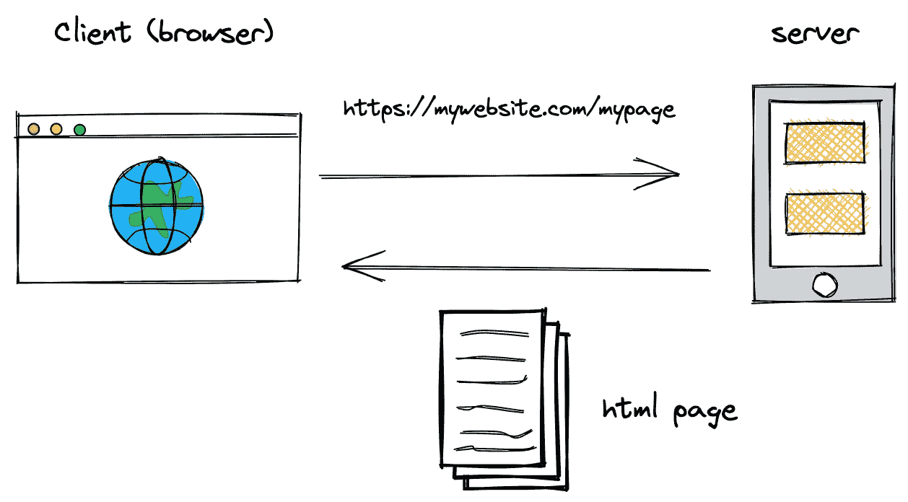
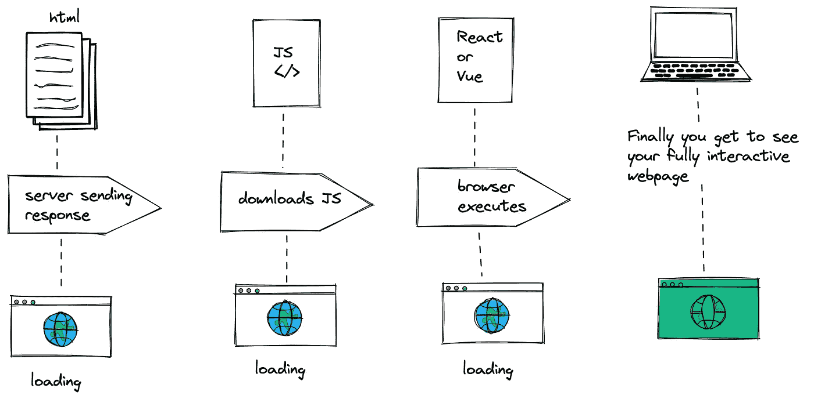
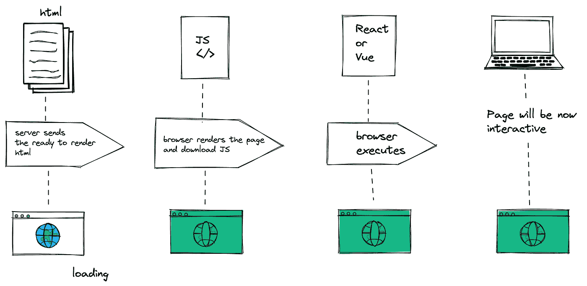

# 简化的服务器端渲染

> 原文：<https://medium.com/geekculture/server-side-rendering-simplified-fd708d5520ba?source=collection_archive---------7----------------------->

**SSR** 代表服务器端渲染。我曾与 next.js、gatsby SSR 和 nuxt.js 广泛合作过，但当谈到面试讨论时，出于某种原因，我最终变得不那么自信了。由于学习曲线很低，我们中的大多数人会直接跳进去，而不去研究为什么🌜—至少我是这样😟

我在几乎所有的面试中都会遇到的一个基本问题是，

对于你的应用程序，你如何决定是否使用服务器端渲染？

暂停一下，试着回答，如果你不喜欢太多的悬崖，那么这篇短文可能会让你感兴趣。

## 什么是服务器端渲染？

那么什么是服务器端渲染呢？让我不要用如此普通的定义来烦你。服务器端渲染就是你向服务器请求一些 HTML 页面(可能有一个类似【https://mywebsite.com/mypage】T2 的链接)，服务器为你提供浏览器可以处理的 HTML 页面(可能有一些相关的标题)。

简单地说，你可以把客户端渲染想象成从头开始建造你的房子，而服务器端渲染就像买了一个预建的带家具的房子并搬进去。

嗯，这听起来很天真——这不是一个精确的答案，SSR 做了很多，但应该是一个好的开始。

让我用图表的方式快速向您展示客户端 SPA 渲染和服务器端 SPA 渲染是如何工作的。

## 典型的客户端渲染— SPA(可能是您的 React/Vue 应用程序)

## 服务器端渲染— SPA

希望上面的图表不言自明。让我们探索其他部分:)

## 通用应用程序

现在下一个问题来了，CSR 和 SSR 选哪个？

嗯，我们实际上可以利用这两者。知道怎么做吗？这些被称为通用应用程序(next.js，nuxt.js，gatsby 使它更容易)。在通用 Web 应用程序中，初始渲染将在服务器中完成，一旦页面加载，客户端渲染将接管。这确保了我们有良好的搜索引擎优化，快速的第一次渲染，以及在应用程序中浏览时的速度。尽管如此，这是开发者的选择，用期望的方式来回答应用程序的需求。

## 使用 SSR 时要考虑的权衡

**发展制约**

如果您已经使用过以上任何 SSR 框架，您可能会遇到像 window is not defined 这样的错误。这是因为特定于浏览器的代码只能在特定的生命周期挂钩中使用；一些外部库可能需要特殊处理才能在服务器渲染的应用程序中运行。

**构建设置和部署要求**

服务器渲染的应用程序需要一个可以运行 Node.js 服务器的环境。

**更多服务器端负载**

这样就带来了服务器端的负载，在 Node.js 中呈现一个完整的应用程序将会比只提供静态文件更耗费 CPU 资源。因此，显然要提前为相应的负载做好准备。

最后，你应该在你的下一个应用中使用它吗？为了回答这个问题，我想引用新 vue 文档中的一句话，

> 在为你的应用程序使用 SSR 之前，你应该问的第一个问题是你是否真的需要它。这主要取决于内容时间对你的应用有多重要。例如，如果您正在构建一个内部仪表板，在这个仪表板中，初始加载额外的几百毫秒并不重要，那么 SSR 将是一个大杀器。然而，在内容获取时间非常关键的情况下，SSR 可以帮助您实现最佳的初始加载性能。

你可以在 https://vuejs.org/guide/scaling-up/ssr.html 了解更多信息

如果您有任何建议(因为我是新手)或希望就此话题进行更多讨论，请在 mariappangameo@gmail.comT3[T5【给我写信】。我也很乐意在 Linkedin](mailto:mariappangameo@gmail.com)上与大家联系。