# 科特林、格雷尔和 CDK 的无服务器 AWS

> 原文：<https://medium.com/geekculture/serverless-aws-with-kotlin-gradle-and-cdk-d6bfe820b85?source=collection_archive---------3----------------------->

最近，我一直在为我的几个移动应用程序向无服务器架构的思维模式过渡。一个特别的应用程序有一个由一个 rest 调用组成的后端。这个调用每次都由开发人员触发，然后更新被发送到移动客户端。为了与移动端共享代码库，我有一个 KTOR 服务器实例，并租用了一台服务器来托管它。

我在探索无服务器选项时遇到了 Lambda，发现它非常适合这个用例。单个 lambda 函数可以快速设置，并且以当前触发请求的数量，它将比整个物理实例更便宜。API 网关可以位于前端，并配置确切的 rest 方案和任何负载平衡器。理想的架构应该是这样的:


Two environments for developement and production

在设置这个的时候，我碰到了 AWS [CDK](https://aws.amazon.com/cdk/) 。云开发工具包允许您使用自己选择的语言用代码配置您的堆栈。因为我已经有了一个纯 Kotlin 项目，并且 CDK 提供了 Java 绑定，所以做这个选择很容易。Kotlin 和 gradle 没有得到 AWS 提供的云工具集的官方支持，但经过一些调整，很有可能开始工作并让您满意。这篇文章将带领你使用 Kotlin、Gradle、AWS API Gateway 和 AWS Lambda 建立一个 CDK 堆栈。

我将假设 gradle 和 kotlin 的工作知识，不会深入到设置您的多模块项目的确切过程中。

## 设置

首先，我们将使用`gradle init`来设置我们的项目。我们将选择一个应用程序项目，使用 Kotlin 作为选择的语言，对子项目说是，并选择 Kotlin 作为我们的脚本 DSL 语言。

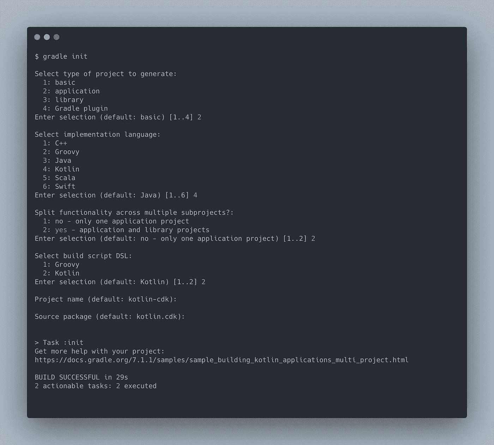

Project creation

删除除了两个子项目之外的所有子项目，并将它们重命名为`lambdas`和`stack`。`lambdas`将保存我们所有的核心业务逻辑、执行所需的任何附加资产以及实际的 AWS lambda 处理程序。`stack`将持有 CDK 所需的代码，以综合和部署我们的堆栈到不同的环境。在 lambda 项目中为函数处理程序创建一个文件，在 stack 项目中创建两个文件来保存与堆栈相关的代码。生成的结构应该如下所示:

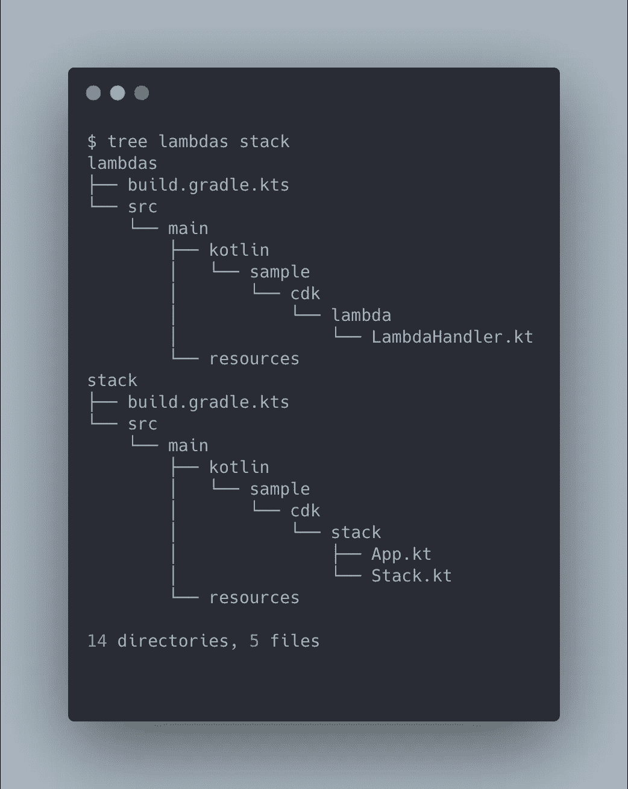

Final project layout

接下来，我们将添加各自的依赖项。lambda 项目的`build.gradle.kts`将包含非 CDK AWS 依赖项，并且应该表现为可以部署在堆栈架构之外的组件。在这里，我将使用 Kotinx 序列化作为我的 json 解析器，但是您可以添加任何您熟悉的解析器。Shadow jar 将确保被压缩并设置为 s3 的 jar 包含运行所需的所有依赖项。将以下内容添加到`lambdas`的构建文件中:

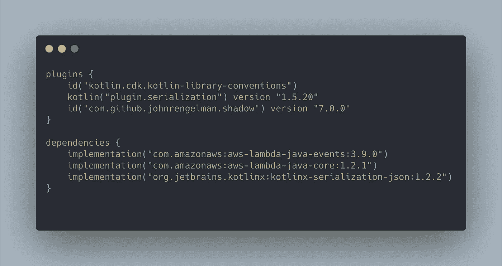

lambdas/build.gradle.kts

我们特定于 CDK 的代码将驻留在`stack`中，并将引用任何我们知道存在于 lamba 模块中的构造。将以下内容添加到堆栈的构建文件中:

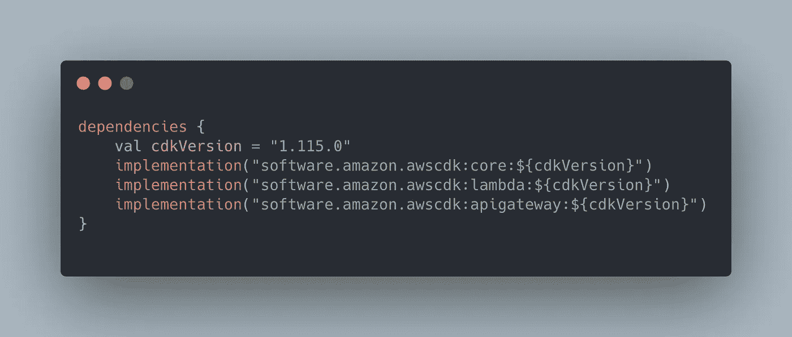

stack/build.gradle.kts

有了这些，我们就可以开始充实我们的堆栈了。首先，我们将创建 lambda 来处理我们的请求逻辑。出于演示的目的，我们将定义一个函数，该函数接受一个 JSON 对象，该对象只有一个“message”键。处理程序将以 JSON 格式将该消息和一些附加文本回显给调用者。现在，我们的响应是一个包含响应消息的字符串映射。

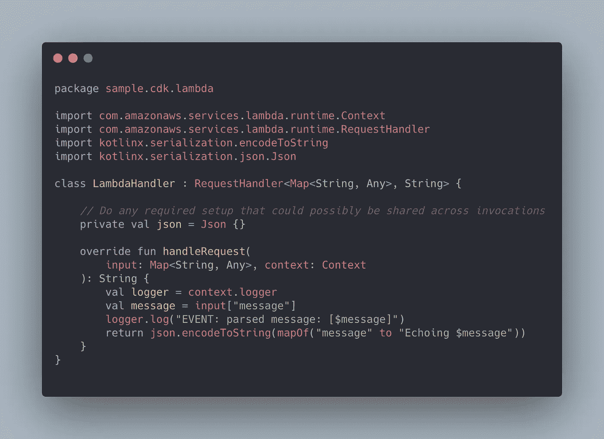

LambdaHandler.kt

下一步是建立我们的栈来实际使用 lambda 函数。填写`Stack.kt`文件，如下所示:

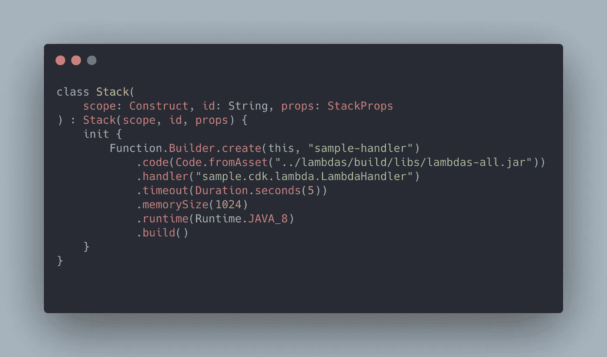

Stack.kt

`App.kt`将包含定义所有栈、它们的环境和各自账户信息的代码。用您的 AWS 帐户 id 替换帐户 id 值，用您想要的区域替换区域。一旦所有的栈都被声明，我们调用`app.synth()`让 CDK 生成最终的云形成模板。

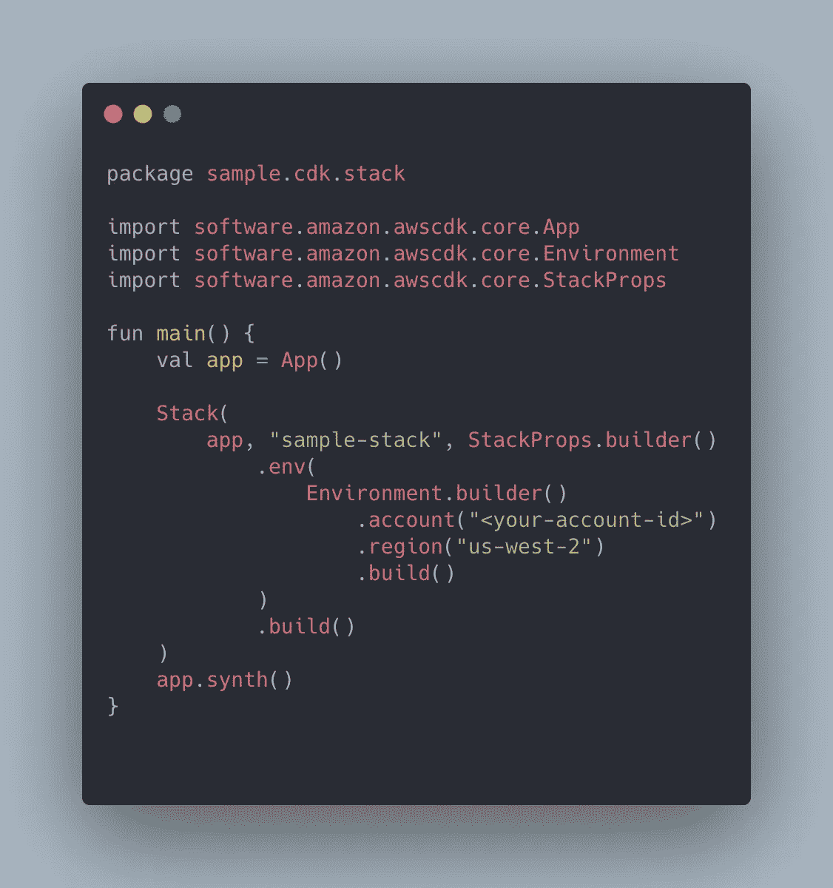

App.kt

接下来，我们需要向项目的根目录添加一个`cdk.json`文件，其中包含元数据和关于我们的云堆栈的附加信息。这通常是通过用 cdk 命令初始化一个项目来添加的，但是我们选择了一个更加手动的路径。

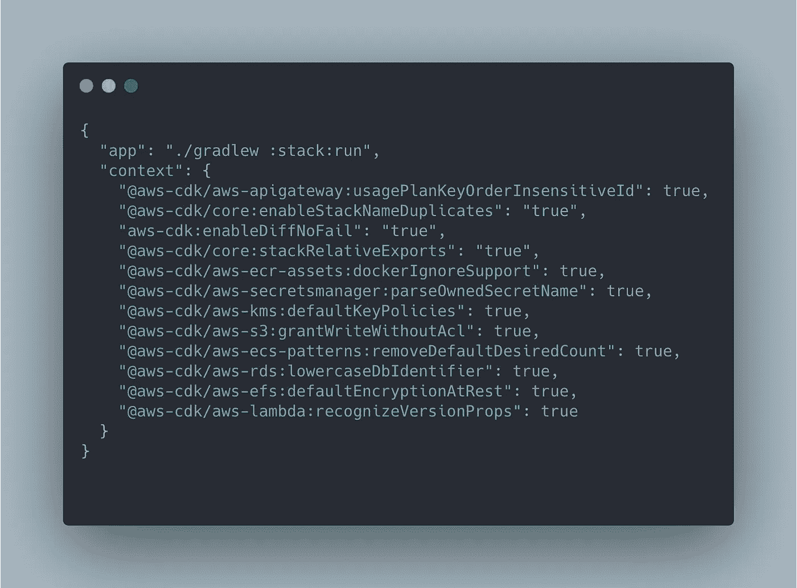

cdk.json

这些值(不一定)都不重要，它们是从默认的`cdk`初始化器中复制的。我们唯一关心的是顶层的`app`值，它被更改为指向我们的 gradle run 命令。

# 把所有的放在一起

我们现在可以开始使用`cdk` cli 来部署我们的基础设施。如果您还没有，请设置您的终端环境来配置和验证 aws。如果这是第一次设置像 lambda 这样的资源，您还需要引导您的环境。更多信息见[引导](https://docs.aws.amazon.com/cdk/latest/guide/bootstrapping.html)。从项目的根目录运行 synth 命令，开始创建保存 lambda 函数的 fat jar。

```
$ ./gradlew shadowJar$ cdk synth
```

您可能已经注意到输出中的最后一行表示`cdk.out/manifest.json`丢失了。对于所有这些命令，我们将从根目录进行操作。默认情况下，CLI 期望`cdk.out`出现在运行命令的目录中。通过检查项目树，我们可以看到 cdk.out 实际上是在`stack`模块下创建的。

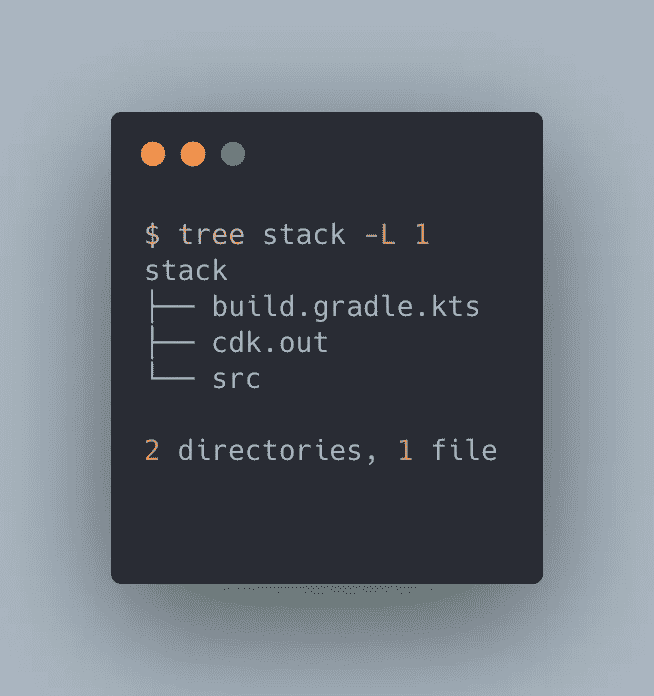

为了与根目录下带有包装器的正常 gradle 工作流保持一致，我们将保留在根目录下。我觉得这更容易推理，我们可以简单地复制稍后在设置 CI/CD 管道时运行的命令。从这里开始，所有使用`cdk`的命令都将附加`--app 'stack/cdk.out'`。现在我们已经合成了模板，可以开始部署了。

```
$ cdk deploy --app stack/cdk.out
```

deploy 命令的输出将为我们提供新创建的函数的 ARN，如果我们转到 AWS 控制台的 lambda 部分，也可以从函数列表中看到它。

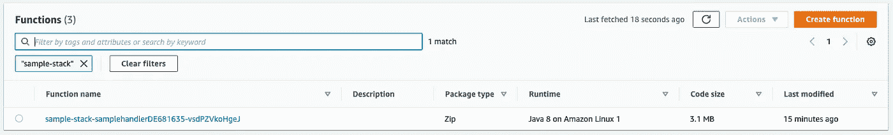

通过在测试事件中发送一些 JSON 来测试函数。

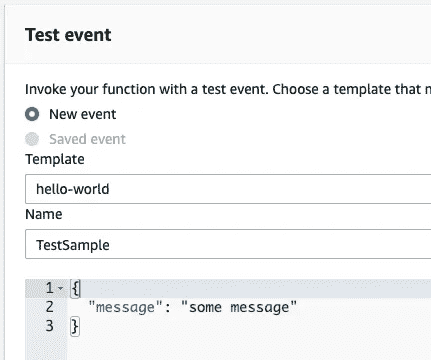

Test request

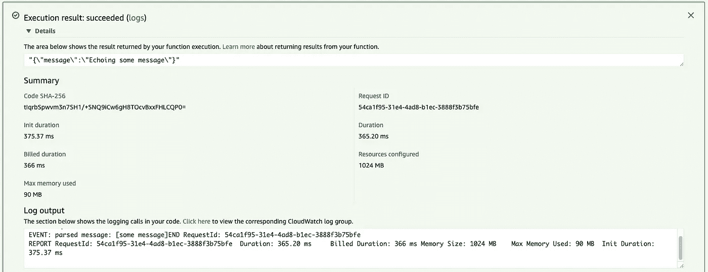

Successful response

我们的功能如预期的那样工作，我们已经成功地用 CDK 和科特林部署了一个 lambda。

# 使用 API 网关更进一步

拥有一个 lambda 很酷，但理想情况下，我们需要一种从外部资源访问这个 lambda 的方法，比如 rest 调用。这就是 API 网关的用武之地，我们可以直接从现有的 CDK 堆栈中配置一个 POST 端点。创建一个 api 端点，让它指向我们的 lambda，并将其连接到我们的堆栈，这些都可以在我们的堆栈文件中完成。对`Stack.kt`进行如下更改:

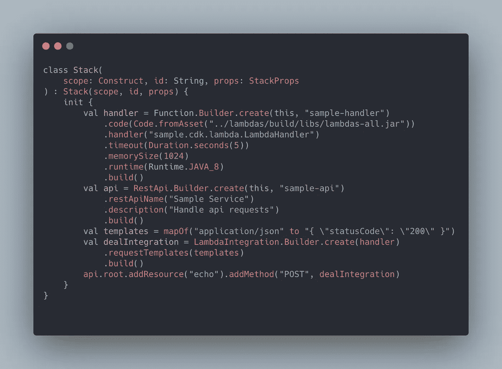

Stack.kt

我们的 lambda 函数也需要修改，以便能够与这个集成系统一起工作。我们发送的任何请求都将被转换为 API Gateway -> Lambda 代理交互的一部分。对 lambda 的新请求将是一个映射，其中包含关于 rest 调用的信息(头、编码)。响应应该是符合 API Gateway 概述的规范的`APIGatewayProxyResponseEvent`。在这个新地图中，身体生活在“身体”键下。更新`LambdaHandler.kt`:

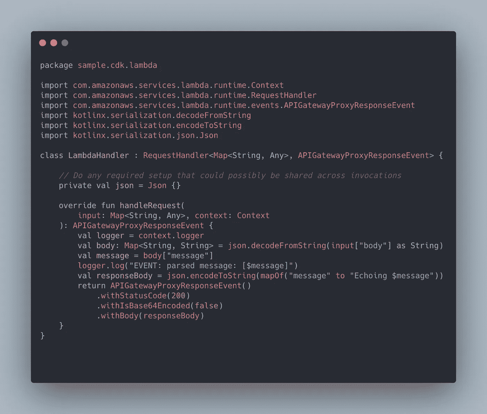

使用前面的命令重新构建 shadowJar，合成 projcet，并进行部署。转到 API gateway 的控制台，现在可以测试新创建的函数了。

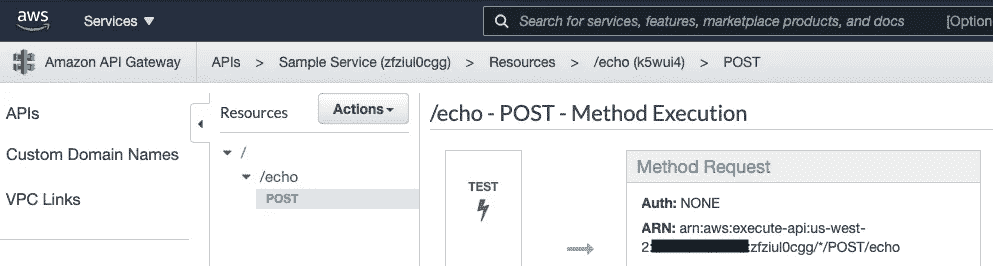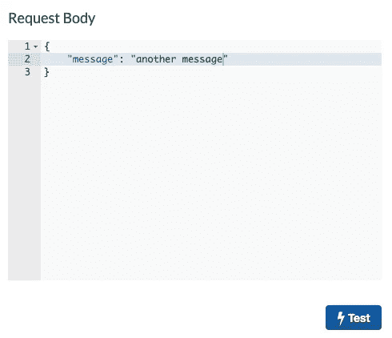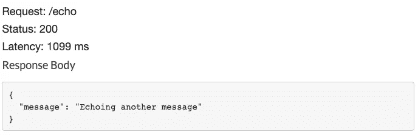

因为我们没有配置任何种类的认证，我们的集成对公共网络是可见的，所以我们也可以用 curl 或者你选择的 API 测试器进行测试

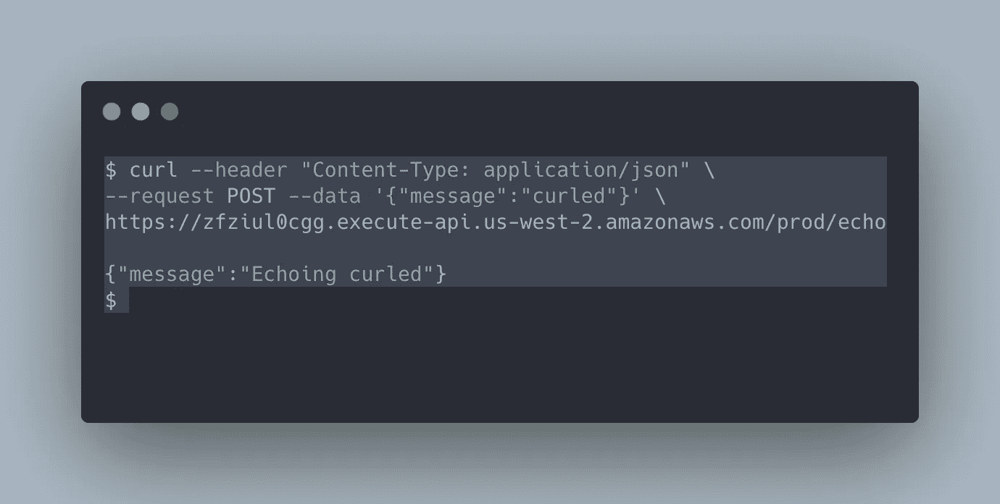

完成后销毁堆栈以释放所有资源。

```
$ cdk destroy --app 'stack/cdk.out'
```

# 摘要

这是如何使用 AWS CDK 建立一个可扩展的多模块梯度项目来构建您的云基础设施的基础。`cdk`工具链还不支持 Kotlin 和 gradle，但希望这很快会改变。关于使用 cdk 的一些最后注意事项:

1.  我们在这里使用的 lambda 方法是阻塞的。用`runBlocking {...}`包装`handleRequest`的内部以进入阻塞的协程上下文并让我们的业务逻辑执行异步操作是很简单的。
2.  如果您没有将 lamda 函数改为返回`APIGatewayProxyResponseEvent`，那么您将看到从 API gateway 返回 502 个响应。这是因为您的函数的响应没有确认 gateway 所期望的格式。要确保您的数据以代理可接受的格式返回，请使用提供的构建器并返回事件对象。
3.  您可以并且应该将所有 CLI 调用合并到一个脚本中，在 CD 过程中按顺序运行它们。您可以在每个调用后添加一个`--profile`参数，为特定的帐户生成模板。您还应该更新您合成的每个堆栈对象中的帐户 id，以确保您明确地部署到帐户。
4.  您可能会看到与 java 6 和 Java 8 兼容性相关的编译问题。将以下内容添加到 gradle 在初始化时创建的`common-conventions` kotlin 插件中，以成功编译。如果你没有使用 gradle cli 让你的项目添加到你的根`build.gradle.kts`或者每个模块的`build.gradle.kts`中。

```
tasks **{** withType<KotlinCompile> **{** kotlinOptions **{** jvmTarget = "1.8" **} }
}**
```