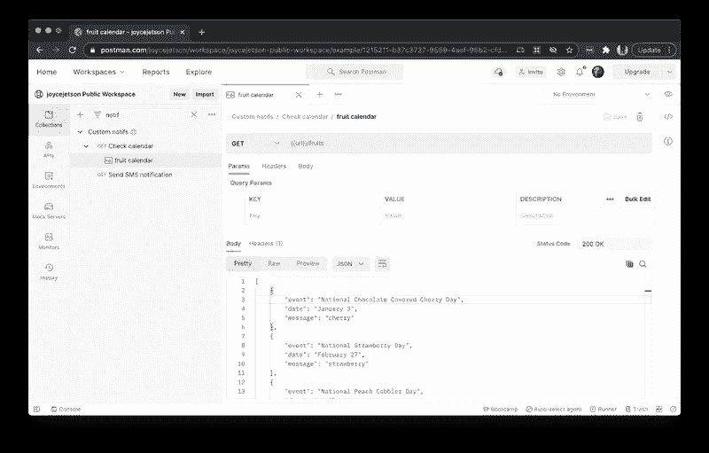
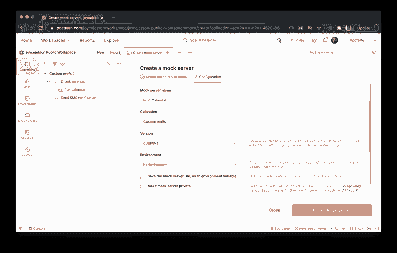
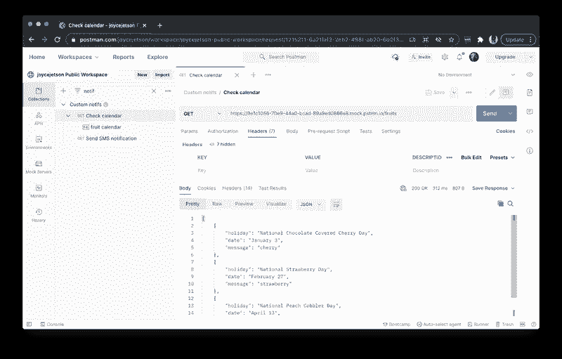
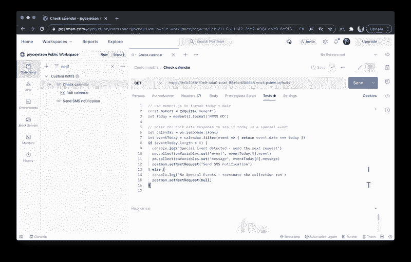
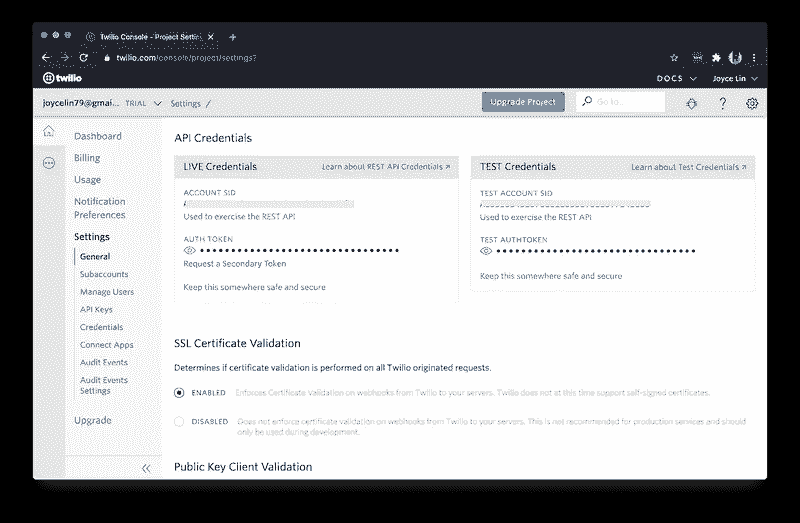
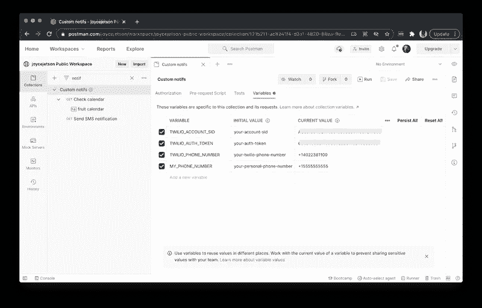
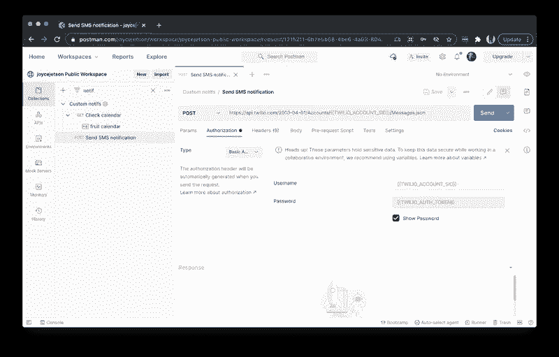
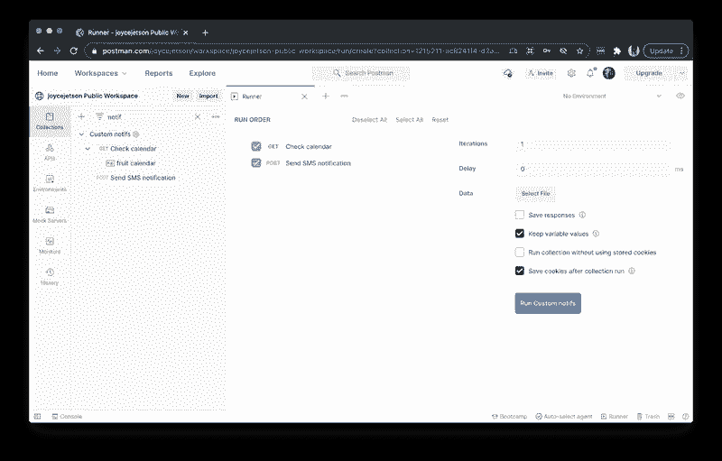
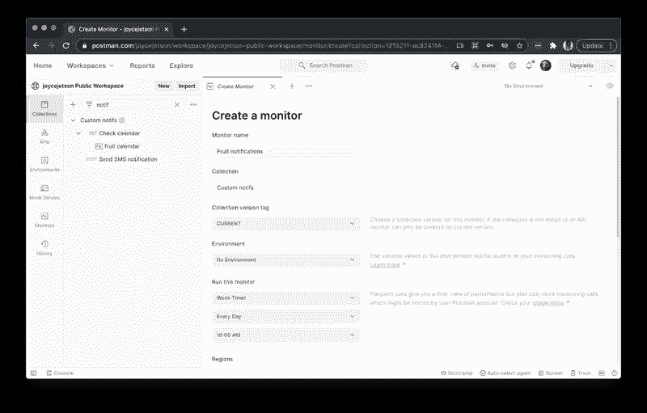

# 使用 Postman 和 Twilio 通过短信发送无服务器日历通知

> 原文：<https://medium.com/geekculture/serverless-calendar-notifications-via-sms-with-postman-and-twilio-f3bd3b4821a1?source=collection_archive---------71----------------------->

## 调度 cron 作业而不部署代码的最简单方法

我喜欢吃新鲜水果，但是我从来不知道什么是时令水果，直到我去了当地的杂货店。想象一下当我发现[全国水果节](https://nationaltoday.com/fruit-holidays/)时我有多高兴！是的，在我的国家，这可能是一个营销噱头，但它也可以提醒我什么是当季的。


Photo by [Katherine Chase](https://unsplash.com/@thekatiemchase?utm_source=unsplash&utm_medium=referral&utm_content=creditCopyText) on [Unsplash](https://unsplash.com/s/photos/fruit?utm_source=unsplash&utm_medium=referral&utm_content=creditCopyText)

本教程向您展示了如何设置自定义日历通知。即使你不关心水果，学习如何使用邮递员监视器在某个日期触发通知，这样你就不会错过任何特殊事件。在本教程中，我们将执行以下操作:

*   建立一个邮递员集合
*   添加数据存储的示例响应
*   模仿邮递员服务器上的 API
*   使用 Twilio 设置短信通知
*   在 Postman 中本地运行收集
*   安排一个监视器在邮递员服务器上运行

# 教程要求

*   接收短信通知的个人电话号码
*   一个免费的 [Twilio 账户](http://www.twilio.com/referral/geBKT7)和一个 [Twilio 电话号码](https://www.twilio.com/user/account/phone-numbers/incoming)来发送短信通知
*   一个免费的[邮差账户](https://www.postman.com/downloads/)存储你的数据并触发通知

要在 web 浏览器中使用 Postman，就像我们在开发过程中在本例中所做的那样，系统会提示您在本地计算机上下载并运行 Postman 代理，以克服跨源资源共享(CORS)的限制。代理和 app 不一样。在 Mac 上，您会在电脑屏幕右上角的状态菜单中看到正在运行的邮递员代理的图标。在 Windows 计算机上，Postman agent 图标显示在计算机屏幕右下角的系统托盘中。

如果您不想在 web 浏览器中使用 Postman 和代理，您可以下载并安装用于 Mac、Windows 或 Linux 的 [Postman 应用程序](https://www.postman.com/downloads/)。

# 建立一个邮递员集合

登录邮递员。在左上角，创建一个新的个人工作区来存放您的工作。然后选择左侧的**收藏库**选项卡，创建一个新收藏库。

向集合中添加两个名为`Check calendar`和`Send SMS notification`的请求。我们将在稍后完成这些请求的细节。第一个请求将检查重要事件。第二个请求将从您的 Twilio 电话号码向您的个人电话号码发送短信。


Create a Postman collection with placeholders for two API calls

# 添加数据存储的示例响应

为了存储像日期列表这样简单的东西，我们可以使用模拟 API 服务器来返回静态数据，而不是使用成熟的 API 与数据库对话。让我们通过描述一个示例来模拟 Postman 服务器上的数据，该示例概述了我们希望从模拟服务器返回的数据。换句话说，对于类似这样的 API 请求，我们会期待类似这样的响应。

虽然我们不需要将模拟数据直接添加到我们的集合中，但将它放在附近可以方便地查看和更新。所以在第一个请求`Check calendar`下，进入溢出菜单(...)，并选择“添加示例”。

对于示例请求，保留 HTTP 方法为`GET`，输入`{{url}}/fruits`作为地址。对于示例响应，输入`200 OK`作为 HTTP 状态代码，主体可以是`JSON`，结构类似于对象数组，如下所示:

```
[
   {
       "event": "National Chocolate Covered Cherry Day",
       "date": "January 3",
       "message": "cherry"
   },
   {
       "event": "National Strawberry Day",
       "date": "February 27",
       "message": "strawberry"
   },
   {
       "event": "National Peach Cobbler Day",
       "date": "April 13",
       "message": "peach"
   }
]
```

切换到示例中的响应**标题**，并添加一个值为`application/json`的键`Content-Type`。确保将这个标题添加到底部的响应，而不是顶部的请求。



Mock endpoint returns example data

当您对模拟的数据感到满意时，保存示例。您将会看到在第一个请求下面列为“例如”的示例。这个例子是我们将在下一步创建的模拟 API 的基础。

# 模仿邮递员服务器上的 API

由于在上一步中我们将示例添加到了集合中，所以我们也必须将模拟服务器添加到这个集合中。进入收藏的溢出菜单(…)，选择“模拟收藏”。给你的模拟一个名字。您可以取消选中“将模拟服务器 URL 保存为环境变量”,因为我们没有使用环境。点击**创建模拟服务器**按钮，确认您的配置选项。



Create a mock server using an example saved to the collection

一旦创建了一个模拟，复制 Postman 提供的模拟 URL 并返回到您的集合中第一个名为`Check calendar`的请求。输入模拟 URL 作为请求地址。根据您在上一步中保存的示例请求路径，记得将`/fruits`附加到您的模拟 URL 的末尾。然后点击**发送**按钮，在回复正文中查看您的嘲笑数据。



Use Postman mock server to return example data

# 在 Postman 中编写一个条件触发器

在 Postman 中，您可以分别在**预请求脚本**和**测试**选项卡下编写在 API 调用之前或之后运行的 JavaScript。运行整个集合时，这些选项卡是控制工作流程的好地方。例如，我们只想在有事件发生时收到短信通知。如果没有事件，那么我们就不会被打扰。

为此，Postman 提供了一个`[pm.*](https://learning.postman.com/docs/writing-scripts/script-references/postman-sandbox-api-reference/)` API，可以在 **Tests** 选项卡下的脚本中使用，以访问响应中返回的数据，如`pm.response.json()`。您还可以使用内置函数`[postman.setNextRequest()](https://learning.postman.com/docs/running-collections/building-workflows/)`来覆盖集合的瀑布执行顺序。

在`Check calendar`请求的**测试**选项卡下，添加下面的代码，以便在我们检索日历数据后运行。

```
// use moment.js to format today's date
const moment = require('moment')
let today = moment().format('MMMM DD')

// parse the mock data response to see if today is a special event
let calendar = pm.response.json()
let eventToday = calendar.filter(event => { return event.date === today })
if (eventToday.length > 0) {
  console.log('Special Event detected - send the next request')
  pm.collectionVariables.set("event", eventToday[0].event)
  pm.collectionVariables.set("message", eventToday[0].message)
  postman.setNextRequest("Send SMS notification")
} else {
  console.log('No Special Events - terminate the collection run')
  postman.setNextRequest(null)
}
```

如果当前日期是一个重要的日期，那么我们将存储一些数据传递给集合中的下一个调用。如果没有，我们将立即停止收集运行。



Add conditional statement under the Tests tab

# 为 Twilio 设置短信通知

要设置 API 调用来发送我们的 SMS 通知，我们首先需要 Twilio 凭证来授权请求。通过登录到 [Twilio 控制台](https://twilio.com/console)找到您的 Twilio 帐户 SID 和身份验证令牌。然后点击侧边栏中的[设置](https://www.twilio.com/console/project/settings)，向下滚动到“API 凭证”。您还需要您的 [Twilio 电话号码](https://www.twilio.com/console/phone-numbers/incoming)来发送短信。



Find Twilio Account SID and Auth Token under “Settings”

因为我们在 Postman 中只处理单个集合，所以让我们将变量存储在集合范围内。如果您想将这些凭证用于一堆其他的 Postman 集合，您可以使用一个 [Postman 环境](https://learning.postman.com/docs/sending-requests/managing-environments/)来代替。在 Postman 中，单击集合名称以查看集合详细信息。选择**变量**选项卡输入以下变量，并保存您的更改。

```
TWILIO_ACCOUNT_SID=<your-account-sid>
TWILIO_AUTH_TOKEN=<your-auth-token>
TWILIO_PHONE_NUMBER=<your-twilio-phone-number>
MY_PHONE_NUMBER=<your-personal-phone-number>
```

> ***安全提示*** *:如果您在 Postman 的团队或公共工作区中工作，并且您不想共享您的凭据，请确保您在“当前值”列下输入的值不是“初始值”，如下图所示。*



Enter Postman collection variables as CURRENT VALUE

找到第二个叫`Send SMS notification`的请求。将 HTTP 方法更新为`POST`，输入下面的请求地址。

```
https://api.twilio.com/2010-04-01/Accounts/{{TWILIO_ACCOUNT_SID}}/Messages.json
```

我们使用双花括号在 Postman 的文本字段中获取变量。将鼠标悬停在请求地址中的`{{TWILIO_ACCOUNT_SID}}`上，查看 Postman 如何解析该变量。

在**授权**选项卡下，选择“基本授权”类型。输入`{{TWILIO_ACCOUNT_SID}}`作为“用户名”，输入`{{TWILIO_AUTH_TOKEN}}`作为“密码”。



Authorization using Basic Auth type helper

如果您在 **Headers** 选项卡下查看，您可以看到 Postman 如何基于您输入的信息生成适当的`Authorization`标头。

在**正文**选项卡下，配置短信详情。选择“x-www-form-urlencoded”，添加`From`、`To`和`Body`参数。短信息会从您的 Twilio 电话号码发送到您的个人电话号码，并包含要包含在短信息中的信息。


Configure the SMS details in the request body

我们的大多数变量，像`TWILIO__PHONE_NUMBER`和`MY_PHONE_NUMBER`，都是手动输入到 Postman 中的。但是，如果有特殊事件，事件和消息将在前面的`Check calendar`请求中动态设置。让我们在下一步中验证我们的代码是否正常工作。

# 在 Postman 中本地运行收集

如果今天没有事件发生，通过编辑 Postman 示例(在“例如”下)来更新模拟数据。添加带有今天日期的虚拟事件，并保存您的更改。

让我们一步一步地完成每个呼叫，一次一个。发送第一个请求`Check calendar`，并验证集合变量 event 和 message 是否已设置。您可以通过检查集合变量编辑器或将鼠标悬停在第二个请求中的那些变量上来实现这一点。

发送第二个请求`Send SMS notification`，并验证 SMS 中是否发送了正确的事件和消息。你可以通过检查你的手机或者检查左下角的邮递员控制台来做到这一点。

一旦您对预期的变量设置和获取感到满意，单击右下角的 **Runner** 图标。将收藏拖到新标签中，然后点击**运行**按钮运行全部收藏。这两个请求都应该运行。



Run the collection to execute all API requests

我们最后的检查是，如果没有特殊事件发生，我们不会发送短信。再次编辑您的示例(在“例如”下)以移除虚拟事件并保存您的更改。使用 **Runner** 再次运行您的收集，以确保只运行第一个请求。

既然我们确信我们的代码正在工作，那么让我们在下一步中安排每天从 Postman 服务器运行收集。

# 安排一个监视器在邮递员服务器上运行

Postman monitor 是在 Postman 服务器上调度的收集运行。进入收藏的溢出菜单(…)，然后选择“监控收藏”。给你的显示器起个名字。在“运行此监视器”下，将频率更新为“每周”，这样您就可以“每天”运行收集。确认**创建**。



Schedule a Postman monitor to run every day

在左侧的**监视器**选项卡下，您将看到监视器运行的历史记录。邮递员每天都会自动运行这个检查，我会收到特别水果庆典的短信通知。

# 最后

创建短信通知很简单，但是有很多方法可以触发它。我之前分享过[如何在 Kubernetes](https://www.twilio.com/blog/starlink-satellite-sms-notifications-python-kubernetes-twilio) 上安排 CronJob。安排一个邮递员监视器甚至更容易，并且不需要部署任何代码。[分叉本例](https://www.postman.com/joyce-jetson/workspace/joycejetson/documentation/1215211-ac8241f4-d2a1-4820-88ea-9e965b91160e)按照“快速入门”下的步骤快速上手运行。

一旦你建立了这个收藏，还有更多可以探索的。

*   **更新条件触发器:**当你发现你不想错过的新事件时，将其添加到包含你的模仿数据的例子中。或者在第一个请求中创建一个新的条件触发器，比如当你的股票跌破某个价格时发送一个警报。
*   **改变通知方式:**如果不喜欢接收短信通知，换出集合中的第二个请求[发送邮件](https://sendgrid.com/docs/api-reference/)。或者你可以设计级联通知。Twilio 的团队已经发布了[邮差合集](https://www.postman.com/twilio/workspace/twilio-api/overview)来帮助你自动化更多的工作流程。

*原载于*[](https://www.twilio.com/blog/serverless-calendar-notifications-sms-postman-twilio)**。**