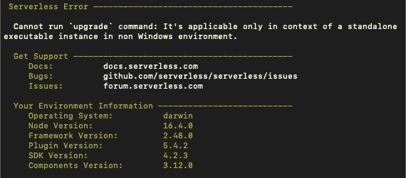

# 无服务器—无法运行“升级”命令:它仅适用于非 Windows 环境中的独立可执行实例的上下文

> 原文：<https://medium.com/geekculture/serverless-cannot-run-upgrade-command-its-applicable-only-in-context-of-a-standalone-ee9c2055191c?source=collection_archive---------28----------------------->



在用无服务器框架创建新项目之前，我想确保我的软件是最新的。因此，我在文档中找到了升级无服务器 CLI 的说明，其中列出了简单的

```
serverless upgrade
```

macOS 的命令。

但是，在新的终端窗口中运行该命令后，出现了以下错误:

```
Cannot run `upgrade` command: It’s applicable only in context of a standalone executable instance in non Windows environment.
```

将错误粘贴到 Google 中并没有带来任何相关的结果，所以我深入研究了文档。macOS 的唯一其他选择是通过 npm 升级。因此，我怀疑我安装了 Serverless 作为全局 npm 包，而不是使用 curl 命令。为了找到答案，我用命令列出了我的所有全局安装的 npm 包

```
npm list -g
```

果然，无服务器是其中之一！

因此，为了在 macOS 上升级我的无服务器 CLI 版本，我在终端中运行了以下命令:

```
npm update -g serverless
```

而且成功了！运行

```
serverless -v
```

命令现在显示最新版本。希望这篇文章能帮助其他无服务器用户更快地升级他们的 CLI！