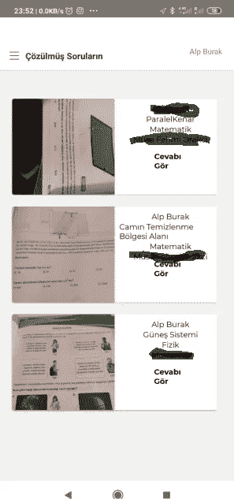

# 无服务器移动应用开发-1

> 原文：<https://medium.com/geekculture/serverless-mobile-app-development-1-4191917704a?source=collection_archive---------53----------------------->

这是一个由两部分组成的文章系列。这个系列的第二部分是关于 AWS 服务和后端的。


# react Native-AWS Lambda-Dynamodb-S3

你好，

在这篇文章中，我将介绍我过去做的一个移动应用程序。我在考虑通过展示一些理论和代码来向前推进。希望对某个人有用。

我不会在本文中教授 React Native 或 AWS Lambda。需要的人可以看看不同的资源。

还是那句话，在这篇文章里，我就不一一解释细节了。如此详细的解释意味着一长串。不幸的是，我现在没有那么多时间，但希望在未来。

我写这篇文章是为了那些至少在初级水平上了解 React Native 和 AWS 的人。只有 AWS 知识是足够的。不需要知道 Lambda。在本文中，我将展示更多的代码。不会有旁白:(

请贡献您的问题和建议。好的读物



# 该应用程序

这个应用程序是为教育部门开发的解决方案。我开发了一个移动应用程序，准备考试的学生可以在那里提问。学生提问后，系统会根据所选的课程类型向相关教师的手机发送通知。然后老师解决问题，上传到应用。学生收到解决方案通知。

# 为什么我在应用程序中使用 React Native？

近年来，React Native 开始在用于移动应用程序开发的库中崭露头角。用 JS 写，编译 Android 和 IOS 的常用代码，简洁对我来说是亮点。如果你喜欢 JS 或者 TS，React Native 适合你。

## 我选择的 React 本机模板:现在 UI React 本机模板

设计在移动应用程序开发中很重要。我们，开发者不是设计师，我认为最好把这项工作留给专家。为此，我在网上寻找的免费 react 本地模板中找到并使用了附带的模板。它非常健壮、清晰、可扩展，并且易于学习。我强烈推荐。

[](https://demos.creative-tim.com/now-ui-react-native/) [## 现在用户界面通过创造性的时间反应自然

### 现在 UI React Native 是基于 Galio.io、React Native 和 Expo 构建的完全编码的应用程序模板，允许您创建…

demos.creative-tim.com](https://demos.creative-tim.com/now-ui-react-native/) 

# **项目代码回购**

你可以在这里找到并下载[该项目的代码。也欢迎投稿。](https://github.com/latift/bulutasor)

# 反应原生文件夹结构和重要文件

创建一个空的 React 原生项目时得到的文件结构对于一般的项目来说已经足够了。react 原生项目中的两个重要文件是 **package.json、package-lock.json** 文件。这些文件包含您将在 react-native 项目中使用的 js 库的列表和版本。一注；在启动 React 本地项目之前，您需要安装一个包管理器。我在我的项目中使用 [*节点包管理器*](https://www.npmjs.com) 。

你可以在[*bulutasor/bulutasorfrontend 2*](https://github.com/latift/bulutasor/tree/master/BulutaSorFrontend2)文件夹下找到完整的 React-Native 相关代码。以下是应该检查的文件夹:

[**画面**](https://github.com/latift/bulutasor/tree/master/BulutaSorFrontend2/screens) :所有的画面代码都在这个文件夹下。

样本屏幕代码:

```
/* eslint-disable no-console */
import React from 'react';
import {
  StyleSheet, Dimensions, ScrollView, Alert
} from 'react-native';// cache app images

// import * as Notifications from 'expo-notifications';
import { connect } from 'react-redux';
import {
  Block, Text, theme, withGalio
} from 'galio-framework';
import AnimatedLoader from 'react-native-animated-loader';
import { Card } from '../components';

const { width } = Dimensions.get('screen');

class StudentsSolvedQuestionListScreen extends React.Component {
  constructor(props) {
    super(props);
    this.state = {
      visible: false,
      error: null,
    };
  }

  componentDidMount() {
    this.state.visible = false;
    this.state.error = null;
  }

  renderArticles = () => {
    const { error } = this.state;
    const { questions } = this.props;
    return (

      <ScrollView showsVerticalScrollIndicator={false} contentContainerStyle={styles.articles}>
        <Block flex>
          {error ? <p>{error.message}</p> : null}
          {
            (Array.isArray(questions))
              ? questions.filter((item) => item.state === 'passive').map(
                (question) => <Card item={question} key={question.s3Key} cevapGoster="true" horizontal />
              )
              : (
                <Text>
                  Henüz çözülmüş bir sorun yok.
                </Text>
              )
          }
        </Block>
      </ScrollView>
    );
  };

  render() {
    const { visible } = this.state;
    return (
      <ScrollView showsVerticalScrollIndicator={false} contentContainerStyle={styles.articles}>
        <Block flex style={styles.home}>
          <Block center style={{ flex: 30 }}>
            <AnimatedLoader
              visible={visible}
              overlayColor="rgba(255,255,255,0.75)"
              source={require('./spinner.json')}
              animationStyle={styles.lottie}
              speed={1}
            />
            {this.renderArticles()}
          </Block>
        </Block>
      </ScrollView>
    );
  }
}

const styles = StyleSheet.create({
  home: {
    width,
  },
  articles: {
    width: width - theme.SIZES.BASE * 2,
    paddingVertical: theme.SIZES.BASE,
    paddingHorizontal: 2,
    fontFamily: 'montserrat-regular',
  },
});

function mapStateToProps(storeState) {
  return {
    userName: storeState.userName,
    password: storeState.password,
    questions: storeState.questions
  };
}

function mapDispatchToProps() {
  return {
    // setQuestions()
  };
}
export default withGalio(connect(mapStateToProps, mapDispatchToProps)(StudentsSolvedQuestionListScreen));
```

[**组件**](https://github.com/latift/bulutasor/tree/master/BulutaSorFrontend2/components) :在这个文件夹下，可以找到 React 原生模板自带的组件库。

```
import React, { useState } from 'react';
import {
  Alert,
  Modal,
  StyleSheet,
  TouchableWithoutFeedback,
  Keyboard,
  View,
  Dimensions,
  TouchableOpacity,
} from 'react-native';
import {
  Text, theme, Block
} from 'galio-framework';
import { useNavigation } from '@react-navigation/native';
import { useSelector } from 'react-redux';
import ArButton from './Button';
import Icon from './Icon';
import nowTheme from '../constants/Theme';

const DismissKeyboard = ({ children }) => (
  <TouchableWithoutFeedback onPress={() => Keyboard.dismiss()}>{children}</TouchableWithoutFeedback>
);

const { width, height } = Dimensions.get('screen');

const SessionBar = (props) => {
  const [modalVisible, setModalVisible] = useState(0);
  const user = useSelector((state) => state.user);
  const navigation = useNavigation();
  let userType = 'Öğrenci';
  const { isTeacher } = user;
  if (isTeacher) {
    userType = 'Öğretmen';
  }
  console.log(`isTeacher:${isTeacher}`);
  console.log(`userType:${userType}`);
  return (
    <Block>
      <Modal
        animationType="slide"
        visible={modalVisible}
        style={styles.modalView}
        transparent
        onRequestClose={() => {
          Alert.alert('Modal has been closed.');
        }}
      >
        <View
          style={{
            flex: 1,
            justifyContent: 'center',
            alignItems: 'center',
            margin: 80,
            padding: 80,
            borderColor: nowTheme.COLORS.BLACK,
            borderRadius: 10,
            backgroundColor: nowTheme.COLORS.WHITE,
          }}
        >
          <ArButton
            color="info"
            round
            style={styles.createButton}
            onPress={() => { setModalVisible(false); }}
            title="Kapat"
          >
            <Text
              style={{ fontFamily: 'montserrat-bold' }}
              size={14}
              color={nowTheme.COLORS.WHITE}
            >
              Kapat
            </Text>
          </ArButton>
          <Block>
            <Text
              size={16}
              muted
              style={{
                width: '100%',
                color: '#2c2c2c',
                fontWeight: 'bold',
                lineHeight: 20,
                fontSize: 19,
                fontFamily: 'montserrat-bold',
                margin: 10,
                zIndex: 2,
                textAlign: 'center',
              }}
            >
              {userType}
            </Text>
            <Text
              size={16}
              muted
              style={{
                width: '100%',
                color: '#2c2c2c',
                fontWeight: 'bold',
                lineHeight: 20,
                fontSize: 19,
                fontFamily: 'montserrat-bold',
                margin: 10,
                zIndex: 2,
                textAlign: 'center',
              }}
            >
              {user.userName}
            </Text>
          </Block>
          <ArButton
            color="primary"
            round
            style={styles.createButton}
            onPress={() => { setModalVisible(false); logout(); navigation.navigate('LoginScreen'); }}
            title="Oturumu Kapat"
          >
            <Text
              style={{ fontFamily: 'montserrat-bold' }}
              size={14}
              color={nowTheme.COLORS.WHITE}
            >
              Oturumu Kapat
            </Text>
          </ArButton>
        </View>
      </Modal>
      <Block flex row right>
        <TouchableOpacity
          style={[styles.profileButton]}
          onPress={() => {
            setModalVisible(true);
          }}
        >
          <Text>{user.userName}</Text>
          <Icon
            family="NowExtra"
            size={16}
            name="basket2x"
            color={nowTheme.COLORS.WHITE}
          />

        </TouchableOpacity>
      </Block>
    </Block>
  );
};
export default SessionBar;

const styles = StyleSheet.create({
  registerContainer: {
    marginTop: 55,
    width: width * 0.9,
    height: height < 812 ? height * 0.8 : height * 0.8,
    backgroundColor: nowTheme.COLORS.WHITE,
    borderRadius: 4,
    shadowColor: nowTheme.COLORS.BLACK,
    shadowOffset: {
      width: 0,
      height: 4,
    },
    shadowRadius: 8,
    shadowOpacity: 0.1,
    elevation: 1,
    overflow: 'hidden',
  },

  centeredView: {
    flex: 1,
    justifyContent: 'flex-start',
    alignItems: 'center',
    margin: 20,
    backgroundColor: nowTheme.COLORS.WHITE,
    padding: 20,
  },
  modalView: {
    backgroundColor: theme.COLORS.WHITE,
    borderRadius: 20,
    margin: 35,
    padding: 35,
    height: height * 0.6,
    width: width * 0.6,
    justifyContent: 'flex-start',
    alignItems: 'stretch',
    borderColor: theme.COLORS.BLACK,

  },
  openButton: {
    backgroundColor: theme.COLORS.WHITE,
    borderRadius: 20,
    padding: 10,
    elevation: 2
  },
  title: {
    flex: 2,
    height: height * 0.07,
    alignItems: 'center',
    justifyContent: 'center',
  },
  titleTextStyle: {
    fontWeight: '400',
    fontSize: theme.SIZES.FONT * 2,
    color: theme.COLORS.BLACK,
    paddingTop: 20
  },

  createButton: {
    width: width * 0.5,
    marginTop: 25,
    marginBottom: 40,
  },

  profileButton: {
    padding: 12,
    position: 'relative',
    width: width * 0.2,
  },

  cikisButton: {
    padding: 12,
    position: 'relative',
    width: width * 0.2,
  }
});
```

[**Android**](https://github.com/latift/bulutasor/tree/master/BulutaSorFrontend2/android) **和**[**IOS**](https://github.com/latift/bulutasor/tree/master/BulutaSorFrontend2/ios)**:**在这些文件夹中，你可以找到 react-native 代码在编译过程中产生的环境特定的配置。某些第三方库的使用需要特定于操作系统的设置。在这种情况下，我们将介入的代码在这里。正常情况下，我们不会在这些文件夹中进行任何开发。

[**Appium**](https://github.com/latift/bulutasor/tree/master/BulutaSorFrontend2/appium) :当我们开发一个移动应用的时候，我们需要在不同的设备上测试我们的应用。因为一般来说，我们的应用程序可能会根据操作系统的型号和版本、内存和屏幕大小而有很大的不同，或者更糟的是，它可能无法工作。:(在终端用户在我们的应用程序中体验到这种情况之前，在设备群中测试我们的应用程序非常有用。我绝对推荐。你可以在这里找到 [***AWS 设备农场***](https://aws.amazon.com/tr/device-farm/) 。

# Redux

Redux 是一个数据存储。用应用程序屏幕分隔数据通常是一种好的做法。通过这种方式，可以确保屏幕之间或同一屏幕上不同组件之间的数据一致性。Redux 现在是 React Native、Vue 或 Angular 等 JS 库中必不可少的组件。您可以从以下地址获取详细信息。

[](https://redux.js.org/) [## redux-JavaScript 应用程序的可预测状态容器。|还原

### JS Apps Redux 的可预测状态容器帮助您编写行为一致的应用程序，运行在不同的…

redux.js.org](https://redux.js.org/) [](https://www.digitalocean.com/community/tutorials/react-react-native-redux) [## React 原生应用中使用 Redux 的介绍| DigitalOcean

### Redux 是 JavaScript 应用程序的可预测状态容器。如果您对 Redux 不熟悉，我们建议您看看我们的…

www.digitalocean.com](https://www.digitalocean.com/community/tutorials/react-react-native-redux) 

以及一篇来自 [Zafer Ayan](https://zaferayan.medium.com/) 的土耳其文

[](https://zaferayan.medium.com/react-native-instagram-redux-kullan%C4%B1m%C4%B1-10e29c8e3f1b) [## React 原生 insta gram—Redux kullan m

### nceki yaz MDA react-navigation-drawer ' kodlayp，bottom bar ' daki tüm ekranlar mock ol arak tamamlam t t k . imdi bu…

zaferayan.medium.com](https://zaferayan.medium.com/react-native-instagram-redux-kullan%C4%B1m%C4%B1-10e29c8e3f1b) 

**结论**

在这篇文章中，我试图展示我的移动应用程序的 react-native 代码，也许它会启发一些人。在本系列的第二篇文章中，我将解释后端。

祝大家生活愉快