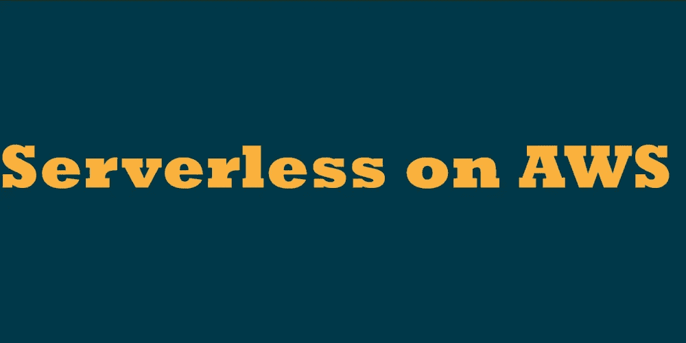
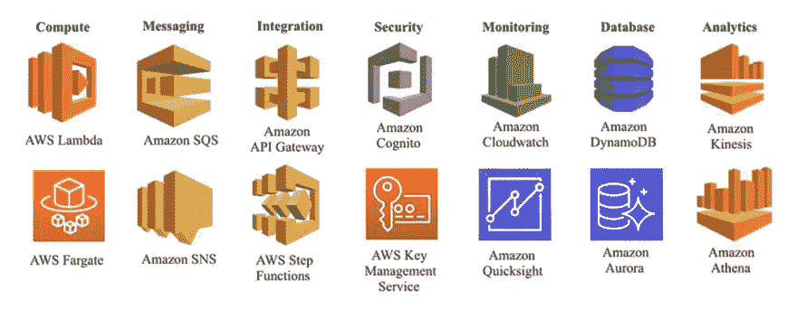

# AWS 上的无服务器

> 原文：<https://medium.com/geekculture/serverless-on-aws-76ac0ea869a8?source=collection_archive---------28----------------------->

近年来，无服务器计算模式已经成为开发现代应用程序、实用程序和后端解决方案的一种破坏性架构方法。它有助于开发人员专注于代码，而不是花费时间在后端基础设施的配置、管理或扩展上。

# 什么是无服务器

无服务器允许您构建和运行应用程序，而无需考虑服务器。应用服务器的供应、管理和扩展都由无服务器云提供商动态管理。

有两种类型的无服务器计算模型。第一类是指利用云服务来管理服务器端逻辑的 web 和移动应用程序。它被称为后端即服务(BaaS)。

第二种类型是功能即服务(FaaS)。在 FaaS 处理后端基础设施，如容器、运行时环境。

# 为什么使用无服务器

*   无服务器管理:免除了配置或维护任何服务器的后顾之忧。
*   灵活的伸缩性:您的应用程序将自动伸缩。
*   为价值付费:只为您使用的东西付费，而不是为服务器单元付费。

# 无服务器 AWS 服务概述

AWS 拥有超过 165 项服务，涵盖了后端开发的主要方面和要求，如计算资源、安全性、机器学习、消息传递和监控服务、特定需求的数据库等等。

## 计算

有了 AWS Lambda ,您几乎可以运行任何类型的应用程序或后端服务的代码——所有这些都无需管理。您可以将代码作为各种事件触发的函数来执行，如 S3 存储桶中的文件更新、AWS API 网关上的请求、Dynamo DB 表上的操作。AWS Lambda 是一个 FaaS 解决方案。您可以将 Lambda 与 AWS 的许多其他服务相结合，并在许多场景中使用它，如 S3 的实时文件处理、实时流处理，以处理移动和 web 应用程序中来自 API 的 HTTP 请求

有了 [AWS Fargate](https://docs.aws.amazon.com/AmazonECS/latest/developerguide/AWS_Fargate.html) 你可以运行容器，而不必管理服务器和集群。Fargate 通过设计应用程序隔离来提高安全性。您不需要优化服务器利用率，管理集群调度。Fargate 借助 Amazon cloud watch Container Insights 提供了丰富的应用可观察性。要启动您的应用程序
，请指定 CPU 和内存需求，定义网络和 IAM 策略。

## 信息发送

[亚马逊简单队列服务(SQS)](https://docs.aws.amazon.com/AWSSimpleQueueService/latest/SQSDeveloperGuide/welcome.html) 是一种完全托管的消息队列服务，使您能够分离和扩展微服务、分布式系统和无服务器应用。使用 AWS 控制台、命令行界面或您选择的 SDK 以及三个简单的命令，在几分钟内开始使用 SQS。

SQS 提供两种类型的消息队列。标准队列提供最大的吞吐量、最大努力排序和至少一次传递，而 FIFO 队列被设计成保证消息按照它们被发送的确切顺序被处理一次。

[亚马逊简单通知服务(SNS)](https://docs.aws.amazon.com/sns/latest/dg/welcome.html) 是一项全面管理的消息服务，适用于应用对应用(A2A)和应用对个人(A2P)的通信。

在社交网络的帮助下，你可以直接向数百万用户发送消息。除了推送通知，您还可以通过电子邮件、SMS 或 HTTP 端点发送通知。

## 综合

[亚马逊 API 网关](https://docs.aws.amazon.com/de_de/apigateway/latest/developerguide/welcome.html)是一个完全托管的服务，用于创建、发布、维护、监控和保护任何规模的 API。您可以创建 RESTful APIs 和 WebSocket APIs，借助 API Gateway 实现实时通信应用程序。

API Gateway 提供了强大、灵活的认证机制，比如 AWS 身份和访问管理策略、Lambda approver 功能和 Amazon Cognito 用户池。

使用 [AWS Step Function](https://docs.aws.amazon.com/step-functions/latest/dg/welcome.html) 您可以将 AWS Lamdba 函数和多个 AWS 服务的序列编排到业务关键型应用程序中。阶跃函数基于状态机。任务是工作流中的一种状态，代表应用程序的单个组件。
如果出现错误，所有任务都会被自动触发、跟踪和重试。以便应用程序顺利执行。

## 安全性

[Amazon Cognito](https://docs.aws.amazon.com/cognito/latest/developerguide/what-is-amazon-cognito.html) 是一款全面管理且经济高效的注册/登录服务，为用户提供 web 和移动应用的认证、授权和管理。Amazon Cognito 的两个主要组件是用户池和身份池。用户池是为应用程序用户提供注册和登录选项的用户目录。身份池使您能够授予用户对其他 AWS 服务的访问权限。您可以单独或一起使用身份池和用户池。

有了 Amazon Cognito，用户可以通过谷歌、脸书等社交身份提供商以及 SAML 和 OpenID Connet 等企业身份提供商登录。

[AWS 密钥管理服务(KMS)](https://docs.aws.amazon.com/kms/latest/developerguide/overview.html) 是一项完全托管的服务，允许您创建和管理加密密钥，并控制它们在您的应用程序和 AWS 服务中的使用。AWS KMS 与大多数其他 AWS 服务集成，为您的数据加密以确保安全。AWS KMS 客户主密钥(CMKs)控制对数据加密的访问。

通过使用 AWS KMS，您可以更好地控制对加密数据的访问。您可以在应用程序中直接使用密钥管理和加密功能。

## 监视

[Amazon CloudWatch](https://docs.aws.amazon.com/AmazonCloudWatch/latest/monitoring/WhatIsCloudWatch.html) 是一款为开发人员、开发人员、站点可靠性工程师(SREs)和 IT 经理打造的监控和可观察性服务。CloudWatch 提供了你使用的每一个 AWS 服务的矩阵。您将获得数据和可行的见解来监控您的应用，响应系统范围的性能变化，优化资源利用率和运行状况。

[亚马逊 QuickSight](https://docs.aws.amazon.com/quicksight/latest/user/welcome.html) 是一个可扩展、无服务器、可嵌入、机器学习驱动的商业智能(BI)服务，专为云构建。QuickSight 在单个仪表板上提供 AWS 数据、第三方数据、大数据、电子表格数据、SaaS 数据、B2B 数据等。您可以将其嵌入到您的应用程序、门户或网站中，以接收您自己的自助服务分析。

## 数据库ˌ资料库

Amazon DynamoDB 是一个完全托管的 NoSQL 数据库，支持键值和文档结构。DynamoDB 让您可以减轻操作和扩展的管理负担，因此您不必担心硬件供应、设置和配置、复制、软件修补或集群扩展。它有个位数毫秒的延迟。对于 AWS 上的许多无服务器应用程序来说，DynamoDB 是一个很好的选择。它与其他 AWS 服务齐头并进。

[Amazon Aurora](https://docs.aws.amazon.com/AmazonRDS/latest/AuroraUserGuide/CHAP_AuroraOverview.html) 是一个完全托管的关系数据库引擎，兼容 MySQL 和 PostgreSQL。Amazon Aurora 比标准 MySQL 数据库快 5 倍，比标准 PostgreSQL 数据库快 3 倍。它自动化并标准化了数据库集群和复制，这是数据库中最具挑战性的方面。Aurora 还提供按需自动扩展配置，称为亚马逊 [Aurora 无服务器](https://docs.aws.amazon.com/AmazonRDS/latest/AuroraUserGuide/aurora-serverless.html)。

## 分析学

[亚马逊 Kinesis](https://docs.aws.amazon.com/streams/latest/dev/introduction.html) 是一个完全托管的数据流服务，可以实时收集和处理大量的数据记录。借助 Amazon Kinesis，您可以摄取实时数据，如视频、音频、应用程序日志、网站点击流和物联网遥测数据，用于机器学习、分析和其他应用。

[亚马逊雅典娜](https://docs.aws.amazon.com/athena/latest/ug/what-is.html)是一种借助标准 SQL 的交互式查询服务，它直接在亚马逊简单存储服务(亚马逊 S3)中分析数据。不需要设置或管理基础设施，只需为运行的查询付费。Athena 可以并行运行查询，因此即使数据集很大，也能很快得到结果。

## 结论

AWS 提供了许多服务，可用于构建任何工作负载的应用程序。开发人员和解决方案架构师有大量的工具来有效地实现后端应用程序。高可用性、自动可伸缩性、安全性和持久性等重要方面都是内置的。使用按使用量付费的定价模式，前期成本为零，并且没有任何约束。这使得无服务器架构非常节省成本。

感谢您的阅读。签署🙌。

## 请随意联系👇

> *GitHub:*[*https://github.com/Push9828*](https://github.com/Push9828) *推特:*[*https://twitter.com/PushkarThakur28*](https://twitter.com/PushkarThakur28)*领英:*[www.linkedin.com/in/pushkarthakur28](http://www.linkedin.com/in/pushkarthakur28)