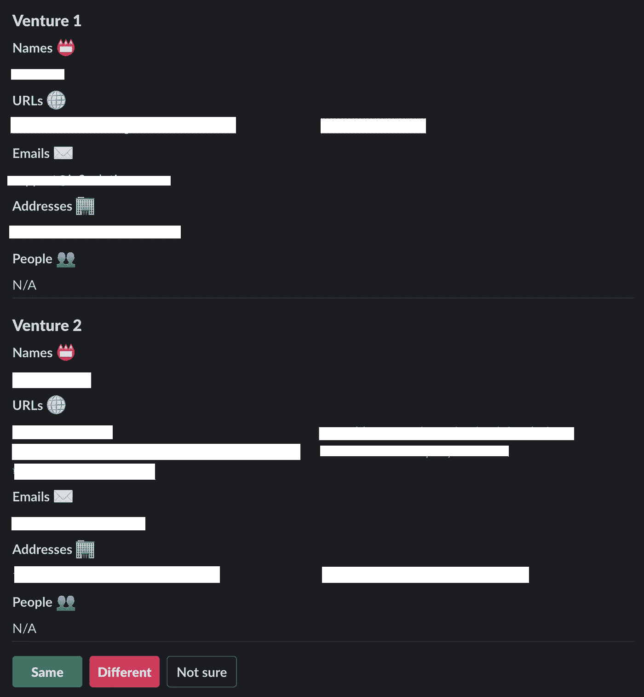
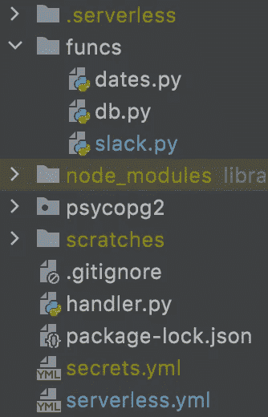
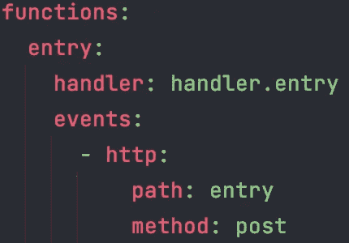
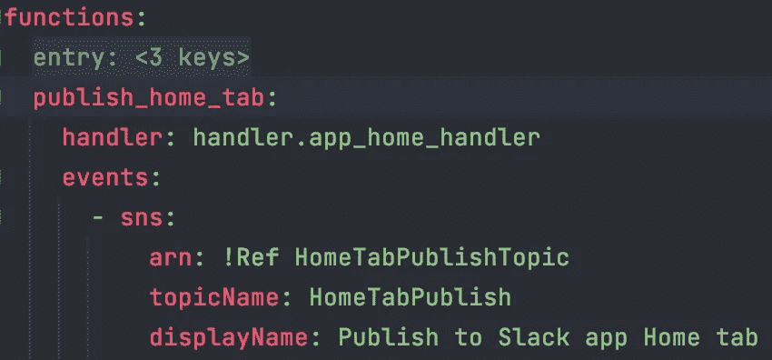
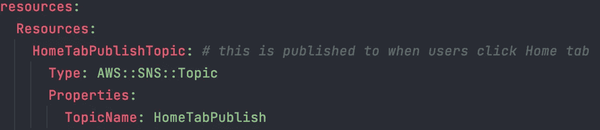

# 无服务器 Slack 应用架构

> 原文：<https://medium.com/geekculture/serverless-slack-app-architecture-d1f310338eba?source=collection_archive---------14----------------------->

这篇文章是我关于使用 Slack 优化手工实体解析的文章[的后续文章](/geekculture/using-slack-to-optimize-manual-entity-resolution-f159b3745a5e)。在那篇文章中，我分享了我如何使用一个定制的 Slack 应用程序来促进一个人在回路中的过程，以验证具有相似但不精确匹配名称的合资企业之间的自动匹配。总之，该应用程序向用户呈现了两个风险匹配，并让他们选择将这两个匹配标记为“相同”、“不同”或“不确定”。一旦他们选择了一个选项，下一个潜在的匹配就会显示出来，并重复这个过程。

The app’s Home tab interface

我决定用无服务器的方式实现 Slack 应用。由于数据存储(合资企业)已经为我们的分析需要而设置，我只是用它来记录任何相关的应用程序活动(例如，谁审查了每场比赛，他们选择了哪个选项，等等)。).这意味着该应用程序不需要在其他任何地方存储持久数据，因此该架构的其余部分可以完全无服务器。

没有什么比无服务器框架更容易进行无服务器开发了([serverless.com](https://www.serverless.com/))。它(主要)是一个开源的基础设施即代码(IaC)框架，允许您使用单个 YAML 文件来配置和部署整个应用程序堆栈。它最适合不需要任何持久存储的应用程序，但无服务器应用程序也可以包括像 S3 桶和 DynamoDB 实例这样的资源。

我不能与您共享我的 serverless.yml 文件内容，但是当我编写了将检索和发布匹配项并执行所有其他与应用程序相关的工作的函数时，我的项目目录如下所示:

A typical serverless project directory structure

我使用无服务器 CLI 工具命令`sls deploy.`部署了应用后端

总的来说，最终的应用架构如下所示:

Serverless Slack app architecture

Slack 应用程序在 Slack 管理设置中进行配置，以便每当 Slack 应用程序主页选项卡打开时，发送一个有效负载到应用程序部署到 AWS 后生成的 API 网关 URL。使用 POST 方法将有效负载发送到 Amazon API Gateway，后者又将有效负载转发到“入口”Lambda 函数，后者验证请求并触发工作流的其余部分。使用无服务器框架建立这种连接非常容易。该连接的整个配置如下所示:

An http events entry means the function can be executed via API Gateway

从那里，多个 Python Lambda 函数将消息发布到 SNS 主题，其他 Python Lambda 函数订阅这些主题。这意味着当新消息发布到 SNS 主题时，订阅的 Lambda 函数将被激活，它们将可以访问发布到 SNS 主题的任何消息。同样，使用 serverless.yml 配置很容易实现这种设置:

The function publish_home_tab is now set up to fire whenever a message is published to the HomeTabPublish topic

如果您在 serverless.yml 文件的`resources`部分进行配置，Serverless 甚至会为您设置 SNS 主题:

!Ref in the previous image points to the resource being created here, specifically HomeTabPublishTopic

鉴于该应用的用户都是内部员工，整个堆栈的运行成本为 0 美元。这使得向我们的 it 部门销售变得相当容易！

现在你知道了:无服务器和定制 Slack 应用是一个强有力的组合。对于小型工作负载，这种架构可以自由运行，几乎不需要维护。请留下您的想法或问题的评论；我很乐意分享更多！