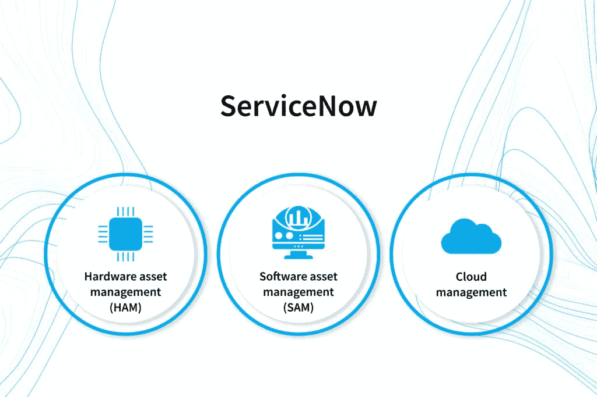
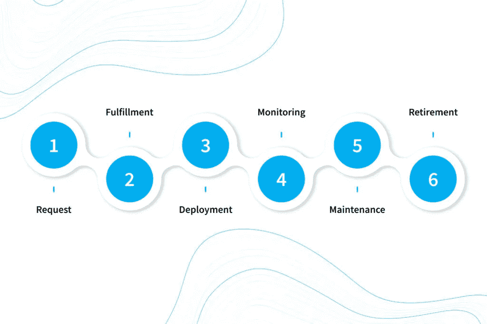
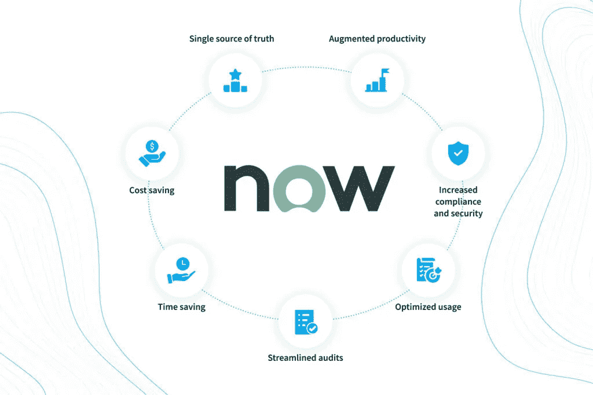

# ServiceNow IT 资产管理:有效跟踪硬件和软件— NIX United

> 原文：<https://medium.com/geekculture/servicenow-it-asset-management-keeping-efficient-track-of-hardware-and-software-nix-united-2984f27b345a?source=collection_archive---------15----------------------->

现代商业领域本质上是一个数字驱动的领域。为了在当今激烈的竞争中生存和发展，公司广泛使用不同种类的硬件，其中包括 CRM、ERP、专业移动应用程序和其他企业解决方案。他们中最聪明的投资于 [IT 集成服务](https://nix-united.com/services/enterprise-it-integration-and-customization-services/)，其最佳实践旨在确保所有类型的软件都能很好地相互兼容。

然而，大多数组织倾向于关注其 IT 环境运行的某些方面，而未能认识到多个端点和解决方案形成了一个复杂且分支的系统，应该从整体上加以考虑。如果不是 ServiceNow IT 资产管理软件，这将是一个相当棘手的问题。这个 [ITAM 平台](https://nix-united.com/blog/servicenow-overview-of-the-revolutionary-it-management-platform/)简化和促进了企业为实施管理公司拥有的高科技资产的全面战略所做的一切努力。

# ServiceNow 中的资产管理方面

IT 部门的 ServiceNow 资产管理涵盖三个领域。

*   ServiceNow 硬件资产管理(HAM)。这一过程涵盖了所有企业设备的生命周期，从购买设备开始，到最终处置不再满足用户需求的机器结束。
*   ServiceNow 软件资产管理(SAM)。该部门负责与购买、使用和逐步淘汰公司在其工作流程中使用的软件资源相关的战略规划、决策和预算。
*   ServiceNow 云管理。这种类型的服务 Now ITAM 用于提供云服务和基础设施，强调成本透明和一致的管理。

让我们仔细看看 ServiceNow 中全面资产管理的每个要素。

# 聚焦 ServiceNow 硬件资产管理

在讨论 ServiceNow HAM 之前，有必要弄清楚在企业硬件的统称下设备是指什么。通常，它包括:

# 最终用户设备

这里是员工在日常工作中使用的所有小发明。除了公司拥有的台式机、笔记本电脑、平板电脑、智能手机(以及其中的 SIM 卡)和其他小工具，员工用来执行业务相关任务的个人设备也被视为组织的硬件资产。

# 网络硬件

这是辅助设备(路由器、交换机、视频会议和其他电信系统)，用于在端点和用户之间传输各种数据。

# 数据中心机器

这一类别不仅包括用于数据存储的服务器，还包括允许此类服务器无缝运行的其他设备(例如，实用程序或安全设备)。

# 外围设备

没有打印机、扫描仪、投影仪、耳机等，现代办公室的高效运转是不可能的。此外，即使像电缆和适配器这样的小部件也包含在 ServiceNow 硬件资产管理中。

全球疫情的爆发使远程工作的概念成为主流。这就是为什么 ServiceNow HAM 的目标是确保远程员工在家中操作的硬件以及所有此类设备符合公司的所有要求。

ServiceNow 硬件资产管理处理所有这些设备的整个生命周期，包括以下组件:

企业硬件必须符合一系列条件，如技术要求、成本、合规性等。但所有这些都归结为两个基本问题:我们需要什么硬件来满足我们的业务需求？我们需要多少预算来购买它？一旦你找到了这些问题的答案，最适合的硬件需求就会被提交。

## 2.完成

当您知道要寻找什么时，您开始筛选可用的供应商，考虑他们提供的技术支持和保修的范围，并评估他们提供的机器与您公司拥有的其他 IT 资源的兼容性。如果企业鼓励自带设备的方法，则以硬件为中心的 ServiceNow ITAM 公司的实施阶段应确保个人设备的安全性及其对内部环境的访问。

## 3.部署

当硬件由您支配时，您必须将设备交付到其未来的工作区域，对其进行配置，并将其与其他资产集成在一起，以便与其协同工作。应向该硬件的最终用户简要介绍可接受的使用政策，并同意遵守这些政策。

## 4.监视

在使用设备时，授权员工必须跟踪其性能，防止其离开指定位置，并预防所有故障风险(随着硬件老化而成比例增长)。ServiceNow ITAM 公司的专业报告工具[可以帮助您控制](https://nix-united.com/blog/what-is-servicenow-reporting-capabilities-and-best-practices/)整个 IT 基础设施并优化其中的资源消耗。

## 5.维护

这一阶段不仅需要定期的服务会话、更新、升级或紧急维修。专家还必须能够确定该资产是否仍然可以开采，或者是否应该报废和回收。

## 6.退休

一旦设备不再起作用、不再可用或/和不再安全运行，就必须停止使用。在这种情况下，所有公司数据都将从设备中删除，之后可以出售、捐赠、回收或以任何适当的方式处置。

面向硬件的 ServiceNow 资产管理解决方案支持创建和管理 HAM 数据存储库，监控合同和库存详细信息，并实现 HAM 相关流程的大部分自动化。

# ServiceNow 软件资产管理审查

ServiceNow SAM 旨在通过与硬件组件基本相同的生命周期阶段(从需求到淘汰)来跟踪组织的软件资产。然而，数字资产的性质需要 ServiceNow 软件资产管理中涉及的完全不同的工具。

# 软件清单

该组织采用的所有解决方案都列在那里，并标明了相关数据(文件信息、标题、大小、版本、创建日期和产品 ID)。

# 许可证管理

事实上，这个解决方案是一个存储库，有助于清单工具提供的数据的许可协调。通过利用其最佳实践，公司可以保持强大的许可地位，并在软件许可不足时及时获得通知。

# 软件计数

该工具能够以硬数字确定软件利用率，并指示其是否合规。

# 访问控制

ServiceNow SAM 的这一要素旨在定义对特定软件甚至企业解决方案特定领域的访问。通过这种方式，您可以确保任何未经授权的人都不允许处理秘密的业务数据。

# 补丁管理

一旦需要这样的补丁，ServiceNow 中的软件资产管理机制会确保它们自动部署到组织使用的所有解决方案中。通过这种方式，所有专业软件都保持最新和安全合规，以排除违规和泄漏。

ServiceNow 软件资产管理有两个版本。SAM Basic 的功能范围非常有限，因此建议使用 ServiceNow SAM Professional。这是一个功能全面的平台，可从 ServiceNow 内容服务接收数据馈送，并可执行与企业软件相关的所有资产管理任务。

# 使用 ServiceNow 管理云资源

如果不利用云技术提供的大量机会，任何当代企业解决方案都会受到损害，而 Servicenow IT asset management 在管理基于云的技术方面提供了帮助。

*   SaaS。您可以通过跟踪组织使用的所有此类应用程序的获取、实施、更新和许可来管理软件即服务解决方案。
*   IaaS。由于基础架构即服务完全是关于云中托管的数据仓库，因此您可以控制其数据存储和容量的利用率。
*   PaaS。平台即服务为公司运行的基于云的应用程序提供部署环境。其管理包括从云提供商处购买资源用于应用部署，并监控其使用情况以保持在预算或使用合同范围内。

通过利用 ServiceNow，您可以订购云服务，使用基于云的解决方案安排日常运营，进行审计，在多云环境中提供高效的服务，并管理部署在云中的所有资产。

无论由 ServiceNow 工具支持的资产管理策略涵盖哪些 IT 资源，它都会带来许多好处。

# IT 资产管理的优势

onboarding ServiceNow 资产管理软件为您带来了哪些好处？

# 真理的单一来源

当资产由一群人跟踪时，没有人对组织的资产有全面的了解。借助 ServiceNow，您可以获得该公司拥有的每个应用程序和键盘的集中和整合记录，并在这种认识的指导下做出明智的决策。

# 成本节约

一旦你对公司的所有资源有了一个全面的了解，你就可以计算出你的支出，找出你可以削减成本的地方。您还可以避免与违反合规性政策相关的监管处罚。

# 节约时间

你需要的任何数据都能以闪电般的速度找到。此外，大量工作流程的自动化(更新软件、续订许可证、启动软件和硬件请求、监控合规性等)。)让你有更多的时间从事更有成效或创造性的活动。

# 简化审计

所有资产相关数据唾手可得，您可以对组织运作的任何方面进行更快、更有效的检查和审计。

# 优化使用

对所有资源进行有组织的管理是员工正确使用硬件和软件、提高设备损失预防和减少浪费的保障。

# 提高合规性和安全性

有了完整的资产清单(包括易受各种威胁攻击的资产),安全团队就可以制定全面的覆盖政策，并确保遵守既定的法规。

# 提高生产率

所有以前的好处都转化成了这一个。通过利用 ServiceNow 工具实施的适当的资产管理策略，当员工能够预测影响、预防紧急情况并提高组织的整体效率时，会带来高效的工作流程。

为了充分利用所有这些优势，公司应该遵循 ServiceNow 资产管理最佳实践。

# 最大化服务 Now IT 资产管理:有用的提示

帮助你擅长资产管理的基本步骤是什么？

# 获得普遍买入

自然，IT 资产管理是技术部门的核心任务。然而，如果其他员工对此漠不关心，或者更糟糕的是，对这项工作冷眼相待，即使 IT 人员最勤奋的努力也注定要失败。如果要管理的资产分布在多个子公司，情况尤其如此。

为了让所有利益相关者都参与到这个过程中，高层必须在技术团队和其他员工之间提供有效的双向沟通。后者必须知道他们在发现资产时要做什么，或者在设备出现故障时要采取什么措施。通过这种方式，你促进了资产所有权，并鼓励员工保持资产处于正常运行状态。

# 掌握资产调节

这可以通过监控关键指标来实现，即控制主要指标如何与业务目标相吻合的指标。为了有效地执行这种监控，您应该从目标(例如，改进购买决策)开始，并跟踪所有 KPI(平均维护成本、资产折旧率、您支付的租赁违规罚款),这些都有助于解决这一挑战。

这种监控的重要性不仅取决于组织能够进行的更有见识的战略行动，还取决于手边的这种数据(顺便说一下，这也包括非 IT 资产)。这些记录的可用性和相关性对于未来的任何审计也是至关重要的。

# 将摄入分成几部分

当创建新的资产名册时，利益相关者倾向于一次性将大量资产输入其中。虽然 ServiceNow Discovery 可以处理大部分此类数据，但 IT 团队肯定会发现很难一次接收并验证所有条目。

推荐的方法是通过输入可消化的数据量来移动。经验法则是从 IT 部门的资产开始，并以此任务为基准来验证接收过程。随后，其他部门的资产可以按照同样的思路一个接一个地被吸收。

# 自动化资产发现

ServiceNow 平台与[人工智能](https://nix-united.com/services/ai-solutions-artificial-intelligence/)和机器学习玩得很好。这些技术的这种本地支持通过配置管理数据库实现了自动资产管理。在这种情况下，如果小工具的实时状态与数据库中定义的状态不同，您的技术人员将通过票证收到警报，并可以禁用该设备。之后，设备用户必须将其带到 it 部门进行维护或检查。

# 优先考虑数据质量

无效或过时的数据，以及不正确或混乱的条目，极大地扰乱了资产管理。为了减少这种情况，您应该定期审核数据输入过程和结果的准确性。ServiceNow 拥有自动扫描网络新资产的工具。如果您选择手工输入资产，负责这项工作的人员应该严格遵循资产注册填充的简单过程。

# 结论

在工业 4.0 时代，企业严重依赖各种最先进的资产——硬件、软件和云。将它们作为独立的项目来管理是一种错误的策略。ServiceNow 提供了一个全面的平台，使组织能够跟踪其生命周期中拥有的所有 IT 资产，优化其使用，简化内部工作流程，并显著提高公司的工作效率。

NIX United 作为 IT 领域的一名经验丰富的参与者，可以向您咨询利用这项技术的细节，并帮助您将 ServiceNow 应用到您公司的实践中。

*原载于 2022 年 9 月 26 日*[*【https://nix-united.com】*](https://nix-united.com/blog/everything-you-need-to-know-about-servicenow-it-asset-management/)*。*