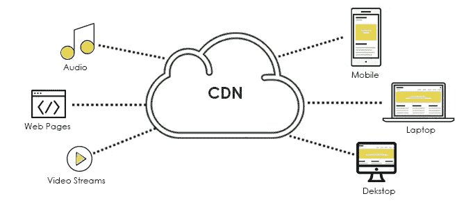
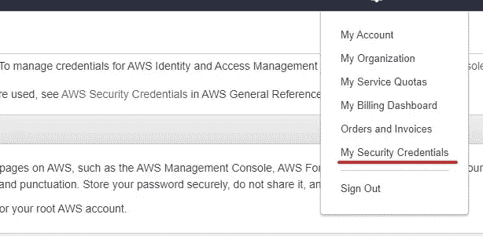
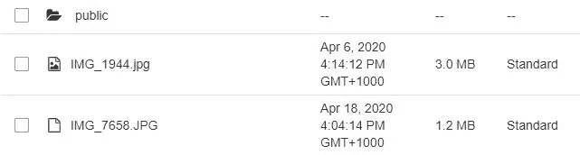
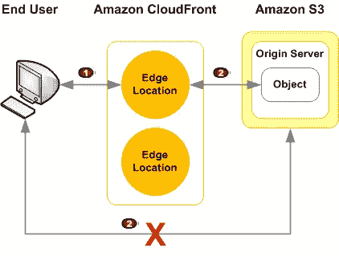
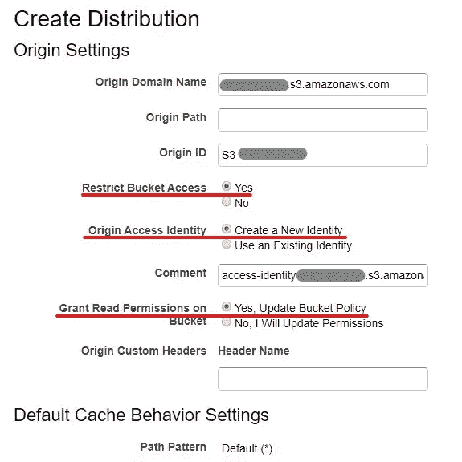
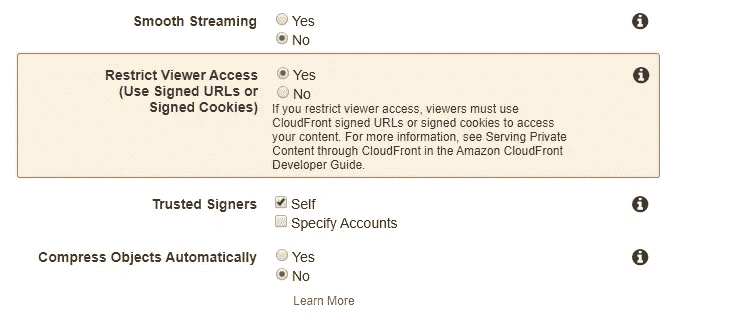

# 通过 AWS CloudFront 提供公共和私有 S3 内容

> 原文：<https://medium.com/geekculture/serving-a-mix-of-public-and-private-content-of-s3-through-aws-cloudfront-e158684f828a?source=collection_archive---------1----------------------->



AWS CloudFront 是一种 CDN web 服务，通过其边缘位置分发您的静态内容，以加速内容交付。许多公司要求从他们的 S3 桶中提供混合的私有和公共内容，但是我发现 AWS 指南在这一点上不是很清楚。我写这篇文章是为了分享我学到的一些技巧。

AWS 通过签名的 URL 或签名的 Cookie 来保护私有内容。本文将集中讨论签名的 URL，因为它更通用。无论如何，签名的 Cookie 与签名的 URL 非常相似。

在深入技术细节之前，让我们先弄清楚 URL 签名。CloudFront 支持一种向最终用户授予私有内容临时访问权的方式，即在内容 URL 上签署一个条件，通常是一个过期时间戳。因此，最终用户可以在有限的时间段内访问签名的内容 URL。

要对文件 URL 进行签名，您需要一对签名密钥:一个用于应用程序签名文件 URL 的私钥和一个用于 CloudFront 验证签名的 URL 的公钥。

*   ***只有 AWS Root 用户才能生成一对 CloudFront 签名密钥***

如果您不是 root 用户(大多数公司不会给开发人员 Root 证书)，您应该在开始之前询问一下。这可能是一个很高的要求，但 CloudFront 是一个跨所有地区的特殊 AWS 服务，这可能有安全原因。

可以在 root 用户帐户安全凭据页面中生成和下载密钥对。



## 创建一个 S3 桶

假设您的私人和公共内容都存在于 S3 存储桶中，您需要将这些内容分隔到不同的位置。如果公共和私人内容已经在不同的桶里，那也没关系，继续读下去。如果在 S3 桶中没有办法区分公共和私有文件，那么 CloudFront 可能也没有办法区分哪些文件是公共的，哪些是私有的。

*   ***公共和私有文件应该在分开的 S3 位置***

但是为什么呢？CloudFront 使用 S3 位置路径作为 CDN URL 的一部分。当 CloudFront 收到用户请求时，它不知道您对所请求文件的应用程序级权限。将公共文件放在一个公共文件夹中，允许 CloudFront 根据 URL 路径轻松识别它是一个公共文件，因此它可以只解除该文件夹上的签名 URL 策略。



在我上面的例子中，公共文件存在于一个公共文件夹中，其他的都是私有文件。您可以在您的 S3 桶中使用其他方式组织公共/私有文件，但是原则是它应该允许 CloudFront 容易地识别公共/私有路径。

*   ***阻止公众访问您的整个 S3 桶***

我们需要确保 CloudFront 可以从这个 S3 桶中读取数据，但是绝对不应该有公共访问这个桶的权限。这很重要，因为公共可访问 S3 存储桶允许最终用户绕过 CloudFront 直接访问受限文件。

转到您的 S3 存储桶的权限选项卡，阻止所有公共访问。(您可能需要允许您的应用程序写入这个桶)

CloudFront 将使用一个特殊的特性， **Origin Access Identity** ，来访问 S3 桶。

下图说明了我们正在努力实现的目标



1.  限制访问文件缓存的签名 URL
2.  仅限 CloudFront 访问您的 S3 存储桶中的对象

## 创建 CloudFront 发行版

转到 AWS CloudFront 页面，单击 Create New Distribution。选择您的 S3 桶网址作为原始域名。确保您启用了限制存储桶访问，并且新的源访问身份已添加到存储桶策略中。



必须启用限制查看者访问。如果您是 Root 用户，可信签名者应该是 self。



您可以将所有 rest 选项保留为默认设置。在创建了一个发行版之后，如果您想要测试它，请等待发行版的状态就绪。这可能需要几分钟到半小时，具体取决于部署的位置。🙄

## 允许公共访问的新缓存行为

现在我们已经限制了所有文件的 URL 签名。我们的公开档案呢？

单击行为，创建新行为。确保它具有以下配置。

**路径模式:**/*
**限制查看者访问:**否

这使得匹配模式`<your CloudFront URL>/public/*`的文件可以通过这个 CloudFront 发行版公开访问。

如果对公共文件使用另一个 S3 存储桶，而不是同一存储桶下的文件夹，则需要为该公共存储桶创建另一个源，并为该源创建一个缓存行为，仅用于禁用查看者访问。

## 签名文件 URL

签名算法只是标准的 RSA SHA-1 算法。您的应用程序可以对其进行签名，而无需 AWS 工具。

有两种签名方式，固定策略或自定义策略。如果您需要做的只是一次签署一个文件。就用罐头政策。自定义策略对于一次签署多个文件非常有用。

在 [AWS 指南](https://docs.aws.amazon.com/AmazonCloudFront/latest/DeveloperGuide/PrivateCFSignatureCodeAndExamples.html)中有代码示例来演示签名过程。

## 对多个文件重复使用签名

当涉及到签署一堆文件时，例如，一个文件夹下的文件集合。如何高效正确地做这件事让我很困惑。AWS 指南在提到“您可以为多个文件重用策略声明”时并不是很清楚。

*   ***您可以使用自定义策略对所有允许的文件重复使用签名***

如果您在一个文件夹中有许多私有文件，并且您需要向用户提供所有这些文件，那么您应该使用自定义策略来授予对整个文件夹的访问权限，并对所有被授予权限的文件重复使用生成的签名。签名过程只对自定义策略本身进行签名，因此结果签名与所有文件完全相同。

自定义策略应该是这样的

```
{
  "Statement": [
    {
      "Resource":"http://d111111abcdef8.cloudfront.net/training/*",
      "Condition":{"DateLessThan":{"AWS:EpochTime":1357034400}}
    }
  ]
}
```

上述策略将生成一个签名，该签名可以附加到 training 文件夹中的所有文件 URL。

## 向最终用户提供文件

现在你差不多完成了。签名应该附加到 CloudFront CDN URL，并提供给用户。完整的签名网址如下所示。

```
http://d111111abcdef8.cloudfront.net/training/image.jpg?Policy=<base64 policy>&Signature=<base64 policy>&Key-Pair-Id=<key id>
```

最后，您可能希望设置您的应用程序域来替换默认的随机 CloudFront CDN URL，因为它看起来不太好。

祝你好运，愿`git push --force`与你同在！