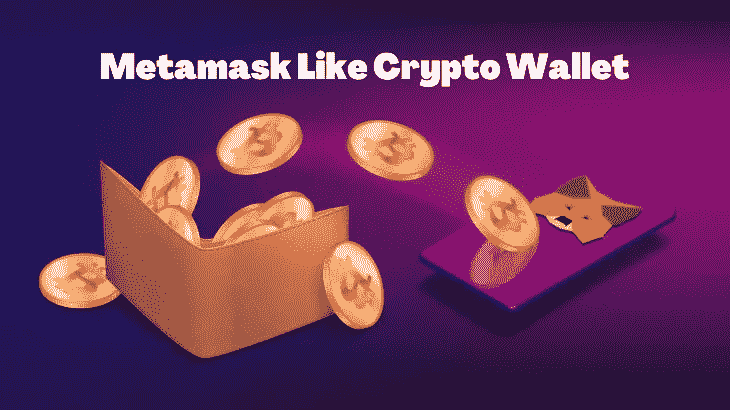
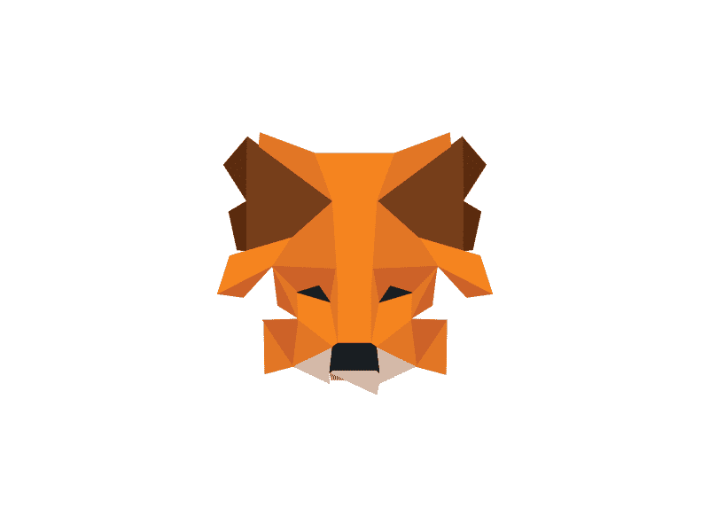
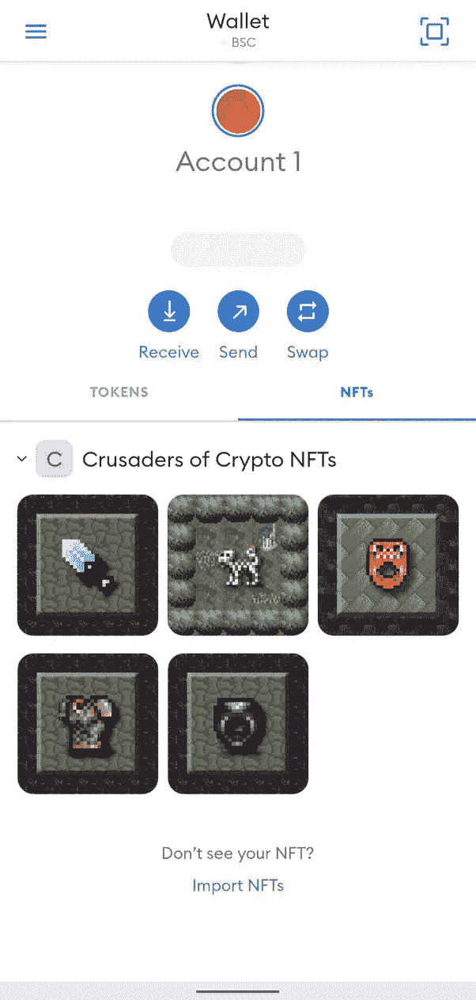

# 通过开发类似加密钱包的元掩码，在加密领域树立一个标志

> 原文：<https://medium.com/geekculture/set-a-mark-in-the-crypto-space-by-developing-a-metamask-like-crypto-wallet-a398d6ca909f?source=collection_archive---------18----------------------->

元掩码在加密世界中留下印记是有原因的。市场上有许多钱包，Metamask 是最受欢迎的加密钱包之一，每月活跃用户近 2100 万，比 2020 年增加了近 38 倍。Metamask 受欢迎的一个主要原因是，它允许用户连接超过 3700 个分散的应用程序和 Web3 服务。如果你渴望 [**创造一个像 Metamask**](https://bit.ly/3Qbepqg) 一样的加密钱包，那么你就选择了一条有利可图的商业冒险之路。

## **Metamask**

[**meta mask**](https://metamask.io/)**是一款开放、安全、人性化的加密货币钱包。它可以作为 Chrome 和 Firefox 的网络扩展，适用于所有 Android 和 iOS 设备。Metamask 可以作为以太坊上各种 Dapps 的连接节点。元掩码也与 ERC-721 和 ERC-1155 令牌兼容。开发元掩模的意图很清楚；它是作为管理加密货币和安全访问 Dapps 的 web 扩展而创建的。**

****

****Metamask****

## ****meta mask 是如何工作的？****

**Metamask 使用 web3.js 库来运行。开发该库是为了与**以太坊区块链**进行交互，利用其功能，并满足 Web3 应用程序的要求。Metamask 基本上是一个为以太坊构建的应用程序，它与 Dapps 一起工作和交互。当 Dapp 识别元掩码时，它会创建一个连接，用户可以开始使用它的所有功能。Metamask 控制 Dapps 的所有功能及其使用。除了作为钱包之外，它还处理特定操作所需的操作。**

## ****类似钱包开发的 meta mask****

**[**创造一个类似钱包**](https://bit.ly/3Qbepqg) 的元掩码有很大的潜力成为市场上最好的加密钱包之一。像 Metamask 这样的钱包将因其最大的兼容性而闻名，因为它支持所有类型的 Web3 资产，如**加密货币、**和**其他 Web3 令牌**。**

## ****类似加密钱包的元掩码的特征****

**✪:用户友好的:Metamask 钱包的一个主要特点是简单易用。它提供了一个用户友好和直观的界面，使与 Dapps 和加密管理的互动更容易。**

**✪ **与 dapp 和其他区块链的集成:**用户只需轻轻一点就可以连接各种 dapp。用户还可以在多个交易所交易代币，在热门市场购买 NFT，并推出区块链游戏。此外，像钱包这样的**元掩码也可以连接到其他区块链，如 Avax、Polygon、Fantom 和 BSC。****

**✪ **硬件钱包支持:**兼容硬件加密货币如 Ledger、Nano、Trezor。用户需要点击“连接到硬件钱包”按钮。**

**✪ **互换支持:**它提供了快捷且经济的机会，通过互换在钱包之间交换代币。用户可以通过自动标记找到最佳的代币汇率。**

**✪ **NFT 支持:**它也允许用户存储 NFT。它们显示在钱包上的**“数字收藏品”**标签下。**

## ****类似钱包开发的元掩码是如何工作的？****

**使用元掩码的用户有两种类型:普通用户和管理员。普通用户使用钱包来持有、购买和出售密码。管理员是负责钱包功能和管理的员工。**

> **➤ **注册:**创建钱包账户很容易。从官网下载 Metamask 扩展，设置一个强密码的账号。**
> 
> **➤ **适用汇率:**您可以为元掩码添加额外的功能，如钱包、代币汇率和投资概况，这些功能在元掩码上是不可用的。**
> 
> **➤ **加密货币资产的操作:**加密钱包的基本功能是持有、出售和接收加密资产。重要的是确保这些功能是用户友好的，并使任何用户对使用钱包有信心。您还可以添加其他功能，让用户可以查看交易历史和当前余额。**
> 
> **➤ **最喜欢的地址:**使用户能够创建一个最喜欢的地址列表，以实现更快的令牌交易和更少的经常性运营费用。**
> 
> **➤ **连接其他区块链:**安装 Metamask 后，用户只能使用以太坊和 ERC20 令牌。但他们可以连接到其他区块链，并有一个单一的钱包地址访问整个区块链。**
> 
> **➤ **NFT 支持:**使用 NFT 集市时支持**NFT 的存储**。**

****

****Metamask Wallet -NFTs****

## ****开发元蒙版钱包的路线图:****

**👉**构思:**通过对市场、竞争对手和目标受众的深入研究，为你的钱包制定一个计划。**

**👉**开发架构:**根据第一步的研究数据，创建钱包的基本架构。架构应该显示系统组件、功能以及它们之间的交互。**

**👉 **UI/UX 设计:**为用户创建一个友好的界面，方便用户浏览钱包。**

**👉**开发:**用智能合约、框架等组件开发前后端代码的钱包。**

**👉**测试:**通过多次测试来测试你的钱包的功能，确保钱包没有任何缺陷和错误。**

**👉**启动:**钱包准备好启动后，根据您的需求将其部署在各种平台上，如网络浏览器、移动应用程序和扩展。**

**在这个密码时代，对密码和钱包的需求正在慢慢增长。越来越多的企业家和公司通过推出自己的加密钱包进入加密领域。如果你渴望 [**开发一个像 Metamask**](https://bit.ly/3Qbepqg) 一样的新的加密钱包，那么你已经做出了正确的选择。在市场上选择一家有经验和潜力的区块链开发公司来打造你的超面具钱包。正确的区块链发展公司可以帮助你。**