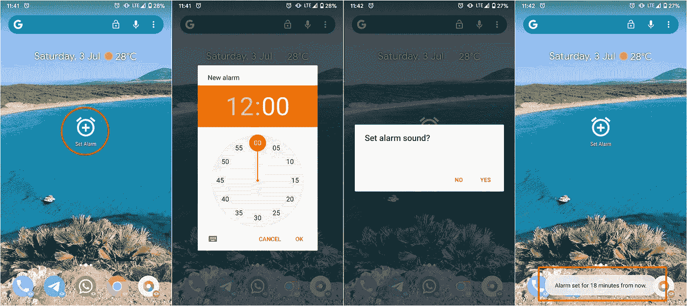
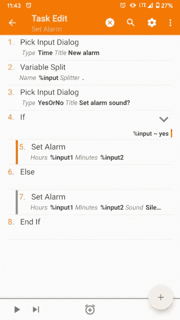
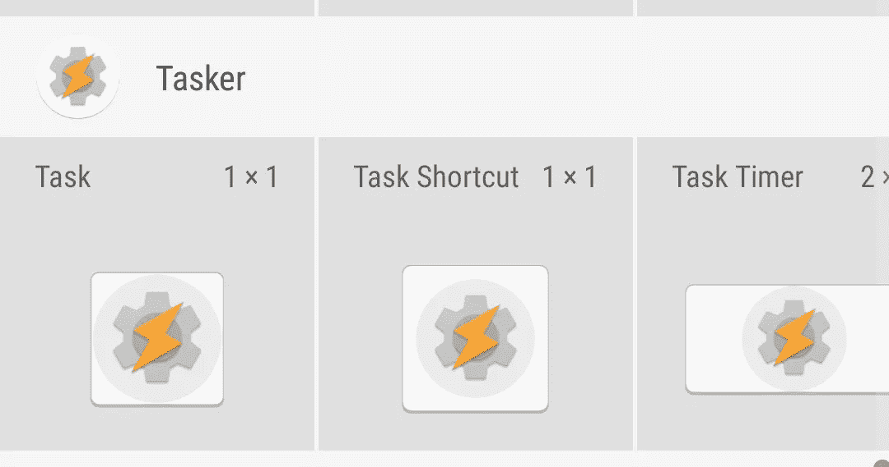
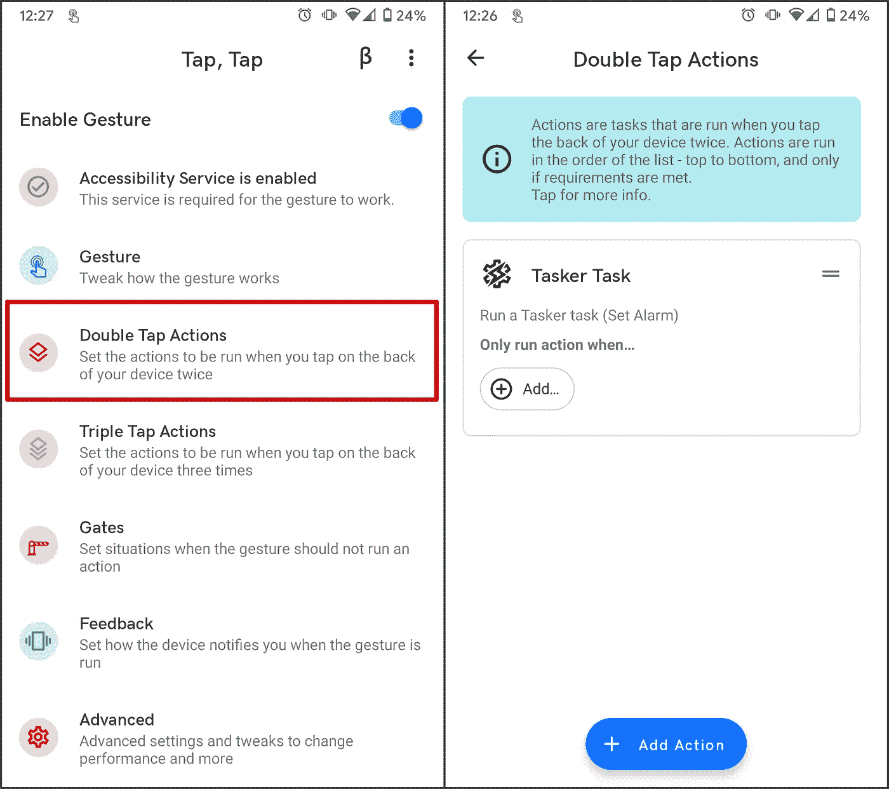

# 用 Tasker 设置闹钟

> 原文：<https://medium.com/geekculture/set-an-alarm-with-tasker-48c784c1297b?source=collection_archive---------9----------------------->

我通常会设置闹钟来唤醒自己或提醒自己必须做的事情。有时候我需要他们安静，有时候我希望他们响。

我创建了一个分两步完成的任务。

# 设置报警任务

这个任务很简单。

1.  **选择类型为*时间*的输入对话框**:询问用户何时触发警报。
2.  **变量拆分**:将对话框 *%input* 按点拆分，在 *%input1* 中有小时，在 *%input2* 中有分钟。
3.  **类型为*是或否*的选择输入对话框**:询问用户是否应该设置新闹钟的默认声音。
4.  **如果**对话框*%输入*为*是*:
5.  **设置闹钟**:小时*%输入 1* ，分钟*%输入 2* 。闹钟声音是在*时钟* app 中设置的默认声音。
6.  **否则**:
7.  **设置闹铃**:小时*%输入 1* ，分钟*%输入 2* ，声音*静音*。

Set Alarm task

你可以从[这个链接](https://taskernet.com/shares/?user=AS35m8nzU8Z2OxB1WGqHbYHDLajdlq0DG%2B8k8f7L2XfQM3eHbHEAthA2xNvalA2%2FZaJvRZj2roE7ow%3D%3D&id=Task%3ASet+Alarm)下载。

# 使用任务

我在主屏幕上添加了一个*任务快捷方式*，以便在需要时启动任务。

From the **Add Widget** menu.

例如，你也可以使用 [TapTap](https://github.com/KieronQuinn/TapTap/releases) 插件，通过双击手机背面来触发它。

TapTap configuration to run the task.

# 删除警报

遗憾的是，不能使用 Tasker 删除警报。

不过有一个叫 [ClockTask](https://play.google.com/store/apps/details?id=com.balda.clocktask) 的插件功能更多。它提供了*动作*来创建和删除报警，并提供了*配置文件事件*来监听报警事件，如*解除*事件。重要的是要记住，这个插件只能删除和订阅由它创建的警报触发的事件。