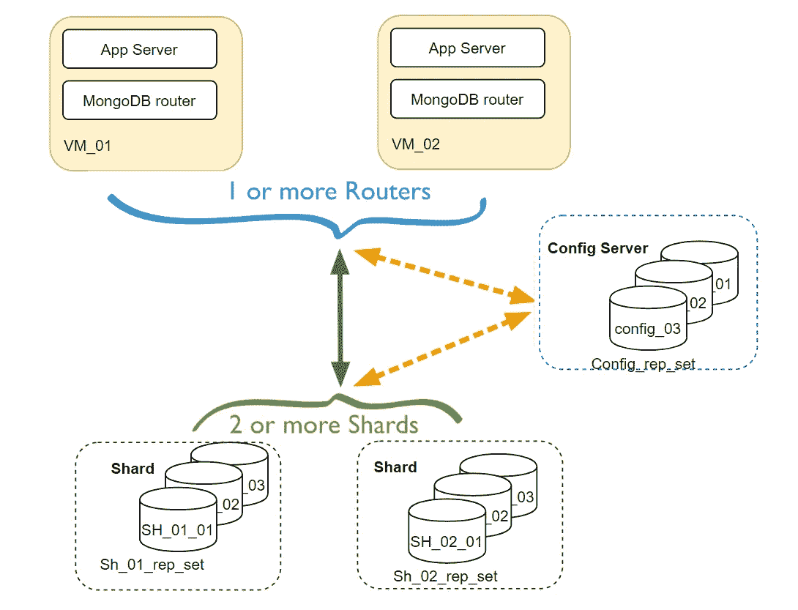
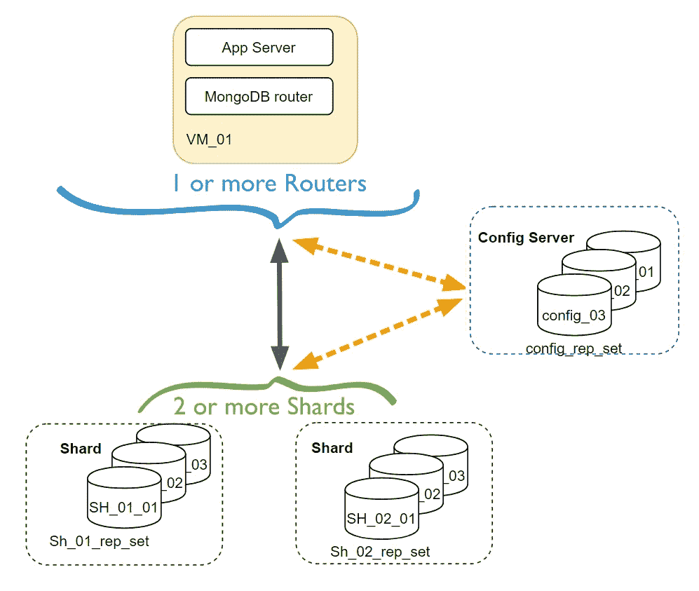

# Mongodb:只需双击即可为 windows 设置分片集群。

> 原文：<https://medium.com/geekculture/set-up-mongodb-sharded-cluster-for-windows-with-just-a-double-click-6eedbb7b79e?source=collection_archive---------0----------------------->



## MongoDB 集群

## 双击 MongoDB 为 windows 设置分片集群。

> 请在最后找到 [Github](https://github.com/arun2pratap/mongodbClusterForWindowsOneClick) 库来配置文件和脚本来设置环境。
> 
> mongodb 3.6+版，必要时链接到 MongoDB 文档以便进一步阅读。

## [分片集群简介。](https://docs.mongodb.com/manual/sharding/)

[分片](https://docs.mongodb.com/manual/reference/glossary/#term-sharding)是一种跨多台机器分发数据的方法。MongoDB 使用分片来支持具有非常大的数据集和高吞吐量操作的部署。

具有大型数据集或高吞吐量应用程序的数据库系统可能会挑战单个服务器的容量。例如，**高查询率**会耗尽服务器的 **CPU 容量**。大于**系统 RAM** 的工作集大小会给磁盘驱动器的 **I/O 容量**带来压力。

MongoDB [分片集群](https://docs.mongodb.com/manual/reference/glossary/#term-sharded-cluster)由以下组件组成:

*   [分片](https://docs.mongodb.com/manual/core/sharded-cluster-shards/):每个分片包含一个分片数据的子集。每个碎片可以被部署为一个副本集。
*   [mongos](https://docs.mongodb.com/manual/core/sharded-cluster-query-router/):`mongos`充当查询路由器，提供客户端应用程序和分片集群之间的接口。
*   [配置服务器](https://docs.mongodb.com/manual/core/sharded-cluster-config-servers/):配置服务器存储集群的元数据和配置设置。从 MongoDB 3.4 开始，配置服务器必须作为副本集部署(CSRS)。

## 使用具有 [3 成员副本集](https://docs.mongodb.com/manual/core/replica-set-architecture-three-members/)主要-次要-次要(P-S-S)的 2 个分片在 windows 中设置分片集群环境。



我们将设置如图所示的集群环境。(单个路由器的本地设置)

## 对于设置，我们将生成 9 个 mongod 实例和 1 个 mongos(路由器)实例。

*   首先，我们需要设置配置服务器副本集。
*   碎片 01 副本集。
*   碎片 02 副本集。
*   配置指向配置服务器的路由器(mongos)。
*   通过路由器向集群添加分片 01 和分片 02。

对于每个实例将创建一个“db”(数据库文件)和“log”(日志文件)文件夹。

## 让我们开始吧……..

## 正在设置配置 3 成员副本集。

*   为 3 实例“数据库”、“日志”文件夹创建文件夹结构

```
md csrs\csrs1\db csrs\csrs1\log csrs\csrs2\db csrs\csrs2\log csrs\csrs3\db csrs\csrs3\log
```

*   `csrs1.conf`配置服务器之一的文件。我们需要分配`clusterRole: configsvr` 将其标记为公共`**replSetName: csrs**` 下的配置服务器，使它们成为同一个副本集“csrs”的成员。

```
**sharding:
  clusterRole: configsvr**
**replication:
  replSetName: csrs**
net:
  bindIpAll: true
  port: 26001
systemLog:
  destination: file
  path: csrs/csrs1/log/csrs1.log
  logAppend: true
storage:
  dbPath: csrs/csrs1/db/
```

*   对于配置副本集的其余 2 个成员，我们将执行相同的操作，如果我们在同一台主机上运行，只需更改端口；如果在不同的主机上运行，则可以保持端口不变。

```
sharding:
  clusterRole: configsvr
replication:
  replSetName: csrs
net:
  bindIpAll: true
  port: 26002
systemLog:
  destination: file
  path: csrs/csrs2/log/csrs2.log
  logAppend: true
storage:
  dbPath: csrs/csrs2/db/
```

将配置保存到文件:`csrs2.conf`

```
sharding:
  clusterRole: configsvr
replication:
  replSetName: csrs
net:
  bindIpAll: true
  port: 26003
systemLog:
  destination: file
  path: csrs/csrs3/log/csrs3.log
  logAppend: true
storage:
  dbPath: csrs/csrs3/db/
```

将配置保存到文件:`csrs3.conf`

*   现在我们可以启动配置服务器了。在端口[26001，26002，26003]上运行

```
echo starting Config replicaSet member's
 start mongod -f csrs1.conf
 start mongod -f csrs2.conf
 start mongod -f csrs3.conf
```

*   将它们配置为同一副本集的一部分。

```
// start one of the server client of the replica set.
 mongo --port 26001
 rs.initiate() 
// this will start showing it as primary.
// add 2 other config server to the replicaset.
 rs.add("didnasiina6:26002") 
// if ip doesn't work use machineName
 rs.add("didnasiina6:26003")
// check all replica set added.
 rs.conf() // this will print the info of the configured server.
{
        "_id" : "csrs",
        "version" : 3,
        "configsvr" : true,
        "protocolVersion" : NumberLong(1),
        "writeConcernMajorityJournalDefault" : true,
        "members" : [
                {
                        "_id" : 0,
                        "host" : "didnasiina6:26001",
                        "arbiterOnly" : false,
                        "buildIndexes" : true,
                        "hidden" : false,
                        "priority" : 1,
                        "tags" : {},
                        "slaveDelay" : NumberLong(0),
                        "votes" : 1
                },
                {
                        "_id" : 1,
                        "host" : "didnasiina6:26002",
                        "arbiterOnly" : false,
                        "buildIndexes" : true,
                        "hidden" : false,
                        "priority" : 1,
                        "tags" : {},
                        "slaveDelay" : NumberLong(0),
                        "votes" : 1
                },
                {
                        "_id" : 2,
                        "host" : "didnasiina6:26003",
                        "arbiterOnly" : false,
                        "buildIndexes" : true,
                        "hidden" : false,
                        "priority" : 1,
                        "tags" : {},
                        "slaveDelay" : NumberLong(0),
                        "votes" : 1
                }
        ],
        "settings" : {
                "chainingAllowed" : true,
                "heartbeatIntervalMillis" : 2000,
                "heartbeatTimeoutSecs" : 10,
                "electionTimeoutMillis" : 10000,
                "catchUpTimeoutMillis" : -1,
                "catchUpTakeoverDelayMillis" : 30000,
                "getLastErrorModes" : {},
                "getLastErrorDefaults" : {
                        "w" : 1,
                        "wtimeout" : 0
                },
                "replicaSetId" : ObjectId("5e09cfcc596228f43c03c4c2")
        }
}
```

现在，我们已经设置并运行了配置服务器副本。

## 正在设置 Shard-01，3 成员副本集。

*   为 3 实例“数据库”、“日志”文件夹创建文件夹结构

```
md sh01\sh011\db sh01\sh011\log sh01\sh012\db sh01\sh012\log sh01\sh013\db sh01\sh013\log
echo Created mongoDb folder structure for Shard 01 Server Instances
```

*   设置 shard replicaset 与我们已经对 config replica set 所做的完全相同。我只需要告诉你这个有一个`clusterRole: shardsvr`并且我们取了一个不同的`replSetName: sh01` ，这个不同的`replSetName: sh01` 将在相同碎片副本集的所有三个成员中通用。

```
**sharding:
  clusterRole: shardsvr
replication:
  replSetName: sh01**
net:
  bindIpAll: true
  port: 27011
systemLog:
  destination: file
  path: sh01/sh011/log/sh011.log
  logAppend: true
storage:
  dbPath: sh01/sh011/db/
```

将配置保存到文件:`sh011.conf`

将对其他 2 人组`sh012.conf`和`sh013.conf`进行同样的操作

*   现在我们可以启动碎片服务器了。在端口[27011，27012，27013]上运行

```
echo starting Shard 01 Replica Set member's.
 start mongod -f sh011.conf
 start mongod -f sh012.conf
 start mongod -f sh013.conf
```

*   将它们配置为同一副本集的一部分。

```
// start one of the server client of the replica set.
mongo --port 27011rs.initiate()
// add 2 other config server to the replicaset.
rs.add("didnasiina6:27012")
rs.add("didnasiina6:27013")
rs.status() // this will print the info of the configured server.// ... not printing the output. already did for config replSet.
```

现在我们已经建立并运行了 Shard 01 副本。

## 正在设置 Shard-02，3 成员副本集。

和碎片 01 的设定一模一样。如果找到并替换`sh01`到`sh02`:)并为所有配置和文件夹结构分配新端口，我们就必须这么做。

```
md sh02\sh021\db sh02\sh021\log sh02\sh022\db sh02\sh022\log sh02\sh023\db sh02\sh023\log
echo Created mongoDb folder structure for Shard 02 Server Instances
```

*   服务器配置文件`sh021.conf`、`sh022.conf`和`sh023.conf`

```
sharding:
  clusterRole: shardsvr
replication:
  replSetName: **sh02**
net:
  bindIpAll: true
  port: **27021**
systemLog:
  destination: file
  path: **sh02/sh021/log/sh021.log**
  logAppend: true
storage:
  dbPath: **sh02/sh021/db/**
```

*   现在我们可以启动碎片服务器了。在端口[27021，27022，27023]上运行

```
echo starting Shard 02 Replica Set member's.
 start mongod -f sh021.conf
 start mongod -f sh022.conf
 start mongod -f sh023.conf
```

*   将它们配置为同一副本集的一部分。

```
// start one of the server client of the replica set.
mongo --port 27021rs.initiate()
// add 2 other config server to the replicaset.
rs.add("didnasiina6:27022")
rs.add("didnasiina6:27023")
rs.status() // check for status, look for Primary/Secondary members.
rs.conf() // see the configuration of replSet.
```

现在我们已经建立并运行了 Shard 02 副本。

## [配置路由器。](https://docs.mongodb.com/manual/core/sharded-cluster-query-router/)

*   启动 mongo 路由器( [mongos](https://docs.mongodb.com/manual/core/sharded-cluster-query-router/) )。

由于 mongo 路由器不是一个数据库实例，没有自己的数据库，只需要创建“日志”文件夹。

```
md router\log
```

*   路由器配置文件`mongos.conf`我们需要路由器指向`**configDB: csrs/didnasiina6:26001,didnasiina6:26002,didnasiina6:26003**` no storage 部分，因为它没有自己的 db，使用配置服务器将查询路由到 shard。

```
**sharding:
  configDB: csrs/didnasiina6:26001,didnasiina6:26002,didnasiina6:26003**
net:
  bindIpAll: true
  port: 26000
systemLog:
  destination: file
  path: log/mongos.log
  logAppend: true
```

*   将 shard 添加到 monos(路由器)。

```
// connect to mongos client 
   mongo --port 26000
   sh.addShard("sh01/didnasiina6:27011")
   sh.addShard("sh02/didnasiina6:27021")
// check the status
sh.status()
--- Sharding Status ---
  sharding version: {
        "_id" : 1,
        "minCompatibleVersion" : 5,
        "currentVersion" : 6,
        "clusterId" : ObjectId("5e09cfcf596228f43c03c4d1")
  }
 ** shards:
        {  "_id" : "sh01",  "host" : "sh01/didnasiina6:27011,didnasiina6:27012",  "state" : 1 }
        {  "_id" : "sh02",  "host" : "sh02/didnasiina6:27021,didnasiina6:27022,didnasiina6:27023",  "state" : 1 }**
  active mongoses:
        "4.0.10" : 1
  autosplit:
        Currently enabled: yes
  balancer:
        Currently enabled:  yes
        Currently running:  no
        Failed balancer rounds in last 5 attempts:  5
        Last reported error:  Could not find host matching read preference { mode: "primary" } for set sh01
        Time of Reported error:  Tue Apr 21 2020 11:50:36 GMT+0530 (India Standard Time)
        Migration Results for the last 24 hours:
                No recent migrations
  databases:
        {  "_id" : "config",  "primary" : "config",  "partitioned" : true }
                config.system.sessions
                        shard key: { "_id" : 1 }
                        unique: false
                        balancing: true
                        chunks:
                                sh01    1
                        { "_id" : { "$minKey" : 1 } } -->> { "_id" : { "$maxKey" : 1 } } on : sh01 Timestamp(1, 0)
        {  "_id" : "mars",  "primary" : "sh01",  "partitioned" : false,  "version" : {  "uuid" : UUID("039312c7-e98d-4099-b69a-1fc57de1d9e4"),  "lastMod" : 1 } } 
```

全部完成..Mongodb 分片集群环境已经启动并运行。

一些有用的命令。

*   [rs.status](https://docs.mongodb.com/manual/reference/method/rs.status/) () // [副本成员](https://docs.mongodb.com/manual/reference/method/js-replication/)命令
*   [rs.config](https://docs.mongodb.com/manual/reference/method/rs.conf/) () // [副本成员](https://docs.mongodb.com/manual/reference/method/js-replication/)命令
*   [sh . status](https://docs.mongodb.com/manual/reference/method/sh.status/)()//[mongos 分片](https://docs.mongodb.com/manual/reference/method/js-sharding/)命令。

# Github 存储库到配置文件和脚本来设置环境。

请按照 README.md 进行快速轻松的设置，只需双击即可:)

[Github](https://github.com/arun2pratap/mongodbClusterForWindowsOneClick):[https://Github . com/arun 2 pratap/mongodbClusterForWindowsOneClick](https://github.com/arun2pratap/mongodbClusterForWindowsOneClick)

> 这个例子如果用于本地盒，将无缝地用于分布式设置。只是你必须使文件夹结构创建配置文件，并在该主机上启动服务器，配置时需要指向该主机。

尽量保持简单，请添加评论/评论任何你认为可以改进的地方。快乐编码:)

希望这是有帮助的，谢谢