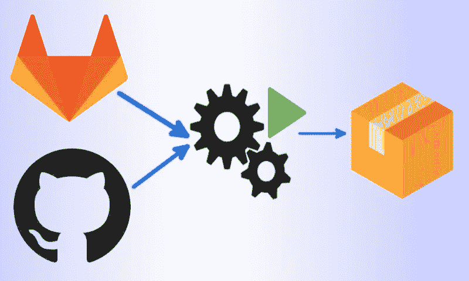

# 使用 Platypush 设置自托管 CI/CD Git 管道

> 原文：<https://medium.com/geekculture/set-up-self-hosted-ci-cd-git-pipelines-with-platypush-f332d5ab8ead?source=collection_archive---------16----------------------->

Git 自动化，无论是以 [Gitlab 管道](https://docs.gitlab.com/ee/ci/pipelines/)还是 [Github 动作](https://github.com/features/actions)的形式，都令人惊叹。它使您能够自动化许多软件维护任务(测试、监控、镜像存储库、生成文档、构建和分发包等)。)直到几年前还需要花费大量的开发时间。这些形式的自动化使 CI/CD 大众化，带来了…