# 为基本 Javascript 项目设置 Webpack 5

> 原文：<https://medium.com/geekculture/set-up-webpack-5-for-basic-javascript-projects-8bded066d282?source=collection_archive---------0----------------------->

Webpack 已经成为我们项目模块化时最有用的工具之一。尽管使用 ES6 语法可以模块化我们的代码，但在本文中，我们将看到如何为我们的项目设置 webpack 5。

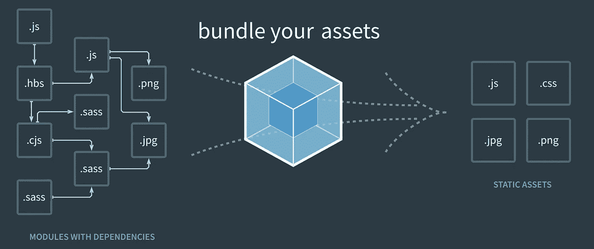

首先，我们将创建一个项目并移动。

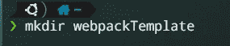

You should use the name of your project.

我们将移动到文件夹。

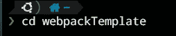

现在，我们将为我们的项目创建一个基本结构。

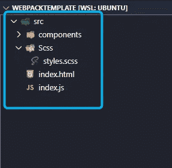

在这个结构中，我们可以看到一个包含所有文件的 src 文件夹，一个包含所有模块的 components 文件夹，一个包含 scss 文件的 Scss 文件夹，一个呈现应用程序的 index.html，以及一个使用模块来呈现应用程序的 index.js。

创建项目结构后，我们将初始化 package.json。如果你没有安装节点，我建议你遵循这个教程。

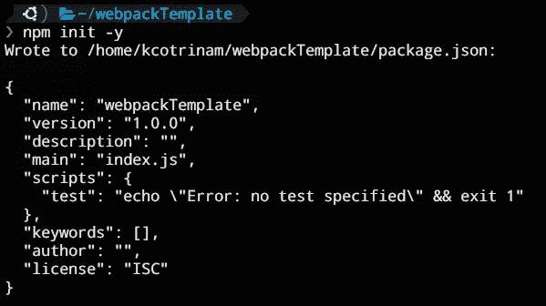

到目前为止，我们还没有看到任何 webpack 配置。这正是我们的项目应该有的基本结构。

现在，我们将安装运行以下代码`npm install —- save-dev webpack webpack-cli`的 W [ebpack](https://webpack.js.org/) 。

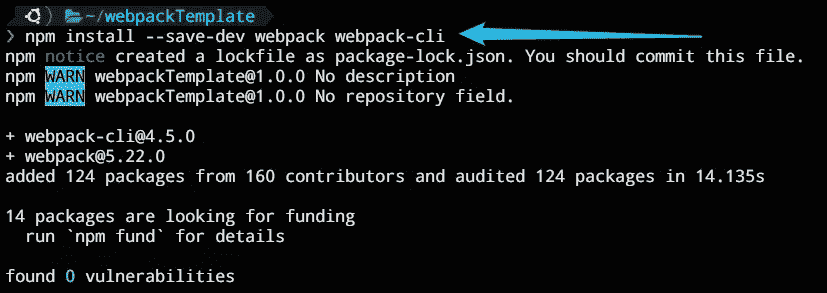

安装 Webpack 后，我们将修改 package.json 中的脚本。

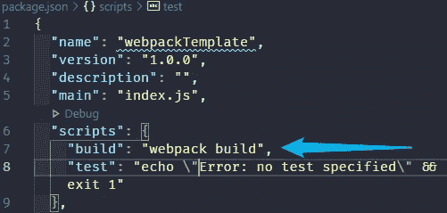

如果我们现在打开终端运行`npm run build`。我们将看到以下输出。

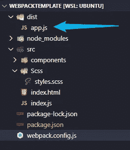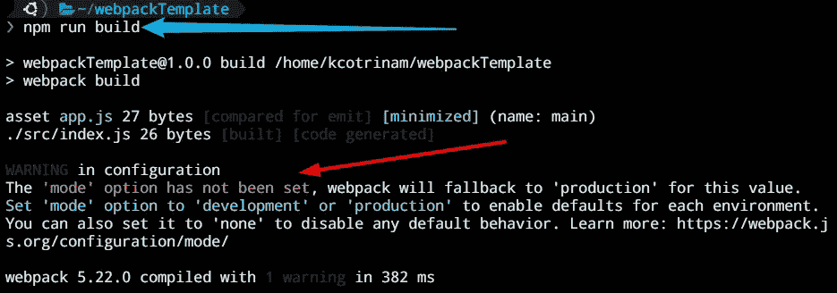

Don’t worry about the red letters, we will fix that in the following steps.

到目前为止，我们已经能够编译 index.js 文件，并在 dist 文件夹中获得输出。但是，如果我们现在对 wepack 的配置更加具体呢？我们继续吧。

首先，让我们创建一个名为“webpack.config.js”的文件。

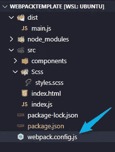

在我们刚刚创建的文件中，我们将添加以下几行:

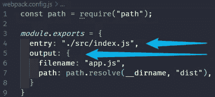

如您所见，我们在 module.export 中有两个主要部分，一个是条目，我们将在其中选择 oust main js 文件(在本例中为 index.js ),另一个是输出，我们将在其中指定编译后的 js 的名称(app.js)和输出路径(dist)。我们还使用了“path.resolve”来指定相对路径，因此为了使用它，我们必须添加第 1 行并需要它。

现在，我们将在 package.json 中添加另一个脚本，并指定我们是处于开发模式还是生产模式:

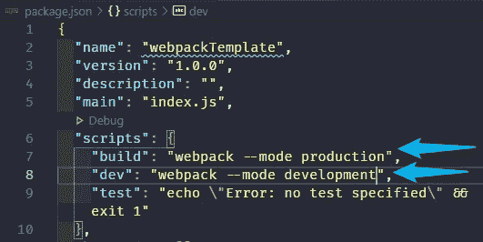

有了这些附加功能，如果我们运行`npmrun build` 或`npm run dev`，我们就再也看不到警告了。

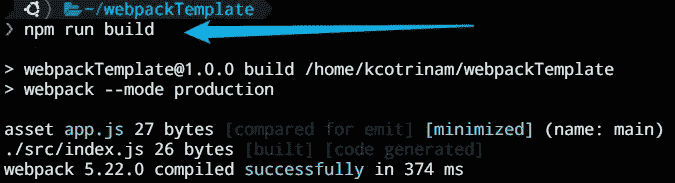

现在让我们开始安装装载机。我们将开始安装必要的加载程序来设计我们的应用程序。运行以下命令`npm i -D sass-loader cdd-loader node-sass`。

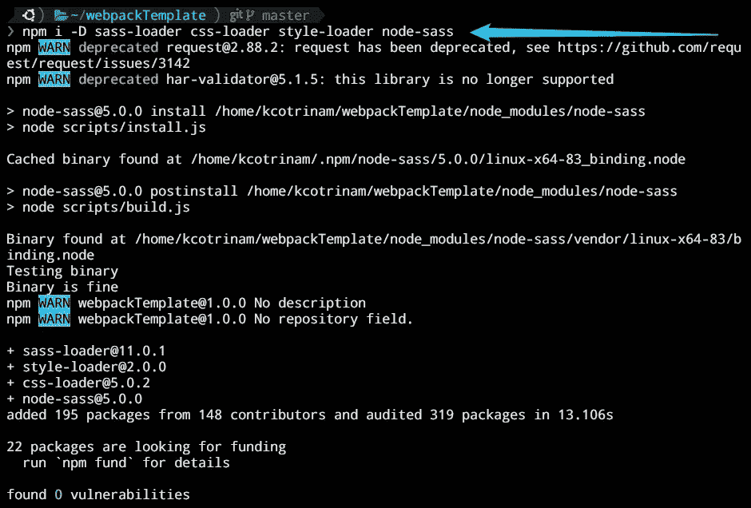

然后，我们将配置我们的 webpack.config.js 文件。在那里，我们将添加一个模块对象，在它里面将有 rules 键，它有一个数组作为值。在数组内部，我们将添加一个具有以下规则的数组:

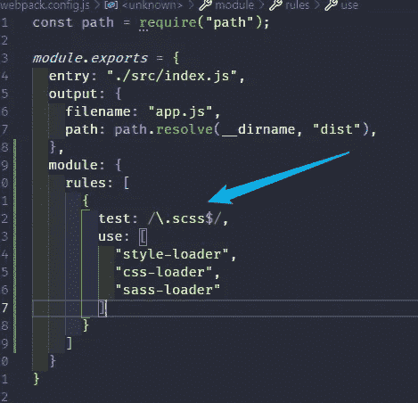

添加规则后，我们需要将 scss 文件导入 index.js 文件。在这一步中，您不会看到一个文件作为输出，因为它在编译时被加载到 HTML 内的 styles 标记中。稍后，我们将安装一个插件来提取 CSS

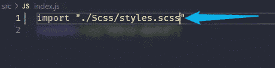

现在，如果我们运行`npm run dev`，我们将看到一切编译无误。就这样吗？还没有。现在，我们将配置 webpack 来编译图像。

从 Webpack 5 开始，我们不需要使用加载器来编译图像。我们只需要添加一些规则，让我们检查一下。

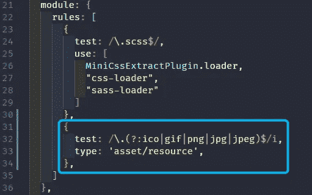

然后，我们必须稍微修改一下我们的输出，并像这样添加公共路径:

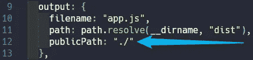

现在，我们可以在 CSS 中添加必要的图像，或者将它们导入 Javascript 文件。在这个例子中，我将把它作为背景添加到 CSS 中。

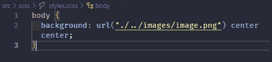

现在，我们可以再次运行`npm run dev`了。您将看到我们导入的文件带有一个哈希。

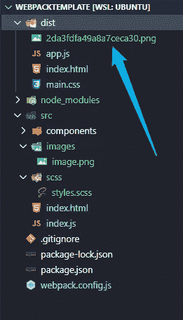

如果我们希望它们以相同的名称在特定的文件夹中编译，我们只需要在输出对象中再添加一行，如下所示:

然后，我们只要再运行一次`npm run dev`，它就会按照我们想要的方式编译。

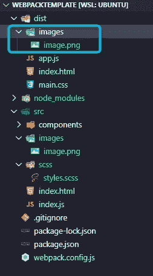

结果！

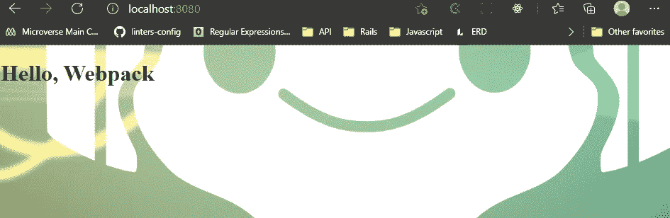

现在，我们已经添加了使用 webpack 的基本加载器。插件呢？我们来试试吧！

首先，让我们从 [HTML Webpack 插件](https://webpack.js.org/plugins/html-webpack-plugin/)开始。让我们安装依赖项，现在你应该更熟悉了吧？运行下面的代码`npm i -D html-webpack-plugin`。一旦安装完依赖项，我们将添加以下几行:

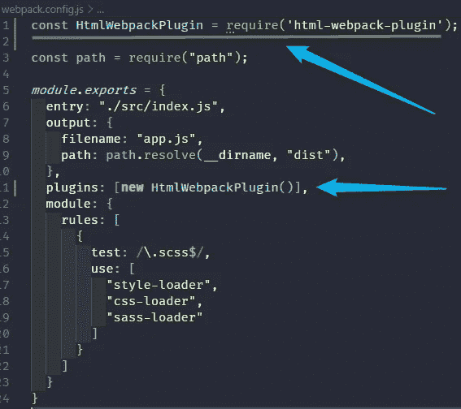

在第一行，我们需要插件。第二步，我们正在初始化插件。如果您现在运行 dev 脚本，您将看到一个 HTML 文件将被自动创建。嗯！但是，如果我想使用自己的 HTML 模板呢？为此，我们将为插件添加一个属性，如下所示:

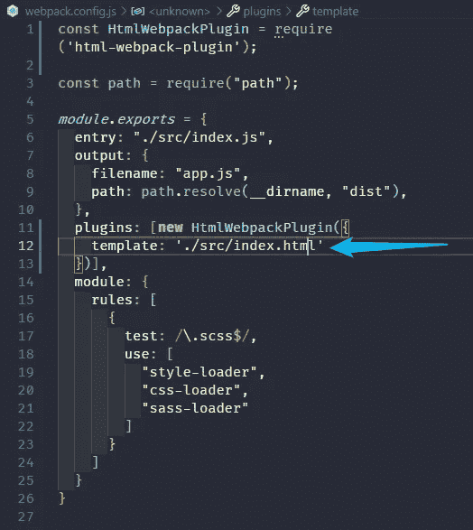

它将使用我们的 HTML 文件作为模板在 dist 文件夹中创建它，并自动添加带有编译的 Js 文件的脚本。

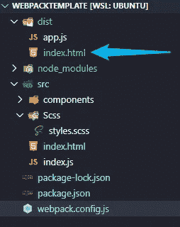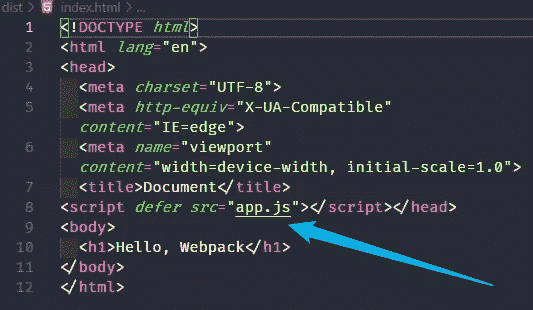

The defer word means that should be executed after the DOM is loader

搞定了！现在，用另一个插件试试怎么样？

让我们安装[迷你 CSS 提取插件](https://webpack.js.org/plugins/mini-css-extract-plugin/)。和上一个挺像的。让我们开始安装依赖项`npm i -D mini-css-extract-plugin`。然后，要求插件:

这一次，我们将修改 scss 规则。我们必须删除样式加载器，并添加如下代码行，就像这样:

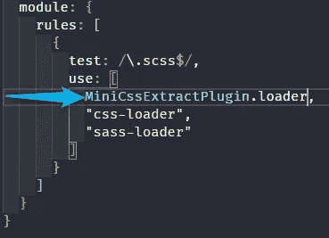

现在，再运行一次`npm run dev`会将样式提取到一个单独的文件中。

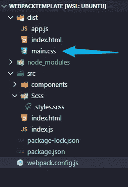

最后，我们将安装最后一个插件，以尽量减少提取的 CSS 文件。为此，运行下面的命令`npm i -D css-minimizer-webpack-plugin`。类似于其他插件，我们将需要它。

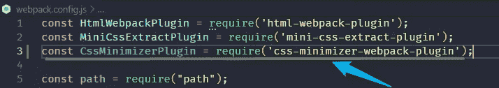

之后，让我们在 module.exports 对象上创建另一个名为 optimization 的键，并为其添加一些值:

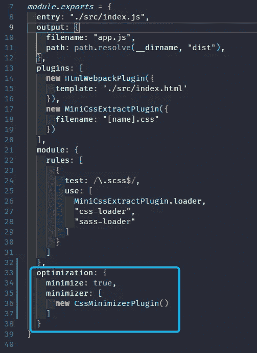

如果我们运行`npm run dev again`，我们会看到 CSS 编译文件缩小。

最后，让我们添加一个监视器来监听我们对 Javascripts 文件所做的修改，并自动重新加载。

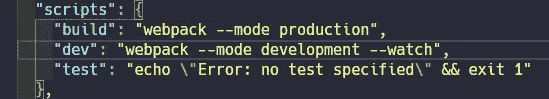

一旦添加了`— watch`标志，我们将能够在我们的模块上工作，并且每次我们修改模块上的某些东西时，它都将编译，而不需要再次运行`npm run dev`。

如果遵循了每一个步骤，我们的配置将会工作得很好，我们将能够自信地在我们的项目中工作。然而，我想说的是，根据项目的需要，你可以使用更多的[加载器](https://webpack.js.org/loaders/)和[插件](https://webpack.js.org/concepts/plugins/)。在下一篇文章中，我将展示如何安装更多插件，以及如何用 Github 页面部署我们的应用程序。我希望这篇文章对你有用。